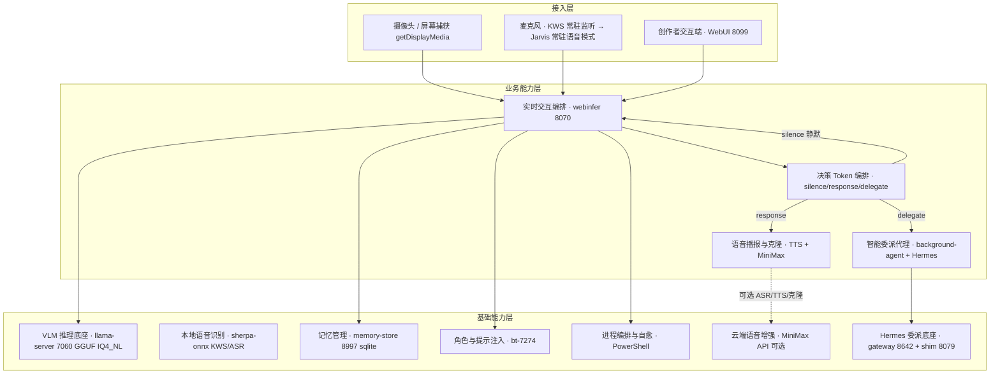

# JoyAI-VL-Interaction · 架构概览

> 精简架构说明。完整决策记录见 [`doc/adr/`](doc/adr/)，项目定位与主方向见 [`doc/main/00-main-direction.md`](doc/main/00-main-direction.md)，运行指引与文档索引见 [`doc/README.md`](doc/README.md)。

> ⚠️ **维护纪律（防偏移）**：本文件是 **指针式镜像**，不是细节源。唯一事实源（SSOT）为 `决策/`（L1–L4 决策）、`doc/specs/`（需求/设计意图）、`doc/adr/`（架构决策记录）。**发生以下「大更新」并落地后，必须从 SSOT 同步更新本文件**：① 端口变更；② 服务拆分或新增；③ 召回等行为语义变更；④ 新子系统；⑤ 新增 ADR。更新时只改端口号、指针与一句话结论，**不要在此搬运具体字段选型或业务细节**（那会污染上下文且必漂移）；深层细节一律用链接指向 SSOT。

## 1. 它是什么

JoyAI-VL-Interaction 是一个 **8B 规模、Apache 2.0 全开源**的实时视觉-语言交互系统。核心模型 **JoyAI-VL-8B** 每秒自主决策「说话 / 沉默 / 委派」（`silence` / `response` / `delegate`），外围由可插拔服务组成，覆盖实时看护提醒、游戏实时解说、菜谱步骤引导、直播弹幕评论四类场景。

> ⚠️ **本 fork 的实时性现状（2026-09-20 实测认定，务必先读）**：上面这句描述的是**上游原版架构**，
> **不是本 fork 的当前行为**。本 fork 因单卡 16GB 算力预算，把持续决策**收敛为稀疏触发**：
> - **1 Hz 决策循环在代码里存在但未被构造** —— `VideoProcessorTrack`（`video_processor.py`）
>   带完整 1 Hz 闸门（`process_interval_seconds = 1.0` / `need_conversion = time_since_last >= interval_sec`），
>   但该 track 在 `services/webui/src/` 下**零构造点**，且它走 `process_frame` 拿**自由文本、不解析决策 token**。
> - **主动循环默认关闭**：`LIVE_PROACTIVE_ENABLED` 默认 `False`，间隔 `LIVE_PROACTIVE_INTERVAL_S` 默认 **5.0 秒**（非 1 秒）。
> - ⇒ **真正的四态决策当前只在「用户说话提交后」与「proactive 轮（默认关）」发生。**
>
> **依据与完整认定**：`doc/research/upstream-realtime-loop-2026-09-20.md`（上游机制认定：确为 1 Hz 持续决策）、
> `doc/research/realtime-claim-drift-audit-2026-09-20.md`（本文档漂移审计）。
> **上游 16GB 档配置是 `1×16GB 主 + 3×16GB`（共 4 张卡）**，单卡 16GB 跑 1 Hz 决策**不是上游的既定配置**。
> 本 fork 的收敛是**算力预算决定的取舍**，非能力丢失。详见 issue **#148**。

- **部署形态**：消费级单卡 Windows 本地运行，数据不出本机（核心 VL 推理 100% 本地化）。
- **定位**：完全开源 + 本地优先；不引入闭源云 API（如 OpenAI Realtime）作为主路径。
- **复用立场**：在已有冻结架构（D4 + ADR0001~0008）之上补齐下游设计，不推倒重来。

## 2. 系统全景

**主链路**：采集（U2/U3）→ VLM 推理 + 决策 token（M1/M2 → B1）→ `[response]` 语音播报（M3）/ `[silence]` 静默 / `[delegate]` Hermes 委派（M4 → B7）→ 用户感知（字幕 / HUD / 语音，U1）→ 会话沉淀（记忆 B3 + 每 **200 轮**中期摘要）。

> ⚠️ 原写「每 100 帧中期摘要」**数值与单位双错**：实际是 `adapter_types.py` 的 `chunk: int = 200`，
> 且触发条件是 `current_chunk["turn_count"] >= chunk` —— **单位是「轮」不是「帧」，数值是 200 不是 100**。
> （2026-09-20 审计更正，见 `doc/research/realtime-claim-drift-audit-2026-09-20.md`）

**常驻语音模式（Jarvis）**：麦克风经 sherpa-onnx KWS 唤醒后进入常驻交互（U3），由 webui 内的 `jarvis_mode` / `jarvis_routes` 编排、hybrid-wake 自动恢复。设计细节见 [`doc/subsystems/jarvis-mode.md`](doc/subsystems/jarvis-mode.md)。

## 3. 服务与端口

| 端口 | 服务 | 角色 | 说明 |
| --- | --- | --- | --- |
| **8070** | webinfer | 单入口网关（ADR0006） | 决策 token 编排 + 角色 prompt 注入；对外唯一 LLM 入口。**SPOF** |
| **7060** | llama-server | VLM 推理主进程 | GGUF IQ4_NL + mmproj F16，**实测稳态 ≈ 8.0GB VRAM**（2026-09-20 KV q8_0 落地后实测 8,014 MiB；落地前 f16 KV 为 9.3GB / 9,535 MiB）。**唯一 SPOF**（挂=全瘫） |
| **8099** | WebUI | 创作者交互端 | WebRTC + 进程内 sherpa-onnx |
| **8985** | voice_clone API | 声音克隆注册 | MiniMax Rapid Clone 同步路径（ADR0001） |
| ~~8991~~ | ~~本地 TTS 模型~~ | — | ❌ **已移除**（CosyVoice3 于 2026-07-12 从代码库删除；不在 `$PortMap`，永不启动） |
| ~~8992~~ | ~~TTS adapter~~ | — | ❌ **已移除**（同上；TTS 现由 voice-clone 8985 承担） |
| **8997** | memory-store | 记忆管理 | sqlite + 向量语义召回（USearch/bge-m3，BM25 兜底已移除，D-2026-08-05-003）；**内嵌 Local Wiki 知识库模块（同进程同端口，非独立服务）**；8996 为遗留默认空壳端口 |
| **8079** | background-agent | 委派后端（默认 provider=**codex**） | `/v1/solve`；**2026-08-15 起进全部启动计划** |
| ~~8642~~ | ~~Hermes gateway~~ | — | ⚠️ 端口在表中但**不在任何启动计划**（仅 `-Restart` 分发表） |

- **默认启动计划**（2026-09-14 按 `Plan-For` 校正）：`7060 / 8079 / 8070 / 8099 / 8985` + `8997`（memory-store 默认 ON，除非 `JOYAI_ENABLE_MEMORY_STORE=0`）—— **共 6 个**。
- 原写「仅 7060/8070/8099/8985」漏了 background-agent(8079) 与 memory-store(8997)；原「全 11 进程」含已删除的 CosyVoice 8991 / TTS adapter 8992，**不再是目标**。
- 权威拓扑见 [`doc/runtime-topology.md`](doc/runtime-topology.md)。
- 入口路径：浏览器 → `localhost:8099`（WebUI）→ `8070`（webinfer）。

## 4. 决策 Token

由 webinfer 产出（**触发时机见上方 §1 警告——本 fork 并非每秒产出**），送 TTS 前剥离：

- `silence` — 静默等待，不打断用户。
- `response` — 正常语音播报（走 TTS）。
- `not-for-me` — live 模式第四态：这段话不是对 AI 说的（自言自语 / 对旁人 / 回应他人）。
- `delegate` — 交给 Hermes 智能委派（代码执行/工具调用），主对话继续；委派失败不影响主链路。

## 5. 模块边界（12 个）

| 编号 | 模块 | 端口 | 职责 |
| --- | --- | --- | --- |
| M1 | 创作者交互端 WebUI | 8099 | 实时对话 / 角色·声音配置 / 历史浏览（零后端改动） |
| M2 | 运维 / 配置端 | — | 启停 / 监控 / 安全配置 |
| M3 | 实时交互编排 webinfer | 8070 | 决策路由 / prompt 注入 |
| M4 | 语音播报与克隆 TTS+MiniMax | 8985 | TTS / 克隆注册 |
| M5 | 智能委派代理 background-agent+Hermes | 8079/8642 | 委派触发 / 结果收敛 |
| M6 | 对话可观测面板 LLM 回复 | — | 状态发布订阅（ADR0003 可见性） |
| M7 | VLM 推理 llama-server | 7060 | 多模态推理 |
| M8 | 本地语音识别 sherpa-onnx | 进程内 | KWS/ASR |
| M9 | 记忆管理 memory-store（含 Local Wiki） | 8997 | push/pull + 知识库召回（sqlite + 向量语义召回） |
| M10 | 角色与提示注入 bt-7274 | — | prompt 配置 |
| M11 | 进程编排与自愈 | — | health check / 自动重启 |
| M12 | 云端语音增强 MiniMax API（外部） | — | 可选 TTS/克隆/ASR |

> 模块可插拔：二次开发者可单服务替换（如换 TTS 后端），接口契约清晰、替换成本低。M8 的 KWS 同时支撑 Jarvis 常驻语音模式（[`doc/subsystems/jarvis-mode.md`](doc/subsystems/jarvis-mode.md)）。

## 6. 关键技术选型

| 维度 | 选型 | 理由 |
| --- | --- | --- |
| VLM 引擎 | llama.cpp / llama-server（GGUF IQ4_NL） | 单卡消费级 GPU 友好、MIT 免费、OpenAI 兼容、**实测稳态 ≈ 8.0GB VRAM**（KV q8_0 已落地，见 §3）；vLLM 运行时重、Windows 单卡不友好 |
| 流式传输 | WebRTC（浏览器）+ 进程内 sherpa-onnx | 不推翻 webinfer 单入口（ADR0006），仅借鉴模式 |
| TTS / 克隆 | MiniMax Speech 2.8 / Rapid Clone | 质量优先；本地 CozyVoice 作 fallback |
| 委派框架 | Hermes（gateway 8642 + shim 8079） | 人格/记忆/Skills/Provider 独立、故障隔离 |
| 存储 | SQLite | 单机本地、零运维；ADR0005 冻结 v0.1 仅 sqlite（无 Redis/K8s/PG） |
| 编排 | PowerShell（start/stop-joyai.ps1） | Windows 单机一键启停 + 依赖顺序校验（ADR0004） |
| 运行时 | Python 3.12 | WebUI/webinfer 已基于 3.12，统一避免双运行时 |

## 7. 已冻结架构决策（ADR0001~0008 + 0011~0020；0009/0010 跳过；目录实有 19 份 .md + 4 份 mermaid）

详细记录见 [`doc/adr/`](doc/adr/)：

| ADR | 主题 |
| --- | --- |
| 0001 | 声音克隆走 MiniMax Rapid Clone 同步路径 |
| 0002 | KWS 配置改成 env 化 |
| 0003 | LLM 回复面板从黑箱改为可见 |
| 0004 | 服务停止方案（让用户不再用任务管理器）/ 端口冻结 |
| 0005 | Memory-Store v0.1 骨架边界（仅 sqlite） |
| 0006 | LLM 网关单入口（webinfer 8070） |
| 0007 | 拆分 live_adapter.py 巨文件 |
| 0008 | P0 适配器正确性修复（多服务端口 / 协议对齐） |
| 0011 | 分阶段 Lint 门禁（baseline + burn-down） |
| ~~0012~~ | ⚠️ **`ADR-0012-v6-proposal.md` 自述状态为「提议（Proposed）」，不是已冻结决策**——原列入本表属实质性错误（2026-09-14 更正）。方案内容：bge-m3 全本地化（独立嵌入服务，云端降为可选 fail-over） |
| 0013 | webinfer↔memory-store 客户端韧性策略（v0.3） |
| 0014 | 日志事件 schema（JSONL 每服务文件） |

> 这些决策是架构基线，下游设计不推翻。

## 8. 非功能基线

| 指标 | 目标 | 说明 |
| --- | --- | --- |
| 端到端延迟 P99 | ≤ 1.2s ⚠️ **前提与来源待重估** | 原记「当前 0.8–1.5s」**无可追溯的端到端实测来源**，继承自已废弃的 2026-07 交付稿；且其前提是**单次交互**，**非「每秒一次」**。本机现有实测仅覆盖 **VLM 推理段**（prompt eval 453.64ms + decode 520ms ≈ 0.97s，2026-09-20）。**端到端 P99 从未实测**（含采集/编码链路）。见 `doc/research/realtime-claim-drift-audit-2026-09-20.md` |
| 进程自愈 RTO | ≤ 30s（P99） | 崩溃 → 自动重启恢复 |
| 数据 RPO | ≤ 5min | 记忆/会话持久化 |
| VRAM 预算 | ⚠️ **待重算**（原记 ≤ 11.5GB / 16GB） | 原预算按**已废弃的 11 进程方案**（含 summary llama 2.9GB / CosyVoice 1.1GB / whisper 0.7GB，均已不在启动计划）推算。**2026-09-20 实测（KV q8_0 落地后）：llama-server 占 8,014 MiB**（落地前 f16 KV 为 9,535 MiB）。构成：权重 ~4,535 / **KV q8_0 1,224**（原 f16 2,321）/ mmproj ~1,483 / 固定 ~840 MiB。**"KV 吃满"的怀疑不成立**（KV 经量化后仅占 1.2GB）。真实可用余量 ≈ 16 − 8.0 = **8.0GB**。**显存逐项分解见 issue #143 / #145** |
| 可用性 | 进程自愈最佳努力 | 单用户本地，无对外 SLA、无多租户 |

> **延迟瓶颈实测结论（issue #43，已 CLOSED）**：端到端延迟瓶颈在采集/编码链路（OBS/屏幕捕获 + `max_pixels` 偏小 + JPEG 有损），VLM 推理段稳态 <320ms（DRIFT-6 实测）非瓶颈；webui 已埋 `frame_seq` 测量环（PR #93）暴露采集/编码开销。指标边界与细节见 `决策/VLM架构与模型组成.md`「VLM 端到端延迟实测结论」。
>
> **VLM 推理段实测复现（2026-09-20，本机 RTX 5060 Ti 16GB，b10155 + IQ4_NL）**：768×576 图 = **448 prompt token**；`prompt eval` **453.64ms（987.56 tok/s）**；`eval` **76.92 tok/s**；稳态显存 **9,326 MiB**。`CLIP graph uses unsupported` 日志**零命中** → 上游 issue #21272 的「CLIP 回退 CPU、单图编码 27× 劣化」**在本机不存在**（`-fa` 保持默认 `auto` 即可）。第三方调研资产见 `doc/research/vlm-lightweight-2026-09.md`、`doc/research/upstream-delta-2026-09.md`。

## 9. 部署形态

- **硬件**：Windows 11 + 单卡 NVIDIA RTX 5060 Ti 16GB；Python 3.12。
- **编排**：`start-joyai.ps1` / `stop-joyai.ps1`；默认启动 **6** 个服务（llama-main + background-agent + webinfer + webui + voice-clone + memory-store）。见 `doc/runtime-topology.md`。
- **环境隔离**：dev/int/uat/prod 同机不同目录（独立 venv + 端口偏移可选），不引入 VPC/K8s。
- **自愈**：M11 监控各进程 `/health`，崩溃自动重启（P99 ≤ 30s）。
- **容量上限**：VRAM 已满预算，扩容方向为关非必要服务 / 降上下文，而非加机器。

## 10. 安全姿态（本地形态）

- **暴露面收敛**：默认 deny inbound（Windows Defender 防火墙）；仅 `8099`(localhost) / `8070`(localhost·内网) 入站放行；内部端口（7060/8985/8991/8992/8079/8642/8997）仅绑 `127.0.0.1`，公网入口 **N/A**。（8996 为遗留废弃空壳端口）
- **密钥托管**：MiniMax Key 经隔离 `.env`（gitignored）/ 隔离密钥目录（NTFS ACL）托管，不硬编码、不落日志明文；Vault 留完整版。
- **数据驻留**：核心 VL 推理 100% 本地；仅 ASR/TTS/克隆音频经 MiniMax 上云，需数据出境合规确认。
- **隐私保护**：屏幕捕获强制仅窗口 + 无音频；摄像头/麦克风采集经用户显式授权。
- **不适用项**：WAF / DDoS / KMS-Vault / 多租户 RBAC —— 本地无公网，按需裁剪。

## 11. 成本模型

| 分项 | 月度 | 年度 | 说明 |
| --- | --- | --- | --- |
| 本地算力 / 存储 / 网络 / 安全 / 可观测 | 0 | 0 | 自有硬件 + OS 内置能力 |
| 云端语音增强（MiniMax Max + 阿里云 ASR，档2） | 149 | 1788 | 可选上限 ≤ ¥149/月 |
| 本地电费（整机常驻估算） | 150 | 1800 | 可选估算 |
| **合计（不含电费）** | **149** | **1788** | 云端仅可选增强 |
| **合计（含电费）** | **299** | **3588** | — |

> 完全本地（sherpa + 本地 CozyVoice）月度成本为 **0**。

## 12. MVP 与完整版

| 阶段 | 范围 | 不做（延后） |
| --- | --- | --- |
| **MVP** | 单机 PowerShell 编排 + 进程自愈 + 安全基础（Key 隔离 + 暴露面收敛）；F1~F12, N1, N2 | memory v0.2 / Docker Compose / 完整 STRIDE / CI / 容量模型 |
| **完整版** | + 可选 Docker Compose + memory-store v0.2 + 完整 STRIDE + CI 门禁 + 容量成本模型 | — |

**Out-of-Scope（明确不做）**：多节点 K8s/多机 HA、全云档（OpenAI Realtime 主路径）、跨会话长期记忆 v0.2（MVP 后）、多租户/SaaS、完整 STRIDE 合规认证（MVP 仅做基础收敛）。

## 13. 文档索引

- [`doc/runtime-topology.md`](doc/runtime-topology.md) — ⭐ **现行运行拓扑（唯一权威）**：服务/端口/启动模式/交互模式
- [`doc/README.md`](doc/README.md) — 文档库总索引（入口路径 + 分类索引）
- [`doc/main/00-main-direction.md`](doc/main/00-main-direction.md) — 项目定位与主方向
- [`决策/README.md`](决策/README.md) — **决策书 SSOT**（已拍板事实；冲突时以它为准）
- [`doc/adr/`](doc/adr/) — 19 份架构决策记录（+ 4 份 mermaid 图；⚠️ 编号冲突：**0007 被 4 个文件占用**（2 md + 2 mermaid），0008 被 3 个占用，待消歧）
- [`doc/subsystems/memory-architecture.md`](doc/subsystems/memory-architecture.md) — 记忆架构（含 Local Wiki 融合、召回链路细节）
- `start-joyai.ps1` / `stop-joyai.ps1` — 启动与停止编排

> ⚠️ 本文件的端口表（§3）与上述文档已对齐；但 `doc/local/architecture-*.md` **已过时**，不再作为架构基线引用。

> 本文档由 9 份生成式架构交付稿（高层/系统/部署/安全/UserStory 等）提炼精简而成，保留端口、SPOF、模块边界、关键决策与成本等实质内容，去除企业级流程仪式。
