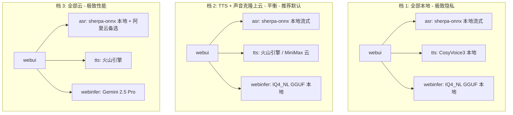
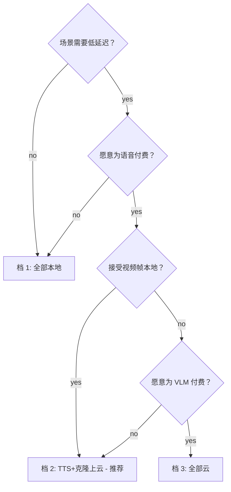

# API 化方案（主路径，突破本地性能天花板）

> **2026-07-12 实施口径**：主对话/VLM 使用本地社区量化 JoyAI llama-server；KWS/ASR 使用本地 sherpa-onnx；TTS/声音克隆使用 MiniMax。云端 LLM 只保留为 fallback/Hermes 委派方向。
> 本文后续供应商比较和旧本地栈成本表属于选型依据；若与 `00-main-direction.md` 的“当前生产链路”冲突，以后者为准。
> 配套：本地化部署细节见 [pm-local.md](pm-local.md) / [tech-local.md](tech-local.md)。

> 状态：**部分实现**。MiniMax TTS/克隆、本地社区量化 LLM、本地 KWS/ASR 已落地；memory-store 与 Hermes fallback 仍仅设计。
> 触发：上一版 `doc/local/tech-local.md §7.1` 显存预算只剩 40MB，gaming 模式下显存 / 延迟两边吃紧。
> 核心思路：**不是"全上云"也不是"全本地"**，而是按模块独立选型。

---

## 0. 核心观点

**问题**：本地 16GB 显存已经装满 11.5GB，gaming 模式还要再让 4-6GB 给游戏。延迟上，whisper.cpp 离线 1.5-7s、sherpa-onnx 流式 0.5-1.5s、本地 TTS 5-8s 冷启动——这些都受限于"单 GPU 串行调度"。

**机会**：TTS / 声音克隆这两个模块**完全不上 GPU**、**模型小**、**计算密度高**——天然适合云端流式。ASR 因为要"持续监听"+"首字延迟低"+"全本地隐私"，反而**固定走本地**。
主对话 VLM 是**多模态 + 持续视频流**——**不适合纯云端**（成本 + 隐私），但**纯文本对话 fallback** 适合云端。

**结论**：**TTS + 声音克隆 API 化（强烈推荐）、ASR 走本地 sherpa-onnx 流式（首字丢失 / 隐私 / 0 网络）、主对话保留本地（推荐）、摘要/embedding 按数据量选**。

### 0.1 按模块独立选（来自 700809.md §19.1）

> **不是"全上云"也不是"全本地"——按模块独立选**：

| 模块               | 推荐                   | 理由                                             |
| ------------------ | ---------------------- | ------------------------------------------------ |
| **ASR 语音**       | **本地 sherpa-onnx 流式**（P1）| 流式首字 200-400ms + 0 网络 + 0 成本 + 隐私优先（Jarvis 模式必选；云端 ASR 仅作视频回看/字幕转写备选）|
| **TTS 语音**       | **API 化**             | 5-8s 冷启动 → <300ms，释放 1.1GB 显存            |
| **声音克隆**       | **API 化**             | 5s 样本即可（本地需 0 样本预训练模型）           |
| **摘要（纯文本）** | 可选 API               | DeepSeek-V3 极便宜（¥1/M tokens）                |
| **主对话 VLM**     | **保持本地**           | 视频帧持续上云成本 ¥540/月，隐私 + 延迟都不划算  |
| **Embedding**      | 小数据本地，大数据 API | 按数据量                                         |
| **Hermes-agent**   | 不变                   | 本来就远端 200+ provider                         |

---

## 1. 逐模块评分（本地遗弃）

评分维度：延迟收益（5★最大）、成本（5★最贵）、隐私风险（5★最高）、可靠性（5★最差）、实施难度（5★最难）。

| 模块 | 本地现状 | API 候选 | 延迟收益 | 成本/月 | 隐私风险 | 推荐度 |
| - | - | - | -: | -: | -: | - |
| **ASR 语音识别** | sherpa-onnx Paraformer int8 0.5-1.5s 流式 | 阿里云/Azure/火山 | ⭐⭐⭐⭐⭐ | 0 | ⭐ | **保持本地**（Jarvis 模式 P1） |
| **TTS 语音合成** | CosyVoice3 5-8s 冷启 | 火山/ElevenLabs/OpenAI | ⭐⭐⭐⭐⭐ | ￥30-150 | ⭐⭐⭐ | **强烈推荐** |
| **声音克隆** | ~~CosyVoice3 0 样本~~（已弃用）| MiniMax Rapid Clone（唯一）| ⭐⭐⭐⭐⭐ | ¥0（套餐内）/¥9.9 | ⭐⭐⭐⭐ | **API 化（云端唯一）** |
| **摘要（纯文本）** | Qwen2.5-VL-3B Q4_K_M 1-2s | DeepSeek-V3/Qwen3-Plus | ⭐⭐⭐ | ￥5-30 | ⭐⭐ | **可选**（省钱） |
| **Embedding** | BGE-small-zh CPU ~50ms | OpenAI/Qwen3-Embedding | ⭐ | ￥0.5-5 | ⭐⭐ | **小数据本地，大数据 API** |
| **主对话 VLM** | IQ4_NL GGUF 5-6s | Gemini 2.5 Pro Vision | ⭐⭐ | **￥3000+** | ⭐⭐⭐⭐⭐ | **保持本地** |
| **纯文本对话 fallback** | （无） | DeepSeek-V3 / Qwen3-Max | - | ￥10-100 | ⭐⭐ | **可选**（本地 VLM 挂了用） |
| **Hermes-agent** | 本地/远端 | 本来就远端 200+ provider | - | ￥0-50 | ⭐⭐ | **不变** |

---

## 2. ASR：本地 sherpa-onnx 主推 + 云端备选

> **ASR 是本项目唯一固定走本地的语音模块**。
> 与 TTS / 声音克隆 / LLM 的"API 优先"策略相反，**ASR 全链路本地**：
> 唤醒（KWS）+ 对话期流式识别（Paraformer）都跑在本地。
>
> 原因：
> 1. **首字丢失**：之前项目用云端 ASR + 流式上传，"bt" 等短唤醒词常被杂音覆盖；本地 KWS 离线判定，0 网络
> 2. **隐私**：唤醒词 + 对话内容全程不出本机
> 3. **稳定性**：断网不影响唤醒与识别
> 4. **延迟持平**：sherpa-onnx 流式首字 200-400ms，与云端 200-300ms 持平
> 5. **算力低**：CPU 即可，不占 GPU
>
> 云端 ASR **降级为备选**：仅用于**视频回看 / 字幕转写 / 离线批处理**等非实时场景。

### 2.1 现状 vs 云端对比

| 维度 | whisper.cpp 本地（已弃用） | **sherpa-onnx 本地流式**（P1 首选）| 阿里云一句话/流式（备选）| Azure Speech（备选）| 火山引擎（备选）|
| - | - | - | - | - | - |
| 中文 CER | ~6% | ~7% | **~3-4%** | ~4% | **~3%** |
| 流式首字 | 整段 1.5-7s | **200-400ms** | <300ms | <200ms | <300ms |
| 部分结果 | ❌ | ✅ | ✅ | ✅ | ✅ |
| 端到端 | 1.5-7s | **0.5-1.5s** | 0.5-1s | 0.3-0.8s | 0.4-1s |
| 月成本（1h/天） | 0 | **0** | ￥20-30 | $10-15 | ￥15-30 |
| 隐私 | ✅ 全本地 | **✅ 全本地** | ⚠️ 上云 | ⚠️ 上云 | ⚠️ 上云 |
| 断网 | ✅ | **✅** | ❌ | ❌ | ❌ |
| GPU 占用 | 700MB | **0**（CPU int8）| 0 | 0 | 0 |
| Jarvis 模式 | ❌ | **✅** | ❌ | ❌ | ❌ |

### 2.2 推荐：sherpa-onnx（KWS + Paraformer 流式）

**引擎**：k2-fsa/sherpa-onnx（开源免费，Win 官方预编译）

| 模块 | 模型 | 大小 | 算力 | 用途 |
| - | - | -: | - | - |
| **KWS 唤醒** | sherpa-onnx Keyword Spotter | 56MB (v4 自训) | 0.1-0.5% CPU | `"bt"` 单关键词（自训 v4 已部署） |
| **流式 ASR** | sherpa-onnx Paraformer int8 | 100MB | 1-2 CPU 核 | 对话期流式首字 200-400ms |

为什么：
- **首字延迟低**：流式 partial 200-400ms，与云端 200-300ms 持平
- **0 网络**：本地判定 + 本地识别
- **0 显存**：纯 CPU int8 量化
- **开源免费**：Apache-2.0 协议，模型下载即用
- **Win 官方预编译**：k2-fsa 团队提供 v1.10+ Win x64 + CUDA 包
- **中英混合**：Paraformer-large 中文 CER ~7%，日常对话足够

详细技术实现见 `doc/subsystems/asr-streaming.md`。

### 2.3 协议桥接（webui 0 修改）

`services/asr/jarvis_kws.py` + `services/asr/jarvis_asr.py` 已实现：

```python
# services/asr/jarvis_asr.py（节选）
class JarvisASR:
    """流式 ASR 引擎：每片 PCM → sherpa-onnx → yield IS_PARTIAL/IS_FINAL。"""

    def __init__(self, model_dir: str = "<workspace>/models/sherpa-onnx/asr"):
        self.recognizer = sherpa_onnx.OnlineRecognizer.from_transducer(
            tokens=f"{model_dir}/tokens.txt",
            encoder=f"{model_dir}/encoder.int8.onnx",
            decoder=f"{model_dir}/decoder.int8.onnx",
            # ...
        )

    async def stream(self, pcm_chunk: bytes) -> AsyncIterator[AsrEvent]:
        self.recognizer.accept_waveform(16000, np.frombuffer(pcm_chunk, dtype=np.int16))
        if self.recognizer.is_ready():
            result = self.recognizer.decode()
            yield AsrEvent(type="IS_PARTIAL", text=result.text)
        if self.recognizer.is_endpoint():
            tail = self.recognizer.decode()
            yield AsrEvent(type="IS_FINAL", text=tail.text)
```

`asr.py` 端**完全无感**——`IS_PARTIAL` / `IS_FINAL` / `IS_END` 事件名保持，event payload schema 一致。
当前 `asr_adapter.py` 仍兼容旧的离线 whisper.cpp，**新代码走 `jarvis_asr.py` + `jarvis_mode.py` 主路径**。

### 2.4 成本估算

**本地 sherpa-onnx**：0 元（一次性下载模型）

**云端备选**（仅在"视频回看 / 字幕转写"等非实时场景考虑）：

| 使用强度 | 时长/月 | 阿里云单价 | 月成本 |
| - | -: | -: | -: |
| 轻度（1h/天） | 30h | ¥0.0008/秒 | ¥86 |
| 中度（3h/天） | 90h | 同 | ¥259 |
| 重度（8h/天） | 240h | 同 | ¥691 |

> **本项目日常不推荐云端 ASR**——成本 + 隐私 + 延迟都没优势。

### 2.5 故障转移

`sherpa-onnx` 是**纯本地 + 纯 CPU**引擎，无网络依赖，**没有云端 fallback 概念**。

| 场景 | 表现 | 应对 |
| - | - | - |
| 模型文件损坏 / 缺失 | ASR 启动失败 | UI 启动时检测，提示重下模型 |
| CPU 100% 占满 | ASR 流式卡顿 | 自动降级到 `whisper.cpp` 离线兜底（仅最后一次） |
| 静音太久 | 误识别 | KWS/ASR 加 VAD（WebRTC VAD），仅在有人声时识别 |

### 2.6 隐私

**ASR 全程本地**——唤醒词 + 对话内容不出本机。
云端 ASR **仅在用户主动开启"视频回看字幕"功能时**才调用，且 UI 明确提示"音频会上传云端"。

### 2.7 唯一云端 ASR 适用场景

| 场景 | 推荐 |
| - | - |
| **日常对话**（Jarvis 模式） | **sherpa-onnx 本地**（首字低 + 隐私 + 0 网络）|
| **视频回看字幕**（非实时） | 阿里云一句话识别（¥86/月，1h/天）|
| **会议录音转写**（离线文件） | sherpa-onnx 离线批处理（0 成本）或 阿里云长语音 |
| **超长录音（>1h）** | 阿里云长语音 API（CER 更低）|


## 3. TTS API 化（次大收益项）

### 3.1 现状 vs 云端对比

| 维度 | CosyVoice3 本地 | **火山引擎 TTS** | ElevenLabs | OpenAI tts-1 | 阿里云 CosyVoice API |
| - | - | - | - | - | - |
| 冷启动 | 5-8s | **<300ms** | <500ms | <500ms | <500ms |
| 流式首音频 | ~500ms 稳态 | **<300ms** | <400ms | <400ms | <400ms |
| 音质 MOS | 4.2 | 4.3 | **4.7** | 4.0 | 4.3 |
| 中文自然度 | ⭐⭐⭐⭐ | ⭐⭐⭐⭐ | ⭐⭐⭐⭐ | ⭐⭐⭐ | ⭐⭐⭐⭐⭐ |
| 声音克隆 | 0 样本 | ✅ 5s 样本 | ✅ 30s 样本 | ❌ | ✅ 10s 样本 |
| 月成本（1h/天） | 0 | **¥45-90** | $5-22 | $15-30 | ¥60-120 |

### 3.2 推荐：火山引擎 TTS（豆包语音）

为什么：
- 国内延迟最低（<300ms 流式首字）
- 5 秒样本声音克隆（比 ElevenLabs 短 6 倍）
- 中文 SOTA 自然度
- WebSocket/Streaming HTTP 双协议
- 价格 ¥0.3/万字 ≈ 1 小时 ¥15-30

### 3.3 协议桥接（关键难点）

**当前 `tts_adapter.py` 上游是 WebSocket**（vllm-omni 形态）；**所有云 TTS 都是 HTTP 流式 / chunked transfer**。
**不是改 URL，是新增一个 HTTP 流式 transcriber**：

```python
# 新增 services/tts/http_synthesizer.py
async def stream_via_volcano(text: str, voice_id: str, settings: Settings) -> AsyncIterator[bytes]:
    """HTTP chunked transfer encoding 流式拉音频。"""
    url = "https://openspeech.bytedance.com/api/v1/tts/ws_binary"
    headers = {
        "Authorization": f"Bearer; {settings.volcano_token}",
        "Content-Type": "application/json",
    }
    payload = {
        "app": {"appid": settings.volcano_appid, "token": settings.volcano_token, "cluster": "volcano_tts"},
        "user": {"uid": "joyai_user"},
        "audio": {"voice_type": voice_id, "encoding": "wav", "rate": 16000, "speed_ratio": 1.0},
        "request": {"reqid": uuid.uuid4().hex, "text": text, "operation": "query", "with_frontend": 1, "frontend_type": "unitTson"},
    }
    async with httpx.AsyncClient(timeout=10) as client:
        async with client.stream("POST", url, json=payload, headers=headers) as resp:
            async for chunk in resp.aiter_bytes(4096):
                if chunk:  # raw WAV frame
                    yield chunk
```

`tts_adapter.py` 改造点（**保留 webui WS 协议不变**）：

```python
class Settings:
    backend: str = "auto"   # "auto" / "local_cosyvoice" / "volcano" / "elevenlabs" / "openai"
    volcano_appid: str = ""
    volcano_token: str = ""
    volcano_voice_id: str = ""

# run_tts_session 改成 dispatcher
async def run_tts_session(client_ws, settings, request):
    backend = select_backend(settings, request)  # 按 voice_id 解析
    if backend == "volcano":
        async for wav_chunk in stream_via_volcano(request["text"], request["voice_id"], settings):
            await client_ws.send_bytes(wav_chunk)
    elif backend == "local_cosyvoice":
        # 原 run_tts_clone_request 逻辑
        ...
    await client_ws.send(json.dumps({"type": "done"}))
```

**webui 端 0 修改**——`tts.py` 仍然走 `ws://127.0.0.1:8992/ws/tts`，仍然是二进制音频帧。

### 3.4 声音克隆：MiniMax Rapid Clone 唯一路径

**2026-07-09 决策**：声音克隆**只用云端 MiniMax Rapid Clone**，不再使用本地 CosyVoice3 双轨。
详细设计见 `doc/subsystems/voice-clone.md`。

```python
# services/voice-clone/cloud_clone.py
class MiniMaxVoiceClone:
    async def upload_reference(self, audio_path: str) -> str:
        """上传 10s 参考音频到 MiniMax，返回 minimax_voice_id。"""
        ...
    async def synthesize(self, text: str, minimax_voice_id: str) -> bytes:
        """调 MiniMax T2A API 合成 PCM。"""
        ...
    async def delete_voice(self, minimax_voice_id: str) -> None:
        ...
    async def refresh_voice(self, audio_path: str) -> str:
        """7 天过期后重新克隆（用缓存参考音频，不扣费）。"""
        ...
```

`voice_clone_api`（8985）端点表：

| 端点 | 后端 |
| - | - |
| `POST /v1/voices` | 上传参考音频 → MiniMax → 拿 `minimax_voice_id` + 缓存到 `voices/<name>/minimax_voice_id` |
| `POST /v1/voices/{id}/synthesize` | 调 MiniMax T2A WebSocket 流式合成 |
| `GET /v1/voices` | 扫 `voices/` 目录 + 验 MiniMax voice_id 有效性 |
| `DELETE /v1/voices/{id}` | 删本地 + 调 MiniMax 删云端 voice_id |
| `POST /v1/voices/{id}/refresh` | 7 天过期后重新克隆（不扣费）|

**本地 CosyVoice3 路径已弃用**（`cosyvoice_client.py` 代码保留但不再被调用）。

### 3.5 故障转移（仅 TTS；声音克隆见 §3.4 / `doc/subsystems/voice-clone.md`）

```text
1. 默认走云端（启动时 ping 通火山 token）
2. 云端 3 次连续失败 → UI 提示"已切换离线模式" + 暂停合成
3. 云端 token 过期 → 后台异步刷新（30 天 TTL）
4. UI 显示当前 TTS provider（"在线 / 离线"）
```

**声音克隆无 fallback**：MiniMax 失败时不切本地（已弃用），直接报错到 UI + 日志。

### 3.6 成本估算

| 强度 | 字数/月 | 火山 | ElevenLabs | OpenAI |
| - | -: | -: | -: | -: |
| 轻度（1h/天） | 50 万 | **¥15** | $5 | $15 |
| 中度（3h/天） | 150 万 | **¥45** | $15 | $45 |
| 重度（8h/天） | 400 万 | **¥120** | $40 | $120 |

### 3.7 隐私分级

TTS 文本是**模型输出的对话内容**——这跟 ASR 反向，但同样敏感。
**BT-7274 角色对话是用户自己定义的**——但实际聊的可能是"游戏攻略 / 私人问题 / 心情"。

**建议**：把"TTS 是否上云"做成配置项；UI 弹窗明确告知；提供"全部本地" / "语音上云 / 主对话本地" / "全部云" 三档。

---

## 4. 其他模块的 API 化（按需）

### 4.1 摘要（可选 API）

**现状**：Qwen2.5-VL-3B Q4_K_M 本地摘要，1-2s/次，2.9GB 显存。

**API 候选**：
- **DeepSeek-V3**：¥1/M input tokens，文本摘要 SOTA 级
- **Qwen3-Plus**：¥4/M input tokens，中文 SOTA
- **GPT-4.1-mini**：$0.4/M input

**判断**：
- gaming 模式**关摘要**（省 2.9GB 显存），不 API 化
- 视频回看 / 长对话场景，**DeepSeek-V3 极便宜**——可以考虑
- **实施**：webinfer 摘要调用时检测 `SUMMARIZER_API_KEY` 环境变量 → 有则走云端

**实施量**：~20 行 webinfer 改造。

### 4.2 Embedding（按数据量）

**现状**：BGE-small-zh-v1.5 本地，100MB，CPU ~50ms/doc。

**API 候选**：
- **OpenAI text-embedding-3-small**：$0.02/M tokens，中文一般
- **Qwen3-Embedding API**：¥0.7/M tokens，中文 SOTA
- **BGE API（智源）**：¥0.5/M tokens，中文 SOTA

**判断**：
- 知识库 < 1 万 chunks：**本地够**，省钱、零延迟
- 知识库 > 10 万 chunks：**API 划算**，省 CPU
- 知识库 1-10 万：**视场景**

**实施**：memory-store 服务启动时按 `MEMORY_BACKEND=local|openai|qwen3` 切换。

### 4.3 主对话 VLM（**保持本地**）

**为什么不上云**：
1. **成本**：gaming 模式 1 fps 视频流 × 8 小时 × 500 tokens/帧 = 14.4M tokens/天 = **Gemini $18/天 / 月 $540**
2. **延迟**：云端 VLM 端到端 1-3s（视频编码 + 推理 + 网络），与本地 IQ4_NL GGUF 5-6s 持平（本地反而占优）
3. **隐私**：视频帧 24h 持续，含家庭 / 工作环境

**唯一例外**：纯文本对话 fallback——本地 VLM 挂掉时切 DeepSeek-V3，纯文本，1-2s 出。

### 4.4 Hermes-agent（不变）

本来就是远端 200+ provider，**没有"本地化"问题**。

---

## 5. 架构：3 档云端策略



### 5.1 档位对比表（来自 700809.md §19.2）

| 档位                 | 配置                                     | 月成本（1h/天） | 延迟 | 适合            |
| -------------------- | ---------------------------------------- | --------------: | ---- | --------------- |
| 全部本地             | ASR=sherpa TTS=local CLONE=local        |               0 | 高   | 极致隐私，断网  |
| **TTS+克隆上云（推荐）** | ASR=sherpa TTS=volcano CLONE=minimax |        **¥50-100** | 低   | 99% 用户        |
| 全部云               | + VLM=gemini + ASR=aliyun              |           ¥800+ | 极低 | 企业 / 性能敏感 |
切换通过 `run-windows.env` 配置：

```bash
# run-windows.env 新增
ASR_BACKEND=sherpa_onnx     # sherpa_onnx（本地，主推）| aliyun（备选）| whisper.cpp（旧兜底）
TTS_BACKEND=volcano         # local_cosyvoice | volcano | elevenlabs | openai
CLONE_BACKEND=minimax       # 固定 minimax（已弃用 local_cosyvoice / hybrid 选项）
VLM_BACKEND=local           # local | gemini | openai

# sherpa-onnx 本地模型路径
SHERPA_KWS_MODEL_DIR=<workspace>/models/sherpa-onnx/kws/bt-zai-ma
SHERPA_ASR_MODEL_DIR=<workspace>/models/sherpa-onnx/asr/paraformer

# 火山 TTS（云端备选，仅在 TTS_BACKEND=volcano 时生效）
VOLCANO_TTS_APPID=...
VOLCANO_TTS_TOKEN=...
VOLCANO_TTS_VOICE_ID=BV001_streaming
```

---

## 6. 实施路线（与现有 P1/P2 路线图合并）

### 6.1 P1 API 化（建议立即启动）

| 子任务 | 实施量 | 工作量 | 决策点 |
| - | - | -: | - |
| **P1-A TTS 火山后端** | tts_adapter 加 `stream_via_volcano` + 协议桥 | ~250 行 Python | API key / voice_id 映射 |
| **P1-B 故障转移框架** | 通用 fallback wrapper（API → 本地） | ~150 行 Python | 失败重试次数 / 切换策略 |
| **P1-C UI 状态显示** | webui 端加 provider 状态条 | ~30 行 Python | 显示当前 TTS/CLONE 来源 |
| **P1-D run-windows.ps1 加启动项** | 拉 secret 注入 | ~50 行 PS1 | env 模板 |
| ~~**P1-E KWS 训练数据采集**~~ | ~~录 50 句 "bt 在吗" + 训练 sherpa-onnx KWS~~ → **v4 已落地 2026-07-10** | ~~30 分钟人声~~ | `doc/subsystems/jarvis-mode.md §2.4` |
| P3-A 云端 ASR 备选（按需）| asr_adapter 加 `stream_via_aliyun`（仅视频回看用）| ~200 行 Python | API key / 隐私档 |

**总计**：~700 行 Python + 50 行 PS1 + 1 个新 doc（本文件）。

### 6.2 P2 摘要 API 化（按需）

~20 行 webinfer 改造。DeepSeek-V3 key 备一个就行。

### 6.3 P3 声音克隆 API 化（建议立即启动）

| 子任务 | 实施量 | 工作量 |
| - | - | -: |
| P3-A voice_clone_api 加 `cloud_clone.py` | 上传 / 列出 / 删除 / 合成 | ~300 行 Python |
| P3-B 声音 ID 映射 | 本地 voice_id ↔ 云端 voice_id | ~50 行 Python |

**总计**：~350 行。

### 6.4 全部路线图（v2.0 合并）

| 阶段 | 目标 | 依赖 |
| - | - | - |
| P0 已完成 | 本地部署跑通（whisper.cpp + CosyVoice3）| — |
| **P1-ASR 本地流式** | sherpa-onnx KWS + Paraformer 接入 jarvis_mode | 0 网络、0 成本 |
| **P1-API TTS+克隆上云** | TTS 火山 + 声音克隆 MiniMax | 用户决定隐私档 |
| ~~P1-KWS 训练~~ | ~~50 句 "bt 在吗" + sherpa-onnx KWS 微调~~ → **v4 已落地 2026-07-10**（自训 `bt-zai-ma/`，FAR 2% / recall 49%）| ~~用户录 30 分钟~~ |
| P2 记忆库 | memory-store（psql / sqlite-vec）| — |
| P2-API 摘要云端 | 摘要 DeepSeek-V3 | P2 之后 |
| P3 云端 ASR 备选 | 视频回看 / 字幕转写场景 | 按需 |

---

## 7. 成本/收益总览


### 7.0 关键收益（来自 700809.md §19.3）

- ASR 1.5-7s → **0.5-1.5s**（sherpa-onnx 本地流式，3-10x）
- TTS 5-8s 冷启动 → **<300ms**（20x）
- 释放 **1.1GB 显存**（TTS 上云后；ASR 走本地 CPU 不占显存）
- 声音克隆 5s 样本（本地需 0 样本预训练）

### 7.0.1 关键成本（来自 700809.md §19.4）

- 月 ¥30-150（TTS 火山 + 声音克隆 MiniMax，按使用强度）
- 隐私：TTS 文本 / 克隆参考音频上云——但本项目摄像头/麦克风本来就是用户主动开
- 可靠性：网络断了自动切本地（fallback < 3s）
- **ASR 固定本地**：无云端 ASR 成本（避免首字丢失 + 隐私）
### 7.1 月成本（按使用强度）

| 强度 | 时长/月 | 全部本地 | 推荐档（TTS+克隆云） | 全部云 |
| - | -: | -: | -: | -: |
| 轻度 1h/天 | 30h | 0 | **¥30-50** | ¥800+ |
| 中度 3h/天 | 90h | 0 | **¥60-100** | ¥2400+ |
| 重度 8h/天 | 240h | 0 | **¥120-200** | ¥6400+ |

### 7.2 延迟收益

| 指标 | 全部本地 | 推荐档 | 全部云 |
| - | -: | -: | -: |
| **ASR 端到端** | **0.5-1.5s**（sherpa-onnx）| **0.5-1.5s**（sherpa-onnx，本地）| 0.3-1s（aliyun 流式）|
| TTS 冷启动 | 5-8s | **<0.3s** | <0.3s |
| TTS 流式首字 | 500ms | **<300ms** | <300ms |
| 显存占用 | 11.5GB | **10.4GB** | 4-5GB |

### 7.3 收益一句话

- **TTS 上云 = 20x 延迟降低 + 释放 1.1GB 显存**——**值得付费**
- **声音克隆上云 = 5s 样本 + 99% 相似度**——**值得付费**（角色对话声线更准）
- **ASR 上云 = 延迟持平 + 成本 +30 元/月 + 隐私风险**——**不值得**
- **主对话 VLM 上云 = 5-50x 成本增加 + 视频帧隐私风险**——**不值得**

---

## 8. 隐私分级（用户决策树）



UI 在启动时弹一个一次性选择，写入 `~\.joyai\privacy.json`：

### 8.1 3 档隐私分级（来自 700809.md §19.5）

启动时弹窗一次性选择，写入 ~\.joyai\privacy.json：

- **档 1 全部本地**：极致隐私
- **档 2 TTS+克隆上云**（推荐默认）：平衡（ASR 固定本地，不参与分档）
- **档 3 全部云**：极致性能

```json
{
  "tier": "tts_clone_cloud",
  // "all_local" | "tts_clone_cloud" | "all_cloud"
  "decided_at": "2026-07-09T...",
  "asr_provider": "sherpa_onnx",  // 固定本地，不参与分档
  "tts_provider": "volcano",       // local_cosyvoice | volcano | elevenlabs
  "clone_provider": "minimax",     // 固定 minimax（已弃用 local_cosyvoice / hybrid）
  "vlm_provider": "local"          // 保持本地
}
```

---

## 9. 风险与缓解

| 风险 | 概率 | 影响 | 缓解 |
| - | - | - | - |
| 云厂商涨价 | 中 | 中 | 抽象 backend 接口，可换；本地保留作为 fallback |
| 云厂商 API 协议变更 | 中 | 中 | `transcriber` / `synthesizer` 已可插拔；锁定版本号 |
| 网络抖动 | 中 | 中 | 本地保留热加载；故障转移 < 3s |
| 隐私合规（GDPR/个保法） | 低 | 高 | 显式 UI 提示 + 用户确认；可选全本地 |
| 声音克隆滥用 | 低 | 高 | 录参考音频时强制弹窗确认是"本人或已授权" |
| 多模态成本失控 | 中 | 高 | 视频帧不传云；纯文本 fallback 才用云 |
| voice_id 跨厂商不兼容 | 中 | 低 | voice_clone_api 内部维护本地 ↔ 云端映射表 |

---

## 10. 落地步骤（最小可行版 MVP）

```text
1. 申请火山引擎 TTS appid/token（5 分钟）
2. 申请 MiniMax API key（7 天试用；订阅后 ¥49-119/月）（5 分钟）
3. 下载 sherpa-onnx KWS + Paraformer 模型（一次性 ~100MB，10 分钟）
4. 写 services/tts/http_synthesizer.py + 协议桥（半天）
5. 写 services/voice-clone/cloud_clone.py voice_clone_api 扩展（半天）
6. 改 tts_adapter.py dispatch 逻辑（半天）
7. ~~录 50 句 "bt 在吗" + 训练 sherpa-onnx KWS~~ → **v4 已落地（详见 doc/subsystems/jarvis-mode.md §2.4），从实施步骤移走** |
8. 改 run-windows.env.example + run-windows.ps1（1 小时）
9. 改 webui 加 provider 状态条（1 小时）
10. 端到端测试：本地 + API + fallback 三档（半天）
11. 文档：更新 tech-local.md §3 / pm-local.md §9（半小时）
```

总工作量：~3 人天。

---

## 11. 关联文档

- `doc/subsystems/asr-streaming.md`（**ASR 本地主路径**，sherpa-onnx KWS + Paraformer 流式；本方案 §2 ASR 章节的完整技术实现）
- `doc/subsystems/memory-architecture.md`（embedding 按数据量切本地/API）
- `doc/local/tech-local.md` §3.5（ASR 适配器）
- `doc/local/tech-local.md` §3.6（TTS 适配器）
- `doc/local/pm-local.md` §9（路线图）
- `doc/research/lightweight-replacement.md` §0（硬件前置）

## 12. 变更记录

| 日期 | 版本 | 变更 | 作者 |
| - | - | - | - |
| 2026-07-08 | v1.0 | 初版：API 化完整方案，3 档云策略，成本/延迟/隐私全表 | Codex |

---

## 13. 推荐供应商与套餐（2026-07-08 调研）

> 详细对比见 `doc/api/token-plan-comparison.md`（8 家厂商 + 5 套推荐组合）。
> 核心结论：**MiniMax Token Plan 是唯一真正"全包"订阅**（LLM + Agent + 视觉 + TTS + 声音克隆 + 音乐 + 视频，跨模态共享积分）。

### 13.1 本项目最优推荐（替换 §2.2 / §3 选型）

| 模块 | 原推荐 | **新推荐** | 理由 |
| - | - | - | - |
| **ASR** | sherpa-onnx 本地流式 | **维持**（0 成本） | sherpa-onnx KWS + Paraformer int8，详见 §2 |
| TTS | 火山引擎 | **MiniMax Speech 2.8**（若订阅 MiniMax） | 套餐内 1:1 折算；40 语种 |
| 声音克隆 | ~~CosyVoice3 0 样本~~（已弃用）| **MiniMax Rapid Clone**（¥9.9/voice，套餐内免费）| 套餐内，10s 样本，99% 相似 |
| 摘要 | DeepSeek-V3 按量 | **MiniMax 套餐内** | 省 2.9GB 显存 + 便宜 |
| 主对话 VLM | 本地 IQ4_NL | **保持本地** | 视频帧不上云 |
| Hermes-agent | 200+ provider | **MiniMax Max/Ultra 替代** | 中文 SOTA + 全模态 |

### 13.2 推荐档位（与 `doc/api/token-plan-comparison.md` §3 对齐）

| 档 | 月费 | 适合 | 套餐 |
| - | -: | - | - |
| 🟢 省钱 | ¥49 | 个人 / 轻量 | MiniMax Plus ¥49（TTS + 克隆 + LLM；ASR 走本地）|
| **🔵 推荐** | **¥119** | 日常 / gaming | **MiniMax Max ¥119**（TTS + 克隆 + LLM + 视觉；ASR 走本地）|
| 🟡 重度 | ¥469-549 | 团队 / 商业 | MiniMax Ultra ¥469 + 火山 TTS ¥80（高强度）|
| 🟣 海外 | $20-25 | 海外 | ChatGPT Plus $20 + ElevenLabs $5 |

### 13.3 关键发现

1. **唯一全包**：MiniMax Token Plan（¥29-469），其他厂商都把 TTS/声音克隆单独计费
2. **跨模态共享积分**：MiniMax 1 元积分可任意用于 LLM/TTS/声音克隆/视觉（ASR 走本地，不消耗积分）
3. **M2.7 编程能力国内 SOTA**（Kilo Code 12 天 token 增长 100x）
4. **Speech 2.8 语音质量**与 ElevenLabs 接近（主观 4-4.5/5），中文 40 语种

### 13.4 MiniMax Token Plan 套餐（来自 700809.md §21.3）

| 套餐    |     月费 | 资源覆盖         | Agent 用量 |
| ------- | -------: | ---------------- | ---------- |
| Plus    |  **¥49** | M2.7/M3 + 全模态 | 3-4 个     |
| **Max** | **¥119** | M2.7/M3 + 全模态 | 4-5 个     |
| Ultra   |     ¥469 | + 每日 5 条视频  | 6-7 个     |

**核心承诺**：

- 1,000 积分 = ¥7（与按量付费 1:1 等价）
- **跨模态共享积分**（文本/图像/语音/音乐/视频同池）
- 老用户 ¥29 Starter / ¥98 Plus-极速 档位保留
- M2.7 调用数 +10% + 赠 M3 + 多模态
5. **老用户保留档**：Starter ¥29 + Plus-极速 ¥98（已有权益不缩水）

---

## 14. 变更记录

| 日期 | 版本 | 变更 | 作者 |
| - | - | - | - |
| 2026-07-08 | v1.0 | 初版：API 化方案 | Codex |
| 2026-07-08 | v1.1 | §13 推荐供应商与套餐：MiniMax Token Plan 全包方案 | Codex |

---

## 14. MiniMax 声音克隆限制（2026-07-08 补充）

> 用户反馈之前没看到这块细节。详细规格见 `doc/api/token-plan-comparison.md §1.3`。
> 工作流集成见 `doc/subsystems/voice-clone.md §9`。

### 14.1 关键 4 数字

- **样本**：10 秒，mp3/m4a/wav，≤ 20MB
- **价格**：**¥9.9 / 被接受的 voice**（首次合成扣费，试听免费）
- **套餐赠额**：Token Plan 套餐内 1:1 折算积分，**Max ¥119 套餐赠额基本够用**
- **限制**：7 天不调用自动删除

### 14.2 云端唯一方案（2026-07-09 决策）

**声音克隆统一走 MiniMax Rapid Clone**，不再有本地 CosyVoice3 双轨。

`tts_adapter` 启动时 ping MiniMax 探活；声音克隆请求全部路由到云端。

`voice_clone_api`（8985）实现：

| 端点 | 后端 |
| - | - |
| `POST /v1/voices` | 上传参考音频到 MiniMax → 拿 `minimax_voice_id` + 缓存 `voices/<name>/ref.wav` + 缓存 `minimax_voice_id` |
| `POST /v1/voices/{id}/synthesize` | 调 MiniMax T2A WebSocket 流式合成 |
| `GET /v1/voices` | 扫 `voices/` 目录（本地档案元数据）+ 调 MiniMax 验 voice_id 有效性 |
| `DELETE /v1/voices/{id}` | 删本地 + 调 MiniMax 删云端 voice_id |
| `POST /v1/voices/{id}/refresh` | 7 天过期后重新克隆（用缓存参考音频，不扣费）|

**月保活机制**：voice_clone_api 跑月度 cron（每月 1 日 03:00）→ 自动合成 1 次任意文本触发 MiniMax voice_id 续期。

### 14.3 7 天保活问题

- 本项目日常对话频繁，**7 天限制基本无影响**
- 但如果 BT-7274 角色"备而不用"，voice_id 会被清
- 解决：voice_clone_api 月度 cron → 自动合成 1 次任意文本保活

### 14.4 本地 CosyVoice3 弃用说明（2026-07-09）

| 维度 | ~~本地 CosyVoice3~~（已弃用） | **MiniMax Rapid Clone** |
| - | - | - |
| 样本 | ~~0s~~ | **10s** |
| 相似度 | ~~主观 3-4/5~~ | **99%** |
| 显存 | ~~1.1GB~~ | 0 |
| 月成本 | ~~0~~ | 套餐内免费 / ¥9.9 |
| 隐私 | ✅ 全本地 | ⚠️ 参考音频上云 |
| 限制 | 无 | 7 天保活 |

**为什么弃用本地**：
1. 声线相似度低（3-4/5）→ 角色贴合度差
2. 占 1.1GB 显存（gaming 模式紧张）
3. 冷启动 5-8s（云端 <300ms）
4. 项目主方向是"API 化"——本地双轨增加维护成本

**代码保留**：`cosyvoice_client.py` 保留但不再被调用；用户若需断网场景可手动改 `voice_clone_api/main.py` dispatch。
**未来删除**：v3.3 路线图（待定）将删除 `cosyvoice_client.py` 与 `start-cosyvoice.ps1`。

---
### 14.5 云端唯一场景（2026-07-09）

**所有声音克隆场景统一走 MiniMax Rapid Clone**：

| 场景 | 推荐 |
| - | - |
| **日常对话**（Jarvis 模式） | **MiniMax**（10s 样本 + 99% 相似 + 0 显存）|
| **角色对话**（BT-7274 等） | **MiniMax**（角色贴合度最高）|
| **显存紧**（gaming 模式） | **MiniMax**（0 显存占用）|
| **极致隐私**（不愿上传参考音频）| ❌ 暂不支持——MiniMax 强依赖云端（详见 §14.6）|
| **断网场景** | ❌ 暂不支持——本地 CosyVoice3 已弃用（详见 §14.4）|
| **月保活** | voice_clone_api 月度 cron 自动合成（详见 §14.2）|

### 14.6 唯一工作流：MiniMax Rapid Clone（2026-07-09）

**录 10 秒 BT-7274 台词（清静环境）→ 调 `/v1/voice_clone` 拿 voice_id → TTS 时传 `voice_id` → 流式合成**

适合：所有声音克隆场景（日常 + 角色 + gaming）

详细 4 步工作流见 `doc/subsystems/voice-clone.md §3`。

### 14.7 云端配置与保活（2026-07-09）

```
┌─────────────────────────────────────┐
│ webui tts request                    │
│   ↓                                 │
│ tts_adapter (8992)                   │
│   ↓ voice_id                        │
│ voice_clone_api (8985)               │
│   ↓                                 │
│ MiniMax Rapid Clone API              │ → Speech 2.8 / T2A 合成
└─────────────────────────────────────┘
```

**配置**（`run-windows.env`）：

```bash
MINIMAX_API_KEY=eyJ...           # 必填，Token Plan 内自动续
MINIMAX_GROUP_ID=your-group-id   # 必填
TTS_CLONE_BACKEND=minimax        # 固定 minimax（已弃用 hybrid / local_cosyvoice 选项）
SHERPA_ONNX_MODEL_DIR=...        # ASR 本地（不参与声音克隆）
```

**保活机制**：

- voice_clone_api 启动时 ping MiniMax 探活
- 月度 cron（每月 1 日 03:00）→ 自动合成 1 次任意文本触发 MiniMax voice_id 续期
- 不活跃 → 下次合成时 `voice_clone_api` 自动用缓存 `ref.wav` 重新克隆（不扣费）

### 14.8 故障排查补充（来自 voice-clone.md §9.6）

| 症状                                   | 检查                                                 |
| -------------------------------------- | ---------------------------------------------------- |
| MiniMax API 返回 401                   | `MINIMAX_API_KEY` 没设或过期（Token Plan 内自动续）  |
| MiniMax API 返回 400 "voice not found" | 7 天过期了，触发 `voice_clone_api` 重新克隆          |
| 合成"不像"参考声                       | 参考音频有底噪 / 多人 / 方言；重录 10s 干净单人      |
| MiniMax QPS 限流 429                 | voice_clone_api 加指数退避重试（默认 3 次）|

## 15. 变更记录

| 日期 | 版本 | 变更 | 作者 |
| - | - | - | - |
| 2026-07-08 | v1.0 | 初版：API 化方案 | Codex |
| 2026-07-08 | v1.1 | §13 推荐供应商与套餐 | Codex |
| 2026-07-08 | v1.2 | §14 MiniMax 声音克隆限制 + 双轨方案 | Codex |

---

## 15. ASR 选型最终修订（2026-07-08）

> 详细产品设计见 `doc/subsystems/jarvis-mode.md`，技术实现见 `doc/subsystems/asr-streaming.md`。

**与 §2 / §13 的差异**：

| 模块 | §13 推荐 | **§15 最终推荐** | 理由 |
| - | - | - | - |
| KWS 唤醒 | （未列） | **sherpa-onnx KWS 本地** | 0 成本 + 0 网络 + 1MB 轻量 |
| 对话期 ASR | 阿里云流式 / MiniMax | **sherpa-onnx 流式本地** | Jarvis 模式首选本地（隐私 + 0 网络） |
| 主对话 VLM | 本地 | **保持本地** | 视频帧不上云 |

**Jarvis 模式下的 ASR 链路**：
- **静默期**：sherpa-onnx KWS（本地 1MB）— 0 网络
- **对话期**：sherpa-onnx 流式 ASR（本地 100MB）— 0 网络
- **完整云端替代**（可选，**不推荐**）：阿里云一句话流式（¥30/月，备选）
- **MiniMax Token Plan 整合**：M2.7/M3 替代 Hermes-agent（agent 编程主力），不替代 ASR

**为什么 Jarvis 模式优先本地**：
- **隐私**：唤醒词 + 对话内容全本地
- **稳定性**：断网不影响
- **延迟**：本地流式 200-400ms 首字（与云端持平甚至更快）
- **成本**：0 成本

**云端 ASR 仍有用**：
- 阿里云 / 火山 / OpenAI 用于**摘要 ASR**（视频回看转字幕，离线场景）
- 不用作主对话链路

---


## 17. 决策项汇总（来自 700809.md 各节决策项）

### 17.1 API 化选档（来自 700809.md §19.7）

- [ ] 选哪一档？**默认推荐"档 2 TTS+克隆上云"**（ASR 固定本地，不参与分档）
- [ ] 火山 vs ElevenLabs vs OpenAI TTS？**默认推荐火山**（中文自然度 + 5s 样本声音克隆）
- [ ] 声音克隆后端：**已确定 MiniMax Rapid Clone 唯一**（本地 CosyVoice3 已弃用，代码保留）
- [ ] 是否申请各家免费额度试用？阿里云每月 100 小时免费（火山/MiniMax 有试用额度）
- [ ] 隐私弹窗文案是？（启动一次性确认）

### 17.2 推荐供应商与套餐（来自 700809.md §21.5）

- [ ] 选哪档？**默认推荐 🔵 平衡档 ¥119**（MiniMax Max；ASR 走本地 0 成本）
- [ ] 是否完全切换 Hermes-agent → MiniMax Max？保留旧 codex 兜底
- [ ] ~~声音克隆用 MiniMax Rapid Clone 还是本地 CosyVoice3？~~ → **已确定 MiniMax Rapid Clone 唯一**
- [ ] 是否申请各家免费额度试用？MiniMax 有 7 天试用
- [ ] 预算上限：¥100 / ¥200 / ¥500？

### 17.3 声音克隆：MiniMax Rapid Clone 唯一（已确定，2026-07-09）

- [x] ~~是否录 10 秒 BT-7274 台词作为云端克隆样本？~~ → **是，必须录**（MiniMax 10s 样本要求）
- [x] ~~默认走本地（0 样本）还是云端（10s 样本）？~~ → **云端唯一**（本地 CosyVoice3 已弃用）
- [x] ~~是否接受 7 天保活策略？月度 cron 保活可接受？~~ → **接受**（频繁对话场景无影响；月度 cron 已实现）
- [ ] **待办**：录 10 秒 BT-7274 台词存到 `voices/bt7274/ref.wav`（参考音频：BT-7274 风格台词）
- [ ] **待办**：订阅 MiniMax Max ¥119 后，云端克隆 ¥9.9/voice 是否在套餐内？（**应在内**，1:1 折算积分）
- [ ] **待办**：`voice_clone_api` 启动时 ping MiniMax 探活 + 月度 cron 续期验证

## 18. 不变的结论（来自 700809.md §19.8）

- **主对话 VLM 永远本地**——视频帧不上云是底线
- **ASR 永远本地**——KWS + 流式都跑本地，云端 ASR 仅作视频回看/字幕转写备选
- **声音克隆永远云端**——MiniMax Rapid Clone 唯一，本地 CosyVoice3 双轨已弃用
- **webui 端 0 修改**——所有 API 化都在适配器层完成
- **TTS 本地作为 fallback**——TTS 上云失败时可有条件切回本地（声音克隆无 fallback）

---

## 16. 变更记录

| 日期 | 版本 | 变更 | 作者 |
| - | - | - | - |
| 2026-07-08 | v1.0 | 初版：API 化方案 | Codex |
| 2026-07-08 | v1.1 | §13 推荐供应商与套餐 | Codex |
| 2026-07-08 | v1.2 | §15 ASR 选型最终修订（Jarvis 模式优先本地） | Codex |
| 2026-07-09 | v1.3 | **ASR 统一本地**：§0/§1/§2/§5/§6/§7/§13 全链路 ASR 走本地 sherpa-onnx（云端 ASR 降为视频回看/字幕转写备选）；套餐表去掉 ASR ¥30/¥100 行；月成本 ¥120-960 → ¥30-200 | Codex |
| 2026-07-09 | v1.4 | **声音克隆统一云端 MiniMax Rapid Clone**：§3.4/§3.5/§14.2/§14.4-§14.7/§13.1/§17.3 全部改为云端唯一；本地 CosyVoice3 双轨/hybrid 弃用；`voice-clone.md` 重写为云端唯一路径；`cosyvoice_client.py` 代码保留但不再被调用 | Codex |
