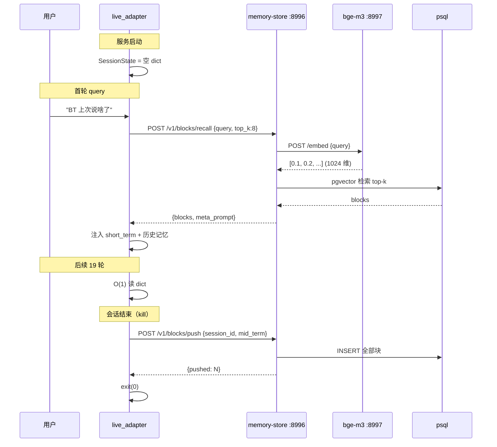

> ⚠️ **本文档已弃用（2026-07-09 归档）**—— 是 2026-07-08/09 多轮讨论的 **时间线 / 原始材料提取**。
> **不是源文档**：节号重复（§18×3、§19×3、§23×2、§25×2）、Tech/PM/voice-clone 三段混排、路线图 3 个版本（v1.2/v1.4/v1.5）互相打架。
>
> **权威源（按主题归类的最终文档）**：
>
> | 主题 | 权威文档 |
> |---|---|
> | 主方向 / 设计原则 / v3.2 路线图 | [../00-main-direction.md](../00-main-direction.md) |
> | API 化（云端 TTS / LLM / 声音克隆） | [../api-optimization.md](../api-optimization.md) |
> | MiniMax Token Plan 调研 | [../token-plan-comparison.md](../token-plan-comparison.md) |
> | Jarvis 唤醒 + 全双工 + EXIT_WORDS | [../subsystems/jarvis-mode.md](../subsystems/jarvis-mode.md) |
> | KWS 唤醒 + 流式 ASR 技术 | [../asr-streaming.md](../asr-streaming.md) |
> | 屏幕捕获（getDisplayMedia） | [../screen-capture.md](../screen-capture.md) |
> | Hermes 严格隔离 | [../hermes-integration.md](../hermes-integration.md) |
> | P2 记忆可插拔 | [../memory-architecture.md](../memory-architecture.md) |
> | 声音克隆（云端唯一） | [../voice-clone.md](../voice-clone.md) |
>
> **保留原因**：作为时间线 / 讨论历史参考（如需追溯某决策的来龙去脉）。
> **不使用方式**：不要从中直接提取内容到新文档——所有主题已在权威文档中归类整理。

> ⚠️ **本文档是"混乱内容提取"** —— 主方向相关内容已整合到 [api-optimization.md](api-optimization.md)。
> - §19 API 化 → `api-optimization.md §0 / §5 / §7 / §8`
> - §21 推荐供应商 → `api-optimization.md §13 / §13.4`
> - §23 声音克隆 7 天保活 → `api-optimization.md §14 / §14.5-§14.8`
> - §19.7-§19.8 决策项 + 不变结论 → `api-optimization.md §17 / §18`
> - Jarvis 模式 / P2 记忆 / 屏幕捕获 / Hermes 隔离 / voice-clone §9 → 已分别在 `doc/subsystems/jarvis-mode.md` / `memory-architecture.md` / `screen-capture.md` / `hermes-integration.md` / `voice-clone.md` 中

# Tech技术文档


## 16. Jarvis 模式（2026-07-08）


> 详细产品设计：`doc/subsystems/jarvis-mode.md`（26KB）

> 技术实现：`doc/subsystems/asr-streaming.md`

> 改动代码：

>

> - `services/asr/jarvis/kws.py`（KWS 引擎，~80 行）

> - `services/asr/jarvis/asr.py`（流式 ASR 引擎，~100 行）

> - `services/webui/src/joy_interaction_webui/jarvis_mode.py`（状态机，~200 行）

> - `services/common/log_with_timestamp.py`（时间戳日志，~50 行）

> - `services/scripts/generate_event_audio.py`（事件生成脚本，~80 行）


### 16.1 与 §3.5 ASR 适配器的关系


**现有 `asr_adapter.py` 不动**——保留 whisper.cpp 离线模式向后兼容。


**新增**：


- `services/asr/jarvis/kws.py`（KWS）

- `services/asr/jarvis/asr.py`（流式 ASR）

- `services/webui/.../jarvis_mode.py`（状态机）


**接入点**：webui 端 WebRTC 音频回调（替换原 `asr_adapter` 路径）。


### 16.2 关键调参


`rule1_min_trailing_silence=2.0` 是避免"首字丢失"的关键参数。


详见 `doc/subsystems/asr-streaming.md §3.4`。


### 16.3 实施步骤


1. 装 sherpa-onnx Win 预编译（5 分钟）

2. 下载 KWS 模型 + 流式 ASR 模型（10 分钟）

3. 训练"bt 在吗"KWS（30 分钟，录 50 句）

4. 上传参考音频到 voice_clone_api（5 分钟）

5. 跑 `generate_event_audio.py` 生成 wake/goodbye（2 分钟）

6. 复制 error.wav 到 prompts/bt/events/（1 分钟）

7. 部署 jarvis_mode.py 到 webui（10 分钟）

8. 端到端测试（30 分钟）


**总工作量**：~1.5 人天。


### 16.4 性能


| 指标       | 旧（whisper.cpp） | **新（Jarvis）** |            改善 |

| ---------- | ----------------: | ---------------: | --------------: |

| 唤醒响应   |    0（always-on） |        **<50ms** |        新增能力 |

| ASR 整句   |            1.5-7s |     **0.5-1.5s** |            3-5x |

| 端到端     |          5.6-7.8s |     **0.8-1.5s** |            3-5x |

| 静默期算力 |  whisper.cpp 持续 |         KWS 0.1% | **省 99% 算力** |

| 显存       |             700MB |        200MB CPU |    **省 500MB** |


---


## 17. 变更记录


| 日期       | 版本 | 变更                                            | 作者  |

| ---------- | ---- | ----------------------------------------------- | ----- |

| 2026-07-06 | v1.0 | 初版                                            | Codex |

| 2026-07-07 | v1.1 | §11/§12 Known Limitations + webinfer Win 复现性 | Codex |

| 2026-07-08 | v1.2 | §14 API 化技术实现                              | Codex |

| 2026-07-08 | v1.3 | §16 Jarvis 模式技术实现                         | Codex |


## 18. P2 记忆架构技术实现（2026-07-09）


### 18.1 服务拓扑


| 端口 | 服务          | 角色                          |

| ---: | ------------- | ----------------------------- |

| 8996 | memory-store  | push/recall 持久化 + 向量检索 |

| 8997 | bge-m3-server | embedding 推理（FastAPI）     |


### 18.2 memory-store 模块结构


```text

services/memory-store/

├── main.py              # FastAPI 入口，:8996

├── backends/

│   ├── __init__.py

│   ├── base.py          # MemoryBackend Protocol

│   ├── psql.py          # PsqlBackend（pgvector）

│   ├── sqlite.py        # SqliteBackend（sqlite-vec）

│   └── obsidian.py      # ObsidianBackend（扫 vault 目录）

├── models.py            # MemoryBlock dataclass

├── router.py            # API 路由

├── client.py            # 客户端（httpx 异步）

└── config.py            # env 配置

```


约 500 行 Python。


### 18.3 bge-m3-server 模块结构


```text

services/memory-store/embedding/

├── main.py              # FastAPI :8997

├── bge_m3.py            # 模型加载 + 推理

└── pool.py              # 批处理队列（10 并发）

```


约 200 行 Python。


### 18.4 live_adapter.py 改造点


| 函数                      | 改动                                                         | 行数   |

| ------------------------- | ------------------------------------------------------------ | ------ |

| `on_session_end()`        | 新增 kill hook，push mid_term 给 memory-store                | ~20 行 |

| `on_session_start()`      | 新增 start hook，pull recalled blocks                        | ~25 行 |

| `compose_system_prompt()` | 追加"历史对话摘要"段                                         | ~15 行 |

| `MemoryBlock` 类          | 新增字段（block_id, score, content, last_hit_at, hit_count） | ~20 行 |


合计 ~90 行，集中在 `live_adapter.py:586-700` 附近。


### 18.5 数据流





### 18.6 性能指标


| 阶段                    |         延迟 | 备注             |

| ----------------------- | -----------: | ---------------- |

| bge-m3 推理（单 query） |      30-80ms | RTX 5060 Ti FP16 |

| pgvector 检索（10K 块） |       5-20ms | 索引 IVFFLAT     |

| 网络往返                |       5-10ms | localhost        |

| **首轮召回总延迟**      | **40-110ms** | 可接受           |

| 后续 19 轮              |          0ms | 全 dict，O(1)    |

| kill hook push          |     50-200ms | 30 块典型        |

| **会话结束阻塞**        |     **< 1s** | 不影响 SIGTERM   |


### 18.7 显存 / 资源


| 项                | 占用              |

| ----------------- | ----------------- |

| bge-m3 FP16       | 2.3GB GPU         |

| bge-m3 INT8       | 600MB 内存        |

| pgvector 数据     | < 100MB（10K 块） |

| memory-store 进程 | ~150MB 内存       |

| 主 LLM 显存       | 不变（共享 16GB） |


### 18.8 失败处理


| 失败场景            | 处理                                    |

| ------------------- | --------------------------------------- |

| memory-store 不可达 | 启动时不报错（仅 warn），主流程不阻塞   |

| bge-m3 不可达       | recall 降级为关键词匹配（无 embedding） |

| pgvector 索引损坏   | sqlite backend 自动接管                 |

| push 失败           | `logger.error` 后台日志，jsonl 兜底     |

| 启动时 recall 失败  | 返回空 blocks，按"无历史"处理           |


### 18.9 部署脚本


新增 `services/memory-store/scripts/`：


- `install-memory-store.ps1`：pip 装依赖（pgvector、sqlite-vec、fastapi、httpx）

- `start-memory-store.ps1`：后台启动 :8996

- `start-bge-m3.ps1`：后台启动 :8997

- `migrate-pgvector.ps1`：建表 + 索引


### 18.10 关联文档


- `doc/subsystems/memory-architecture.md`（v3.1 完整设计）

- `doc/local/pm-local.md` §25（P2 决策落地）

- `doc/subsystems/jarvis-mode.md`（状态机，记忆层下游）


---


## 19. 变更记录


| 日期       | 版本 | 变更                                                         | 作者  |

| ---------- | ---- | ------------------------------------------------------------ | ----- |

| 2026-07-09 | v1.4 | **§18 P2 记忆架构技术实现**：memory-store + bge-m3 + live_adapter 改造 + 性能/失败处理 | Codex |


---


## 18. 屏幕捕获实现（getDisplayMedia）


> 详细方案见 `doc/subsystems/screen-capture.md`（9.3KB）


### 18.1 接入点


- **前端**：`services/webui/src/.../static/js/screen_capture.js`（~50 行）

- **HTML**：`services/webui/src/.../templates/index.html`（加按钮）

- **Python 端**：`services/webui/src/.../server.py`（接收 `video_frame` WebSocket 消息，~20 行）


### 18.2 关键代码片段


```javascript

// 启动屏幕捕获

const stream = await navigator.mediaDevices.getDisplayMedia({

  video: { displaySurface: "window", frameRate: { ideal: 1 } },

  audio: false

});

```


### 18.3 0 后端改动


webui 端 WebRTC 链路完全复用——`video_frame` 类型消息走现有 vlm_service 队列。


### 18.4 性能


- 用户感知延迟 <100ms

- 帧大小 100-300 KB（1080p JPEG 70%）

- 带宽 ~200 KB/s

- VLM 推理 0.5-2s/帧


---


## 19. Hermes-agent 严格隔离实现


> 详细方案见 `doc/subsystems/hermes-integration.md`（10.5KB）


### 19.1 shim 端实现


```python

# services/background-agent/hermes_api/main.py

HERMES_GATEWAY = os.getenv("HERMES_GATEWAY_URL", "http://127.0.0.1:8642")

HERMES_GATEWAY_KEY = os.getenv("HERMES_GATEWAY_KEY", "")


async def solve(req: SolveRequest) -> SolveResponse:

    resp = await httpx.AsyncClient().post(

        f"{HERMES_GATEWAY}/v1/chat/completions",

        json={

            "model": "auto",  # 委托给 hermes gateway

            "messages": [{"role": "user", "content": req.question}],

            # 不传 system 字段（让 hermes 用自己的 SOUL.md）

            # 不传 context 字段（BT-7274 记忆保留在主对话链路）

        },

        headers={"Authorization": f"Bearer {HERMES_GATEWAY_KEY}"},

        timeout=300,

    )

    return parse_response(resp)

```


### 19.2 严格隔离原则


- shim 不读 hermes 内部配置（SOUL.md / MEMORY.md / USER.md）

- shim 不维护 provider（用户用 `hermes model` 切换）

- shim 不传 system 字段给 hermes

- shim 只做协议转换（`/v1/solve` ↔ hermes OpenAI API）


### 19.3 故障转移


```

[主路径] hermes gateway 可达 → 委派给 hermes

[降级] hermes gateway 不可达 → codex_api（原项目保留）

[错误] hermes 返回错误 → 返回 status="failed"

```


### 19.4 启动顺序


1. 启动 hermes gateway（port 8642）

2. `hermes model` 配置 provider

3. 启动 hermes_api shim（port 8079）

4. 启动 webui（port 8099）


---


## 20. 变更记录


| 日期       | 版本 | 变更                               | 作者  |

| ---------- | ---- | ---------------------------------- | ----- |

| 2026-07-06 | v1.0 | 初版                               | Codex |

| 2026-07-07 | v1.1 | §11/§12                            | Codex |

| 2026-07-08 | v1.2 | §14 API 化                         | Codex |

| 2026-07-08 | v1.3 | §16 Jarvis 模式                    | Codex |

| 2026-07-09 | v1.4 | §18 屏幕捕获 + §19 Hermes 严格隔离 | Codex |


# PM


## 19. API 化（突破本地性能天花板）


> 详细方案见 `doc/api/api-optimization.md`（19.3KB，含协议、成本、3 档策略、隐私分级）。

> 触发：本地 16GB 显存吃紧到 40MB 余量，gaming 模式体验被 ASR/TTS 延迟拖垮。


### 19.1 核心观点


**不是"全上云"也不是"全本地"——按模块独立选**：


| 模块               | 推荐                   | 理由                                             |

| ------------------ | ---------------------- | ------------------------------------------------ |

| **ASR 语音**       | **API 化**             | 5-10x 延迟降低 + 释放 0.7GB 显存 + 中文 CER SOTA |

| **TTS 语音**       | **API 化**             | 5-8s 冷启动 → <300ms，释放 1.1GB 显存            |

| **声音克隆**       | **API 化**             | 5s 样本即可（本地需 0 样本预训练模型）           |

| **摘要（纯文本）** | 可选 API               | DeepSeek-V3 极便宜（¥1/M tokens）                |

| **主对话 VLM**     | **保持本地**           | 视频帧持续上云成本 ¥540/月，隐私 + 延迟都不划算  |

| **Embedding**      | 小数据本地，大数据 API | 按数据量                                         |

| **Hermes-agent**   | 不变                   | 本来就远端 200+ provider                         |


### 19.2 3 档云端策略


| 档位                 | 配置                                     | 月成本（1h/天） | 延迟 | 适合            |

| -------------------- | ---------------------------------------- | --------------: | ---- | --------------- |

| 全部本地             | `ASR_BACKEND=local TTS_BACKEND=local`    |               0 | 高   | 极致隐私，断网  |

| **语音上云（推荐）** | `ASR_BACKEND=aliyun TTS_BACKEND=volcano` |        **¥120** | 低   | 99% 用户        |

| 全部云               | + `VLM_BACKEND=gemini`                   |           ¥800+ | 极低 | 企业 / 性能敏感 |


### 19.3 关键收益


- ASR 1.5-7s → **0.5-1s**（5-10x）

- TTS 5-8s 冷启动 → **<300ms**（20x）

- 释放 **1.8GB 显存**（0.7 ASR + 1.1 TTS）

- 中文 CER -3%（6% → 3%）

- 声音克隆 5s 样本（本地需 0 样本预训练）


### 19.4 关键成本


- 月 ¥120-960（按使用强度）

- 隐私：对话内容 / 语音上云——但本项目摄像头/麦克风本来就是用户主动开

- 可靠性：网络断了自动切本地（fallback < 3s）


### 19.5 隐私分级（用户决策）


启动时弹窗一次性选择，写入 `~\.joyai\privacy.json`：


- 档 1 全部本地：极致隐私

- **档 2 语音上云**（推荐默认）：平衡

- 档 3 全部云：极致性能


### 19.6 路线图修订（v1.2 合并）


| 阶段                        | 目标                  | 优先级             | 阻塞              |

| --------------------------- | --------------------- | ------------------ | ----------------- |

| P0 已完成                   | 本地部署              | ✅                  | —                 |

| **P1-API 语音上云（新增）** | ASR/TTS 切阿里云+火山 | **🔴 立即**         | 用户拍档位        |

| P1-ASR 流式（之前）         | 离线→本地流式         | 🟡 降级（API 优先） | P1-API 不做时启动 |

| P2 记忆库                   | memory-store          | 🟡                  | —                 |

| P2-API 摘要云端（新增）     | 摘要切 DeepSeek-V3    | 🟢 按需             | —                 |

| P3 声音克隆云端（新增）     | 火山 5s 样本          | 🔴 与 P1-API 同步   | —                 |

| P5 优化                     | 显存压到 10GB         | 🟢                  | P1-API 之后       |


**关键决策**：


- **P1-ASR 流式被 API 化取代**——云端流式比本地流式更好（0.5-1s vs 0.5-1.5s，3% CER vs 7% CER）

- **P3 声音克隆**被拆为本地 + 云两路径，用户可任选


### 19.7 决策项（PM 拍板）


- [ ] 选哪一档？默认推荐"档 2 语音上云"

- [ ] 阿里云 vs 火山 vs Azure ASR？默认推荐阿里云

- [ ] 火山 vs ElevenLabs vs OpenAI TTS？默认推荐火山

- [ ] 是否申请各家免费额度试用？阿里云每月 100 小时免费、ElevenLabs 每月 10000 字符

- [ ] 隐私弹窗文案是？（启动一次性确认）


### 19.8 不变的结论


- **主对话 VLM 永远本地**——视频帧不上云是底线

- **webui 端 0 修改**——所有 API 化都在适配器层完成

- **本地作为 fallback**——API 挂了 3s 内自动切回


---


## 20. 变更记录


| 日期       | 版本 | 变更                                            | 作者  |

| ---------- | ---- | ----------------------------------------------- | ----- |

| 2026-07-06 | v1.0 | 初版                                            | Codex |

| 2026-07-07 | v1.1 | P1 ASR 流式 + P2 记忆库 + 100% 跨平台修正       | Codex |

| 2026-07-08 | v1.2 | API 化方案：3 档云策略，ASR/TTS/声音克隆 API 化 | Codex |


---


## 21. 推荐供应商与套餐（2026-07-08 调研后）


> 详细对比见 `doc/api/token-plan-comparison.md`（14.7KB，8 家厂商 + 5 套推荐组合）。

> 配套技术实现：`doc/api/api-optimization.md §13` + `doc/local/tech-local.md §14`。


### 21.1 核心结论


> **业界唯一真正"全包"订阅：MiniMax Token Plan**

> （LLM + Agent + 视觉 + TTS + 声音克隆 + 音乐 + 视频，跨模态共享积分）


所有其他厂商（阿里云百炼 / 火山 / 腾讯 / 智谱）都把 TTS/ASR 单独计费；OpenAI / Anthropic / Gemini / Grok 的订阅价格高 3-4 倍但仅含 LLM + 视觉 + Voice。


### 21.2 本项目推荐档


| 档         |     月费 | 组合                              | 适合                       |

| ---------- | -------: | --------------------------------- | -------------------------- |

| **🟢 省钱** |  **¥79** | MiniMax Plus ¥49 + 阿里云 ASR ¥30 | 个人 / 轻量                |

| **🔵 推荐** | **¥149** | MiniMax Max ¥119 + ASR ¥30        | **本项目 / 日常 / gaming** |

| 🟡 重度     |    ¥600+ | MiniMax Ultra + 火山 TTS + ASR    | 团队                       |

| 🟣 海外     |      $25 | ChatGPT Plus + ElevenLabs         | 海外                       |


### 21.3 MiniMax Token Plan 套餐


| 套餐    |     月费 | 资源覆盖         | Agent 用量 |

| ------- | -------: | ---------------- | ---------- |

| Plus    |  **¥49** | M2.7/M3 + 全模态 | 3-4 个     |

| **Max** | **¥119** | M2.7/M3 + 全模态 | 4-5 个     |

| Ultra   |     ¥469 | + 每日 5 条视频  | 6-7 个     |


**核心承诺**：


- 1,000 积分 = ¥7（与按量付费 1:1 等价）

- **跨模态共享积分**（文本/图像/语音/音乐/视频同池）

- 老用户 ¥29 Starter / ¥98 Plus-极速 档位保留

- M2.7 调用数 +10% + 赠 M3 + 多模态


### 21.4 关键决策


- **本项目主对话 VLM 永远本地**（视频帧不上云）

- **Hermes-agent 可被 MiniMax Max 替代**（中文 SOTA + 全模态）

- **本项目所有云端需求，MiniMax Max ¥119 套餐内基本全覆盖**

- **ASR 用阿里云按量**（¥30/月，比 MiniMax 套餐内便宜）

- **TTS 用 MiniMax Speech 2.8**（套餐内）


### 21.5 决策项


- [ ] 选哪档？**默认推荐 🔵 平衡档 ¥149**

- [ ] 是否完全切换 Hermes-agent → MiniMax Max？保留旧 codex 兜底

- [ ] 声音克隆用 MiniMax Rapid Clone（¥10-15/voice）还是本地 CosyVoice3？

- [ ] 是否申请各家免费额度试用？MiniMax 有 7 天试用

- [ ] 预算上限：¥100 / ¥200 / ¥500？


---


## 22. 变更记录


| 日期       | 版本 | 变更                                                       | 作者  |

| ---------- | ---- | ---------------------------------------------------------- | ----- |

| 2026-07-06 | v1.0 | 初版                                                       | Codex |

| 2026-07-07 | v1.1 | P1/P2 + 100% 跨平台                                        | Codex |

| 2026-07-08 | v1.2 | API 化 3 档云策略                                          | Codex |

| 2026-07-08 | v1.3 | 调研 8 家 token plan，推荐 MiniMax Max ¥119 + ASR ¥30 组合 | Codex |


---


## 23. 声音克隆 7 天保活风险（2026-07-08 补充）


> 用户反馈之前没看到声音克隆细节。详细见 `doc/api/token-plan-comparison.md §1.3` + `doc/subsystems/voice-clone.md §9`。


### 23.1 MiniMax Rapid Clone 关键约束


- **价格**：¥9.9 / 被接受的 voice（首次合成扣费，试听免费）

- **套餐内**：Token Plan Max ¥119 套餐赠额 1:1 折算积分，**基本够用**

- **7 天保活**：voice_id 7 天内未调用合成 → 系统自动删除


### 23.2 本项目应对


| 风险                                     | 概率 | 影响 | 缓解                                            |

| ---------------------------------------- | ---- | ---- | ----------------------------------------------- |

| BT-7274 角色"备而不用"导致 voice_id 被清 | 中   | 中   | voice_clone_api 月度 cron 合成 1 次任意文本保活 |

| 参考音频上云隐私顾虑                     | 低   | 中   | 本地 CosyVoice3 作为双轨 fallback               |

| 声音相似度主观 4-4.5/5 不满意            | 低   | 低   | 录 10s 干净单人音频；不行换 ElevenLabs          |


### 23.3 双轨方案（推荐生产）


```

┌─ 本地优先：voice_clone_api → CosyVoice3（0 样本，0 成本）

└─ 用户指定 voice_id：voice_clone_api → MiniMax API（10s 样本，99% 相似）

```


### 23.4 决策项


- [ ] 是否录 10 秒 BT-7274 台词作为云端克隆样本？

- [ ] 默认走本地（0 样本）还是云端（10s 样本）？

- [ ] 是否接受 7 天保活策略？月度 cron 保活可接受？

- [ ] 若相似度不达预期，是否切 ElevenLabs Starter $5/月（不限时）？


---


## 24. 变更记录


| 日期       | 版本 | 变更                                         | 作者  |

| ---------- | ---- | -------------------------------------------- | ----- |

| 2026-07-06 | v1.0 | 初版                                         | Codex |

| 2026-07-07 | v1.1 | P1/P2 + 100% 跨平台                          | Codex |

| 2026-07-08 | v1.2 | API 化 3 档云策略                            | Codex |

| 2026-07-08 | v1.3 | 8 家 token plan 调研                         | Codex |

| 2026-07-08 | v1.4 | §23 MiniMax 声音克隆 7 天保活风险 + 双轨方案 | Codex |


---


## 23. Jarvis 模式（2026-07-08 重大更新）


> 详细产品设计：`doc/subsystems/jarvis-mode.md`（26KB）

> 技术实现：`doc/subsystems/asr-streaming.md`

> 使用指南：`doc/subsystems/gaming-mode.md`（已升级为 Jarvis 模式）


### 23.1 核心产品定位变化


**原定位**：always-on ASR 监听 + 通用助手

**新定位**：**类钢铁侠贾维斯**——唤醒 + 全双工 + 短指令对话


### 23.2 关键决策


| 决策点       | 选择                                                         | 理由                                                |

| ------------ | ------------------------------------------------------------ | --------------------------------------------------- |

| 唤醒词       | **"bt 在吗"**                                                | 3 字 + 强中文特征 + 避开"bt"单字误识别              |

| KWS 引擎     | **sherpa-onnx KWS**                                          | 开源免费、0 网络、1MB 轻量                          |

| 对话期 ASR   | **sherpa-onnx 流式**                                         | 0 成本 + 0 网络 + 流式首字 200-400ms                |

| 结束词       | **"行/明白/了解/ok/好的"**                                   | 5 个明确、互不冲突、与肯定结束语义对应              |

| 退出方式     | **EXIT_WORDS 立即退出**                                      | 静默超时仅作兜底（5s）                              |

| 打断         | **Barge-in**                                                 | ASR partial → TTS pause                             |

| 事件响应     | **预录 + TTS 生成混合**                                      | wake/goodbye TTS 生成（统一声线），error 复制原文件 |

| 声音克隆源   | `D:\AI\workspace\bt-voice\ref_audio\1.BT-7274\diag_sp_pilotLink_WD141_43_01_mcor_bt.wav` | 用户提供                                            |

| MiniMax 整合 | **先写程序预留 API**                                         | 激活时再订阅，避免浪费                              |


### 23.3 预录事件响应（3 个 wav）


| 文件                            | 来源                     | 内容                               |

| ------------------------------- | ------------------------ | ---------------------------------- |

| `prompts/bt/events/wake.wav`    | TTS 生成（BT-7274 声线） | "铁御，我在"                       |

| `prompts/bt/events/goodbye.wav` | TTS 生成（BT-7274 声线） | "任务完成，断开神经链接"           |

| `prompts/bt/events/error.wav`   | 复制重命名               | "铁御，必须先建立神经链接才能继续" |


### 23.4 状态机


```

KWS_LISTENING → WAKE_DETECTED → DIALOG_ACTIVE ⇄ TTS_PAUSED

       ↑                                        │

       └────────── EXIT_DETECTED ───────────────┘


(5s 静默兜底：DIALOG_ACTIVE / TTS_PAUSED → 直接归位 KWS_LISTENING，不读出)

```


### 23.5 路线图修订（v1.4）


| 阶段                       | 目标                             | 优先级     | 状态                |

| -------------------------- | -------------------------------- | ---------- | ------------------- |

| **P0 Jarvis 模式（新增）** | 唤醒 KWS + 流式 ASR + EXIT_WORDS | **🔴 立即** | 设计完成，待实施    |

| P0 之前已规划              | 本地部署                         | ✅          | 完成                |

| P1-API 语音上云            | ASR/TTS 切云                     | 🟡 降级     | Jarvis 模式优先本地 |

| P2 记忆库                  | memory-store                     | 🟡          | 设计完成            |

| P3 声音克隆云端            | 火山 5s 样本                     | 🟢 按需     | 预留                |


**关键修订**：


- **P0 新增 Jarvis 模式**（KWS 唤醒 + 流式 ASR）

- P1-API 语音上云 **降级**（Jarvis 模式优先本地 0 成本）

- 静默兜底保留（5s 自动退出，不读出）

- **不再"先唤醒再 ASR"**——这是 Jarvis 模式核心


### 23.6 决策项（已拍板）


- [x] 唤醒词 = "bt 在吗"

- [x] KWS 引擎 = sherpa-onnx

- [x] 对话期 ASR = sherpa-onnx 流式

- [x] EXIT_WORDS = {"行", "明白", "了解", "ok", "好的"}

- [x] wake.wav TTS 生成（统一声线）

- [x] error.wav 复制重命名到 prompts/bt/events/

- [x] 保留静默兜底（5s）

- [x] MiniMax API 预留，先写程序


### 23.7 新增代码 / 文档


**新增**：


- `doc/subsystems/jarvis-mode.md`（26KB，产品设计）

- `services/asr/jarvis/kws.py`（KWS 引擎）

- `services/asr/jarvis/asr.py`（流式 ASR 引擎）

- `services/common/log_with_timestamp.py`（时间戳日志）

- `services/scripts/generate_event_audio.py`（事件音频生成）

- `prompts/bt/events/wake.wav`（生成）

- `prompts/bt/events/goodbye.wav`（生成）

- `prompts/bt/events/error.wav`（复制）


**改写**：


- `doc/subsystems/asr-streaming.md`（与 jarvis-mode 协同）

- `doc/subsystems/gaming-mode.md`（升级为 Jarvis 模式）

- `doc/api/api-optimization.md §15`（ASR 选型修订）


**实施工作量**：~700 行 Python + 150 行 PowerShell + 3 个 wav 生成


---


## 24. 变更记录


| 日期       | 版本 | 变更                                                         | 作者  |

| ---------- | ---- | ------------------------------------------------------------ | ----- |

| 2026-07-06 | v1.0 | 初版                                                         | Codex |

| 2026-07-07 | v1.1 | P1/P2 + 100% 跨平台                                          | Codex |

| 2026-07-08 | v1.2 | API 化 3 档云策略                                            | Codex |

| 2026-07-08 | v1.3 | 8 家 token plan 调研                                         | Codex |

| 2026-07-08 | v1.4 | **Jarvis 模式（重大更新）**：唤醒 KWS + 流式 ASR + EXIT_WORDS | Codex |


## 25. P2 记忆持久化（2026-07-09 决策落地）


### 25.1 目标


- 会话结束不丢记忆（mid_term 摘要）

- 外部知识库可注入（obsidian wiki / 角色 lore）

- 不破坏进程内 dict 的速度


### 25.2 关键决策


| 项             | 决定                                                       | 理由                                           |

| -------------- | ---------------------------------------------------------- | ---------------------------------------------- |

| 架构           | **B 方案**：中间件 memory-store（:8996），进程内 dict 不动 | A 太轻，C 太重；B 兼容现有架构                 |

| namespace 字段 | **彻底删除**（YAGNI）                                      | 后续要加 = 15 行代码（半天），现在付复杂度不值 |

| 协作方式       | **A 推/拉对称**：kill 时 push，启动首轮 pull               | 崩溃窗口丢失可接受（jsonl 兜底）               |

| Embedding      | 本地 bge-m3（RTX 5060 Ti 16GB 富余）                       | 与 OpenAI text-embedding-3-large 中文基本打平  |

| 排期           | P2-1 → P2-3 → P2-2                                         | 持久化最痛优先；embedding 是 RAG 前置          |

| 持久时机       | 会话结束（kill hook）整批 push                             | 不阻塞 30s 内完成                              |

| 召回时机       | 启动首轮（pull hook）按 query 拉                           | 空 dict 启动，按需加载                         |


### 25.3 排期


| 阶段                                      | 工作量 | 依赖       | 验收                                 |

| ----------------------------------------- | ------ | ---------- | ------------------------------------ |

| **P2-1** memory-store 骨架 + psql backend | 2-3 天 | 0          | 推/拉接口能跑通                      |

| **P2-1.1** live_adapter kill hook + push  | 0.5 天 | P2-1       | kill 后 psql 能查到块                |

| **P2-1.2** live_adapter start hook + pull | 0.5 天 | P2-1       | 启动时空 dict，首轮 query 后自动召回 |

| **P2-3** bge-m3 本地服务（FastAPI :8997） | 1 天   | 0          | 30ms/查询                            |

| **P2-2** 向量检索集成 + obsidian 同步     | 2-3 天 | P2-1, P2-3 | recall 接口能搜到 obsidian 内容      |


**总工作量：~10 天**，分两周迭代。


### 25.4 旧设计 v1 → 新设计 v3.1 主要变更


| 章节           | v1                | v3.1                                          |

| -------------- | ----------------- | --------------------------------------------- |

| §1.1 记忆现状  | "0 记忆"          | "3 层进程内记忆 + 无持久化"（修正事实）       |

| §2.1 架构      | 单一 memory-store | 推/拉对称 + 3 backend（psql/sqlite/obsidian） |

| §2.2 隔离      | namespace 字段    | 删除（YAGNI）                                 |

| §3 API         | /v1/memory/search | /v1/blocks/push + /v1/blocks/recall           |

| §5.1 后端      | sqlite-vec 优先   | psql 优先（复用 hermes）                      |

| §5.2 备选      | Qdrant            | 删除（不需要）                                |

| §5.4 embedding | bge-small-zh-v1.5 | **bge-m3**（多语种 + 8192 token）             |


### 25.5 关联文档


- `doc/subsystems/memory-architecture.md`（v3.1 完整设计）

- `doc/local/tech-local.md` §18（P2 技术实现）

- `services/background-agent/hermes_api/main.py`（psql 复用点）


### 25.6 风险


- bge-m3 下载失败 → 备选 bge-large-zh-v1.5

- 检索不准 → 调 min_score 阈值

- 注入太多稀释决策 → 限制 top_k=8、token 上限 2000

- psql 不可用 → 自动降级 sqlite

- 异常崩溃丢 push → 接受（jsonl 兜底）


---


## 26. 变更记录


| 日期       | 版本 | 变更                                                         | 作者  |

| ---------- | ---- | ------------------------------------------------------------ | ----- |

| 2026-07-09 | v1.5 | **§25 P2 记忆持久化决策落地**：B 方案 + 推/拉对称 + bge-m3 + 删 namespace + psql 优先 | Codex |


---


## 25. 屏幕捕获 + Hermes 隔离（2026-07-09）


> 详细方案：

>

> - `doc/subsystems/screen-capture.md`（9.3KB）

> - `doc/subsystems/hermes-integration.md`（10.5KB）


### 25.1 屏幕捕获（getDisplayMedia）


| 决策             | 选择                       | 理由                                         |

| ---------------- | -------------------------- | -------------------------------------------- |

| 方案             | **浏览器 getDisplayMedia** | 0 后端改动 + 与 webui 完美集成 + 延迟 <100ms |

| `displaySurface` | **"window"**               | 只让用户选窗口，不要整屏（隐私）             |

| `frameRate`      | **1 fps**                  | 与 VLM 1 fps 视频流对齐                      |

| `audio`          | **false**                  | 不要系统音频（避免 TTS 反馈到 mic）          |


**实施工作量**：~2 小时（前端 ~50 行 + Python ~20 行）。


### 25.2 Hermes 严格隔离


**核心原则**：Hermes 是"工具层"，不是"角色层"。


| 维度     | 隔离方式                                                     |

| -------- | ------------------------------------------------------------ |

| 人格     | shim 不传 system 字段给 hermes（让 hermes 用自己的 SOUL.md） |

| 记忆     | Hermes 自己的 MEMORY.md / USER.md vs BT-7274 自己的 memory-store（命名空间隔离） |

| Skills   | 独立命名空间，不共享                                         |

| Provider | shim 不维护，委托给 hermes gateway，用户用 `hermes model` 切换 |


**好处**：


- 调用更快（不解析 BT-7274 人格/记忆）

- 故障隔离（Hermes 挂了 BT-7274 仍能工作）

- 升级独立（Hermes 升级不影响 BT-7274）

- 人格纯粹


### 25.3 路线图修订（v1.5）


| 阶段                       | 目标                | 优先级 | 状态     |

| -------------------------- | ------------------- | ------ | -------- |

| P0 Jarvis 模式             | 唤醒 KWS + 流式 ASR | 🔴 立即 | 设计完成 |

| **P1 屏幕捕获（新增）**    | getDisplayMedia     | 🟡      | 设计完成 |

| **P1 Hermes 隔离（新增）** | 严格隔离 shim       | 🟡      | 设计完成 |

| P2 记忆库                  | memory-store        | 🟡      | 设计完成 |

| P3 声音克隆云端            | 火山 5s 样本        | 🟢 按需 | 预留     |


### 25.4 决策项（已拍板）


- [x] 屏幕捕获 = getDisplayMedia

- [x] Hermes 严格隔离（人格/记忆/Skills/Provider 全部独立）

- [x] shim 不传 system 字段

- [x] shim 不维护 provider（用户用 `hermes model` 切换）

- [x] webui 端 `/v1/solve` 契约不变


---


## 26. 变更记录


| 日期       | 版本 | 变更                       | 作者  |

| ---------- | ---- | -------------------------- | ----- |

| 2026-07-06 | v1.0 | 初版                       | Codex |

| 2026-07-07 | v1.1 | P1/P2 + 100% 跨平台        | Codex |

| 2026-07-08 | v1.2 | API 化 3 档云策略          | Codex |

| 2026-07-08 | v1.3 | 8 家 token plan 调研       | Codex |

| 2026-07-08 | v1.4 | Jarvis 模式（重大更新）    | Codex |

| 2026-07-09 | v1.5 | 屏幕捕获 + Hermes 严格隔离 | Codex |


# voice-clone


## 9. 云端声音克隆方案（MiniMax 速记）


> 本节为 2026-07-08 补充。详细对比见 `doc/api/token-plan-comparison.md §1.3`。

> 选型逻辑见 `doc/api/api-optimization.md §13` + `doc/local/pm-local.md §21.4`。


### 9.1 何时用云端


| 场景                      | 本地 CosyVoice3 | 云端 MiniMax               | 选哪个                   |

| ------------------------- | --------------- | -------------------------- | ------------------------ |

| 极致隐私                  | ✅ 全本地        | ⚠️ 上传参考音频             | 本地                     |

| 断网                      | ✅               | ❌                          | 本地                     |

| 显存紧                    | ❌ 占 1.1GB      | ✅ 不占                     | **云端**                 |

| 声音相似度（10s 样本）    | 主观 3-4/5      | **99%**                    | **云端**                 |

| 想要角色级声线（BT-7274） | 通用            | 角色贴合度更高             | **云端**                 |

| 月成本敏感                | 0               | ¥9.9/voice（套餐内可免费） | 本地 / **云端套餐**      |

| 不活跃保活                | ❌ 无限制        | ⚠️ 7 天删                   | 本地 / 长对话频繁 → 云端 |


### 9.2 MiniMax 速记（4 个关键数字）


- **样本**：10 秒，mp3/m4a/wav，≤ 20MB

- **价格**：**¥9.9 / 被接受的 voice**（首次合成时扣费；试听不扣）

- **套餐**：Token Plan Max ¥119 套餐赠额内**免费**（1:1 折算积分）

- **限制**：7 天不调用就**自动删除**（频繁对话场景无影响）


### 9.3 两种工作流


#### A. 本地 CosyVoice3 0 样本（遗弃）


- 不需要录参考音频，直接合成

- 在 `voice_clone_api` (8985) 上传 wav 即可

- 适合：极速试玩、首次跑通流程


#### B. 云端 MiniMax Rapid Clone（推荐生产用）


- 录 10 秒 BT-7274 台词（清静环境）

- 调 `/v1/voice_clone` 拿 voice_id

- TTS 时传 `voice_id` → 流式合成

- 适合：追求声线相似度的角色对话


### 9.4 双轨方案（）


```

┌─────────────────────────────────────┐

│ webui tts request                    │

│   ↓                                 │

│ tts_adapter (8992)                   │

│   ├─ 优先用本地 voice_id            │ → CosyVoice3 合成

│   │  (voices/bt7274/ref.wav)        │

│   ↓                                 │

│   └─ 找不到本地 → 调 MiniMax API    │ → Speech 2.8 合成

└─────────────────────────────────────┘

```


**配置**：


- `run-windows.env` 加 `MINIMAX_API_KEY=eyJ...`

- `run-windows.env` 加 `TTS_CLONE_BACKEND=hybrid`（默认本地，找不到走云端）

- 首次运行时 `voice_clone_api` 自动上传参考音频到 MiniMax 拿 `voice_id`，缓存到 `voices/bt7274/minimax_voice_id`


**保活机制**：


- 本地合成 1 次 / 月 → 标记 voice_id 活跃

- 不活跃 → 下次合成时 `voice_clone_api` 自动重新克隆（已缓存参考音频）


### 9.5 决策项


- [ ] 默认走 A（本地）还是 B（云端）？**推荐 B（生产用）+ A（兜底）**

- [ ] 是否录 10 秒 BT-7274 台词存到 `voices/bt7274/ref.wav`？

- [ ] 订阅 Token Plan Max ¥119 后，云端克隆 ¥9.9/voice 是否在套餐内？

- [ ] 是否接受 7 天不调用就删的策略？月保活可接受


### 9.6 故障排查补充


| 症状                                   | 检查                                                 |

| -------------------------------------- | ---------------------------------------------------- |

| MiniMax API 返回 401                   | `MINIMAX_API_KEY` 没设或过期（Token Plan 内自动续）  |

| MiniMax API 返回 400 "voice not found" | 7 天过期了，触发 `voice_clone_api` 重新克隆          |

| 合成"不像"参考声                       | 参考音频有底噪 / 多人 / 方言；重录 10s 干净单人      |

| 云端调用失败自动 fallback 慢           | `voice_clone_api` 启动时 ping MiniMax 探活，提前发现 |
