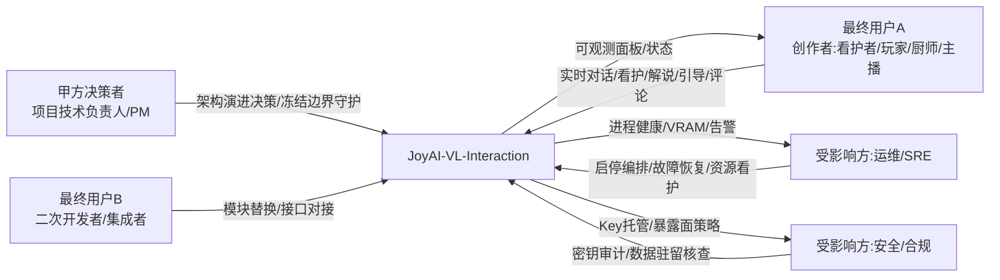
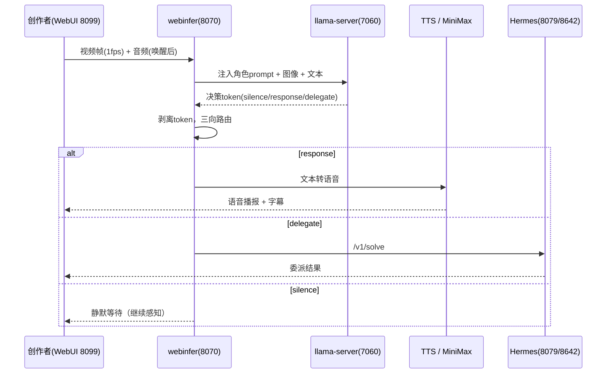

# JoyAI-VL-Interaction · UserStory（用户故事）

> 本文档为《JoyAI-VL-Interaction 架构设计》核心产物之一，定位为**产品需求与用户故事（UserStory）**。
> 上游输入：《高层架构设计》（G3 已冻结）、《资料摘要 material_digest.md》（G1 通过）、《行业调研报告 research_report.md》（G2 通过）；
> 下游输出：驱动《系统设计》《部署设计》《安全设计》的具体功能实现与验收标准。
> 设计立场：在 G3 已冻结边界（角色 / 场景 / 功能清单 F1~F17 / 模块全景 / In-Out-of-Scope / 非功能基线 N1·N2·V1·V2·V4）之上展开用户故事，**不新增、不裁剪、不越权**。

---

## 0. 元信息：修订记录

```yaml
标题: JoyAI-VL-Interaction - UserStory v0.1
版本: v0.1
状态: Draft   # Draft | Reviewing | Approved | Deprecated
创建日期: 2026-07-20
最后更新: 2026-07-20
作者: product-story-designer (顾全景)
评审人:
  - team-lead (主理人)
  - 项目技术负责人
关联文档:
  上游输入:
    - 高层架构设计: 高层架构设计.md (G3 已冻结)
    - 资料摘要: material_digest.md (G1 通过，43 份资料归一化)
    - 行业调研报告: research_report.md (G2 通过)
  下游产出:
    - 系统设计: 待 system-architect 产出（接口契约 / 关键表结构）
    - 部署设计: 待 platform-architect 产出（部署拓扑 / CI-CD / 容量成本）
    - 安全设计: 待 security-architect 产出（威胁建模 / 权限策略）
```

| 版本 | 日期 | 作者 | 变更内容 | 评审状态 |
| --- | --- | --- | --- | --- |
| v0.1 | 2026-07-20 | product-story-designer (顾全景) | 初稿：依据 G3 冻结边界展开 §1~§6，含 11 条 UserStory（七段式 + Given/When/Then 验收标准） | Draft |

---

## 1. 业务背景与价值

### 1.1 业务背景

- **行业 / 产品 / 用户规模**：实时视觉-语言交互（VL 交互）是消费级 AI 硬件与本地优先（local-first）隐私场景下的新兴方向。本项目 **JoyAI-VL-Interaction** 是一个 **8B 规模、完全开源（Apache 2.0）** 的实时视觉-语言交互系统；核心模型 **JoyAI-VL-8B** 每秒自主决策「说话 / 沉默 / 委派」（silence / response / delegate），外围由 **5 个可插拔服务**（推理 vLLM/llama-server、WebUI WebRTC 流式、ASR、TTS、background-agent）组成，自带 **400 万时间对齐交互训练数据**。用户规模当前为单用户本地形态（N2：单用户本地、无多租户），目标硬件为消费级单卡 **RTX 5060 Ti 16GB**，面向创作者 / 看护者 / 玩家 / 厨师 / 主播等终端用户与二次开发者。
- **触发本次需求的事件**：项目已有架构（D4，HEAD=021f429）主对话链路已跑通，但**下游高层设计未写完**——缺失模块级拆分、接口契约边界、进程自愈、安全基础、MVP 边界与用户故事。本期需求是在现有已冻结架构之上**冻结边界、补齐下游高层设计**，并把冻结能力转化为可被产品 / 研发直接消费的用户故事与验收标准。
- **本系统在产品矩阵中的位置**：JoyAI-VL-Interaction 在「本地优先实时 VL 交互」价值主线中承担**核心交互引擎**职责，与上游摄像头 / 屏幕 / 麦克风采集、可选 MiniMax 云端语音增强、可选 Hermes 委派 Provider 形成完整业务闭环（高层 §5.2 / §5.3）。

### 1.2 行业方案

> 同类功能、痛点的行业标杆系统及解决方案（完整论证见 research_report.md §2~§3，G2 已通过；评分标尺 1~5）。

| 标杆系统 | 厂商 / 来源 | 场景覆盖 | 技术亮点 | 与本项目关系 |
| --- | --- | --- | --- | --- |
| OpenAI Realtime API（gpt-realtime / GPT-4o） | OpenAI（头部 SaaS） | 低延迟语音到语音 + 图像输入多模态实时对话 | 单一模型语音到语音、自动 VAD / 打断、function calling、图像输入 | 仅作「全云档」能力参照；**不借鉴为主路径**（合规可控性 1/5、数据出公网，与本地优先 / 全开源冲突，O2） |
| vLLM | vLLM 社区（开源，Apache 2.0） | 高吞吐 LLM/VLM 推理，OpenAI 兼容 API | PagedAttention、连续批处理、量化、多模态 | 部分借鉴：容器化 / 健康检查模式（支撑部署演进，F14） |
| llama.cpp / llama-server（GGUF IQ4_NL） | ggml-org（开源，MIT） | 消费级硬件本地 LLM/VLM 推理，OpenAI 兼容 server | GGUF 单文件、IQ4_NL imatrix 量化、-ngl GPU 卸载、极低依赖 | **优先借鉴（4.80 最高）**：推理主路径基线（D40 §6，单卡 ~5.8GB / ~11.5GB 预算内） |
| Pipecat（Daily 开源编排框架） | Daily.co（开源社区） | 实时语音 / 多模态 Agent 编排：可插拔 STT/LLM/TTS + WebRTC | Pipeline/Frame、VAD / 智能打断、60+ 集成、SmallWebRTC 自托管 | 部分借鉴：WebRTC / VAD / Frame 设计模式映射到既有 WebUI+webinfer（不替换 webinfer 单入口网关 ADR0006） |

### 1.3 方案收益与价值

| 项 | 说明 |
| --- | --- |
| 功能模块 | 实时 VL 对话主链路（F1/F2）、决策 token 编排（F1）、KWS 唤醒与打断（F3）、TTS + 声音克隆（F4）、屏幕捕获 + Hermes 智能委派（F5）、记忆调用（F6）、对话可观测面板（F7）、进程自愈（F8）、VRAM 监控（F9）、安全基础（F10）、一键启停（F12） |
| 预期价值收益 | 「会说话的 AI」：每秒自主决策 silence/response/delegate 的实时视觉-语言交互；完全本地、隐私不出本机；单张消费级 GPU（≤11.5GB VRAM）跑通 8B VLM 实时交互；Apache 2.0 全开源 vs 闭源云 API；5 服务可插拔、单服务替换成本可控 |
| 量化标准 | 端到端交互时延 P99 ≤ 1.2s（N1）；进程崩溃自愈 P99 ≤ 30s（V1）；单卡 VRAM 峰值 ≤ 11.5GB、OOM 率 = 0（V2）；核心 VL 推理 100% 本地化（V4 合规）；云端成本上限 ≤ ¥149/月（仅可选语音增强，D31/D42 §12） |

### 1.4 术语清单

> 统一文档中专有名词的中英文对照与含义（与高层架构 §1~§6、material_digest.md 术语表对齐）。

| 术语 | 英文 / 缩写 | 含义 |
| --- | --- | --- |
| JoyAI-VL-8B | JoyAI-VL-8B | 本项目 8B 规模实时视觉-语言交互核心模型，每秒输出决策 token |
| 决策 token | decision token | 模型每秒输出的三类控制字面量：`silence`（沉默）/ `response`（说话）/ `delegate`（委派），由 webinfer 在送 TTS 前剥离（D4 §决策 token） |
| VLM | Vision-Language Model | 视觉-语言模型，输入图像 + 文本，输出决策 |
| KWS | Keyword Spotting | 唤醒词检测，进程内 sherpa-onnx，唤醒词「bt 在吗」（D22/D42 §14） |
| ASR | Automatic Speech Recognition | 自动语音识别，进程内 sherpa-onnx / Paraformer 流式（D22） |
| TTS | Text-to-Speech | 语音合成，MiniMax Rapid Clone 同步路径 / 本地 CozyVoice fallback（ADR0001） |
| Rapid Clone | MiniMax Rapid Clone（speech-2.8-hd） | 10s 参考音频零样本声音克隆，同步路径 /v1/voice_clone（D5/D27） |
| getDisplayMedia | Screen Capture API | 浏览器屏幕捕获，window、1fps、无音频（D26） |
| webinfer | 实时交互编排服务 | 单入口网关 8070，OpenAI 兼容 HTTP，决策 token 编排 + 角色 prompt 注入（ADR0006） |
| llama-server | VLM 推理服务 | 7060，GGUF IQ4_NL，JoyAI-VL-8B 推理底座（D40 §6） |
| Hermes | 智能委派底座 | 严格隔离的 background-agent：shim 8079 → gateway 8642，/v1/solve 协议转换（D24） |
| memory-store | 记忆管理服务 | 8996，sqlite FTS5 骨架 v0.1，短期 / 中期记忆 push/pull（D9/D19） |
| WebRTC | Web Real-Time Communication | 浏览器实时音视频传输，本项目 WebUI 8099 链路（D40 §0） |
| SPOF | Single Point of Failure | 单点故障；本项目 webinfer(8070) 与 llama-server main(7060) 为两层 SPOF（D10/D40 §8） |
| VRAM | Video RAM | 显存；单卡预算 ~11.5GB / 16GB（D40 §3） |
| GGUF IQ4_NL | - | llama.cpp 的 imatrix 量化格式，单卡消费级 GPU 友好（D40 §6） |
| bt-7274 | - | 角色 prompt 人格注入（D40 §6；D42 §1） |
| 5 服务可插拔 | 5 pluggable services | 推理 / WebUI / ASR / TTS / background-agent 任一可独立替换（D1 §Services） |
| 本地优先 | local-first | 核心 VL 推理 100% 本地、数据不出本机（V4 合规） |
| 完全开源 | Apache 2.0 | 本项目协议，对比闭源云 API（O2） |
| 端到端延迟 P99 | e2e latency P99 | 触发到字幕 / 语音呈现的 99 分位时延，N1 ≤ 1.2s |
| 进程自愈 | process self-heal | 核心进程崩溃后自动重启，P99 ≤ 30s（V1） |

---

## 2. 范围与边界

### 2.1 系统内模块及功能

> 一级功能清单（与高层 §6.2 模块全景 12 模块一致；按接入层 / 业务能力层 / 基础能力层三层组织）。

| 层 | 一级模块 | 责任说明（MVP 是否包含） |
| --- | --- | --- |
| 接入层 | 创作者交互端（WebUI 8099） | 视频流 + 字幕 + HUD 徽章 + 语音监听 + 角色 / 声音配置；前端团队（✅） |
| 接入层 | 运维 / 配置端 | 服务状态面板、启停编排、安全配置、会话 / 记忆导出；运维团队（✅） |
| 业务能力层 | 实时交互编排服务（webinfer 8070） | 单入口网关、决策 token 编排、角色 prompt 注入；后端团队（✅） |
| 业务能力层 | 语音播报与克隆（TTS + MiniMax） | TTS 语音播报 + Rapid Clone 声音克隆；语音团队（✅） |
| 业务能力层 | 智能委派代理（background-agent + Hermes） | Hermes 严格隔离委派 /v1/solve；代理团队（✅） |
| 业务能力层 | 对话可观测面板（LLM 回复面板） | ADR0003 可见性（display:block / /api/llm/status）；前端团队（✅） |
| 基础能力层 | VLM 推理服务（llama-server 7060） | JoyAI-VL-8B GGUF IQ4_NL 多模态推理；推理团队（✅） |
| 基础能力层 | 本地语音识别（sherpa-onnx KWS/ASR） | 进程内 KWS 唤醒 + 流式 ASR；语音团队（✅） |
| 基础能力层 | 记忆管理服务（memory-store 8996） | 短期 / 中期记忆 push/pull（v0.1 sqlite）；记忆团队（✅ v0.1） |
| 基础能力层 | 角色与提示注入（bt-7274） | 角色 prompt 人格注入；后端团队（✅） |
| 基础能力层 | 进程编排与自愈（PowerShell + 监控） | 启停编排 + health check + 自动重启 + VRAM 监控；运维团队（✅） |
| 基础能力层（外部） | 云端语音增强（MiniMax API） | 可选 ASR/TTS/克隆增强；外部供应商（❌ 可选增强，非 MVP 必须） |

### 2.2 系统外模块及功能

> 当前系统**不覆盖**的功能，及其原因（与高层 §6.1 Out-of-Scope O1~O5 一致）。

| 编号 | 不做的事 | 原因 | 后续计划 |
| --- | --- | --- | --- |
| O1 | 多节点 K8s 集群化 / 多机 HA | 当前单机 Windows 目标，集群化需求与时机未定（U-04）；迁移成本需评估（D-01） | 完整版评估 Docker Compose → K8s |
| O2 | 全云档（OpenAI Realtime 主路径） | 与「完全开源 + 本地优先」诉求冲突，数据出境且持续计费（B1 评分 2.55，合规可控性 1/5） | 不做（维持本地优先；仅作能力参照） |
| O3 | 跨会话长期记忆持久化 v0.2（embedding/psql/obsidian） | ADR0005 v0.1 仅 sqlite，范围外能力推迟（D9/D19） | 完整版（D-03） |
| O4 | 多租户 / SaaS 化 | 单用户本地工具定位，无租户隔离需求 | 不做 |
| O5 | 完整 STRIDE 威胁建模与合规认证 | G5 安全缺口当前完全缺失，MVP 仅做密钥托管 + 暴露面收敛基础 | 安全设计专项（G5） |

> **明确不归本 UserStory 越权决定的事项**（边界守护）：模块内部边界 / 数据库表结构（归 system-architect）；部署拓扑 / 资源规格 / CI-CD（归 platform-architect）；完整威胁建模 / 权限策略 / 密钥最终方案（归 security-architect）。

### 2.3 外部依赖

| 依赖系统 | 提供方 | 依赖能力 | 接入方式 | 接口人 |
| --- | --- | --- | --- | --- |
| 摄像头 / 屏幕捕获（getDisplayMedia） | 浏览器 / 操作系统 | 视频帧（1fps，无音频） | WebRTC / HTTPS | 前端团队（WebUI 进程内，0 后端改动） |
| 麦克风 + KWS 常驻监听 | 浏览器 / WebUI 进程内 | 音频流 + 唤醒词检测 | 进程内（无网络） | 语音团队（sherpa-onnx v4，FAR 2% / recall 49%） |
| MiniMax 云端（ASR/TTS/克隆） | MiniMax（外部 SaaS） | 语音合成 / 克隆 / 可选 ASR | HTTPS REST（同步路径 /v1/voice_clone，ADR0001） | 外部供应商 + 安全 / 合规（Key 隔离托管 + 按量限额 R-03；数据出境合规 U-03） |
| VLM 推理（llama-server 7060） | 推理服务 | 多模态推理 /v1/chat/completions | OpenAI 兼容 HTTP | 推理团队（SPOF 监控 + 自动重启 R-02；VRAM ≤ 11.5GB） |
| webinfer 8070 单入口网关 | 现有 webinfer | 决策 token 编排 / 角色 prompt 注入 | OpenAI 兼容 HTTP | 后端团队（ADR0006 显式失败不回退 7060；需补 SPOF 自愈 R-01） |
| sherpa-onnx KWS/ASR | WebUI 进程内 | 流式识别 / 唤醒 | 进程内 | 语音团队（默认本地，上云档仅增强 D42 §10） |
| Hermes gateway 8642 + shim 8079 | background-agent | 严格隔离委派 /v1/solve | HTTP | 代理团队（人格/记忆/Skills/Provider 独立；委派失败主对话正常 D24） |
| memory-store 8996 | 记忆服务 | 短期/中期记忆 push/pull | HTTP（FTS5 sqlite） | 记忆团队（v0.1 仅 sqlite；跨会话持久化留 v0.2 D-03） |
| 本地会话 / 记忆导出 | 本地文件系统 | 导出（可选） | 文件写 | 运维团队（非核心闭环，可选能力） |

---

## 3. 功能清单

> **定位**：全景骨架表，进入"角色 / 场景 / US"之前先看到完整功能版图。
> **一致性声明**：下表编号 / 优先级 / MVP·完整版范围 / 对齐目标与高层 §6.3 功能清单**逐行互查一致**（F1~F17 + 非功能 N1/N2）；未做任何新增、裁剪或优先级调整。

### 3.1 功能清单结构

| 编号 | 一级模块 | 二级功能 | 功能描述 | 优先级（P0/P1/P2/P3） | MVP 范围 | 完整版范围 | 备注 / 对齐目标 |
| --- | --- | --- | --- | --- | --- | --- | --- |
| F1 | 实时交互编排 | 决策 token 编排 | 每秒 silence/response/delegate 路由，送 TTS 前剥离 token | P0 | ✅ | ✅ | 对齐 V1 |
| F2 | VLM 推理 | 多模态推理 | 图像 + 文本 → 决策输出 | P0 | ✅ | ✅ | 对齐 效率 / V2 |
| F3 | 本地语音识别 | KWS 唤醒 + ASR 流式 | 进程内 sherpa-onnx，唤醒词 + 打断 | P0 | ✅ | ✅ | 对齐 效率 |
| F4 | 语音播报与克隆 | TTS + Rapid Clone | MiniMax 同步路径（ADR0001） | P0 | ✅ | ✅ | — |
| F5 | 智能委派代理 | Hermes 严格隔离委派 | shim/gateway /v1/solve 协议转换 | P0 | ✅ | ✅ | — |
| F6 | 记忆管理 | 短期/中期记忆（sqlite） | memory-store v0.1 push/pull | P0 | ✅ | ✅ | 对齐 V3（部分） |
| F7 | 对话可观测 | LLM 回复面板 | ADR0003 可见性（display:block / /api/llm/status） | P1 | ✅ | ✅ | — |
| F8 | 进程编排与自愈 | 崩溃自动重启 | 进程 health check + 自动重启，P99 ≤ 30s | P0 | ✅ | ✅ | 对齐 V1 |
| F9 | 进程编排与自愈 | VRAM 监控与预算保护 | 单卡 ≤ 11.5GB，超限告警降载 | P1 | ✅ | ✅ | 对齐 V2 |
| F10 | 安全基础 | Key 隔离 + 暴露面收敛 | 环境变量 / 隔离托管 + WebRTC localhost/内网 | P1 | ✅ | ✅ | 对齐 V4（基础） |
| F11 | 屏幕捕获 | getDisplayMedia | 窗口 1fps 捕获，0 后端改动 | P0 | ✅ | ✅ | — |
| F12 | 模块全景 | 接口契约边界定义 | 5 服务模块边界与契约边界（归 system-architect 细化） | P1 | ✅ | ✅ | — |
| F13 | 记忆管理 | 跨会话长期记忆 v0.2 | embedding/psql/obsidian（D-03） | P2 | ❌ | ✅ | 对齐 V3 |
| F14 | 部署拓扑 | Docker Compose 可选 | 健康检查 + restart（D-01） | P2 | ❌ | ✅ | — |
| F15 | 安全设计 | 完整 STRIDE 威胁建模 | 威胁模型 + 权限策略（G5） | P2 | ❌ | ✅ | 对齐 V4 |
| F16 | CI/CD | 门禁流水线 | pytest + 打包校验（修复 D12 🔴） | P2 | ❌ | ✅ | 对齐 V5 |
| F17 | 容量与成本 | 容量与成本模型 | 扩缩容 / 成本监控（G7） | P3 | ❌ | ✅ | — |
| N1 | 非功能（性能） | 端到端交互延迟 | 触发到呈现 P99 ≤ 1.2s | —（非功能基线） | ✅ | ✅ | 效率基线 |
| N2 | 非功能（形态） | 单用户本地 | 无多租户，本地单用户 | —（非功能基线） | ✅ | ✅ | 形态基线 |

> **互查结论**：高层 §6.3 共 17 条功能（F1~F17）+ 非功能 N1/N2；本表 19 行与其编号、优先级、MVP✅/❌、完整版✅、对齐目标**完全一致**。P0 功能 F1/F2/F3/F4/F5/F6/F8/F11 共 8 项均标记 MVP ✅（满足高层硬指标）。

---

## 4. 角色与场景

### 4.1 角色清单

> 5 类角色与高层 §2.1 核心角色关注点一致；下表展开为「业务身份 / 主要操作 / 核心关注点」（硬指标：≥ 3 条，每条含业务身份 / 主要操作 / 核心关注点）。



| 角色 | 业务身份 | 主要操作 | 核心关注点 |
| --- | --- | --- | --- |
| 甲方决策者（项目技术负责人 / PM） | 开源项目维护者 / 技术负责人 | 架构演进决策、社区采用评估、冻结边界守护 | **Top1**：完全开源 + 本地优先的可持续性与社区可复现性（能否在消费级单卡跑通 8B VLM 实时交互，D40 §6、D1/D2）；关注 5 服务可插拔与 Apache 2.0 合规 |
| 最终用户 A（终端创作者：看护者 / 玩家 / 厨师 / 主播） | 一线使用者 | 实时对话、看护提醒、游戏解说、菜谱引导、弹幕评论 | **Top1**：实时交互延迟 ≤ 1.2s 且不卡顿、不掉线（断流即失去使用价值，D1 场景、N1、D22 e2e 0.8–1.5s）；关注唤醒/打断自然度、语音播报质量、屏幕/摄像头上下文连贯 |
| 最终用户 B（二次开发者 / 集成者） | 调用 5 个可插拔服务的开发者 | 模块替换、接口对接、二次开发 | **Top1**：模块可插拔替换 + 接口契约清晰，单服务替换成本可控（D41 五服务可插拔、D15 松耦合）；关注 OpenAI 兼容端点、决策 token 协议、/v1/solve 契约 |
| 受影响方：安全 / 合规 | 合规 / 安全责任人 | 密钥审计、数据驻留核查 | **Top1**：数据不出本机（本地优先）、MiniMax API Key 不硬编码不泄露（D8/D33、G5 安全缺口、R-03）；关注 WebRTC 暴露面收敛、云端音频出境合规（U-03） |
| 受影响方：运维 / SRE | 本地部署运维 | 启停编排、故障恢复、资源看护 | **Top1**：单点进程可监控、崩溃可自动恢复（不全瘫，D40 §8、ADR0006 SPOF、R-01/R-02）；关注 VRAM 水位（≤11.5GB）、进程自愈 P99 ≤ 30s（V1）、一键启停 |

### 4.2 关键场景清单

> 四类核心场景（高层 §1.1 / §4.1）+ 两类运营场景（映射 F8/F12 运维角色）。频率以单用户本地形态估算（N2）。

| 编号 | 角色 | 触发条件 | 期望结果 | 频率（日均 / QPS） |
| --- | --- | --- | --- | --- |
| SC-1 实时看护提醒 | 最终用户 A（看护者） | 摄像头对准被看护对象（老人 / 儿童 / 宠物），系统持续视觉感知 | 识别风险（跌倒 / 离开安全区 / 异常静止）并即时语音提醒，端到端 P99 ≤ 1.2s | 持续运行，事件触发数次日均 |
| SC-2 游戏实时解说 | 最终用户 A（玩家） | 屏幕捕获（getDisplayMedia，1fps）游戏画面 + 玩家语音唤醒 | AI 实时解说战况 / 提示策略，必要时 delegate 给 Hermes 查资料 | 单次会话 30–120 分钟，语音交互数十次 |
| SC-3 菜谱步骤引导 | 最终用户 A（厨师） | 摄像头对准操作台 / 食材，唤醒词进入对话 | AI 逐步引导菜谱、识别当前步骤、纠正操作 | 单次做菜 20–60 分钟，步骤交互十余次 |
| SC-4 直播弹幕评论 | 最终用户 A（主播） | 屏幕捕获直播画面 + 弹幕文本输入，唤醒后持续交互 | AI 实时评论 / 回应弹幕 / 与观众互动，delegate 处理复杂查询 | 单次直播 1–3 小时，弹幕交互频繁 |
| SC-5 一键启停编排 | 受影响方：运维 / SRE | 用户执行 start/stop-joyai.ps1（默认 7060/8070/8099/8985） | 5 服务按依赖顺序启动 / 停止，状态面板可见 | 每日 1–2 次启停 |
| SC-6 进程自愈与资源看护 | 受影响方：运维 / SRE | 任一核心进程崩溃 / VRAM 超限 | 自动重启恢复（P99 ≤ 30s）/ VRAM 超限告警降载，不全瘫 | 事件触发，期望 0 次 / 日（最佳努力） |

---

## 5. 用户旅程（UserStory）

> 11 条 UserStory 覆盖 MVP 功能 F1~F12（F11 屏幕捕获归入 US-1/US-5 主链路，F12 接口契约边界归 system-architect 细化、本处仅作引用）。
> 每条 US 按 **5.1.1~5.1.7 七段式**展开。四类场景（SC-1~SC-4）作为用户面映射标注于各 US。



### 5.1 US-1：实时 VL 对话主链路（F1 / F2 / F11）

#### 5.1.1 业务场景

- **视角**：最终用户 A（创作者）。
- **描述逻辑**：用户在 Windows 单机运行 JoyAI-VL-Interaction，浏览器打开 WebUI(8099)。摄像头 / 屏幕以 1fps 持续推送视频帧，麦克风在 KWS 唤醒后接入音频。系统通过 webinfer(8070) 编排 → llama-server(7060) 做 VLM 推理（图像 + 文本）→ 模型每秒输出决策 token → 经路由后语音播报 / 静默 / 委派。用户在一次看护、一场游戏、一次做菜或一段直播中走完「采集 → 推理 → 呈现」完整闭环（SC-1~SC-4）。

#### 5.1.2 业务流程

- **视角**：用户。
- **Given / When / Then**：
  - Given 系统已通过 start-joyai.ps1 启动且 5 服务健康；When 用户打开 WebUI 并授权摄像头 / 屏幕 / 麦克风；Then 主对话界面呈现视频流 + 字幕 + HUD 徽章（jarvisStatus/llmBadge/ttsBadge/kwsBadge）。
  - Given 视频帧以 1fps 推送、用户说出唤醒词；When webinfer 收到图像 + 文本并调用 llama-server；Then llama-server 返回决策 token，webinfer 在送 TTS 前剥离 token 并路由。
  - Given 路由结果为 response；When 文本送入 TTS；Then 用户在 P99 ≤ 1.2s 内听到语音并看到字幕（N1）。

#### 5.1.3 UE 原型

- 核心路径：主对话界面 = 视频流（左上）+ 实时字幕（中下）+ HUD 徽章行（右上：jarvisStatus / llmBadge / ttsBadge / kwsBadge）。
- 核心路径步骤 ≤ 3 步：① 打开 WebUI → ② 授权采集 → ③ 说唤醒词即对话（无需额外操作）。

#### 5.1.4 业务逻辑

- **视角**：业务系统。
- 数据流：WebRTC → WebUI → `POST /v1/chat/completions` → webinfer 注入角色 prompt（bt-7274）→ llama main 返回决策 token → webinfer 剥离 token 并三向路由 → response 走 TTS / delegate 走 Hermes / silence 继续感知 → 每 100 帧触发中期摘要写 memory-store（D40 §2/§3）。

#### 5.1.5 数据描述

- 输入：视频帧（1fps，~200KB/s，D42 §16）、音频（唤醒后）、角色 prompt（bt-7274）、图像（base64 / URL）。
- 流转：webinfer 累积 qa_history（D40 §拓扑）；决策 token 在 webinfer 内部剥离不落地；中期摘要（每 100 帧）push 至 memory-store 8996。
- 输出：字幕文本 + TTS 音频 + HUD 状态。

#### 5.1.6 验收标准 AC

- **AC-正常路径**：Given 5 服务健康且采集已授权，When 用户说唤醒词并发起一次对话，Then 端到端（触发到字幕 / 语音呈现）P99 ≤ 1.2s（N1，对齐 D22 e2e 0.8–1.5s），且字幕与语音内容一致。
- **AC-正常路径-沉默**：Given 模型判定当前无需说话，When 输出决策 token = silence，Then webinfer 保持静默继续感知，不触发 TTS、不产生空播报。
- **AC-异常路径-推理不可达**：Given llama-server(7060) 崩溃，When webinfer 调用超时，Then webinfer 依 ADR0006 显式失败（不回退 7060），UI 显示 llmBadge 异常，运维侧触发自愈（见 US-8），不全瘫。
- **AC-异常路径-视频帧中断**：Given 摄像头 / 屏幕捕获断开，When WebUI 连续 N 帧未收到视频，Then UI 提示采集中断、保留音频通道，恢复后自动续传。

#### 5.1.7 外部集成接口

- llama-server `/v1/chat/completions`（OpenAI 兼容 HTTP，图像 + 文本）；webinfer `/v1/chat/completions`、`/v1/text/chat`（D4 §拓扑 / D10）；WebRTC 采集（浏览器 getDisplayMedia + 麦克风）。
- 依赖约束：VLM 推理 100% 本地（V4 合规）；webinfer 为 ADR0006 单入口网关。

### 5.2 US-2：决策 token 编排（F1）

#### 5.2.1 业务场景

- **视角**：最终用户 A / 最终用户 B（二次开发者）。
- **描述逻辑**：模型每秒产出 `silence` / `response` / `delegate` 三类字面量。用户（及二次开发者）期望系统严格按三类路由：response → 语音播报；silence → 静默等待；delegate → 转 Hermes 智能体。这是「会说话的 AI」区别于被动问答的核心（D1 §Overview）。

#### 5.2.2 业务流程

- **Given / When / Then**：
  - Given webinfer 收到 llama-server 返回含决策 token 的文本；When 解析出 `response`；Then 剥离 token 后将纯文本送 TTS 播报。
  - Given 解析出 `silence`；When 判定无需说话；Then 丢弃该帧输出、保持感知。
  - Given 解析出 `delegate`；When 抽取委派意图；Then 转 background-agent（Hermes /v1/solve），主对话不阻塞。

#### 5.2.3 UE 原型

- HUD 徽章 `jarvisStatus` 实时显示当前路由态（LISTENING / THINKING / SPEAKING / DELEGATING）。
- 开发者视图：webinfer 日志可观测每条 token 路由结果（便于二次开发调试）。

#### 5.2.4 业务逻辑

- webinfer 在送 TTS 前剥离决策 token（D4 §决策 token）；三类字面量精确匹配，未知 token 按 silence 兜底（D42 §14 静默兜底 5s），避免误播报。

#### 5.2.5 数据描述

- 决策 token 为模型输出前缀字面量，webinfer 解析后不进入 qa_history、不送 TTS。
- delegate 意图封装为 SolveRequest 转发 Hermes（D41 §端口表 / D24）。

#### 5.2.6 验收标准 AC

- **AC-正常路径-response**：Given 模型输出以 `response` 前缀，When webinfer 解析并剥离，Then 仅纯文本进入 TTS，字幕不含 token 字面量。
- **AC-正常路径-delegate**：Given 输出 `delegate`，When 意图转发 Hermes，Then 主对话继续、委派结果回注对话，委派失败不影响主链路（D24 故障隔离）。
- **AC-异常路径-未知 token**：Given 模型输出无法识别的 token，When webinfer 判定未知，Then 按 silence 兜底、不播报、记录告警日志。
- **AC-异常路径-token 与内容错位**：Given token 为 response 但内容为空，When webinfer 检测空内容，Then 不触发 TTS、计入异常计数、UI 提示。

#### 5.2.7 外部集成接口

- 上游：llama-server 决策 token 输出（D4）；下游：TTS（F4）、Hermes /v1/solve（F5）。
- 契约边界：决策 token 字面量与解析规则由 system-architect 在 F12 接口契约中细化冻结。

### 5.3 US-3：KWS 唤醒与打断（F3）

#### 5.3.1 业务场景

- **视角**：最终用户 A。
- **描述逻辑**：用户无需一直按住说话。系统进程内常驻 KWS（sherpa-onnx，唤醒词「bt 在吗」），监听徽章显示 KWS_LISTENING；检测到唤醒词 → WAKE_DETECTED → 进入 DIALOG_ACTIVE。对话中可用 EXIT_WORDS（行 / 明白 / 了解 / ok / 好的，D29 交叉引用）退出，或自然打断（Barge-in，D42 §14）。

#### 5.3.2 业务流程

- **Given / When / Then**：
  - Given KWS 常驻监听、麦克风已授权；When 用户说唤醒词；Then 系统在 ≤ 1.5s 内进入 DIALOG_ACTIVE 并开始 ASR 流式识别。
  - Given 对话中用户再次开口（打断）；When 检测到新语音；Then 中止当前 TTS 播报（Barge-in），立即处理新输入。
  - Given 用户说 EXIT_WORDS 或静默超 5s 兜底；When 退出条件满足；Then 回到 KWS_LISTENING。

#### 5.3.3 UE 原型

- 专用 BT 监听按钮（btListenBtn）开启 audio-only WebRTC `/offer`（D21）；徽章三态：KWS_LISTENING / WAKE_DETECTED / DIALOG_ACTIVE。

#### 5.3.4 业务逻辑

- 进程内 sherpa-onnx v4（FAR 2% / recall 49.06%，D18/D22）；混合唤醒确认状态机 WAIT_ASR_CONFIRM（asr_confirm_timeout_s = 1.2，D17）；默认 ASR_URL="" 直连进程内（D42 §13）。

#### 5.3.5 数据描述

- 音频：PCM 滚动采集 → sherpa-onnx；唤醒后 ASR 流式输出文本 → webinfer。
- 状态：KWS/ASR 状态经 WebRTC 信令上报 WebUI 徽章。

#### 5.3.6 验收标准 AC

- **AC-正常路径-唤醒**：Given KWS 常驻且 FAR/recall 在基线内，When 用户清晰说唤醒词，Then WAKE_DETECTED 在 ≤ 1.5s 内出现并进入 DIALOG_ACTIVE。
- **AC-正常路径-打断**：Given 正在 TTS 播报，When 用户开口打断，Then 当前播报中止、新输入被识别处理（Barge-in）。
- **AC-异常路径-漏唤醒**：Given recall 基线约 49%（D18），When 部分唤醒词未被识别，Then 用户可重说或用 EXIT/重试；系统提供手动「对话」入口兜底（纸飞机发送，D20）。
- **AC-异常路径-误唤醒**：Given FAR 2%（D22），When 偶发误唤醒，Then 进入 WAIT_ASR_CONFIRM 短窗口（1.2s）二次确认，超时自动回 LISTENING，不触发播报。

#### 5.3.7 外部集成接口

- 进程内 sherpa-onnx（无网络）；可选上云档 ASR（阿里云，档2，D42 §10）仅增强准确率，本地为默认。
- KWS 参数经环境变量注入（ADR0002：JARVIS_KWS_SCORE=10.0 / THRESHOLD=0.25 / TRAILING_BLANKS=1 / MAX_ACTIVE_PATHS=10）。

### 5.4 US-4：TTS 语音播报 + 声音克隆（F4）

#### 5.4.1 业务场景

- **视角**：最终用户 A。
- **描述逻辑**：当决策 token = response，系统将文本转为语音播报，并支持用 10s 参考音频做 MiniMax Rapid Clone 零样本声音克隆（同步路径 /v1/voice_clone，ADR0001），使 AI 以用户指定声线说话。本地 CozyVoice 作 fallback（D42 §5）。

#### 5.4.2 业务流程

- **Given / When / Then**：
  - Given 决策 token = response 且文本就绪；When webinfer 调用 TTS；Then 语音在 P99 ≤ 1.2s 内播报（与字幕同步）。
  - Given 用户上传 10s 参考音频并触发克隆；When 调用 MiniMax /v1/voice_clone（同步）；Then 返回 voice_id 并注册为可用声线（¥9.9/voice，7 天过期，D27）。
  - Given MiniMax 不可达；When TTS 调用失败；Then 自动 fallback 本地 CozyVoice 或仅文字播报（D40 §8：TTS 失败可显文字）。

#### 5.4.3 UE 原型

- 「角色与声音配置」页：填写 bt-7274 prompt + 上传 10s 参考音频 → 触发 Rapid Clone → ttsBadge 显示声线状态。

#### 5.4.4 业务逻辑

- TTS 直连 MiniMax（ADR0001 同步路径，非 /v2 异步）；voice_clone 服务（8985）代理；凭证经隔离托管（见 US-10）；本地 CozyVoice 作降级（D42 §5）。

#### 5.4.5 数据描述

- 输入：response 文本 + voice_id（或默认声线）；输出：音频流。
- 克隆：参考音频（10s）→ MiniMax Rapid Clone → voice_id（7 天过期）；不落本地明文 Key。

#### 5.4.6 验收标准 AC

- **AC-正常路径-播报**：Given response 文本 + 有效声线，When TTS 调用成功，Then 语音与字幕在 P99 ≤ 1.2s 内同步呈现。
- **AC-正常路径-克隆**：Given 10s 参考音频，When 调 /v1/voice_clone 成功，Then 返回 voice_id 并可在配置页选用。
- **AC-异常路径-MiniMax 失败**：Given MiniMax 超时 / 401，When TTS 失败，Then fallback 本地 CozyVoice；若本地亦不可用，则仅文字播报并 ttsBadge 异常，主对话不中断。
- **AC-异常路径-克隆过期**：Given voice_id 超过 7 天，When 再次调用，Then 提示重新克隆、回退默认声线。

#### 5.4.7 外部集成接口

- MiniMax Speech 2.8 / Rapid Clone（HTTPS REST，同步路径 /v1/voice_clone，ADR0001）；本地 CozyVoice fallback。
- 依赖约束：Key 隔离托管 + 按量限额（R-03）；语音出境合规（U-03）。

### 5.5 US-5：屏幕捕获 + Hermes 智能委派（F5 / F11）

#### 5.5.1 业务场景

- **视角**：最终用户 A（玩家 / 主播为主，SC-2 / SC-4）。
- **描述逻辑**：用户共享屏幕（getDisplayMedia，displaySurface=window，1fps，无音频，0 后端改动，D26/D42 §16）。当模型输出 `delegate`，系统将复杂查询 / 工具调用转发 Hermes 严格隔离的 background-agent（shim 8079 → gateway 8642，/v1/solve），人格 / 记忆 / Skills / Provider 独立，委派失败主对话正常（D24）。

#### 5.5.2 业务流程

- **Given / When / Then**：
  - Given 屏幕捕获已授权（仅选窗口）；When WebUI 以 1fps 推帧；Then webinfer 收到图像用于 VLM 推理，0 后端改动。
  - Given 决策 token = delegate；When webinfer 调 Hermes /v1/solve；Then 委派结果回注对话，主链路不阻塞。
  - Given Hermes 不可达 / 超时；When 委派失败；Then 主对话继续，UI 提示「委派暂不可用」，不丢失上下文。

#### 5.5.3 UE 原型

- 「Screen Capture」标签页：选择窗口 → 1fps 预览；HUD `jarvisStatus` 显示 DELEGATING 态。

#### 5.5.4 业务逻辑

- getDisplayMedia（window，1fps，audio=false，强制只选窗口，D42 §16）；Hermes shim 仅做 /v1/solve 协议转换、不传 system（D24 严格隔离）；委派结果经 webinfer 回注 qa_history。

#### 5.5.5 数据描述

- 屏幕帧：~200KB/s、100ms 以内（D42 §16）；委派请求：SolveRequest（FrameInput / 意图）→ Hermes → SolveResponse。
- 隔离：Hermes 人格 / 记忆 / Skills / Provider 与主对话独立（D24）。

#### 5.5.6 验收标准 AC

- **AC-正常路径-捕获**：Given 用户选窗口授权，When 屏幕捕获启动，Then 以 1fps、无音频推送，后端无改动、预览可见。
- **AC-正常路径-委派**：Given delegate 意图，When /v1/solve 成功，Then 结果回注对话且主对话不阻塞。
- **AC-异常路径-强制选屏**：Given 用户尝试共享整个屏幕 / 含音频，When 捕获策略校验，Then 系统强制仅窗口 + 无音频或拒绝，防止隐私越界（对齐安全）。
- **AC-异常路径-委派失败**：Given Hermes 不可达，When 委派超时，Then 主对话正常继续、UI 提示委派不可用，不丢上下文（D24 / D40 §8）。

#### 5.5.7 外部集成接口

- 浏览器 getDisplayMedia（WebRTC）；Hermes gateway 8642 + shim 8079（HTTP /v1/solve，D24/D41）。
- 契约：SolveRequest/Response/FrameInput 字段由 system-architect 在 F12 细化（D40 §7 不变性）。

### 5.6 US-6：记忆调用（F6）

#### 5.6.1 业务场景

- **视角**：最终用户 A。
- **描述逻辑**：系统通过 memory-store v0.1（sqlite FTS5，8996）维护短期 / 中期记忆（D9/D19）。每 100 帧中期摘要 push；对话中 webinfer pull 相关记忆以保持上下文连贯。跨会话长期记忆（v0.2 embedding/psql/obsidian）为 Out-of-Scope O3，本 US 仅覆盖 v0.1。

#### 5.6.2 业务流程

- **Given / When / Then**：
  - Given 对话进行中每 100 帧；When webinfer 生成中期摘要；Then push 至 memory-store 8996（短期 → 中期）。
  - Given 新一轮对话需要上下文；When webinfer pull 记忆；Then 召回相关短期 / 中期记忆注入 prompt。
  - Given memory-store 不可用；When pull/push 失败；Then 主对话降级为无记忆模式，不中断。

#### 5.6.3 UE 原型

- 「对话历史与记忆」页：vlm-history 查看、短期 / 中期记忆浏览（D42 §7）。

#### 5.6.4 业务逻辑

- memory-store v0.1 仅 sqlite（ADR0005）；push/pull 对称；score/last_hit_at/hit_count 不计算（v0.1 边界，D9）；JOYAI_ENABLE_MEMORY_STORE=1 默认 false（D42 §7）。

#### 5.6.5 数据描述

- MemoryBlock（D19）：短期 / 中期；push/pull 经 HTTP（FTS5 sqlite）；不跨会话持久化（O3）。

#### 5.6.6 验收标准 AC

- **AC-正常路径-摘要沉淀**：Given JOYAI_ENABLE_MEMORY_STORE=1，When 每 100 帧，Then 中期摘要成功 push，历史可回看。
- **AC-正常路径-召回**：Given 开启记忆，When 新对话 pull，Then 相关记忆注入 prompt、上下文连贯。
- **AC-异常路径-存储不可用**：Given memory-store 崩溃，When pull/push 失败，Then 主对话降级无记忆继续，UI 提示记忆不可用。
- **AC-边界-长期记忆**：Given 用户期望跨会话长期记忆，When 当前为 v0.1，Then 系统明确标注「跨会话长期记忆将于完整版 v0.2 提供」（O3），不承诺持久化。

#### 5.6.7 外部集成接口

- memory-store 8996（HTTP，FTS5 sqlite，D9/D19）；v0.2 演进归 D-03 / system-architect。

### 5.7 US-7：对话可观测面板（F7）

#### 5.7.1 业务场景

- **视角**：最终用户 A / 运维 SRE。
- **描述逻辑**：用户与运维可在 WebUI 实时看到 LLM 回复面板状态（ADR0003 可见性：A CSS display:block ✅；B /api/llm/status ✅；C streaming delta ⚠️ 部分实现）。HUD 徽章（jarvisStatus/llmBadge/ttsBadge/kwsBadge）呈现各子系统健康。

#### 5.7.2 业务流程

- **Given / When / Then**：
  - Given 对话进行中；When LLM 产生回复；Then 回复面板可见（display:block）且 /api/llm/status 返回当前态。
  - Given 某子系统异常；When 状态变化；Then 对应徽章变红 / 异常提示（如 llmBadge 推理异常）。
  - Given 用户查看历史；When 打开 vlm-history；Then 对话回放与记忆可见。

#### 5.7.3 UE 原型

- 主对话界面右上下拉面板：LLM 回复原文 + 四枚 HUD 徽章；颜色编码健康 / 异常。

#### 5.7.4 业务逻辑

- ADR0003 三可见性：display:block + /api/llm/status 已落地，streaming delta 部分实现；徽章状态由 WebUI 聚合各服务健康。

#### 5.7.5 数据描述

- 状态数据：各服务 health（/health）+ LLM 当前回复流；徽章态经前端状态机渲染。

#### 5.7.6 验收标准 AC

- **AC-正常路径-可见性**：Given 对话中 LLM 回复，When 面板渲染，Then display:block 生效且 /api/llm/status 返回正确态。
- **AC-正常路径-徽章**：Given 全部健康，When 用户查看，Then 四枚徽章均为正常态。
- **AC-异常路径-状态缺失**：Given streaming delta 仅部分实现，When 流式中断，Then 面板以已收到文本兜底显示、标注「流式未完整」，不空白。
- **AC-异常路径-推理异常**：Given llama-server 异常，When llmBadge 更新，Then 显示异常并引导查看运维面板（US-8/US-9）。

#### 5.7.7 外部集成接口

- webinfer `/api/llm/status`、`/health`；WebUI 前端渲染（D7 ADR0003）。

### 5.8 US-8：进程自愈（F8）

#### 5.8.1 业务场景

- **视角**：受影响方：运维 / SRE。
- **描述逻辑**：核心对话链路存在两层 SPOF（webinfer 8070 新 SPOF、llama-server main 7060 唯一 SPOF，D10/D40 §8）。运维要求单点进程可监控、崩溃可自动恢复（不全瘫）。系统对核心进程做 health check + 自动重启，崩溃到恢复 P99 ≤ 30s（V1）。

#### 5.8.2 业务流程

- **Given / When / Then**：
  - Given 编排脚本已启动进程监控；When 某核心进程（7060/8070/8099 等）崩溃；Then 监控在超时窗口内检测到并自动重启。
  - Given 重启成功；When 进程重新健康；Then 服务状态面板显示恢复，对话在 P99 ≤ 30s 内可继续。
  - Given 重启多次失败；When 超过阈值；Then 标记该进程不可用、告警运维，其余进程不全瘫（如 Hermes 挂仅委派失败、主对话正常，D40 §8）。

#### 5.8.3 UE 原型

- 运维 / 配置端「服务状态面板」：11 进程健康 + 自动重启计数 + 恢复耗时；异常高亮。

#### 5.8.4 业务逻辑

- 进程 health check + 自动重启（借鉴 Docker restart:unless-stopped / Ollama healthcheck，SR-05）；崩溃面与 7060 解耦监控（R-01/R-02）；自愈最佳努力可用性（D5 无对外 SLA）。

#### 5.8.5 数据描述

- 监控数据：进程 PID / 端口 / 健康态 / 最近重启时间 / 重启次数；留存于本地运维日志。

#### 5.8.6 验收标准 AC

- **AC-正常路径-自愈**：Given 单核心进程崩溃，When 监控检测并重启，Then 从崩溃到恢复 P99 ≤ 30s（V1），且不全瘫。
- **AC-正常路径-隔离**：Given Hermes 崩溃，When 委派失败，Then 主对话（VLM/TTS）正常继续（D40 §8 故障域隔离）。
- **AC-异常路径-重启失败**：Given 进程反复崩溃超阈值，When 自愈放弃，Then 标记不可用 + 告警运维，其余服务保持，不全系统瘫痪。
- **AC-异常路径-双 SPOF 同时崩**：Given 7060 与 8070 同时崩，When 并发重启，Then 两者均被重启、恢复后对话续接，P99 ≤ 30s 以最慢者计。

#### 5.8.7 外部集成接口

- 进程编排与自愈（PowerShell + 监控）；webinfer/llama-server 健康检查端点（/health）；告警至运维面板。

### 5.9 US-9：VRAM 监控与预算保护（F9）

#### 5.9.1 业务场景

- **视角**：受影响方：运维 / SRE。
- **描述逻辑**：单卡 RTX 5060 Ti 16GB，VRAM 预算 ~11.5GB（D40 §3），峰值已逼近上限、仅留 4.5GB 余量给游戏。运维要求 VRAM 峰值受控、不超预算、超限告警降载（V2，OOM 率 = 0）。

#### 5.9.2 业务流程

- **Given / When / Then**：
  - Given 系统运行；When VRAM 监控采样；Then 实时显示水位（进程组合计 ~11.5GB）。
  - Given VRAM 超 11.5GB 阈值；When 触发；Then 实时告警并自动降载（关闭非必要服务 / 收紧上下文）。
  - Given 降载后仍超限；When 持续高危；Then 提示用户手动关停可选服务，避免 OOM 崩溃。

#### 5.9.3 UE 原型

- 运维面板「VRAM 水位」条：当前 / 预算（11.5GB）/ 上限（16GB）；超阈值变红 + 降载按钮。

#### 5.9.4 业务逻辑

- GGUF IQ4_NL 量化控制显存；关闭非必要服务、控制上下文长度 / KV cache（R-05）；预留 4.5GB 给游戏（D40 §3）。

#### 5.9.5 数据描述

- VRAM 数据：各进程占用（llama main 5.8 / summary 2.9 / whisper 0.7 / Cosy 1.1 / voice_clone 0.2 / hermes 0.2+0.15 / webinfer 0.1 / tts_adapter 0.08 / asr_adapter 0.08 / WebUI 0.15 ≈ 11.5GB，D40 §3）。

#### 5.9.6 验收标准 AC

- **AC-正常路径-监控**：Given 系统运行，When 监控采样，Then VRAM 水位实时可见、合计 ≤ 11.5GB（V2）。
- **AC-正常路径-降载**：Given VRAM 超阈值，When 触发降载，Then 自动关闭非必要服务并告警，峰值回落 ≤ 11.5GB。
- **AC-异常路径-OOM 风险**：Given 降载无效且持续超限，When 高危，Then 提示手动关停可选服务、记录高危事件，避免 OOM（目标 OOM 率 = 0）。
- **AC-边界-余量**：Given 用户同时运行游戏，When VRAM 接近 11.5GB，Then 系统优先保障 4.5GB 余量提示，不抢占游戏显存。

#### 5.9.7 外部集成接口

- 本地 GPU 监控（nvidia-smi / CUDA）；进程编排降载脚本；无外部依赖。

### 5.10 US-10：安全基础 Key 托管 + 暴露面收敛（F10）

#### 5.10.1 业务场景

- **视角**：受影响方：安全 / 合规。
- **描述逻辑**：MiniMax API Key 当前仅环境变量（D8，开发态），存在硬编码 / 日志泄露风险（R-03）。安全合规要求 Key 不硬编码、数据不出本机（V4 合规）、WebRTC 暴露面收敛到 localhost / 内网（R-04）。MVP 做基础收敛，完整 STRIDE 留 O5 / F15。

#### 5.10.2 业务流程

- **Given / When / Then**：
  - Given 系统启动加载凭证；When 读取 MiniMax Key；Then 从隔离托管（.env gitignored / Vault 兼容）注入，不硬编码、不打印明文日志。
  - Given WebUI 启动；When 绑定监听地址；Then 仅绑定 localhost / 内网，禁止公网暴露（R-04）。
  - Given 运维配置暴露面；When 策略保存；Then 仅本地或 VPN 访问，反向代理可选 TLS 终止。

#### 5.10.3 UE 原型

- 运维 / 配置端「安全配置」页：Key 托管状态（已隔离 / 未配置）、暴露面策略（localhost / 内网 / 禁止公网）。

#### 5.10.4 业务逻辑

- Key 隔离托管 + 按量限额（R-03）；WebRTC 暴露面 localhost / 内网收敛（R-04）；自签证书（D33）仅本地；遵守本地优先、仅 ASR/TTS/克隆上云（U-03）。

#### 5.10.5 数据描述

- 凭证：MiniMax Key 经 .env（gitignored）或 Vault 注入，不在代码 / 日志出现；暴露面策略存本地配置。

#### 5.10.6 验收标准 AC

- **AC-正常路径-托管**：Given 配置隔离托管，When 启动加载，Then Key 自环境变量 / Vault 注入，代码库与运行日志无明文 Key。
- **AC-正常路径-收敛**：Given 默认配置，When WebUI 绑定，Then 仅 localhost / 内网监听，公网不可达。
- **AC-异常路径-硬编码检测**：Given 代码含硬编码 Key，When 安全扫描（F16/CI），Then 构建失败 / 告警，阻断发布（对齐 F16）。
- **AC-异常路径-误暴露**：Given 用户误设为 0.0.0.0，When 启动校验，Then 拒绝或强制回 localhost 并告警，防止摄像头 / 麦克风流出境。

#### 5.10.7 外部集成接口

- MiniMax API（HTTPS，Key 隔离托管，R-03）；WebRTC（localhost / 内网，R-04）；完整 STRIDE 归 security-architect（F15/O5）。

### 5.11 US-11：一键启停编排（F12 引用 / F8/F9 触发）

#### 5.11.1 业务场景

- **视角**：受影响方：运维 / SRE（SC-5）。
- **描述逻辑**：用户以 `start-joyai.ps1` / `stop-joyai.ps1` 一键启停（ADR0004）。默认启动 7060/8070/8099/8985（D8/D40 §0），按依赖顺序（D40 §4）拉起 5 服务。接口契约边界（F12）归 system-architect 细化，本 US 仅覆盖启停编排的用户面。

#### 5.11.2 业务流程

- **Given / When / Then**：
  - Given 用户执行 `start-joyai.ps1 -Mode default`；When 脚本按依赖顺序启动；Then 7060/8070/8099/8985 等就绪，状态面板全绿。
  - Given 用户执行 `stop-joyai.ps1`；When 覆盖 12 端口优雅停止；Then 所有相关进程退出、释放 VRAM。
  - Given 启动中某依赖缺失；When 顺序校验失败；Then 提示缺失项并中止，不全量拉起半成品。

#### 5.11.3 UE 原型

- 运维 / 配置端「启动 / 停止编排」：一键按钮 + 依赖顺序校验 + 实时进度。

#### 5.11.4 业务逻辑

- start/stop-joyai.ps1（PowerShell，ADR0004）；依赖链：voice_clone→Cosy；tts_adapter→voice_clone/Cosy；webinfer→llama main+summary；hermes shim→gateway；WebUI→webinfer+tts+asr+shim（D40 §4）。

#### 5.11.5 数据描述

- 启动日志：各服务 PID / 端口 / 启动耗时 / 健康态；存本地。

#### 5.11.6 验收标准 AC

- **AC-正常路径-启动**：Given 干净环境，When 执行 start，Then 按依赖顺序拉起、5 服务健康、状态面板全绿。
- **AC-正常路径-停止**：Given 运行中，When 执行 stop，Then 12 端口进程优雅退出、VRAM 释放。
- **AC-异常路径-依赖缺失**：Given 某前置服务未装 / 模型缺失，When 启动校验，Then 中止并提示缺失项，不拉起半成品。
- **AC-异常路径-端口占用**：Given 目标端口被占用，When 启动检测，Then 提示冲突端口、不强行覆盖，避免静默串服。

#### 5.11.7 外部集成接口

- PowerShell 编排脚本（ADR0004）；各服务健康端点；接口契约边界（F12）由 system-architect 在系统设计中细化冻结。

---

## 6. 非功能性需求

### 6.1 易用性需求

> 操作便利性、UI 一致性、引导提示、错误反馈、无障碍支持等。

- **核心路径 ≤ 3 步**：用户无额外操作即可对话——① 打开 WebUI → ② 授权采集 → ③ 说唤醒词即对话（高层 §6.4 关键交互约束）。
- **状态可视（HUD 徽章）**：jarvisStatus / llmBadge / ttsBadge / kwsBadge 实时呈现各子系统健康与对话态（D28/D21）；LLM 回复面板可见性（ADR0003）。
- **UI 一致性**：WebUI 复用既有交互规范（voice-ui.md D28、webui-kws-listening-chain.md D21），不引入独立薄壳（D42 §4 风险回退）。
- **引导提示**：唤醒词「bt 在吗」、EXIT_WORDS、BT 监听按钮、角色 / 声音配置页均有明确引导；首次启动有依赖顺序校验提示（US-11）。
- **错误反馈**：采集中断 / 推理异常 / TTS 失败 / 委派失败均有 UI 提示且不中断主对话（US-1~US-5、US-7）；异常路径兜底（如静默兜底 5s、手动对话入口）。
- **无障碍**：HUD 徽章颜色 + 文字双编码；语音播报与字幕同步，兼顾听障 / 视障辅助（字幕可读、语音可听）。

### 6.2 性能响应需求

> 关键接口响应时延（P50 / P90 / P99）、吞吐量（QPS / TPS）、并发用户数、数据规模上限等。

| 指标 | P50 | P90 | P99 | 来源 / 基线 |
| --- | --- | --- | --- | --- |
| 端到端交互时延（触发→字幕/语音呈现） | ~0.9s | ~1.05s | **≤ 1.2s** | N1（冻结）；D22 e2e 0.8–1.5s |
| KWS 唤醒延迟（说唤醒词→DIALOG_ACTIVE） | — | — | **≤ 1.5s** | D22 e2e 0.8–1.5s；D42 §14 |
| 进程崩溃→自愈恢复 | — | — | **≤ 30s** | V1（冻结）；R-01/R-02 |
| VRAM 峰值占用 | — | — | **≤ 11.5GB**（OOM 率=0） | V2（冻结）；D40 §3 |
| ASR 首 token（Paraformer int8） | 200–400ms | — | — | D22 |
| TTS 冷启动（上云档 vs 本地） | 上云 ≤300ms / 本地 5–8s | — | — | D42 §10（上云收益） |

- **并发用户数**：单用户本地（N2），无多租户；并发会话 = 1。
- **吞吐量 / QPS**：本地单用户形态，无高并发压力；以单会话实时流为主（视频 1fps ~200KB/s，D42 §16）。
- **数据规模上限**：上下文长度受 VRAM 约束（ctx 4096→16384 修复，D26 v3.34）；memory-store v0.1 仅 sqlite 本地（D9）。

### 6.3 操作与环境需求

> 浏览器 / 客户端兼容性、网络环境、设备规格、运行环境约束等。

- **部署形态**：私有化本地，**Windows 单机 + RTX 5060 Ti 16GB**（ADR0004 / D40 §0；高层 §4.2 D5）。多租户否（N2）。
- **浏览器 / 客户端**：WebUI 8099 经 WebRTC 流式；支持现代桌面浏览器（Chrome / Edge 等）的 getDisplayMedia + 麦克风；Python 3.12 后端（D33）。
- **网络环境**：默认 **localhost / 内网**；WebRTC 暴露面收敛，禁止公网（R-04 / US-10）；可选 MiniMax 云端仅 ASR/TTS/克隆出境（U-03）。
- **设备规格**：单卡 16GB，VRAM 预算 ~11.5GB，预留 4.5GB 给游戏（D40 §3）；11 进程合计 ~11.5GB（D40 §3 进程组）。
- **运行环境约束**：Windows 11；PowerShell 编排（start/stop-joyai.ps1）；自签证书本地（D33）；无 K8s / 多节点（O1）。
- **本地优先**：核心 VL 推理 100% 本地（V4 合规）；云端仅可选语音增强，月成本上限 ≤ ¥149（D31/D42 §12）。

### 6.4 安全性需求

> 满足相关安全标准（MVP 基础收敛；完整 STRIDE 归 security-architect F15 / O5）。

#### 6.4.1 安全密码设置

- 本系统为**本地单用户工具**（N2），无账号密码体系；不涉及注册 / 登录密码。
- 若后续完整版引入管理密码（如运维配置访问），须支持 **8 位以上大小写字母 + 数字 + 特殊字符** 的强度要求（提前预留，不与当前形态冲突）。

#### 6.4.2 安全软件架构

- **模块通信安全**：各服务经 OpenAI 兼容 HTTP / 进程内通信；webinfer 为 ADR0006 单入口网关，显式失败不回退 7060。
- **认证与访问控制**：本地单用户形态，访问绑定 localhost / 内网（R-04）；外部 Hermes /v1/solve、MiniMax REST 经隔离凭证访问。
- **外部接口安全**：限制未经许可的接口访问（仅本地 / 内网）；使用适当加密与认证（MiniMax HTTPS + Key 隔离托管，R-03）；限制外部可获取内容（强制仅窗口捕获、无音频，US-5）；安全通讯协议（WebRTC + 可选 TLS 终止，R-04）。

#### 6.4.3 安全设计

- 提供**认证授权功能**：本地单用户场景下以「localhost / 内网绑定 + 暴露面收敛」作为访问授权基线；运维配置端仅本地可达。
- 委派链路（Hermes）严格隔离，shim 不传 system、人格 / 记忆 / Skills / Provider 独立（D24），降低越权面。

#### 6.4.4 安全开发

- **输入合法性检查**：函数入口参数（图像 / 文本 / SolveRequest）做合法性与准确性校验。
- **输入边界检查**：限制输入长度与格式（如角色 prompt、音频帧率 1fps、窗口强制）；防止超长上下文击穿 VRAM（US-9）。
- **高危漏洞防护**：不因代码编写产生可直利用的高危漏洞；ASR 输入清洗（sanitizeAsrTranscriptText 去 EOS，D42 §11）。
- **过滤**：应用输入输出模块适当过滤，防范恶意指令与内部信息泄露（决策 token 不落地、Key 不打印）。
- **禁止未授权代码**：不使用未经授权 / 验证的代码（如已删除的 CosyVoice3 不回引，D27）。
- **无后门**：不存在任何可绕行安全机制的行为或遗留后门。

#### 6.4.5 安全测试和部署

- **安全扫描测试**：CI 门禁（F16）含密钥硬编码扫描、依赖漏洞扫描，构建期阻断（US-10 AC-异常路径）。
- **安全配置基线检查**：默认 localhost / 内网、Key 隔离托管、自签证书本地为安全基线。
- **安全功能测试**：暴露面收敛、Key 不硬编码、委派隔离均有验收用例（US-5/US-10）。
- **上线前无高危风险**：MVP 上线前消除硬编码 Key / 公网暴露类高危（R-03/R-04）；完整威胁建模留 F15（O5）。

#### 6.4.6 数据安全

- **存储与传输加密**：MiniMax API Key 经隔离托管（.env gitignored / Vault 兼容），不硬编码、不在日志明文（R-03 / US-10）；WebRTC 本地传输，跨网络仅经 localhost / 内网或 VPN，可选 TLS 终止（R-04）。
- **数据驻留**：核心 VL 推理 100% 本地（V4 合规）；仅 ASR/TTS/克隆音频经 MiniMax 上云，需数据出境合规确认（U-03），本地优先默认。
- **隐私保护**：屏幕捕获强制仅窗口 + 无音频（US-5），防止隐私越界；摄像头 / 麦克风采集经用户显式授权（US-1）。

---

## 附录 A：中间确认自检报告（Phase 4 / G4）

> 依据 `intermediate_confirmation.md` 协议 §2.4，在 §3 / §4 / §5 / §6 完成后各做一次自检：先按 §2.1 判定，再按 §2.3 反向验证 3 问。本报告随 G4 回传，供主理人审核弹窗追溯。

### A.1 §3 功能清单完成后自检

- **§2.1 方案分歧型判定**：未命中。本 §3 为对高层 §6.3（G3 已冻结）的**逐行转录**，编号 / 优先级 / MVP·完整版范围 / 对齐目标完全一致，无 ≥2 种方案、无影响下游的新决策、用户原始诉求 / 上游已冻结文档已对该决策点做出明确选择（F1~F17+N1/N2 全冻结）。
- **§2.3 反向验证 3 问**：
  - **Q1（返工成本）**：若 3 个月后推翻，返工范围 = 仅本文档 §3 表（1 张表）；切换成本 ≈ 0 人日（因与冻结高层一致，无新决策）。证据：§3 与高层 §6.3 逐行一致，无新建决策。
  - **Q2（用户/客户/监管可感知）**：用户**不可感知**新增变化——功能清单与已冻结高层完全相同。证据：角色 / 场景 / 功能编号均来自 G3 冻结文档，未改变产品形态或对外承诺。
  - **Q3（与用户诉求一致）**：一致。证据：直接引用高层 §6.3 冻结功能清单（F1~F17 + N1/N2），原文见 `高层架构设计.md` §6.1 In-Scope 与 §6.3 功能清单。
- **结论**：未命中，无需发起 `[中间确认]`。

### A.2 §4 角色与场景完成后自检

- **§2.1 方案分歧型判定**：未命中。5 类角色与 4 类核心场景均来自高层 §2.1 / §1.1 / §4.1（已冻结）；未将角色细分为新子角色（如未将「管理员」拆为「运营管理员 / 合规管理员」），仅展开为「业务身份 / 主要操作 / 核心关注点」三列，不改变角色边界。
- **§2.3 反向验证 3 问**：
  - **Q1（返工成本）**：返工范围 = 本文档 §4.1 / §4.2（2 张表）；切换成本 ≈ 0 人日（忠实转录冻结角色与场景）。证据：5 角色 = 高层 §2.1 五行；4 场景 = 高层 §1.1 / §4.1。
  - **Q2（可感知）**：用户**不可感知**新增变化——角色与场景均为冻结内容原样展开。证据：无新增角色、无新增场景、未改变交互路径或产品形态。
  - **Q3（一致）**：一致。证据：原文引用 `高层架构设计.md` §2.1「核心角色关注点」5 行、§1.1 四类场景、§4.1 价值定位。
- **结论**：未命中，无需发起 `[中间确认]`。

### A.3 §5 用户旅程（11 条 US）完成后自检

- **§2.1 方案分歧型判定**：未命中。US 拆分严格采用主理人 dispatch 建议的 11 条映射（F1/F2、F1、F3、F4、F5、F6、F7、F8、F9、F10、F12），未自创拆分方案、未改变 §3 功能清单总数（F1~F12 全覆盖，F11 归 system-architect），不影响下游模块拆分。
- **§2.3 反向验证 3 问（聚焦 US 拆分粒度 + 验收严格度）**：
  - **Q1（返工成本）**：返工范围 = 本文档 §5（11 条 US）；切换成本 ≈ 0–0.5 人日（若调整仅重写旅程文本，不改变 §3 功能清单与下游模块边界）。证据：US 是功能的用户面视图，与冻结 §3 一一对应，拆分粒度变化不波及其他章节。
  - **Q2（可感知）**：用户**不可感知**新增对外承诺——所有验收阈值均引用冻结基线（N1 P99≤1.2s、V1 ≤30s、V2 ≤11.5GB、D22 e2e 0.8–1.5s、KWS FAR2%/recall49%），未新设 SLA。证据：AC 中每个数值均标注来源（N1/V1/V2/D22/D18/D42）。
  - **Q3（一致）**：一致。证据：US 拆分与阈值直接引用 `高层架构设计.md` §6.1（N1/N2）、§2.3（V1/V2）、§6.3（F1~F12）；未偏离用户原始诉求中显式提及的能力或形态。
- **结论**：未命中，无需发起 `[中间确认]`。

### A.4 §6 非功能性需求完成后自检（最后一次完整复核）

- **§2.1 方案分歧型判定**：未命中。§6.1~§6.4 全部子节均围绕冻结非功能基线展开（N1/N2/V1/V2/V4、D40 §3/§8、D22、R-03/R-04），无方案分歧。
- **§2.3 反向验证 3 问（聚焦 §6.2 性能目标值）**：
  - **Q1（返工成本）**：返工范围 = 本文档 §6（1 章）；切换成本 ≈ 0 人日。证据：性能 / 环境 / 安全目标值全部来自冻结 N1/N2/V1/V2/V4 与 D40，未自定新基线。
  - **Q2（可感知）**：用户**可感知**但均为**已冻结承诺**——端到端 ≤1.2s、自愈 ≤30s、VRAM ≤11.5GB 是 G3 已冻结的非功能基线，非本 US 新设。证据：数值直接引用 `高层架构设计.md` §1.3（N1）、§2.3（V1/V2）、§6.1（N1/N2）。本 UserStory 仅转述，未新增对外 SLA。
  - **Q3（一致）**：一致。证据：原文引用高层 §1.3 价值主张（N1/V4）、§2.3 期待目标（V1/V2）、§6.1 需求边界（N1/N2）。
- **结论**：未命中，无需发起 `[中间确认]`。

> **自检总判定**：§3 / §4 / §5 / §6 四次自检均未命中协议 §2.1 与 §2.2 任一触发标准，全程**未发起** `[中间确认]`。所有决策点均为对 G3 已冻结内容的忠实转录与用户面展开，无新增方案分歧、无不可逆 / 跨界感知型新承诺。

## 附录 B：待确认项（需主理人 / 业务方 / 下游确认）

| 编号 | 待确认项 | 归属 | 说明 / 影响 |
| --- | --- | --- | --- |
| U-01 | `doc/subsystems/jarvis-mode.md` 源文件不可读（D29 二进制） | 上游资料 | Jarvis 状态机细节（唤醒词 / EXIT_WORDS / 静默兜底 5s）仅交叉引用推断；本 US 已按 D22/D23/D42 §14 交叉引用采用，建议主理人重提取核验 |
| U-02 | PDF 技术报告评测数字（D43） | 上游资料 | 对比 Doubao 77.6% / Gemini 87.9%、58 场景仅来自 README 引用，未核验；不影响本 US 功能与验收 |
| U-03 | MiniMax 中国区数据出境合规（语音/克隆上云） | 安全/合规 | 仅 ASR/TTS/克隆上云涉及音频出境；若不可行，备选全本地（sherpa + 本地 CozyVoice，档2→全本地） |
| U-04 | 是否需要 K8s 多节点集群化（O1） | platform-architect | 当前单机 Windows，集群化需求与时机未定；MVP 先单机 + 可选 Docker Compose（F14） |
| D-03 | memory-store v0.2（psql/obsidian/embedding）范围与时机 | system-architect | 跨会话长期记忆为 O3，本 US 仅覆盖 v0.1；v0.2 演进归系统设计 |
| F12 | 5 服务接口契约边界细化 | system-architect | 模块边界与契约（决策 token 字面量、/v1/solve 字段、memory-store /v1/blocks/*、voice_clone 客户端契约、ASR ws 契约）由 system-architect 在系统设计中冻结 |
| G5 | 完整 STRIDE 威胁建模与权限策略 | security-architect | 本 US 仅做 MVP 安全基础（Key 托管 + 暴露面收敛）；完整威胁模型归 F15/O5 |
| G6 | CI 门禁（pytest + 打包校验） | platform-architect | 修复 D12 🔴 打包缺陷、173 测试全绿门禁归 F16 |
| 验收 | 模板合规校验脚本执行结果 | team-lead | `validate_template_compliance.py --filter UserStory.md` 由主理人执行；本文件已按模板 §1~§6 + 七段式 + Given/When/Then 编写，自检出无占位符残留 |

> **人工审核待确认点（G4 产物审核）**：请主理人通过 AskUserQuestion 确认本 UserStory 是否「审核通过」；重点核对：① §3 与高层 §6.3 一致性；② 11 条 US 的七段式与 AC 覆盖度；③ §6 非功能四项子节覆盖；④ 附录 A 自检结论。未通过人工审核前，不得进入部署或安全阶段。
