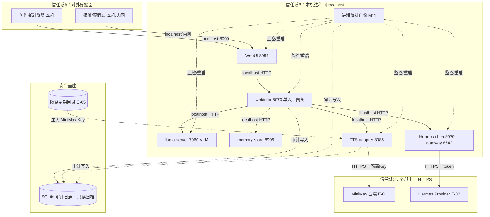
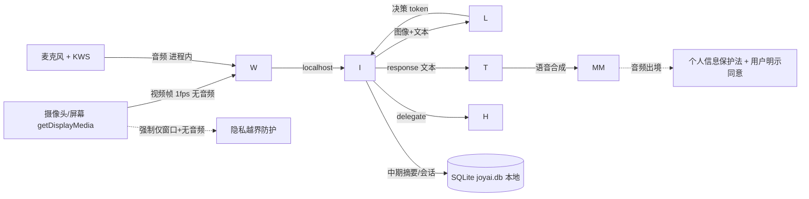

# JoyAI-VL-Interaction · 安全设计

> 本文档为《JoyAI-VL-Interaction 架构设计》核心产物之一，对应**安全设计**阶段（G5）。
> 上游输入：《系统设计》（G4 已冻结，11/11 校验通过，decision「系统设计冻结，部署和安全可进入」）、《高层架构设计》（G3 已冻结）、《资料摘要 material_digest.md》（G1 通过，含冻结边界 D4 + ADR0001~0007）、《UserStory》（G4 已冻结）；
> 下游消费：本安全设计定义的「密钥分级/访问控制/轮转周期（权威）」「审计字段与合规保留期（权威）」「安全组/WAF 规则（权威）」由 platform-architect 在《部署设计》中按此配置资源与日志管道。
> 设计立场：在现有已冻结架构（D4 + ADR0001~0007 + 高层 D1~D5 + 系统设计 §0 裁剪说明）基础上**冻结边界、补齐完整 STRIDE 威胁建模与权限/密钥/审计/应急设计**，不推倒重来。

---

## 0. 元信息：修订记录

| 文档版本 | 发布日期 | 修订人 | 修订说明 |
| --- | --- | --- | --- |
| v1.0 | 2026-07-20 | 严守正（security-architect） | 初稿：基于冻结边界产出单机 Windows 形态完整安全设计（威胁模型 STRIDE / IAM / 数据安全 / OWASP / 网络主机 / 密钥 / 运行时审计应急） |

**裁剪说明（按模板「按需裁剪」规则 + 单机部署形态）**：

| 模板章节 | 处理 | 理由 |
| --- | --- | --- |
| 堡垒机 / 云防火墙 / DDoS 高防 / SOC / 多 VPC（DMZ/业务/DevOps） | **整章/整节删除** | 部署形态为本地 Windows 单机 + RTX 5060 Ti 16GB，无公网入口、无多租户、无 K8s（D5 + 系统设计 §6 + 系统设计 §7.1 标注不适用）。仅保留与国际合规相关的条款（个人信息保护法）按本地私有化场景落地 |
| 容器 / K8s 安全 | **整节删除（标注 N/A）** | MVP 为裸进程（Docker Compose 留完整版 F14，系统设计 §7.1 标注不适用）；无特权容器/逃逸面 |
| §5 网络分区（VPC CIDR） | **重述为单机信任域** | 无 VPC；按「对外暴露面 / 本机进程间 / 外部出口 / 管理通道」四种信任域重述（见 §5.1） |
| 多租户隔离 / RBAC 角色体系 | **明确「单用户本地不做」** | N2（单用户本地、无多租户）+ D5；暴露面绑定 localhost/内网作为唯一访问控制基线（系统设计 §7.2.5） |

> 后续章节序号已按「略过章节后顺延」规则连续编号；原模板 §5 的 VPC/容器内容删除后，§5 仅保留信任域、流量管控、主机安全、中间件安全。

---

## 1. 安全总体架构与威胁模型

### 1.1 安全总体架构图（信任域 + 暴露面 + 密钥托管 + 审计，单机形态）

> 总览：下图叠加展示**信任域边界、流量入口安全（暴露面收敛 / Windows 防火墙）、主机安全（Windows Defender / 文件权限）、密钥托管（C-05 隔离目录）、本地审计（结构化日志 + 只读归档）**。云组件（DDoS/WAF/堡垒机/SOC/KMS 云）在本形态下不适用，已在 §5 / §6 / §7 注明 N/A。

**信任域划分（单机形态）**：

| 信任域 | 范围 | 信任级别 | 边界控制 |
| --- | --- | --- | --- |
| A 对外暴露面 | 浏览器→WebUI 8099、运维端→8099/ops | 中（需收敛） | 仅绑定 localhost/内网；禁止 0.0.0.0（C403001 越界拒绝） |
| B 本机进程间 | 各服务 localhost:port 互调 | 高（同机回路） | 不启用 mTLS，以暴露面收敛 + 可选 HMAC 签名替代（系统设计 §6.3） |
| C 外部出口 | MiniMax / Hermes HTTPS | 低（不可控外部） | ACL 适配 + 隔离 Key + 按量限额 + 出境合规 |
| D 安全基座 | 隔离密钥目录、SQLite 审计 | 最高 | 文件权限收紧 + 只读归档 + 不打印明文 |

### 1.2 敏感数据流图（本地优先，仅语音出境）

> 关键安全事实：**核心 VL 推理 100% 本机**（Q4 合规）；视频/音频采集数据默认仅在本机内存流转、不落库明文；**唯一出境数据流为语音/克隆音频经 MiniMax**（E-01），须满足数据最小化与用户同意（见 §3.3.7）。

### 1.3 威胁模型（STRIDE）

> 采用 **STRIDE** 方法，基于《系统设计》模块边界（M1~M12）、数据流、接口契约（§3.5）、身份边界（本地单用户）、外部依赖（MiniMax E-01 / Hermes E-02）与运行形态（Windows 单机裸进程）识别威胁。每条威胁必须对应到第 2~7 章某项缓解措施，形成「威胁—缓解映射表」。

| 威胁类别（STRIDE） | 典型示例（本项目语境） |
| --- | --- |
| 仿冒（Spoofing） | 来源 IP 伪造绕过暴露面绑定；MiniMax/Hermes 凭证冒用；运维端无密码被同网段冒充 |
| 篡改（Tampering） | 本地 SQLite 被直接篡改（角色 prompt/克隆/配置）；同机恶意进程篡改进程间 HTTP；角色 prompt 注入越权指令 |
| 否认（Repudiation） | 密钥变更/暴露面变更/克隆撤销无审计；会话/记忆删除不可验证 |
| 信息泄露（Information Disclosure） | MiniMax Key/音频明文落日志或代码；摄像头/屏幕/麦克风数据误存或误出境；错误暴露堆栈；SQLite 文件权限过宽 |
| 拒绝服务（DoS） | VRAM 超限 OOM 资源耗尽；本地大量请求打满单用户会话；外部配额/限流耗尽 |
| 权限提升（Elevation of Privilege） | 水平越权（资源归属未校验）；垂直越权（运维高敏操作越界）；Hermes 委派越权注入高权限工具调用 |

### 1.4 威胁—缓解映射表

> 每条威胁映射到后续章节缓解措施；STRIDE 六类全覆盖，表格无空行。

| 威胁ID | STRIDE 类别 | 具体威胁（映射模块/数据流） | 影响 | 缓解措施（指向章节） | 责任层 |
| --- | --- | --- | --- | --- | --- |
| T1 | 仿冒 | 误绑 0.0.0.0 致 WebUI/webinfer 公网可达，攻击者冒充本地用户操控对话/配置 | 远程操控、隐私泄露 | §5.1 信任域 + §5.2 暴露面收敛 + §2.2.4 越界拒绝（C403001） | 网络/部署 |
| T2 | 仿冒 | MiniMax Key / Hermes token 泄露被冒用，产生费用与音频出境 | 财务损失、数据出境 | §6 密钥隔离托管 + §6.2 泄露防护 + §6.4 红线 | 密钥 |
| T3 | 仿冒 | 运维配置端无密码，同网段他人冒充管理员改暴露面/重启 | 越权配置 | §2.1.2 管理密码 + §2.3.3 高敏二次确认 | IAM |
| T4 | 篡改 | 本地 joyai.db 被直接篡改（角色 prompt/克隆注册/配置项） | 注入恶意 prompt、配置被改 | §3.3.3 SQLite 文件权限 + §5.4 中间件强鉴权 + §3.3.5 审计 | 数据/主机 |
| T5 | 篡改 | 同机恶意进程篡改 webinfer→llama-server 本机 HTTP 请求 | 决策被篡改 | §3.2.2 本机回路 + §3.2.4 可选 HMAC 签名 | 应用 |
| T6 | 篡改 | bt-7274 角色 prompt 注入越权/越界指令 | 模型行为偏离、越权 | §4.1 输入校验 + §4.3.1 输出过滤 + §2.2.4 | 应用 |
| T7 | 否认 | 密钥变更/暴露面变更/克隆撤销无审计日志 | 无法追责 | §7.2 审计日志（5 维度）+ §3.3.5 | 运行时 |
| T8 | 否认 | 会话/记忆删除（被遗忘权）无审计 | 合规不可验证 | §7.2 审计 + §3.3.5 数据销毁 | 运行时 |
| T9 | 信息泄露 | MiniMax Key / 音频明文落日志或入代码 | 凭证泄露 | §6.4 红线（禁日志/代码）+ §8.2 日志规范（系统设计） | 密钥 |
| T10 | 信息泄露 | 摄像头/屏幕/麦克风数据本地误存或误出境 | 严重隐私泄露 | §3.3.7 隐私合规 + 强制仅窗口无音频（US-5）+ §3.2 本地化 | 数据 |
| T11 | 信息泄露 | 错误响应暴露堆栈/内部路径/端口 | 信息泄露 | §4.2 统一异常处理 | 应用 |
| T12 | 信息泄露 | SQLite 文件权限过宽，其他本地用户可读 | 对话/记忆泄露 | §3.3.3 文件权限 + §5.3 主机账号管控 | 主机 |
| T13 | 拒绝服务 | VRAM 超限 OOM（上下文膨胀/新增服务）致推理崩溃 | 核心链路中断 | §5.4 VRAM 看护 + 限流（系统设计 §3.5.3）+ 降载 BD-03 | 资源 |
| T14 | 拒绝服务 | 本地大量请求打满单用户会话 | 卡顿/不可服务 | §3.5.3 限流基线（C429001）+ §5.2 | 应用/网络 |
| T15 | 拒绝服务 | 外部 MiniMax 配额/限流耗尽或 API 失败 | 语音不可用 | §3.2.M4 降级 BD-02（本地 CozyVoice fallback） | 外部 |
| T16 | 权限提升 | 水平越权：API 如 `/api/voice/{id}` 未校验归属 | 撤销/读取他人资源 | §2.2.4 归属校验 + §4.3.1 越权防护 | IAM/应用 |
| T17 | 权限提升 | 垂直越权：运维高敏操作（重启/改配置/改暴露面）越界执行 | 全系统被控 | §2.2.4 + §2.3.3 二次确认 + C403001 | IAM |
| T18 | 权限提升 | Hermes 委派越权：shim 若传 system 或越权工具调用 | 主对话被注入高权限操作 | §2.2.4 Hermes 严格隔离（shim 不传 system，D24）+ §4.3 | 应用 |
| T19 | 权限提升 | 完整版 Docker 容器逃逸（MVP 裸进程 N/A） | 主机被控 | §5.3 主机最小化 + 完整版容器基线（F14） | 主机 |

---

## 2. 身份与访问管理（IAM）

### 2.1 访问认证（Authentication）

#### 2.1.1 单用户本地形态的认证模型

本系统为**本地单用户工具**（N2，D5：多租户否），无账号体系、无 SSO/IDP（系统设计 §7.2.1）。访问认证以「**暴露面绑定 + 可选管理密码**」为基线，并预留远程/多用户扩展路径：

- **认证方式一：暴露面绑定鉴权**（主基线）。WebUI 8099 / 运维端 / 各服务仅绑定 `localhost`（127.0.0.1）或显式内网子网；Windows 防火墙规则拒绝非绑定源；任何越界访问返回 C403001（系统设计 §3.5.1）。等价于「网络层来源地址认证」。
- **认证方式二：运维配置端管理密码**（预留，可选开启）。`/ops/*` 高敏操作（暴露面变更、启停、密钥相关）在开启后须凭本地管理密码访问，防止同网段冒充（对应 T3）。
- **完整性扩展（完整版远程运维/多用户预留）**：若引入远程访问或多用户，采用 **OAuth 2.0 / OIDC** 作为联合身份，并对管理操作强制 **MFA（2FA）** 双因素；本地单用户形态下不启用 MFA/SSO（明确标注现状，不虚构能力）。

> 认证方式满足「≥2 种」：暴露面绑定鉴权 + 管理密码（已实现/可开启），OAuth/OIDC/MFA 为远程扩展路径。

#### 2.1.2 密码策略（运维配置端，预留量化阈值）

| 项 | 基线值 |
| --- | --- |
| 最小长度 | ≥ 8 位（本地管理密码；若远程管理员 ≥ 12 位） |
| 复杂度 | 同时包含数字、大写字母、小写字母、特殊字符（可配置开关） |
| 加密存储 | bcrypt / scrypt / argon2 加盐哈希；**禁止 MD5 / SHA1 明文** |
| 更换周期 | 默认 90 天提醒（可配置） |
| 失败锁定 | 连续失败 5 次锁定 1 小时（次数和时长可配置） |
| 自动登出 | 30 分钟无操作自动登出 |
| 注册策略 | 不允许用户自行注册，仅本地管理员创建；改密需原密码验证 |

#### 2.1.3 会话管理

- **Token 类型**：本地单用户无集中会话 Token（系统设计 §7.2.1）；对话态在 memory-store，不在进程内。若完整版引入远程会话，采用 JWT / Session ID，**禁止 URL 携带 token**。
- **有效期**：远程会话默认 24 小时（可配置），提供续期与主动注销接口。
- **互踢机制**：管理端同账号仅允许单设备登录，新登录踢掉旧会话，异地登录需提示。
- **风险登录**：异地 / 异常登录二次验证（完整版远程场景）。

### 2.2 授权与权限控制（Authorization）

#### 2.2.1 权限模型

默认采用 **RBAC0**（用户—角色—权限）作为完整版多用户扩展基线；**当前本地单用户形态不做 RBAC / 多租户隔离**（N2 + D5 + 系统设计 §7.2.5），以「暴露面绑定 localhost/内网」作为唯一访问控制。高敏操作（密钥变更、暴露面变更、克隆撤销、进程强制重启）叠加 **ABAC** 属性条件（来源 IP 必须为绑定子网 + 管理密码 + 二次确认）。

#### 2.2.2 权限维度

- **接口级**：webinfer 单入口网关统一鉴权（ADR0006）；`/ops/*` 高敏接口需管理密码 + 二次确认；接口签名（HMAC-SHA256，见 §3.2.4）。
- **数据级**：行级（按 `session_id` / `voice_id` 归属，单用户下归 `local`）；列级（凭证字段仅存 `credential_handle`，不存明文）。
- **功能级**：菜单/按钮/操作细粒度（运维端安全配置页仅本地可达）。

#### 2.2.3 多租户隔离

明确选择：**单租户本地工具，不做租户隔离**（O4 + N2）。`tenant_id` 在 SQLite 中仅预留默认 `1`（系统设计 §4.1），查询不强制带入。物理隔离即逻辑隔离（本机即唯一租户）。

#### 2.2.4 越权防护

- **水平越权（IDOR）**：每个查询/修改接口（如 `/api/voice/{id}`、`/api/role/{key}/activate`、`/v1/blocks/pull`）必须校验资源归属（单用户下归 `local`，完整版多用户须校验 `user_id`）。
- **垂直越权**：RBAC + 接口拦截器双层校验；运维高敏操作（重启/改暴露面/改配置）须管理密码 + 二次确认，越界访问返回 C403001。
- **Hermes 委派严格隔离**：shim 不传 system（D24/D42 §16），人格/记忆/Skills/Provider 独立；委派失败主对话正常（BD-01）。防止委派链路越权注入高权限工具调用（T18）。

### 2.3 外部调用凭证与运维通道

#### 2.3.1 外部 API 凭证鉴权

MiniMax（E-01）/ Hermes（E-02）经隔离凭证访问：MiniMax 走 ACL adapter（M4）封装，Key 经 C-05 隔离托管不硬编码；Hermes 经 `/v1/solve` token 鉴权。详见 §6。

#### 2.3.2 运维通道

运维/配置端仅 `localhost` / 内网可达（系统设计 §6.1）；Windows 防火墙规则默认拒绝 0.0.0.0 暴露；无独立堡垒机（本地单用户 N/A）。

#### 2.3.3 高敏操作二次确认

密钥变更、暴露面绑定变更、声音克隆撤销、进程强制重启等须：管理密码 + 二次确认（短信/MFA 仅完整版远程场景；本地形态以显式确认弹窗 + 审计记录替代）。对应错误码 A110001（重启失败）、C403001（越界）。

---

## 3. 数据安全

### 3.1 数据分级

| 等级 | 类别 | 本项目示例（映射真实数据对象） | 处理策略 |
| --- | --- | --- | --- |
| L1 公开 | 公开 | 产品介绍、公开 API 文档、决策 token 协议（`silence`/`response`/`delegate`） | 无特殊管控，可本地展示 |
| L2 内部 | 内部 | 对话/记忆（落 SQLite `t_session`/`t_memory_block`）、进程健康（`t_process_health`）、配置项（`t_config_item`）、角色 prompt（`t_role_prompt`） | 需本地鉴权访问；展示脱敏；审计 |
| L3 敏感 | 敏感 | MiniMax Key（凭证句柄 `credential_handle`）、参考音频引用（`clone_ref_handle`）、声音克隆注册元数据（`t_voice_clone_registry`） | 加密传输、隔离存储、强脱敏、严格审计；不落明文 |
| L4 高敏 | 高敏 | 摄像头/屏幕视频帧、麦克风音频（实时采集流）、摄像头/麦克风原始数据 | 本机内存流转、不落库明文、强制仅窗口+无音频采集、不出境（除语音上云 MiniMax 经用户同意） |

> 说明：系统设计 §7.2.2 将 MiniMax Key / 参考音频标为 L3；本文在此基础上将**实时音视频采集流**列为 L4 高敏（隐私核心），其余与系统设计一致。视频帧/音频默认不持久化至磁盘（仅内存 + 1fps 推帧），降低泄露面。

### 3.2 数据传输安全

#### 3.2.1 本地回路

主交互入口为浏览器 → `127.0.0.1:8099`（WebUI）→ `8070`（webinfer），全程本机回路 HTTP；自签证书（D33）仅 localhost/内网，前端忽略 cert-error 或内网代理 TLS 终止。

#### 3.2.2 服务内部访问

- 低敏感、本机访问：HTTP（OpenAI 兼容）localhost 寻址（系统设计 §6.3）。
- 高敏感、跨信任域：本形态**不启用 mTLS**（本机回路），以「暴露面收敛 + 可选 HMAC 签名」替代（系统设计 §6.3 已锁定）。进程间调用显式设超时（§3.5.4 基线）。

#### 3.2.3 外部出口

仅 MiniMax（E-01）/ Hermes（E-02）走 HTTPS（外部 E-01/E-02）；VL 推理不出本机（Q4）。出口白名单登记 MiniMax 域名 / Hermes 端点（系统设计 §6.2.2）。

#### 3.2.4 接口签名

- **内部跨服务调用**（webinfer↔memory-store、ops 高敏接口）：建议 HMAC-SHA256（密钥取自 C-05 隔离目录）+ `nonce` + `timestamp` 防重放；与 traceId/幂等键（系统设计 §3.5.2）一同透传。
- **外部调用**：MiniMax/Hermes 使用各自 API Key / token 鉴权，不依赖自签 mTLS。

#### 3.2.5 传参禁忌

- **禁止 URL 携带 token、AKSK、MiniMax Key、手机号等敏感信息**（如回调/导出链接）。
- WebRTC 媒体流不经由 URL 参数；采集帧经内存/WebSocket 传递。
- 错误响应与日志禁止回显上述敏感参数（见 §4.2 / §6.4）。

### 3.3 数据存储安全

#### 3.3.1 加密存储（仅敏感数据需要）

- **磁盘层**：SQLite 本地文件（joyai.db），建议启用 Windows BitLocker 全盘加密（系统设计 §7.2.2 建议）。
- **字段层**：MiniMax Key 不落库明文，仅存 `credential_handle`（隔离托管引用，V4/ADR0001）；参考音频仅存 `clone_ref_handle`，不存音频明文。
- **密钥管理**：C-05 隔离目录 / .env（gitignored），**禁止硬编码**（见 §6）。
- 对称加密 AES-256 可用于完整版跨会话长期记忆 v0.2（O3）；本形态以文件权限 + BitLocker 为主。

#### 3.3.2 敏感字段单向哈希加盐

管理密码、Key 摘要等不可逆字段使用 bcrypt/scrypt/argon2 加盐哈希；MiniMax Key 明文不进库、不进日志。

#### 3.3.3 数据库安全

- SQLite 文件权限收紧：仅运行账户可读写，禁止其他本地用户读（对应 T12）；部署侧 Windows 防火墙 + 文件系统 ACL 落实。
- 账号最小权限；**禁止业务直连 root**（本形态无独立 DB 账号，以文件权限替代）；运维使用独立账户。
- 开启慢查询日志、审计日志（§7.2）；日志独立存储本地。
- 防止 SQLite 被直接篡改（T4）：文件只读归档 + 应用层写入校验 + 审计。

#### 3.3.4 文件存储安全

- 参考音频仅传引用句柄，不落本地明文（系统设计 §3.2.M4）。
- 本地会话/记忆导出：仅本地文件写，非跨网络共享；导出文件建议加密 + 水印（操作人 + 时间）。
- 上传文件（如角色参考音频）类型校验 + 大小限制 + 随机重命名 + 隔离存储。

#### 3.3.5 数据使用安全

- **展示脱敏**：MiniMax Key 掩码展示（`sk-***`）；参考音频不展示；对话/记忆本地展示。
- **数据导出管控**：导出审批（本地形态为显式确认）+ 水印（操作人 + 时间）+ 操作审计。
- **数据销毁**：逻辑删除（`deleted=1`）+ 定期物理销毁；EXPIRED/REVOKED 克隆超 7 天定时清理（系统设计 §4.2.10）；明确过期数据清理策略。

#### 3.3.6 数据备份与异地容灾

| 存储类型 | 备份策略 |
| --- | --- |
| SQLite（joyai.db + FTS5） | 本地文件复制（分钟级）+ 异地 U 盘可选；RPO ≤ 5min、数据 RTO ≤ 10min（系统设计 §4.3.2） |
| 进程健康/配置 | 随主库备份；配置变更记 `updated_time` 审计 |

#### 3.3.7 隐私合规

- **个人信息保护法**：本项目适用《个人信息保护法》。MiniMax 语音/克隆音频属个人信息处理，需在注册克隆 / 开启语音上云时取得用户**明示同意**；数据最小化（仅必要音频片段）；可被遗忘权（撤销克隆 / 删除会话，T8 审计可验证）。
- **数据出境**：MiniMax 为国内 SaaS，音频不出境至境外；若后续接入境外 SaaS，须做出境安全评估。核心 VL 推理 100% 本机（Q4），视频/音频采集默认不出境。
- **用户同意机制**：隐私政策 + 用户明示同意（采集/克隆/上云）；默认关闭公网、默认本地优先。
- **GDPR**：当前本地单用户中国场景 N/A；若面向 EU 用户需补充 GDPR 合规（DPIA/数据主体权利）。

---

## 4. 应用安全（OWASP Top 10）

> 以 OWASP Top 10 为风险场景，结合本项目（Web/API 本地单用户、对外暴露面收敛）梳理具体防护清单，每项给出明确防护措施（非泛化）。

### 4.1 输入安全

| 风险 | 防护措施（本项目具体） |
| --- | --- |
| SQL 注入 | memory-store / 各服务强制参数化查询（SQLite 参数绑定，禁止字符串拼接 SQL）；动态字段（order by）使用白名单校验 |
| XSS | 前端输出编码（HTML/JS/URL）；CSP 策略（仅本机源）；Cookie HttpOnly + Secure（若引入）；LLM 回复面板转义渲染 |
| CSRF | 同源策略 + SameSite Cookie；`/ops/*` 高敏操作需管理密码 + 二次确认（CSRF Token 仅完整版远程场景启用） |
| 命令注入 | 系统禁用动态命令执行；PowerShell 编排（start/stop-joyai.ps1）使用白名单参数化数组，禁止拼接用户输入到 shell |
| 反序列化 | 禁用危险反序列化（如 fastjson autoType、Python `pickle` 反序列化不可信数据）；DTO 用 JSON schema 校验 |
| SSRF | 外部调用仅 MiniMax/Hermes 白名单域名；禁止用户传入任意 URL 让服务端抓取；`/v1/summarizer/route` 目标仅限 `summary_llama` |
| 文件上传 | 角色参考音频类型校验（magic number + 扩展名 + 大小 ≤ 15MB）、随机重命名、隔离存储目录 |
| XXE | 关闭 XML 外部实体解析（DTD）；优先 JSON 协议（OpenAI 兼容） |
| 开放重定向 | 跳转 URL 白名单（仅本机 `localhost`/内网路径）；拒绝外部跳转参数 |
| 越权（IDOR/垂直） | 见 §2.2.4：每个接口校验资源归属 + 高敏操作二次确认 |

### 4.2 输出安全

#### 4.2.1 统一异常处理

错误码统一 6 位结构（A/B/C + 模块 + 序号，如 `A030001`，系统设计 §3.5.1）；错误响应结构统一 `Result(T)`，**禁止暴露堆栈、SQL、内部路径、端口**。

#### 4.2.2 调试信息

调试信息（debug、stacktrace、内部 IP/端口）严禁出现在生产环境响应中；生产环境 `DEBUG=false`。

### 4.3 业务逻辑安全

#### 4.3.1 越权防护

水平越权（IDOR）每个接口必检（归属校验）；垂直越权由暴露面绑定 + 管理密码 + 接口拦截器双层校验。

#### 4.3.2 防刷防爬

限流（IP / 用户 / 接口三维度，系统设计 §3.5.3：全局 QPS 50、单用户 10、重保接口单用户 5 次/分锁定 15 分）；单用户本地形态以本地限流防止误用/资源打满（T14）。

#### 4.3.3 防薅羊毛

外部 MiniMax 调用按量限额（R-03）；克隆注册幂等（X-Idempotency-Key）避免重复扣费（系统设计 §3.5.2）。

#### 4.3.4 幂等性

防重复提交：前端 token + 后端唯一键（sqlite `uk_` 唯一索引兜底）；克隆/委派强制 `biz_req_no` / `X-Idempotency-Key`（系统设计 §3.5.2）。

#### 4.3.5 关键业务二次验证

密钥变更、暴露面变更、克隆撤销、进程强制重启等需管理密码 + 二次确认（§2.3.3）。

### 4.4 第三方与供应链安全

- **MiniMax / Hermes 接入评估**：数据传输 HTTPS、存储位置（国内）、合规资质登记；ACL 适配隔离外部模型（C-02 关系）。
- **第三方组件漏洞扫描**：完整版 CI 门禁（F16）含依赖漏洞扫描（修复 D12 🔴 打包缺陷）；MVP 至少本地依赖清单核对。
- **开源协议合规**：本项目 Apache 2.0；引入组件须审查 GPL/AGPL 商业风险（如已删除的 CosyVoice3 不回引，D27）。
- **镜像源 / 依赖源**：使用锁定版本 + 校验和；避免被投毒。
- **供应商安全管理**：MiniMax 合同含数据保护与审计条款；定期复评。

---

## 5. 网络与主机安全

> 裁剪说明：本形态为**本地 Windows 单机**，无 DMZ VPC / 业务 VPC / DevOps VPC、无公网入口、无堡垒机/DDoS/SOC（系统设计 §7.1 标注不适用）。以下按单机信任域重述。

### 5.1 信任域划分（单机形态）

- **信任域 A（对外暴露面）**：浏览器→WebUI 8099、运维端→8099/ops；仅绑定 localhost/内网。
- **信任域 B（本机进程间）**：各服务 localhost:port 互调（7060/8070/8099/8985/8994/8996/8079/8642 等，ADR0004 端口冻结）；高信任。
- **信任域 C（外部出口）**：MiniMax/Hermes HTTPS；低信任，需 ACL + 隔离 Key。
- **信任域 D（安全基座）**：隔离密钥目录、SQLite 审计；最高信任，文件权限收紧。

> VPC CIDR 不重叠等云网络约束在本形态 N/A；端口为固定 localhost（ADR0004），服务发现用固定 localhost:port（系统设计 §6.3）。

### 5.2 流量管控（南北向 + 东西向，单机收敛）

#### 5.2.1 入口防护（南北向）

- **暴露面收敛**：WebUI / 运维端 / 各服务默认绑定 `localhost`；**禁止绑定 0.0.0.0**（系统设计 §6.1）；内网访问需显式授权（BindRequest.bind_scope=localhost/intranet）。
- **自签证书**：本地自签（D33），仅 localhost/内网；前端忽略 cert-error 或内网代理 TLS 终止（系统设计 §6.2.1）。
- **DDoS / WAF**：不适用（无公网入口，V4/R-04）；若未来暴露公网，须补 WAF + DDoS 高防（本形态不启用，标注 N/A）。

#### 5.2.2 边界防护（Windows 防火墙）

- Windows 防火墙默认拒绝入站；仅放通 `127.0.0.1` 及显式内网子网到 8099/8070/8985/ops；**禁止 0.0.0.0/0 开放 22/23/3306/6379 等敏感端口**（本形态本就无这些服务，规则显式拒绝）。
- 安全组等价物 = Windows 防火墙高级安全规则（入站默认拒绝 + 显式放通）。

#### 5.2.3 主机流量防护（东西向）

- 本机进程间 localhost HTTP；不启用 mTLS（暴露面收敛替代，系统设计 §6.3）。
- 跨服务调用幂等键 + traceId 透传（系统设计 §3.5.2 / §8.3）。
- 限流联动（§3.5.3）：触发限流返回 C429001。

#### 5.2.4 运维通道防护

- 运维端仅 localhost/内网；无独立堡垒机（本地单用户 N/A）。
- 运维操作全量审计（§7.2）。

### 5.3 主机安全（Windows 单机）

- **最小化安装**：关闭非必要 Windows 服务；定期补丁（Windows Update）。
- **账号管控**：运行账户非 Administrator；**严禁 Administrator 远程暴露**；运维使用独立低权账户。
- **登录**：优先密钥/本地账户 + 管理密码；禁用不必要的远程桌面公网暴露。
- **主机安全组件**：Windows Defender（既有，启用实时防护 + 定期扫描）；可选启用防恶意软件 + 漏洞扫描。
- **文件权限**：joyai.db / 隔离密钥目录 ACL 收紧至运行账户；日志目录仅运行账户写。
- **日志**：主机层安全事件（登录/权限变更）落本地审计。

### 5.4 中间件安全

#### 5.4.1 网络隔离

SQLite（joyai.db）为本地文件，无网络暴露；llama-server / memory-store / TTS adapter 仅监听 localhost（ADR0004）；**禁止公网暴露**（系统设计 §6.1）。

#### 5.4.2 强制鉴权

SQLite 以文件权限鉴权（运行账户独占）；llama-server / memory-store 仅本机访问，可选 HMAC 签名（§3.2.4）；不依赖默认弱密码。

#### 5.4.3 审计

SQLite 写入 / 配置变更 / 克隆注册启用应用层审计（§7.2）；关键中间件接入本地审计日志。

---

## 6. 密钥与凭证管理

> 本形态无云 KMS，采用**本地隔离密钥目录 / 文件加密 + 环境变量**（呼应 ADR0001/ADR0002）；分级与轮转周期仍完整定义，作为权威项供 platform-architect 配置。

### 6.1 密钥分级与存储（5 类）

| 密钥类型 | 存储 / 管理方式 | 本项目对应 |
| --- | --- | --- |
| 数据库密码 | 本形态 SQLite 无独立密码；若完整版引入 DB 则配置中心加密存储 | N/A（SQLite 文件权限替代） |
| 云 AKSK（MiniMax 等） | C-05 隔离密钥目录 + 环境变量注入；不硬编码、不落库明文 | MiniMax Key（E-01，ADR0001） |
| 服务间通信密钥 | C-05 隔离目录；用于内部 HMAC 签名（§3.2.4） | webinfer↔memory-store / ops 签名密钥 |
| 用户密码 | bcrypt 加盐哈希（不可逆）；仅运维管理密码场景 | 运维配置端管理密码（§2.1.2） |
| API Key / Token | 分级授权、可撤销、有限期；Hermes token 同理 | MiniMax Key / Hermes `/v1/solve` token |

### 6.2 AKSK / 外部 Key 泄露防护

- **隔离托管**：MiniMax Key 经 `.env`（gitignored）/ 隔离密钥目录（C-05）注入，业务模块经 `common.secrets.IsolatedVault` 读取（系统设计 §3.4）；不硬编码、不打印明文日志。
- **按量限额**：MiniMax 调用按量限额（R-03）；异常调用告警（AL-04）。
- **ACL 适配**：MiniMax 经 M4 ACL adapter 封装，外部模型不污染本域（C-02 关系，D24）。
- **泄露处置**：疑似泄露立即在 MiniMax 控制台禁用并轮换；事后排查调用日志确认影响面。

### 6.3 轮换策略

| 密钥类型 | 轮换周期 | 方式 |
| --- | --- | --- |
| MiniMax Key（云 AKSK） | MVP 手动轮换；完整版按 90 天基线（Vault 动态） | 控制台禁用旧 Key → 新 Key 注入 C-05 → 重启相关进程 |
| 服务间 HMAC 密钥 | 90 天或事件驱动（人员变动/疑似泄露） | 隔离目录替换 + 重启 |
| 运维管理密码 | 90 天提醒 | 本地改密 |
| Hermes token | 按 Provider 策略 | Provider 侧轮换 |

### 6.4 密钥使用红线

- **严禁** MiniMax Key / 服务间密钥 / Token 出现在源码、Git 仓库、前端代码、日志、错误堆栈、URL、配置明文。
- **禁止**多业务共用同一对 Key；按业务/环境隔离签发（本形态单业务，仍禁止与开发/测试混用）。
- 上线前必须通过代码扫描（CI 门禁 F16）+ 镜像扫描，识别硬编码密钥；D12 🔴 打包缺陷需同步修复。
- 每一对 Key 明确所有人、用途、存储位置、轮换日期；**上线 checklist 包含「密钥扫描通过」项**。
- 本地单用户形态下，Key 不跨环境共用、不入库明文（V4/ADR0001）。

---

## 7. 运行时安全：监控、审计、应急

### 7.1 安全事件监控

- **入侵检测 / 异常**：本地进程健康 + VRAM 水位 + 接口限流触发（系统设计 §8.4 告警 AL-01~AL-07）；无云端 SOC/IDS，以本地指标 + 结构化日志替代（§7.1 裁剪说明）。
- **敏感操作**：密钥变更、暴露面变更、克隆撤销、角色激活、进程强制重启（§2.3.3）全量审计。
- **登录异常**：管理密码连续失败锁定（§2.1.2）；异地/异常来源访问被 C403001 拒绝并告警。
- **权限异常**：越界访问、高敏接口高频调用、Hermes 委派异常（BD-01）。

### 7.2 审计日志（5 维度映射）

> 本形态无云资源审计/堡垒机/WAF（N/A，本地单用户）；审计以**业务操作 / 数据库 / 应用 / 外部调用 / 运维**五维度落地，保留期按合规要求。

| 审计维度 | 本形态落地 | 审计字段（权威，供部署配置日志管道） | 保留期 |
| --- | --- | --- | --- |
| 业务操作审计 | 对话/克隆/角色/配置/启停 | 操作时间、来源 IP（localhost）、操作者（local）、事件名、读写类型、资源 ID、结果 | ≥ 1 年（本地磁盘允许） |
| 数据库审计 | SQLite 写入/配置变更/克隆注册 | SQL 类型、执行账户、客户端（本机）、时间、影响行数、表名 | ≥ 1 年 |
| 应用/接入审计 | WebUI/webinfer 接入、错误、限流 | traceId、userId（local）、sessionId、service、event、level、msg | INFO 30 天热 + 归档；ERROR 90 天 |
| 外部调用审计 | MiniMax/Hermes 调用 | peer.service、调用时间、token 指纹（非明文）、结果、耗时、是否降级 | ≥ 1 年（含出境合规追溯） |
| 运维审计 | 启停/重启/暴露面变更/密钥变更 | 操作者、时间、来源 IP、动作、结果、二次确认标记 | ≥ 1 年 |

> 云资源审计 / 堡垒机日志 / WAF 日志三项在云形态下适用；本单机形态标注 N/A，不虚构。审计字段（traceId + userId/sessionId）与系统设计 §8.2 日志规范一致。

### 7.3 应急响应

- **应急预案（5 类事件）**：

| 事件类型 | 触发 | 响应 Runbook | 负责 |
| --- | --- | --- | --- |
| 漏洞响应 | 组件漏洞/依赖 CVE 曝光 | 定位影响面 → 临时降级/隔离 → 打补丁/升级 → 复测 | 研发/运维 |
| 数据泄露 | MiniMax Key 泄露 / 音频误出境 / 日志含明文 Key | 禁用并轮换 Key → 排查日志影响面 → 通知合规 → 加固 | 安全/合规 |
| 被攻击 | 暴露面误绑 0.0.0.0 致公网可达 / 大量异常请求 | 立即回绑 localhost（启动校验拒绝 0.0.0.0）→ 查防火墙 → 审计溯源 | 运维 |
| 密钥泄露 | 隔离密钥目录被读 / Key 入代码 | 轮换 Key → 清理代码/日志 → 扫描硬编码 → 复盘 | 安全 |
| 勒索病毒 | 主机文件被加密/异常进程 | 断网 → 停进程 → 从本地备份恢复（§3.3.6）→ 查入侵源 | 运维/SRE |

- **备份与恢复**：明确 RPO ≤ 5min / RTO ≤ 10min（数据）、进程 RTO ≤ 30s（系统设计 §4.3.2 / §5.3）；每年 ≥ 1 次灾备演练（完整版纳入，MVP 最佳努力）。
- **暴露面防误绑启动校验**：若配置误设为 0.0.0.0，启动校验拒绝或强制回 localhost 并告警（对应 US-10 AC-异常路径），从源头阻断「被攻击」类事件。

---

## 附录 A：阶段内中间确认自检报告（协议 §2.4）

> 按 intermediate_confirmation 协议，在 §1 / §2 / §3 / §6 完成后各做一次自检（先 §2.1 判定，再 §2.3 反向验证 3 问）。本安全设计为 G5 完整 STRIDE 专项，所有关键决策点均已被上游冻结文档（D4 + ADR0001~0007 + 高层 D1~D5 + 系统设计 §0 裁剪 + §7 安全基线）明确选择，故四轮自检均判定「未命中触发标准」，未发起 `[中间确认]`。

### A.1 §1 威胁模型完成后自检

- **§2.1 方案分歧型判定**：未命中。STRIDE 六类威胁识别基于已冻结模块边界（M1~M12）、数据流、接口契约（系统设计 §3）、外部依赖（E-01/E-02）；威胁清单为对已冻结系统的风险枚举，不引入竞争性方案，不影响下游部署产出边界（密钥分级/审计字段已定为安全侧权威）。
- **§2.3 反向验证 3 问**：
  - Q1（返工成本）：若 3 月后推翻，返工范围 = 本文 §1.3/§1.4 威胁表（约 1 章），切换成本 ≈ 0.5 人日；因上游冻结边界未变，实际推翻概率低。证据：威胁映射指向的缓解章节（§2~§7）均为冻结形态下的控制点。
  - Q2（可感知性）：用户/客户/监管**感知不到**内部威胁枚举；可感知的是「数据不出本机 / Key 不泄露 / 暴露面收敛」（V4），均已冻结。证据：威胁建模不进入 UI/合同/合规属性。
  - Q3（与原始诉求一致）：用户原始诉求（D1「本地优先、数据不出本机」+ G5 安全缺口「完整 STRIDE 威胁建模」）要求补齐威胁建模，本文补齐之，未偏离。证据：material_digest G5「全资料无威胁建模」。

### A.2 §2 IAM 完成后自检

- **§2.1 方案分歧型判定**：未命中。认证模型（暴露面绑定 + 管理密码，OAuth/OIDC/MFA 为远程扩展）与权限模型（单用户不做 RBAC/多租户，暴露面绑定为唯一访问控制）已被 N2 + D5 + 系统设计 §7.2.1/§7.2.5 冻结；无竞争性未冻结方案。
- **§2.3 反向验证 3 问**：
  - Q1：返工范围 = 本文 §2（约 1 章），切换成本 ≈ 0.5 人日。证据：IAM 选择继承系统设计 §7.2 基线。
  - Q2：用户可感知「本地单用户无登录态 + 暴露面收敛」，已冻结；无新 SLA/形态。证据：系统设计 §7.2.1 明确「无账号体系」。
  - Q3：与原始诉求一致（本地优先单用户）。证据：N2「单用户本地，无多租户」。

### A.3 §3 数据安全完成后自检

- **§2.1 方案分歧型判定**：未命中。数据分级 L1~L4 映射真实数据对象（决策 token/对话记忆/MiniMax Key/实时音视频），加密与脱敏策略继承系统设计 §7.2.2 + ADR0001 + V4；隐私合规（个人信息保护法 + MiniMax 音频出境）为冻结边界（U-03）下的落地，无竞争性方案。
- **§2.3 反向验证 3 问**：
  - Q1：返工范围 = 本文 §3（约 1 章），切换成本 ≈ 0.5 人日。证据：分级映射基于已冻结表结构（§4.2 六张表）。
  - Q2：用户可感知「数据本地化 / 音频上云需同意」（Q4/V4），已冻结；无新对外承诺。证据：系统设计 §7.2.2 敏感字段处理策略表。
  - Q3：与原始诉求一致（数据不出本机 + 隐私合规）。证据：高层 §4.1 价值定位「数据零出境」。

### A.4 §6 密钥与凭证管理完成后自检（最后一次完整复核）

- **§2.1 方案分歧型判定**：未命中。密钥 5 分级、隔离托管（C-05）、轮换周期（90 天完整版 / 手动 MVP）、使用红线均继承 ADR0001（voice-clone 同步路径凭证）+ ADR0002（KWS 环境变量）+ V4 + 系统设计 §7.2.3；无竞争性未冻结方案。
- **§2.3 反向验证 3 问**：
  - Q1：返工范围 = 本文 §6（约 1 章），切换成本 ≈ 0.5 人日。证据：密钥管理定义为安全侧权威项，部署侧按此配置。
  - Q2：用户可感知「Key 不硬编码 / 不泄露」（R-03/V4），已冻结。证据：US-10 AC「代码库与运行日志无明文 Key」。
  - Q3：与原始诉求一致（MiniMax API Key 不硬编码不泄露，D8/D33）。证据：material_digest G5 安全缺口。

**结论**：四轮自检均未命中协议 §2.1 / §2.2 任一触发标准，全程未发起 `[中间确认]`；所有决策点均为对冻结边界的忠实落地。

---

## 附录 B：与部署设计的交接说明（[交接·安全→部署] 落点）

> 本安全设计在 §1.1（安全总体架构图）+ §5.1（信任域划分）+ §5.2（流量管控初步规则）完成后，即形成骨架并回传主理人。因部署形态为**本地 Windows 单机，无 VPC / 子网 / CIDR**（D5 + 系统设计 §6 标注公网 N/A），不存在云端网络拓扑需 platform-architect 反向注入；信任域已由冻结的 ADR0004 端口 + 系统设计 §6 完全确定，故无需阻塞等待部署侧拓扑。

**安全侧权威项（platform-architect 在部署设计中须按此配置）**：

| 权威项 | 安全侧定义 | 部署侧落实点 |
| --- | --- | --- |
| 安全组 / 防火墙规则 | Windows 防火墙入站默认拒绝 + 仅放通 127.0.0.1 及显式内网子网到 8099/8070/8985/ops；禁止 0.0.0.0 | 部署文档防火墙规则 + start-joyai.ps1 启动校验 |
| WAF / DDoS | 本形态 N/A（无公网）；若未来暴露公网须补 | 标注 N/A，未来扩展 |
| 密钥分级 / 访问控制 / 轮转 | §6 五级 + 90 天基线 + 红线 | 隔离密钥目录 C-05 落地 + CI 扫描 |
| 审计字段与合规保留期 | §7.2 五维度字段 + ≥1 年 | 日志管道（本地文件 + 只读归档）配置 |

**需平台侧确认的一点**：若完整版引入 Docker Compose（F14），仅进程/网络 namespacing 变化，**不改变上述安全控制**（暴露面绑定、密钥隔离、本地审计）；届时由 platform-architect 在容器网络层面落实等价暴露面收敛，安全侧控制点不变。

---

## 附录 C：待确认项 / 人工审核待确认点（G5 产物审核）

| 编号 | 待确认项 | 归属 | 说明 / 影响 |
| --- | --- | --- | --- |
| U-03 | MiniMax 中国区数据出境合规（语音/克隆上云） | 安全/合规 + 主理人 | 当前按国内 SaaS 处理；若接入境外 SaaS 需出境安全评估 |
| G5 | 完整 STRIDE 威胁建模与权限策略（本文档） | security-architect | 本产物即 G5 交付；待人工审核通过 |
| 密钥托管形态 | 本地隔离目录 vs 完整版 Vault | 安全 + 平台 | 本形态用隔离目录/文件加密；Vault 留完整版 |
| 管理密码启用 | 运维端是否默认开启管理密码 | 安全 + 运维 | 默认可选关闭（单用户本地）；建议完整版远程场景强制开启 |
| 审计保留期 | ≥1 年本地磁盘容量是否允许 | 安全 + 平台 | 单用户本地数据量小，可行；超限则滚动归档 |

> **人工审核待确认点（G5 产物审核）**：请主理人通过 AskUserQuestion 确认本安全设计是否「审核通过」；重点核对：① STRIDE 六类全覆盖且每条威胁映射到缓解（§1.4）；② 单机裁剪是否合理（无 VPC/堡垒机/DDoS 删除并注明）；③ 密钥分级 5 类与轮换周期；④ 审计五维度字段与保留期；⑤ 应急响应 5 类事件 Runbook。未通过人工审核前，不得进入最终交付（G6）。
