# JoyAI-VL-Interaction · 系统设计

> 本文档为《JoyAI-VL-Interaction 架构设计》核心产物之一，对应**系统设计**阶段（G4）。
> 上游输入：《高层架构设计》（G3 已通过，决策「高层架构边界冻结，下游可进入」）、《资料摘要 material_digest.md》（G1 通过，含冻结边界 D4 + ADR0001~0007）、《行业调研报告 research_report.md》（G2 通过）；
> 下游输出：驱动《部署设计》（platform-architect）、《安全设计》（security-architect）、《UserStory》（product-story-designer）的撰写。
> 设计立场：在现有已冻结架构（D4 + ADR0001~0007 + 高层 D1~D5 + F1~F12/N1/N2 + O1~O5）基础上**冻结边界、补齐下游系统级设计**，不推倒重来。

---

## 0. 元信息：修订记录

| 文档版本 | 发布日期 | 修订人 | 修订说明 |
| --- | --- | --- | --- |
| v1.0 | 2026-07-20 | 高见远（system-architect） | 初稿：在冻结架构之上补齐 G4 系统设计（业务域/DDD 映射/12 模块五段式/接口契约/关键表结构/部署/网络/安全基线/可观测） |

**裁剪说明（按模板「按需裁剪」规则）**：

| 章节 | 处理 | 理由 |
| --- | --- | --- |
| §4.4 缓存与 Key 规范 | **未启用（整节略过）** | 单机本地、无 Redis（ADR0005 仅 sqlite）；进程内字典即可满足限流/幂等计数，不引入 Redis |
| §4.5 数据迁移与兼容性 | **未启用（整节略过）** | greenfield 本地系统，无存量数据迁移；记忆库从 v0.1 sqlite 演进到 v0.2 属同后端升级（ADR0005），非跨系统迁移 |
| §4.1 隔离字段 tenant_id | **保留为可选项，不强制** | 单租户本地工具（D5：多租户否），不做租户隔离；`tenant_id` 预留默认 `1`，查询中不强制带入 |
| §6 网络架构 | 保留，但公网入口/DMZ/VPC 等不适用项标注 N/A | 本地 localhost/内网暴露收敛（对齐 V4 安全基础），无公网入口 |
| §7 安全设计 | 仅机制选择 + 关键参数基线 | 完整 STRIDE 威胁建模归 G5（security-architect） |

> 后续章节序号已按「略过章节后顺延」规则连续编号：原 §4.4/§4.5 略过，第 5 章起编号不变（原 §4.4/§4.5 之后本就是 §5）。

---

## 1. 引言

### 1.1 文档目标

- **一句话定位**：本文档定义 JoyAI-VL-Interaction（8B 规模、完全开源的实时视觉-语言交互系统）在交付物中的所有系统级架构设计产物。
- **读者对象**：架构师 / 开发 / 运维 / 安全 / 评审委员会。
- **设计范围**：业务架构 + 应用架构 + 数据库设计 + 部署架构 + 网络架构 + 安全设计（基线）+ 可观测设计。

### 1.2 关联文档清单

| 输入类型 | 内容要点 | 在本文档中的用途 | 形式（外部文档 / 本文档自带） |
| --- | --- | --- | --- |
| 业务需求 | 业务定位、角色、场景、关键流程（高层 §1~§6） | 第 2 章业务架构 | 外部文档《高层架构设计》 |
| 非功能性需求 | 端到端 P99 ≤ 1.2s、进程自愈 P99 ≤ 30s、VRAM ≤ 11.5GB、单用户本地 | 第 3.5 / 5 / 7 / 8 章 | 外部文档《高层架构设计》§2.3 / §6.1 |
| 系统定位与边界 | 本地 Windows 单机 + RTX 5060 Ti 16GB；多租户否；无对外 SLA（高层 §4.2 / D5） | 第 3.1 集成架构 / 第 5 章 | 外部文档《高层架构设计》 |
| 外部系统 API | MiniMax Speech 2.8（/v1/voice_clone，ADR0001）、Hermes（/v1/solve，D24）、llama-server OpenAI 兼容（D4/D40） | 第 3.1.3 / 3.2 模块 | 外部文档《资料摘要》D5/D24/D40 |
| 云组件 / 中间件清单 | sqlite（memory-store v0.1，ADR0005）、llama-server GGUF、进程健康存储 | 第 3.1.3 / 4.3 / 5 / 6 章 | 外部文档 ADR0005 / D40 |
| 团队 / 行业规范 | Apache 2.0 开源、本地优先、数据不出本机 | 第 4.1 / 5 / 7 章 | 外部文档《高层架构设计》§4.1 |

### 1.3 名词与术语表

| 业务术语 | 业务定义（≤ 30 字） | 应用层核心对象（§3.3 O-xx） | 数据库表名（§4.2） |
| --- | --- | --- | --- |
| 实时交互编排 | webinfer 8070 单入口网关，每秒决策 | `InteractionOrchestrator` (M3) | — |
| 决策 Token | silence/response/delegate 三态字面量 | `DecisionToken` (O-01) | — |
| VLM 推理 | llama-server 7060 多模态推理 | `VlmInference` (M7) | — |
| 角色 Prompt | bt-7274 人格与系统提示注入 | `RolePrompt` (O-02) | `t_role_prompt` |
| 声音克隆 | MiniMax Rapid Clone 同步路径注册 | `VoiceClone` (O-03) | `t_voice_clone_registry` |
| 进程自愈 | 进程崩溃自动重启（restart 模式） | `ProcessHealth` (O-04) | `t_process_health` |
| 会话 | 一次交互会话生命周期 | `Session` (O-05) | `t_session` |
| 记忆块 | memory-store MemoryBlock（短期/中期） | `MemoryBlock` (O-06) | `t_memory_block` |
| 配置项 | 开关/阈值/降级开关集中管理 | `ConfigItem` (O-07) | `t_config_item` |
| 智能委派 | Hermes 严格隔离委派 /v1/solve | `Delegation` (M5) | — |

---

## 2. 业务架构

> **本章回答**：系统服务什么业务、业务由哪些场景构成、业务的关键流程长什么样。

### 2.1 业务架构概览

#### 2.1.1 业务全景图

**业务域清单**（7 个，与第 3 章模块、第 4 章数据库分组一致）：

| 业务域 | 核心场景 | 涉及角色 | 与其他业务域的关系 |
| --- | --- | --- | --- |
| 实时交互编排域（BC-ORCH） | 每秒 silence/response/delegate 决策路由、角色 prompt 注入 | 创作者 / 看护者 / 玩家 / 厨师 / 主播 | 上游调用 VLM 推理域；下游触发语音合成域 / 智能委派域；发布状态给面板与运维域 |
| 视觉语言推理域（BC-VLM） | 图像+文本 → 决策输出（JoyAI-VL-8B IQ4_NL） | 系统（无直接人交互） | 被实时交互编排域消费（Customer/Supplier） |
| 语音合成与克隆域（BC-SPEECH） | TTS 语音播报 + MiniMax Rapid Clone 声音克隆 | 创作者（注册声音） | 经 ACL 隔离调用外部 MiniMax（E-01）；供实时交互编排域消费 |
| 智能委派域（BC-DELEG） | Hermes 严格隔离委派（代码执行/工具调用） | 系统（后台智能体） | Conformist 遵循 Hermes 框架协议 |
| 记忆与角色域（BC-MEM） | 短期/中期记忆 push/pull、角色 prompt 配置 | 创作者（配置角色） | Shared Kernel 与编排域共享会话/记忆模型 |
| 采集与流式域（BC-CAPTURE） | 摄像头/屏幕捕获（1fps）、麦克风 KWS/ASR 流式 | 创作者 | 为实时交互编排域提供输入（本地采集 E-03/E-04） |
| 进程运维域（BC-OPS） | 一键启停编排、进程健康监控、崩溃自愈、VRAM 看护 | 运维 / SRE | 消费编排域发布的健康/状态事件（Published Language） |

### 2.2 领域关系映射

#### 2.2.1 限界上下文清单

| 限界上下文 | 对应业务域 | 域类型 | 覆盖的核心业务实体 | 上下文边界（属于本域 vs 不属于） |
| --- | --- | --- | --- | --- |
| BC-ORCH | 实时交互编排域 | 核心域 | `InteractionOrchestrator` / `DecisionToken` / `Session` | 属于：决策路由、网关、session 编排；不属于：VLM 权重、TTS 音频合成 |
| BC-VLM | 视觉语言推理域 | 核心域 | `VlmInference` | 属于：多模态推理 IO；不属于：决策语义剥离（归 BC-ORCH） |
| BC-SPEECH | 语音合成与克隆域 | 支撑域 | `VoiceClone` / `TtsSynthesis` | 属于：TTS 调用与克隆注册；不属于：MiniMax 内部模型（ACL 外） |
| BC-DELEG | 智能委派域 | 支撑域 | `Delegation` | 属于：委派触发与结果收敛；不属于：Hermes Provider 内部实现 |
| BC-MEM | 记忆与角色域 | 通用域 | `MemoryBlock` / `RolePrompt` | 属于：记忆块、角色 prompt；不属于：跨会话长期 embedding（v0.2） |
| BC-CAPTURE | 采集与流式域 | 支撑域 | `CaptureFrame` / `AsrStream` / `KwsTrigger` | 属于：采集与本地 ASR/KWS；不属于：远程 ASR（上云档） |
| BC-OPS | 进程运维域 | 通用域 | `ProcessHealth` / `ConfigItem` | 属于：进程注册/自愈/配置中心；不属于：业务对话逻辑 |

**域类型说明**：

| 域类型 | 含义 | 投入策略 |
| --- | --- | --- |
| 核心域（Core） | 业务护城河，差异化竞争力所在 | 投入最多资源自研（BC-ORCH / BC-VLM） |
| 支撑域（Supporting） | 必要但非差异化 | 可自研可外采（BC-SPEECH / BC-DELEG / BC-CAPTURE） |
| 通用域（Generic） | 通用能力 | 优先复用 / 外采（BC-MEM / BC-OPS） |

#### 2.2.2 上下文映射（Context Mapping）

> 使用 5 种关系模式（Customer/Supplier、ACL、Shared Kernel、Conformist、Published Language），覆盖全部上游/外部协作。

| 关系编号 | 上游上下文 | 下游上下文 | 关系模式 | 同步方式 | 选择理由 |
| --- | --- | --- | --- | --- | --- |
| C-01 | BC-VLM | BC-ORCH | Customer/Supplier | API 同步（OpenAI 兼容 HTTP） | webinfer 作为 Customer 驱动 llama-server 服务节奏（如 summarizer 热切换 /v1/summarizer/route），可反向影响摘要服务部署 |
| C-02 | MiniMax 云端（外部系统 E-01） | BC-SPEECH | ACL（防腐层） | API + 适配器（本地 TTS adapter） | 外部 MiniMax 模型/字段不污染本域，本地 adapter 做协议与字段隔离转换 |
| C-03 | BC-MEM | BC-ORCH | Shared Kernel | 共享 DTO / SQLite schema | 两域共享 `Session` / `MemoryBlock` 结构（会话索引、qa_history），小内核稳定且必须一致 |
| C-04 | Hermes 框架（外部上游 E-02） | BC-DELEG | Conformist | 直接遵循对方模型（/v1/solve） | Hermes 为强势上游框架，shim 仅做协议转换，不自定义委派模型 |
| C-05 | BC-ORCH | BC-OPS / 对话可观测面板 | Published Language | 标准状态事件 / HTTP（/api/llm/status） | 编排域以标准决策/健康协议对外发布，多个下游共同消费 |

**关系模式说明**：

| 关系模式 | 适用场景 |
| --- | --- |
| Customer/Supplier | 上下游强协作，下游能影响上游迭代节奏（webinfer → llama-server 热切换） |
| Conformist | 顺从者，下游完全遵循上游模型（对接 Hermes 框架） |
| ACL（Anticorruption Layer） | 在本域和外部域之间建一层适配，外部模型变化不影响本域（对接 MiniMax） |
| Shared Kernel | 共享内核，多个上下文共享一小块代码 / 模型（Session / MemoryBlock schema） |
| Published Language | 上游以标准协议（事件 / Schema）对外暴露，多下游消费（状态面板 / 运维监控） |

#### 2.2.3 跨域协作原则

| 原则编号 | 原则 |
| --- | --- |
| P-01 | 核心域（BC-ORCH / BC-VLM）→ 支撑域 / 通用域：禁止反向依赖（核心域不依赖支撑域内部模型） |
| P-02 | 核心域之间：禁止直接耦合，必须通过事件 / API 解耦（BC-ORCH 经 API 调 BC-VLM，不共享内部状态） |
| P-03 | 对接外部不可控系统（MiniMax / Hermes）：必须建 ACL / Conformist 防腐层，禁止把外部模型贯穿到本域 |

### 2.3 详细业务架构

#### 2.3.1 用例图

**用例图清单**：

| 编号 | 用例图标题 | 涉及业务域 | 源文件位置 |
| --- | --- | --- | --- |
| UC-01 | 实时对话交互（创作者/看护者/玩家/厨师/主播） | BC-ORCH / BC-VLM / BC-CAPTURE / BC-SPEECH | 本文档 §3.2.M3 / Mermaid 主链路时序 |
| UC-02 | 角色与声音配置 | BC-MEM / BC-SPEECH | 本文档 §3.2.M10 / M4 |
| UC-03 | 智能委派（后台任务） | BC-DELEG | 本文档 §3.2.M5 |
| UC-04 | 进程启停与自愈运维 | BC-OPS | 本文档 §3.2.M11 |
| UC-05 | 会话记忆查看 | BC-MEM | 本文档 §3.2.M9 |

> 用例图以 Mermaid 心智模型表达（角色—用例—系统边界）：创作者触发 UC-01/UC-02/UC-05；运维触发 UC-04；系统在 BC-ORCH 边界内编排 BC-VLM/BC-SPEECH/BC-DELEG/BC-MEM/BC-CAPTURE。

#### 2.3.2 业务流程图

**关键流程清单**（核心业务覆盖度 ≥ 80%）：

| 流程编号 | 流程名 | 起点 | 终点 | 涉及业务域 | 源文件位置 |
| --- | --- | --- | --- | --- | --- |
| BF-01 | 主对话链路（采集→推理→决策→播报） | 摄像头/麦克风采集 | 用户听到语音/看到字幕 | BC-CAPTURE / BC-ORCH / BC-VLM / BC-SPEECH | §3.2.M3.4 SQ-01 |
| BF-02 | 智能委派流程 | webinfer 判定 delegate | 委派结果回流主对话 | BC-ORCH / BC-DELEG | §3.2.M5.4 SQ-03 |
| BF-03 | 进程自愈流程 | 监控探测进程崩溃 | 进程重启恢复 | BC-OPS | §3.2.M11.4 SQ-02 |
| BF-04 | 声音克隆注册 | 创作者上传 10s 参考音频 | 克隆 voice_id 注册完成 | BC-SPEECH / BC-MEM | §3.2.M4.4 |
| BF-05 | 角色 prompt 配置 | 创作者填写 bt-7274 prompt | 角色生效于下一轮对话 | BC-MEM | §3.2.M10.4 |

### 2.4 业务范围与边界

#### 2.4.1 功能模块清单

按「功能编号 → 子功能编号」两层组织，与 §2.1 业务域对应（继承高层 §6.3）。

| 编号 | 一级功能名 | 子功能描述 | 对应业务域 | 实现状态 |
| --- | --- | --- | --- | --- |
| F1 | 实时交互编排 | 决策 token 编排（silence/response/delegate） | BC-ORCH | 完整实现 |
| F2 | VLM 推理 | 多模态推理（图像+文本→决策） | BC-VLM | 完整实现 |
| F3 | 本地语音识别 | KWS 唤醒 + ASR 流式（进程内 sherpa） | BC-CAPTURE | 完整实现 |
| F4 | 语音播报与克隆 | TTS + Rapid Clone（同步路径，ADR0001） | BC-SPEECH | 完整实现 |
| F5 | 智能委派代理 | Hermes 严格隔离委派 | BC-DELEG | 完整实现 |
| F6 | 记忆管理 | 短期/中期记忆（sqlite v0.1） | BC-MEM | 完整实现 |
| F7 | 对话可观测 | LLM 回复面板 | BC-ORCH | 完整实现 |
| F8 | 进程编排与自愈 | 崩溃自动重启（P99 ≤ 30s） | BC-OPS | 完整实现 |
| F9 | 进程编排与自愈 | VRAM 监控与预算保护（≤ 11.5GB） | BC-OPS | 完整实现 |
| F10 | 安全基础 | Key 隔离 + 暴露面收敛（localhost/内网） | BC-OPS / BC-SPEECH | 完整实现（基础） |
| F11 | 屏幕捕获 | getDisplayMedia（1fps） | BC-CAPTURE | 完整实现 |
| F12 | 模块全景 | 接口契约边界定义 | 全部 | 本文档定义 |
| F13 | 记忆管理 | 跨会话长期记忆 v0.2 | BC-MEM | `[MOCK]` 完整版替换路径：memory-store v0.2（embedding/psql） |
| F14 | 部署拓扑 | Docker Compose 可选 | BC-OPS | `[简化]` 完整版 |
| F15 | 安全设计 | 完整 STRIDE 威胁建模 | 全部 | `[MOCK]` G5 专项 |
| F16 | CI/CD | 门禁流水线 | BC-OPS | `[MOCK]` 完整版 |
| F17 | 容量与成本 | 容量与成本模型 | BC-OPS | `[MOCK]` 完整版 |

**In-Scope（本期范围内）**：

| 编号 | 本期必做的事项 |
| --- | --- |
| F1~F12 | 实时交互全链路 + 进程自愈 + 安全基础 + 接口契约边界 |
| N1 | 端到端交互延迟 P99 ≤ 1.2s |
| N2 | 单用户本地，无多租户 |

**Out-of-Scope（本期不做）**：

| 编号 | 不做的事项 | 不做的原因 | 未来归属 |
| --- | --- | --- | --- |
| O1 | 多节点 K8s 集群化 / 多机 HA | 当前单机 Windows 目标，集群化需求与时机未定（U-04） | 完整版评估 Docker Compose → K8s |
| O2 | 全云档（OpenAI Realtime 主路径） | 与「完全开源 + 本地优先」诉求冲突，数据出境且持续计费 | 不做 |
| O3 | 跨会话长期记忆持久化 v0.2 | ADR0005 v0.1 仅 sqlite，范围外能力推迟 | 完整版 |
| O4 | 多租户 / SaaS 化 | 单用户本地工具定位，无租户隔离需求 | 不做 |
| O5 | 完整 STRIDE 威胁建模与合规认证 | MVP 仅做密钥托管 + 暴露面收敛基础 | 安全设计专项（G5） |

### 2.5 质量与柔性可用

#### 2.5.1 服务质量目标

**质量目标 Top 5**：

| 优先级 | 质量目标 | 业务驱动 | 受影响的关键章节 |
| --- | --- | --- | --- |
| Q1 | 低延迟：端到端交互 P99 ≤ 1.2s | 实时交互不掉线不卡顿（N1） | §3.1 / §3.5.4 / §5.3 / §8.1 |
| Q2 | 可用性：进程自愈 P99 ≤ 30s | 核心对话链路 SPOF 不全瘫（V1） | §3.2.M11 / §5.2 / §8.4 |
| Q3 | VRAM 受控：峰值 ≤ 11.5GB | 单卡预算紧张防 OOM（V2） | §3.2.M11 / §8.1 |
| Q4 | 数据本地化：VL 推理 100% 本地 | 合规/隐私底线（D5） | §3.1.3 / §7.2.2 |
| Q5 | 可维护性：模块可插拔替换 | 二次开发者单服务替换成本可控 | §3.1.2 / §3.2 |

**可验证质量场景**：

| 场景编号 | 关联目标 | 触发源 | 触发条件 | 期望响应 | 度量指标 |
| --- | --- | --- | --- | --- | --- |
| QS-01 | Q1 | 用户发起对话 | KWS 唤醒→字幕/语音呈现 | 端到端 ≤ 1.2s | P99 ≤ 1.2s（WebUI HUD 计时） |
| QS-02 | Q2 | llama-server/webinfer 崩溃 | 进程退出 | 监控探测→自动重启→恢复 | RTO ≤ 30s（P99） |
| QS-03 | Q3 | 上下文膨胀/新增服务 | VRAM > 11.5GB | 告警 + 降载（关非必要服务） | VRAM 峰值 ≤ 11.5GB |

#### 2.5.2 业务柔性可用策略

**业务功能优先级分层**：

| 层级 | 含义 | 故障态下的处置方向 | 用户感知 |
| --- | --- | --- | --- |
| L0 核心业务 | 主对话链路（WebUI→webinfer→llama-server→TTS） | 不降级；优先消耗所有资源保障 | 无 / 极轻微 |
| L1 重要业务 | 记忆（memory-store）、角色 prompt | 限流 + 异步化；记忆失败不影响主对话 | 部分记忆不可用 + 友好提示 |
| L2 辅助业务 | 智能委派（Hermes）、LLM 回复面板 | 关闭 / 返回兜底数据；委派失败主对话正常 | 部分功能不可用 + 提示 |
| L3 附加业务 | 云端语音增强（MiniMax）、配置中心热更 | 直接关闭 + 本地 fallback（CozyVoice） | 通常无感（切本地） |

**业务降级清单**：

| 编号 | 关联功能（F-xx） | 触发条件 | 降级动作 | 用户感知 | 决策类型 |
| --- | --- | --- | --- | --- | --- |
| BD-01 | F5 智能委派 | Hermes gateway/shim 不可达 | 委派失败，主对话继续（D40 §8） | 委派类请求无结果，对话正常 | 自动 |
| BD-02 | F4 语音播报 | MiniMax API 失败/Key 失效 | 切本地 CozyVoice fallback（D42 §5） | 语音正常，声线可能变化 | 自动 |
| BD-03 | F9 VRAM 看护 | VRAM > 11.5GB | 关非必要服务 + 降上下文 | 交互略变慢 | 自动 |
| BD-04 | F6 记忆 | memory-store 不可达 | 跳过记忆持久化，主对话继续 | 无跨轮记忆，对话正常 | 自动 |

---

## 3. 应用架构

> **本章回答**：系统由哪些模块组成、模块与外部系统怎么集成、每个模块的内部交互链路是什么。

### 3.1 应用架构概览

#### 3.1.1 系统上下文

**系统上下文要素清单**：

| 节点类型 | 节点名 | 与本系统的关系 | 关系语义 |
| --- | --- | --- | --- |
| 角色 | 创作者 / 看护者 / 玩家 / 厨师 / 主播 | 使用 | WebUI 交互（对话/配置） |
| 角色 | 运维 / SRE | 使用 | 运维端启停与监控 |
| 上游平台 | 摄像头 / 屏幕捕获（getDisplayMedia） | 推送 → 本系统 | 视频帧（1fps，无音频） |
| 上游平台 | 麦克风 + KWS 常驻监听 | 推送 → 本系统 | 音频流 + 唤醒词检测 |
| 外部业务系统 | MiniMax 云端（E-01） | 本系统 → 调用 | TTS / 声音克隆 / 可选 ASR |
| 外部业务系统 | Hermes Provider（E-02） | 本系统 → 调用 | 严格隔离委派 |
| 内部依赖 | llama-server 7060（C-02，本地） | 本系统 → 调用 | 多模态推理 |

**系统上下文图（Mermaid）**：

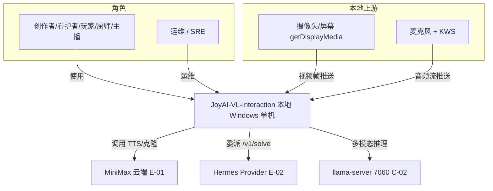

#### 3.1.2 系统模块图

**分层组件清单**：

| 层次 | 内容 | 数据来源 |
| --- | --- | --- |
| 接入层 | 创作者交互端 WebUI 8099 / 运维配置端 | §2.3 用例图角色 |
| 应用层 | webinfer 8070 / TTS+MiniMax 8985 / background-agent+Hermes / LLM 回复面板 / memory-store 8996 / bt-7274 / 进程编排自愈 | §2.1 业务域 |
| 中间件层 | SQLite（memory-store 后端）/ llama-server 7060（VLM 引擎）/ 进程健康存储 / 密钥隔离托管 | §3.1.3 云组件清单 |
| 集成对接层 | MiniMax API（E-01）/ Hermes Provider（E-02）/ 摄像头·麦克风·屏幕（E-03/E-04 本地采集） | §3.1.3 外部依赖清单 |

**系统模块图（分层：接入层→应用层→中间件层→集成对接层）**：

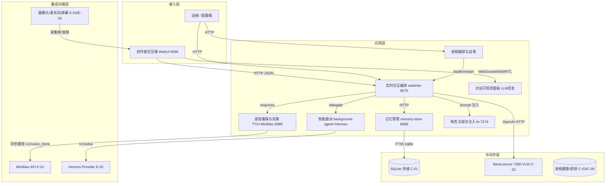

#### 3.1.3 集成架构

##### 外部依赖清单

| ID | 外部系统 | 归属团队 / 供应商 | 类别 | 使用方式 | 集成方式 | 协议 / 版本 | 功能定位（≤ 30 字） | 联系人 |
| --- | --- | --- | --- | --- | --- | --- | --- | --- |
| E-01 | MiniMax Speech 2.8 / Rapid Clone | MiniMax（外部 SaaS） | 第三方业务平台 | 消费 | REST API + 本地 adapter | HTTPS / MiniMax Speech 2.8（ADR0001） | TTS 合成 / 声音克隆 / 可选 ASR | `@语音团队` |
| E-02 | Hermes Agent Framework | Hermes 社区（外部框架） | 第三方业务平台 | 消费 | REST API | HTTP / Hermes /v1/solve（D24） | 严格隔离智能委派 | `@代理团队` |
| E-03 | 摄像头 / 屏幕捕获（getDisplayMedia） | 浏览器 / 操作系统 | 上游采集 | 生产（推送） | WebRTC / HTTPS | WebRTC（window, 1fps, 无音频） | 视频帧采集 | `@前端团队` |
| E-04 | 麦克风 + KWS 常驻监听 | 浏览器 / WebUI 进程内 | 上游采集 | 生产（推送） | 进程内（无网络） | sherpa-onnx v4 | 音频流 + 唤醒词 | `@语音团队` |

> 说明：llama-server 7060 视为本地中间件（C-02），不列入 E-xx；MiniMax/Hermes 为不可控外部 SaaS/框架，列入 E-xx。

##### 云组件 / 基础设施清单

| ID | 组件类别 | 选型 | 部署形态 | 规格量级 | 容量预估 | 提供方 / SLA | 用途 |
| --- | --- | --- | --- | --- | --- | --- | --- |
| C-01 | 嵌入式存储 | SQLite 3（memory-store v0.1，ADR0005） | 本地单文件 | 单库 ≤ 数百 MB | 会话/记忆条目级 | 本地（无 SLA，最佳努力） | 记忆块 / 会话索引 / 配置中心 |
| C-02 | VLM 推理引擎 | llama.cpp / llama-server（GGUF IQ4_NL，JoyAI-VL-8B） | 本地单二进制 | 单卡 ~5.8GB VRAM | 文本+图像推理 | 本地（单卡 RTX 5060 Ti 16GB） | 多模态决策推理 |
| C-03 | 进程健康存储 | 本地 SQLite / JSON 进程注册表（t_process_health） | 本地文件 | 11 进程行 | 重启计数/心跳 | 本地 | 进程自愈状态 |
| C-04 | 流式传输 | WebRTC（浏览器）+ 进程内 sherpa-onnx v4 | 浏览器/进程内 | 1fps 视频 + 音频流 | ~200KB/s 视频 | 本地 | 采集与 KWS/ASR |
| C-05 | 密钥托管 | 隔离托管（.env gitignored / 隔离密钥目录；Vault 完整版） | 本地文件 | 单 MiniMax Key | 按量限额 | 本地 | MiniMax Key 不硬编码 |
| C-06 | 可观测 | 进程级指标 + 结构化日志（MVP 轻量；Prometheus+Grafana 完整版） | 本地 | 11 进程指标 | 日志按日 | 本地 | 健康/VRAM/延迟监控 |

> 已删除不适用组件行：MySQL 集群 / Redis / Kafka / K8s / 对象存储 / 容器编排，理由：单机本地、无中心化中间件（D5 + ADR0005）。

##### 组件依赖关系

| 业务模块（§3.2） | 依赖的外部系统（E-xx） | 依赖的云组件（C-xx） | 故障传导风险 |
| --- | --- | --- | --- |
| M3 webinfer | E-03 / E-04 | C-02 / C-01 / C-06 | C-02 不可达→全瘫（SPOF）；C-01 不可达→记忆降级 |
| M4 TTS+MiniMax | E-01 | C-05 | E-01 不可达→切本地 Cozy fallback（BD-02） |
| M5 智能委派 | E-02 | — | E-02 不可达→委派失败，主对话正常（BD-01） |
| M9 memory-store | — | C-01 | C-01 损坏→记忆丢失，主对话正常（BD-04） |
| M11 进程编排自愈 | — | C-03 / C-06 | C-03 损坏→自愈状态丢失，重启可重建 |

#### 3.1.4 工程结构

```
JoyAI-VL-Interaction/
├── backend/                       # 后端工程根目录（Python 3.12）
│   ├── common/                    # 公共模块：DTO / VO / Enum / Exception / Constants
│   │   ├── dto/                   # BaseRequest / Result / DecisionToken
│   │   ├── enums/                 # Status / Layer 枚举
│   │   └── exceptions/            # 全局异常 + 错误码注册
│   ├── webinfer/                  # M3 实时交互编排（8070）
│   ├── tts_adapter/               # M4 语音播报与克隆（8985，含 MiniMax ACL）
│   ├── background_agent/          # M5 智能委派（Hermes shim 8079 / gateway 8642）
│   ├── memory_store/              # M9 记忆管理（8996，sqlite FTS5）
│   ├── voice_clone_api/           # M4 声音克隆服务（Rapid Clone）
│   ├── bt_7274/                   # M10 角色与提示注入
│   ├── process_supervisor/        # M11 进程编排与自愈（health check + restart）
│   └── config_center/             # 配置中心（t_config_item）
├── frontend/                      # 前端工程根目录
│   ├── webui/                     # 创作者交互端 8099（WebRTC + HUD）
│   │   ├── src/api/               # 接口封装（对齐 §3.2 接口清单）
│   │   ├── src/pages/             # 主对话 / 角色声音配置 / 历史记忆
│   │   └── src/components/        # HUD 徽章 / 状态面板
│   └── ops-console/               # 运维/配置端（服务状态 / 启停 / 安全配置）
├── services/scripts/              # PowerShell 编排（start/stop-joyai.ps1）
├── models/                        # GGUF 模型（JoyAI-VL-8B IQ4_NL）
└── .env (gitignored)              # 隔离托管的密钥（MiniMax Key 等，C-05）
```

> 公共模块 `common` 被各业务服务依赖；业务服务禁止反向依赖具体服务实现（遵循 P-01）。

#### 3.1.5 技术选型（版本约束）

| 技术分类 | 选型 | 版本 | 备注 / 选型理由（为什么选 A 不选 B） |
| --- | --- | --- | --- |
| 后端语言 | Python | 3.12 | WebUI/webinfer 已基于 Python 3.12（D33），保持统一避免双运行时 |
| VLM 推理引擎 | llama.cpp / llama-server（GGUF IQ4_NL） | GGUF IQ4_NL（JoyAI-VL-8B） | 选 A（llama-server）不选 B（vLLM）：单卡消费级 GPU 友好、MIT 免费、OpenAI 兼容、~5.8GB VRAM；vLLM 运行时重、Windows 单卡不友好（D40 §6） |
| 流式传输 | WebRTC（浏览器）+ 进程内 sherpa-onnx | WebRTC + sherpa-onnx v4 | 选 A（现有 WebRTC+sherpa）不选 B（SmallWebRTC/Pipecat 整体替换）：不推翻 webinfer 单入口（ADR0006），仅借鉴模式（B4） |
| 本地 ASR / KWS | sherpa-onnx | v4（KWS recall 49.06%，FAR 2%） | 选 A（进程内 sherpa）不选 B（阿里云 ASR）：零网络、低延迟；上云档仅作增强（档2） |
| TTS / 声音克隆 | MiniMax Speech 2.8 / Rapid Clone | Speech 2.8（ADR0001 同步路径） | 选 A（MiniMax Rapid Clone，10s 参考音频，¥9.9/voice）不选 B（本地 CozyVoice）：质量优先；本地 CozyVoice 作 fallback（D42 §5） |
| 智能委派框架 | Hermes（gateway 8642 + shim 8079） | Hermes（严格隔离） | 选 A（Hermes）不选 B（Codex）：人格/记忆/Skills/Provider 独立、故障隔离（D24/D42 §16） |
| 嵌入式存储 | SQLite | 3.x | 选 A（sqlite）不选 B（PostgreSQL）：单机本地、零运维、ADR0005 冻结 v0.1 仅 sqlite |
| 记忆检索引擎 | SQLite FTS5 | FTS5 | 进程内全文检索，零额外组件 |
| 编排脚本 | PowerShell | 5.1+（Windows） | 选 A（PowerShell start/stop-joyai.ps1）不选 B（Docker Compose）：现状可用、Windows 原生；Compose 留完整版（F14） |
| 前端框架 | 原生 JS + WebRTC | — | WebUI 已落地（D33），零修改原则（D40 §7） |
| 密钥托管 | 隔离 .env / 隔离密钥目录 | — | 选 A（隔离托管）不选 B（硬编码）：满足 V4/ADR0001；Vault 留完整版 |
| 训练数据编码 | AdaCodec | — | 4M 时间对齐片段编码（D1，资料引用） |

### 3.2 模块详细设计

> **核心方法论**：画业务逻辑在角色和系统之间流动的过程。每个模块按 §3.2.3 五段式独立成节。

#### 3.2.1 模块公共约束（Common）

**通信方式约束**：

| 约束项 | 取值 |
| --- | --- |
| 接口路径风格 | RESTful（与现有 OpenAI 兼容 HTTP 一致，ADR0006） |
| 协议 | HTTP / WebRTC / 进程内（sherpa） |
| 数据格式 | JSON（OpenAI 兼容 schema） |
| 字符编码 | UTF-8 |

**通用基础结构**：

| 基类 / 结构 | 用途 | 包路径 |
| --- | --- | --- |
| `BaseRequest` | 多态请求对象基类 | `common.dto` |
| `Result(T)` | 统一返回结构（含 code / msg / data / traceId） | `common.dto` |
| `DecisionToken` | silence/response/delegate 三态 | `common.dto` |
| `PageRequest` / `PageResponse(T)` | 分页请求 / 响应 | `common.dto` |

#### 3.2.2 模块清单与编号规则

**模块清单**（继承高层 §6.2 共 12 模块）：

| 编号 | 模块名 | 业务域（§2.1） | 模块负责人 | 关联子领域 |
| --- | --- | --- | --- | --- |
| M1 | 创作者交互端 WebUI 8099 | BC-CAPTURE / BC-ORCH | `@前端团队` | 采集 / 对话 / 配置 |
| M2 | 运维 / 配置端 | BC-OPS | `@运维团队` | 启停 / 监控 / 安全配置 |
| M3 | 实时交互编排 webinfer 8070 | BC-ORCH | `@后端团队` | 决策路由 / prompt 注入 |
| M4 | 语音播报与克隆 TTS+MiniMax 8985 | BC-SPEECH | `@语音团队` | TTS / 克隆注册 |
| M5 | 智能委派代理 background-agent+Hermes | BC-DELEG | `@代理团队` | 委派触发 / 结果收敛 |
| M6 | 对话可观测面板 LLM 回复 | BC-ORCH | `@前端团队` | 状态发布订阅 |
| M7 | VLM 推理 llama-server 7060 | BC-VLM | `@推理团队` | 多模态推理 |
| M8 | 本地语音识别 sherpa-onnx | BC-CAPTURE | `@语音团队` | KWS/ASR |
| M9 | 记忆管理 memory-store 8996 | BC-MEM | `@记忆团队` | push/pull |
| M10 | 角色与提示注入 bt-7274 | BC-MEM | `@后端团队` | prompt 配置 |
| M11 | 进程编排与自愈 | BC-OPS | `@运维团队` | health/restart |
| M12 | 云端语音增强 MiniMax API（外部 E-01） | BC-SPEECH（外部） | 外部供应商 | TTS/克隆/ASR |

**编号规则**：模块编号 `M{N}` 全局唯一；每个模块在 §3.2 下独立成节，编号 `§3.2.M{N}`；节内五段式编号 `§3.2.M{N}.1` ~ `§3.2.M{N}.5`。

#### 3.2.3 单模块设计模板（五段式）

> 本节为规范说明（所有模块共同遵守的项目级规范），不在 §3.2.M{N} 下重复声明。五段顺序固定：模块概述 → 接口清单 → 关键结构定义 → 模块逻辑时序图 → 关键流程逻辑。简单 CRUD 模块可省略 `.5` 但须显式注明。

#### 3.2.M1 创作者交互端 WebUI 8099

##### §3.2.M1.1 模块概述

创作者交互端覆盖「实时对话、角色/声音配置、历史记忆浏览」业务流程，业务逻辑在创作者、摄像头/麦克风、webinfer 之间流动，同时涉及 LLM 回复面板、本地 ASR（进程内 sherpa）、webinfer（8070）等内外部系统。零后端修改原则（D40 §7）。

##### §3.2.M1.2 接口清单

| 子领域 | 方法 | 路径 | 用途（≤ 20 字） | 请求 DTO | 响应 VO | 幂等 |
| --- | --- | --- | --- | --- | --- | --- |
| 对话 | POST | `/v1/chat/completions` | 多模态对话（经 webinfer） | `ChatCompletionRequest` | `ChatCompletionStream` | 否 |
| 配置 | GET | `/api/role/list` | 角色 prompt 列表 | — | `RolePromptListVO` | 天然 |
| 配置 | POST | `/api/voice/clone` | 触发声音克隆注册 | `VoiceCloneRequest` | `VoiceCloneVO` | 是（X-Idempotency-Key） |
| 历史 | GET | `/api/vlm/history` | 会话/记忆历史 | — | `SessionHistoryVO` | 天然 |

##### §3.2.M1.3 关键结构定义（DTO）

```json
{
  "ChatCompletionRequest": {
    "model": "joyai-vl-8b",
    "messages": [ { "role": "user", "content": "image_url + text" } ],
    "stream": true,
    "decision_token": true
  },
  "VoiceCloneRequest": {
    "voice_name": "string",
    "reference_audio_b64": "string(10s)",
    "prompt_audio_b64": "string(optional)"
  }
}
```

| DTO / VO 名 | 字段名 | 类型 | 必填 | 业务含义 | 约束 / 默认值 |
| --- | --- | --- | --- | --- | --- |
| `ChatCompletionRequest` | `decision_token` | Boolean | 否 | 是否要求返回决策 token | 默认 true（webinfer 剥离） |
| `VoiceCloneRequest` | `reference_audio_b64` | String | 是 | 10s 参考音频（base64） | 仅传引用，不落库明文 |
| `RolePromptListVO` | `items` | Array | 是 | 角色列表 | 含 bt-7274 |

##### §3.2.M1.4 模块逻辑时序图

| 编号 | 标题 | 场景类别 | 是否包含异常分支 |
| --- | --- | --- | --- |
| SQ-01 | WebUI - 实时对话主链路 | 核心对话触发 | 是（webinfer 不可达显式失败） |

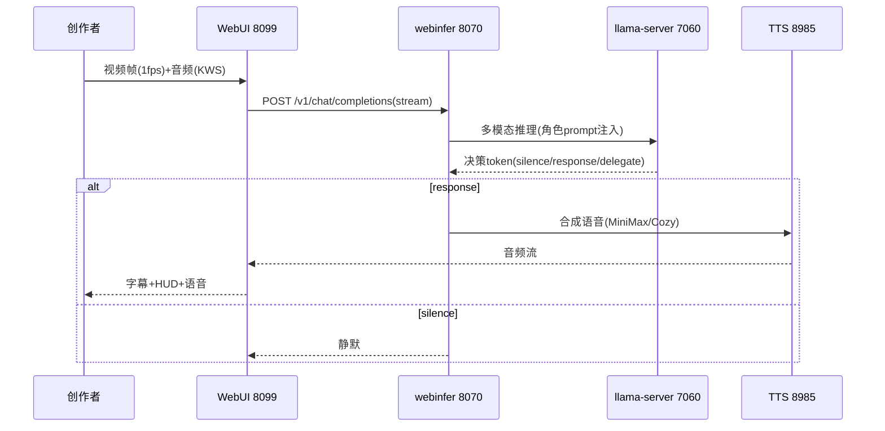

##### §3.2.M1.5 关键流程逻辑

无复杂状态机/事务/跨多步异步，本段省略（前端采集→推流→渲染，状态由 webinfer 决策驱动；KWS/EXIT_WORDS 状态机在 M8）。

#### 3.2.M2 运维 / 配置端

##### §3.2.M2.1 模块概述

运维/配置端覆盖「服务状态查看、一键启停、安全配置（Key 托管/暴露面）」业务流程，业务逻辑在运维人员、进程编排自愈、webinfer 之间流动，涉及所有 11 进程与密钥托管（C-05）。

##### §3.2.M2.2 接口清单

| 子领域 | 方法 | 路径 | 用途（≤ 20 字） | 请求 DTO | 响应 VO | 幂等 |
| --- | --- | --- | --- | --- | --- | --- |
| 状态 | GET | `/api/ops/processes` | 11 进程健康+VRAM | — | `ProcessHealthListVO` | 天然 |
| 编排 | POST | `/api/ops/start` | 一键启动（顺序校验） | `StartRequest` | `Result` | 是（biz_req_no） |
| 编排 | POST | `/api/ops/stop` | 一键停止 | `StopRequest` | `Result` | 是（biz_req_no） |
| 安全 | PUT | `/api/ops/security/bind` | 暴露面绑定 localhost/内网 | `BindRequest` | `Result` | 是（id+version） |

##### §3.2.M2.3 关键结构定义（DTO）

```json
{
  "ProcessHealthListVO": {
    "items": [ { "process_key": "llama_main", "status": "RUNNING", "vram_mb": 5800, "restart_count": 0 } ]
  },
  "BindRequest": { "bind_scope": "localhost", "allowed_subnet": "127.0.0.1/32" }
}
```

| DTO / VO 名 | 字段名 | 类型 | 必填 | 业务含义 | 约束 / 默认值 |
| --- | --- | --- | --- | --- | --- |
| `ProcessHealthListVO` | `items[].vram_mb` | Integer | 否 | 进程显存占用 | llama_main 峰值 ~5800 |
| `BindRequest` | `bind_scope` | String | 是 | 暴露面范围 | 枚举：localhost / intranet |

##### §3.2.M2.4 模块逻辑时序图

| 编号 | 标题 | 场景类别 | 是否包含异常分支 |
| --- | --- | --- | --- |
| SQ-02 | 运维端 - 一键启停编排 | 启动/停止触发 | 是（依赖顺序校验失败） |

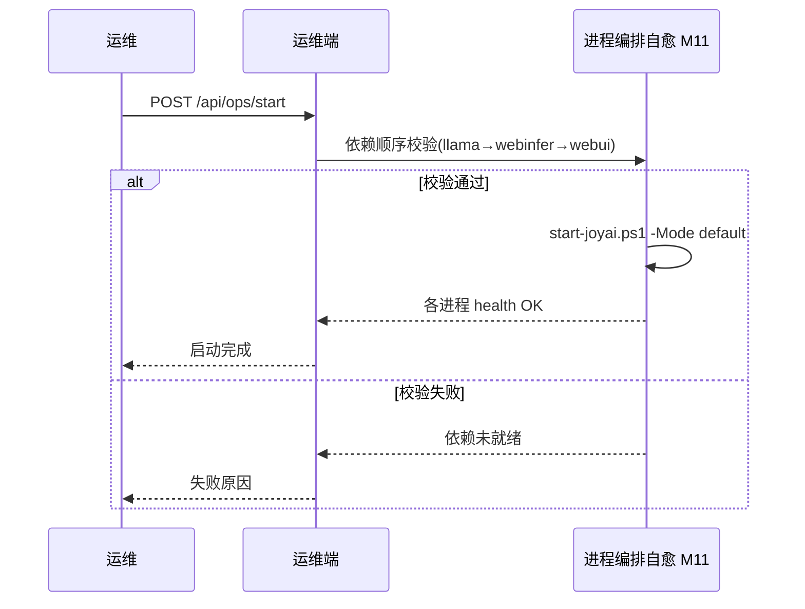

##### §3.2.M2.5 关键流程逻辑

无复杂状态机/事务；启停为幂等脚本调用（biz_req_no 去重）。

#### 3.2.M3 实时交互编排 webinfer 8070

##### §3.2.M3.1 模块概述

webinfer 覆盖「每秒 decision token 编排、角色 prompt 注入、会话编排、状态发布」业务流程，是 ADR0006 冻结的单入口网关（显式失败不回退 7060）。涉及 WebUI、llama-server、memory-store、bt-7274、TTS、Hermes、LLM 回复面板等内外部系统。

##### §3.2.M3.2 接口清单

| 子领域 | 方法 | 路径 | 用途（≤ 20 字） | 请求 DTO | 响应 VO | 幂等 |
| --- | --- | --- | --- | --- | --- | --- |
| 对话 | POST | `/v1/chat/completions` | 多模态对话（含图像） | `ChatCompletionRequest` | `ChatCompletionStream` | 否 |
| 对话 | POST | `/v1/text/chat` | 纯文本对话（拒图像） | `TextChatRequest` | `ChatCompletionStream` | 否 |
| 决策 | POST | `/v1/summarizer/route` | 摘要服务热切换 | `RouteRequest` | `Result` | 是（biz_req_no） |
| 记忆 | GET | `/v1/blocks/pull` | 拉取记忆块 | `PullRequest` | `MemoryBlockVO` | 天然 |
| 记忆 | POST | `/v1/blocks/push` | 推送记忆块 | `PushRequest` | `Result` | 是（block_id） |
| 角色 | GET | `/v1/prompts/active` | 当前角色 prompt | — | `RolePromptVO` | 天然 |
| 角色 | POST | `/v1/prompts/reload` | 重载角色 prompt | `ReloadRequest` | `Result` | 是（biz_req_no） |
| 状态 | GET | `/api/llm/status` | LLM 回复面板状态 | — | `LlmStatusVO` | 天然 |
| 系统 | GET | `/health` | 健康检查 | — | `HealthVO` | 天然 |

> 接口风格继承现有 OpenAI 兼容 HTTP（D4/D14/D32）；`/v1/text/chat` 收到 image_url 返回 400（D14）。

##### §3.2.M3.3 关键结构定义（DTO）

```json
{
  "DecisionToken": { "type": "silence | response | delegate", "payload": "..." },
  "ChatCompletionStream": {
    "choices": [ { "delta": { "content": "...", "decision_token": "response" } } ]
  },
  "RouteRequest": { "target": "summary_llama", "action": "hot_switch" }
}
```

| DTO / VO 名 | 字段名 | 类型 | 必填 | 业务含义 | 约束 / 默认值 |
| --- | --- | --- | --- | --- | --- |
| `DecisionToken` | `type` | String | 是 | 决策三态 | 枚举：silence / response / delegate |
| `ChatCompletionStream` | `decision_token` | String | 是 | 剥离前决策字面量 | 送 TTS 前由 webinfer 剥离（D4） |
| `RouteRequest` | `target` | String | 是 | 热切换目标服务 | summary_llama（D4 §拓扑） |

##### §3.2.M3.4 模块逻辑时序图

| 编号 | 标题 | 场景类别 | 是否包含异常分支 |
| --- | --- | --- | --- |
| SQ-01 | webinfer - 主链路决策编排 | 核心对话/决策 | 是（llama-server 不可达显式失败） |
| SQ-03 | webinfer - 智能委派分支 | delegate 触发 | 是（Hermes 不可达隔离） |

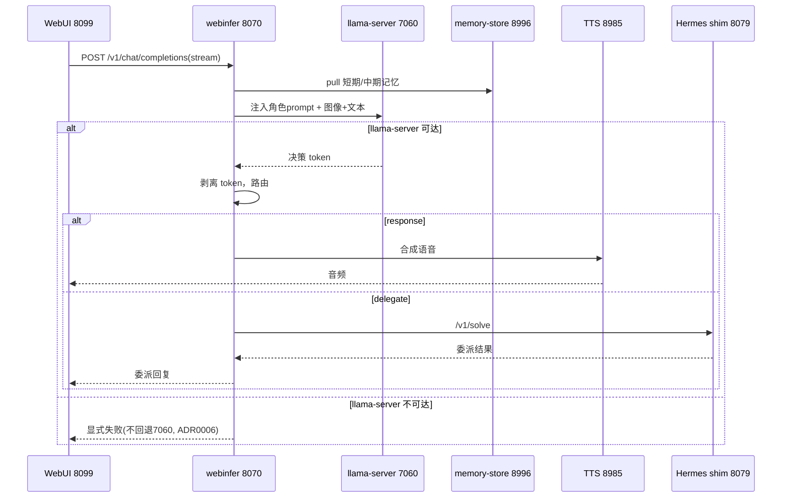

##### §3.2.M3.5 关键流程逻辑

```
触发：每帧/每秒决策周期
Step 1: 采集上下文（图像+文本+记忆）
  ├── 校验：角色 prompt 已加载 → 失败则 reload
  ├── 校验：llama-server health → 失败则显式失败(ADR0006)
  └── 状态变更：无
Step 2: 推理 + 决策 token 解析
  ├── [MOCK] 摘要热切换(/v1/summarizer/route) 未完成契约：MVP 仅端点存在
  └── 状态变更：DecisionToken(silence/response/delegate)
Step 3: 路由
  ├── response → TTS 合成（剥离 token）
  ├── silence → 静默等待
  └── delegate → Hermes /v1/solve（失败隔离，主对话正常，BD-01）
```

#### 3.2.M4 语音播报与克隆 TTS + MiniMax 8985

##### §3.2.M4.1 模块概述

覆盖「TTS 语音播报、MiniMax Rapid Clone 声音克隆注册」业务流程，业务逻辑在 webinfer、MiniMax 云端（ACL 隔离）、voice_clone 服务之间流动；本地 CozyVoice 作 fallback。

##### §3.2.M4.2 接口清单

| 子领域 | 方法 | 路径 | 用途（≤ 20 字） | 请求 DTO | 响应 VO | 幂等 |
| --- | --- | --- | --- | --- | --- | --- |
| TTS | POST | `/api/tts/synthesize` | 文本合成语音 | `TtsRequest` | `AudioStreamVO` | 否 |
| 克隆 | POST | `/v1/voice_clone` | Rapid Clone 同步注册 | `VoiceCloneRequest` | `VoiceCloneVO` | 是（X-Idempotency-Key） |
| 克隆 | GET | `/api/voice/list` | 克隆列表 | — | `VoiceCloneListVO` | 天然 |
| 克隆 | DELETE | `/api/voice/{id}` | 撤销克隆 | — | `Result` | 天然 |

> `/v1/voice_clone` 为 ADR0001 冻结同步路径（非 `/v2/t2a_async_v2`）；MiniMax 走 ACL adapter（C-02 关系）。

##### §3.2.M4.3 关键结构定义（DTO）

```json
{
  "TtsRequest": { "text": "string", "voice_id": "minimax_man_33333", "speed": 1.0 },
  "VoiceCloneVO": {
    "voice_id": "minimax_man_33333",
    "group_id": "<your_minimax_group_id>",
    "expire_at": "2026-07-27T00:00:00Z",
    "credential_handle": "enc://minimax/voice_xxx"
  }
}
```

| DTO / VO 名 | 字段名 | 类型 | 必填 | 业务含义 | 约束 / 默认值 |
| --- | --- | --- | --- | --- | --- |
| `VoiceCloneVO` | `credential_handle` | String | 是 | 隔离托管的凭证引用 | 不存 MiniMax Key 明文（V4） |
| `VoiceCloneVO` | `expire_at` | DateTime | 是 | 克隆 7 天过期 | MiniMax 策略（D27） |

##### §3.2.M4.4 模块逻辑时序图

| 编号 | 标题 | 场景类别 | 是否包含异常分支 |
| --- | --- | --- | --- |
| SQ-04 | TTS - 合成与克隆注册 | TTS/克隆触发 | 是（MiniMax 失败切 Cozy fallback） |

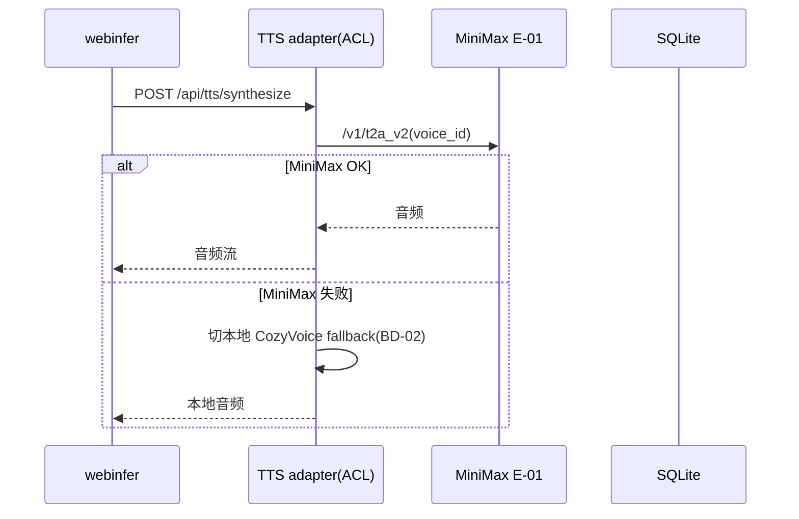

##### §3.2.M4.5 关键流程逻辑

无复杂状态机；克隆注册为同步路径，凭证句柄入库（t_voice_clone_registry），音频明文不落库（仅存引用）。

#### 3.2.M5 智能委派代理 background-agent + Hermes

##### §3.2.M5.1 模块概述

覆盖「Hermes 严格隔离委派触发与结果收敛」业务流程，业务逻辑在 webinfer（delegate）、Hermes shim 8079、gateway 8642、Provider 之间流动（Conformist 遵循 /v1/solve）。

##### §3.2.M5.2 接口清单

| 子领域 | 方法 | 路径 | 用途（≤ 20 字） | 请求 DTO | 响应 VO | 幂等 |
| --- | --- | --- | --- | --- | --- | --- |
| 委派 | POST | `/v1/solve` | Hermes 委派求解 | `SolveRequest` | `SolveResponse` | 是（biz_req_no） |
| 委派 | GET | `/health` | shim/gateway 健康 | — | `HealthVO` | 天然 |

> 契约字段 `SolveRequest/Response/FrameInput` 与现有 OpenAI 兼容（D40 §7）；shim 不传 system（D42 §16）。

##### §3.2.M5.3 关键结构定义（DTO）

```json
{
  "SolveRequest": { "task": "string", "frame_input": { "image": "b64", "text": "string" }, "context": {} },
  "SolveResponse": { "result": "string", "delegated": true }
}
```

| DTO / VO 名 | 字段名 | 类型 | 必填 | 业务含义 | 约束 / 默认值 |
| --- | --- | --- | --- | --- | --- |
| `SolveRequest` | `frame_input` | Object | 否 | 视觉帧输入 | 与 OpenAI 兼容字段一致 |
| `SolveResponse` | `delegated` | Boolean | 是 | 是否委派成功 | 失败则主对话正常 |

##### §3.2.M5.4 模块逻辑时序图

| 编号 | 标题 | 场景类别 | 是否包含异常分支 |
| --- | --- | --- | --- |
| SQ-03 | Hermes - 严格隔离委派 | delegate 触发 | 是（gateway 不可达隔离） |

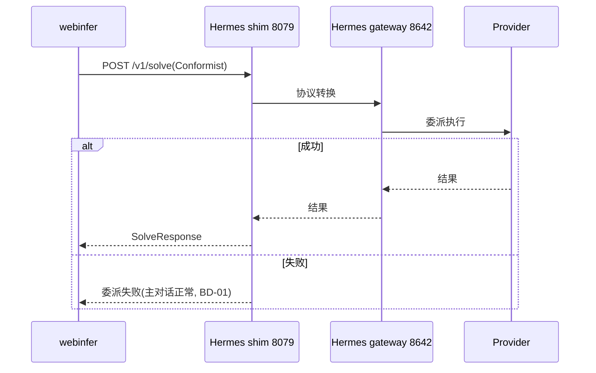

##### §3.2.M5.5 关键流程逻辑

无复杂状态机；shim 仅做协议转换（Conformist），人格/记忆/Skills/Provider 隔离（D24）。委派失败不影响主对话。

#### 3.2.M6 对话可观测面板 LLM 回复

##### §3.2.M6.1 模块概述

覆盖「LLM 回复面板可见性（display:block + /api/llm/status）」业务流程（ADR0003），消费 webinfer 发布的决策/状态事件（Published Language），业务逻辑在 webinfer、前端之间流动。

##### §3.2.M6.2 接口清单

| 子领域 | 方法 | 路径 | 用途（≤ 20 字） | 请求 DTO | 响应 VO | 幂等 |
| --- | --- | --- | --- | --- | --- | --- |
| 状态 | GET | `/api/llm/status` | 回复/决策状态 | — | `LlmStatusVO` | 天然 |
| 状态 | WS | `/ws/llm/stream` | 流式 delta（部分实现） | — | `LlmDeltaVO` | 天然 |

##### §3.2.M6.3 关键结构定义（DTO）

```json
{ "LlmStatusVO": { "jarvisStatus": "DIALOG_ACTIVE", "llmBadge": "thinking", "ttsBadge": "speaking", "kwsBadge": "LISTENING" } }
```

##### §3.2.M6.4 模块逻辑时序图

| 编号 | 标题 | 场景类别 | 是否包含异常分支 |
| --- | --- | --- | --- |
| SQ-05 | 面板 - 状态订阅 | 状态消费 | 是（webinfer 不可达） |

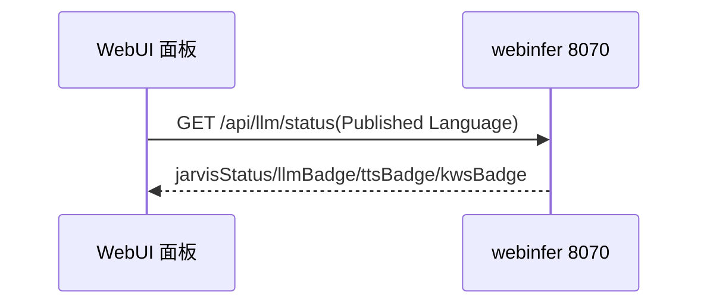

##### §3.2.M6.5 关键流程逻辑

无复杂状态机；前端 HUD 徽章渲染（D28），display:block 默认可见（ADR0003）。

#### 3.2.M7 VLM 推理 llama-server 7060

##### §3.2.M7.1 模块概述

覆盖「多模态推理（图像+文本→决策）」业务流程（BC-VLM 核心域），作为 OpenAI 兼容 HTTP 服务被 webinfer 消费（Customer/Supplier）。单卡 ~5.8GB VRAM，唯一 SPOF（D40 §8）。

##### §3.2.M7.2 接口清单

| 子领域 | 方法 | 路径 | 用途（≤ 20 字） | 请求 DTO | 响应 VO | 幂等 |
| --- | --- | --- | --- | --- | --- | --- |
| 推理 | POST | `/v1/chat/completions` | 多模态推理 | `ChatCompletionRequest` | `ChatCompletionStream` | 否 |
| 推理 | POST | `/v1/models` | 模型列表 | — | `ModelListVO` | 天然 |
| 系统 | GET | `/health` | 健康检查 | — | `HealthVO` | 天然 |

> 本地二进制（llama.cpp GGUF IQ4_NL），非本项目自研；接口契约继承 OpenAI 兼容。

##### §3.2.M7.3 关键结构定义（DTO）

```json
{ "ChatCompletionRequest": { "model": "joyai-vl-8b-iq4_nl", "messages": [ {"role":"user","content":[{"type":"image_url"},{"type":"text"}]} ] } }
```

##### §3.2.M7.4 模块逻辑时序图

| 编号 | 标题 | 场景类别 | 是否包含异常分支 |
| --- | --- | --- | --- |
| SQ-06 | llama-server - 推理调用 | 推理触发 | 是（OOM/超时） |

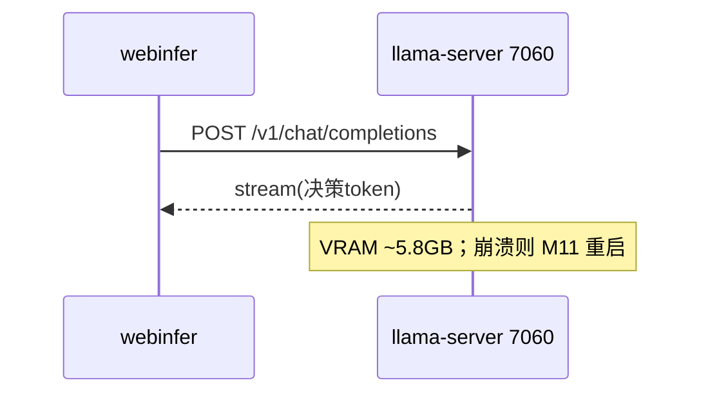

##### §3.2.M7.5 关键流程逻辑

无复杂状态机；SPOF 监控+自动重启由 M11 负责（R-02）。

#### 3.2.M8 本地语音识别 sherpa-onnx

##### §3.2.M8.1 模块概述

覆盖「KWS 唤醒 + ASR 流式识别」业务流程（BC-CAPTURE 支撑域），进程内运行（零网络），业务逻辑在麦克风、WebUI 之间流动（D22/D40）。

##### §3.2.M8.2 接口清单

| 子领域 | 方法 | 路径 | 用途（≤ 20 字） | 请求 DTO | 响应 VO | 幂等 |
| --- | --- | --- | --- | --- | --- | --- |
| KWS | 进程内 | `audio-only /offer` | KWS 常驻监听 | — | `KwsEvent` | 天然 |
| ASR | WS | `ws://127.0.0.1:8994/ws/asr` | 流式转写（上云档） | `PcmFrame` | `AsrTranscript` | 天然 |

> KWS/ASR 在 WebUI 进程内（sherpa-onnx v4）；本地优先，上云档（阿里云 ASR）仅增强。

##### §3.2.M8.3 关键结构定义（DTO）

```json
{ "KwsEvent": { "type": "KWS_LISTENING | WAKE_DETECTED | DIALOG_ACTIVE", "word": "bt 在吗" } }
```

##### §3.2.M8.4 模块逻辑时序图

| 编号 | 标题 | 场景类别 | 是否包含异常分支 |
| --- | --- | --- | --- |
| SQ-07 | KWS/ASR - 唤醒与打断 | 唤醒触发 | 是（WAIT_ASR_CONFIRM 超时） |

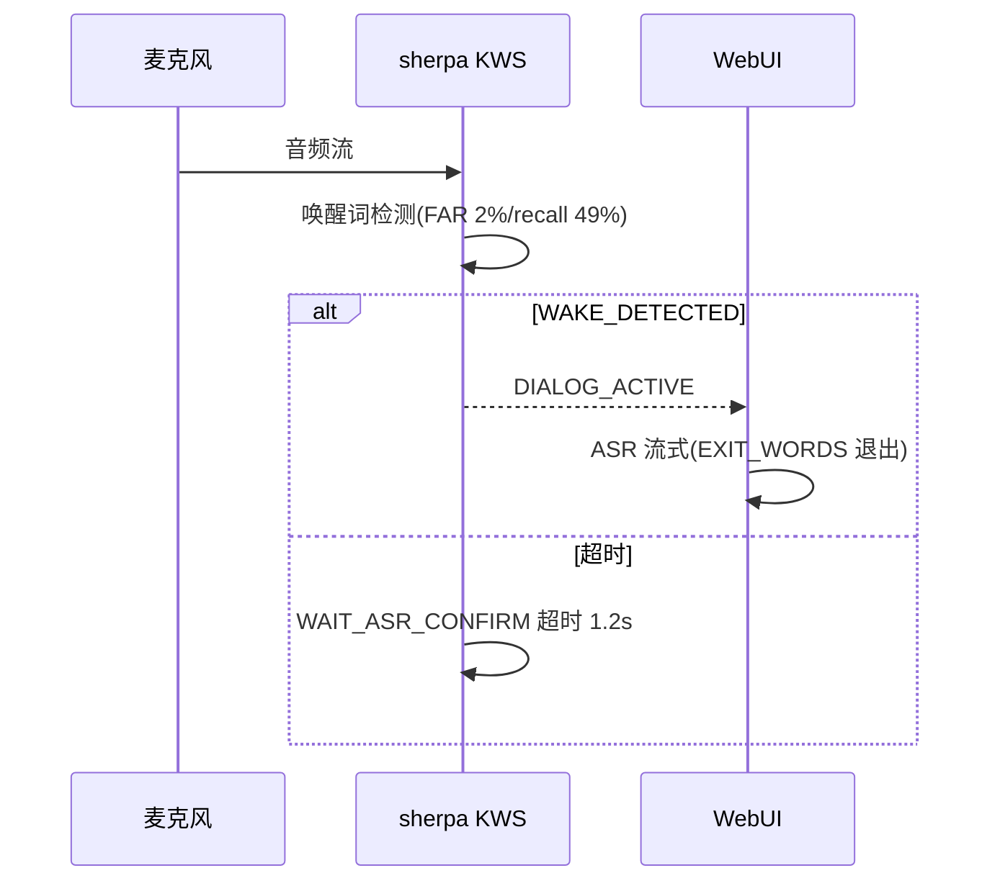

##### §3.2.M8.5 关键流程逻辑

混合唤醒确认状态机（D17）：WAIT_ASR_CONFIRM（asr_confirm_timeout_s=1.2）→ DIALOG_ACTIVE → EXIT_WORDS 退出。KWS v4 参数经环境变量注入（ADR0002）：JARVIS_KWS_SCORE=10.0 / THRESHOLD=0.25 / TRAILING_BLANKS=1 / MAX_ACTIVE_PATHS=10。

#### 3.2.M9 记忆管理 memory-store 8996

##### §3.2.M9.1 模块概述

覆盖「短期/中期记忆 push/pull（sqlite FTS5 v0.1）」业务流程（BC-MEM 通用域），与 webinfer 共享 `Session`/`MemoryBlock` 模型（Shared Kernel）。ADR0005 冻结 v0.1 仅 sqlite。

##### §3.2.M9.2 接口清单

| 子领域 | 方法 | 路径 | 用途（≤ 20 字） | 请求 DTO | 响应 VO | 幂等 |
| --- | --- | --- | --- | --- | --- | --- |
| 记忆 | POST | `/v1/blocks/push` | 推送记忆块 | `PushRequest` | `Result` | 是（block_id） |
| 记忆 | GET | `/v1/blocks/pull` | 拉取记忆块 | `PullRequest` | `MemoryBlockVO` | 天然 |
| 会话 | POST | `/v1/sessions` | 创建会话 | `SessionCreate` | `SessionVO` | 是（session_id） |
| 会话 | GET | `/v1/sessions/{id}` | 会话详情 | — | `SessionVO` | 天然 |

> 端点为骨架契约（D9/D19），v0.2 补 embedding/psql（O3）。

##### §3.2.M9.3 关键结构定义（DTO）

```json
{
  "MemoryBlock": { "block_id": "uuid", "session_id": "uuid", "layer": "L0|L1|L2", "content": "string", "score": 0.0 },
  "SessionVO": { "session_id": "uuid", "turn_count": 12, "summary_status": "DONE" }
}
```

##### §3.2.M9.4 模块逻辑时序图

| 编号 | 标题 | 场景类别 | 是否包含异常分支 |
| --- | --- | --- | --- |
| SQ-08 | memory-store - push/pull | 记忆读写 | 是（sqlite 写入失败降级） |

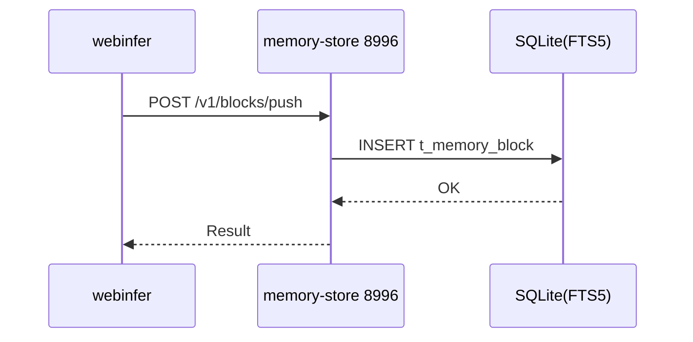

##### §3.2.M9.5 关键流程逻辑

无复杂状态机；每 100 帧中期摘要（D40 §2）写入 L1；v0.1 不计算 score/last_hit_at/hit_count（ADR0005 §5A），v0.2 补（O3）。

#### 3.2.M10 角色与提示注入 bt-7274

##### §3.2.M10.1 模块概述

覆盖「bt-7274 角色 prompt 配置与注入」业务流程（BC-MEM），业务逻辑在创作者、webinfer、t_role_prompt 之间流动；决策 token 由 webinfer 剥离（D4）。

##### §3.2.M10.2 接口清单

| 子领域 | 方法 | 路径 | 用途（≤ 20 字） | 请求 DTO | 响应 VO | 幂等 |
| --- | --- | --- | --- | --- | --- | --- |
| 角色 | GET | `/api/role/list` | 角色列表 | — | `RolePromptListVO` | 天然 |
| 角色 | POST | `/api/role` | 创建/更新角色 prompt | `RolePromptRequest` | `RolePromptVO` | 是（role_key+version） |
| 角色 | POST | `/api/role/{key}/activate` | 激活角色 | — | `Result` | 是（biz_req_no） |

##### §3.2.M10.3 关键结构定义（DTO）

```json
{ "RolePromptRequest": { "role_key": "bt-7274", "role_name": "BT-7274", "prompt_text": "system prompt...", "decision_token_enabled": true } }
```

##### §3.2.M10.4 模块逻辑时序图

| 编号 | 标题 | 场景类别 | 是否包含异常分支 |
| --- | --- | --- | --- |
| SQ-09 | bt-7274 - 角色配置生效 | 配置触发 | 是（prompt 校验失败） |

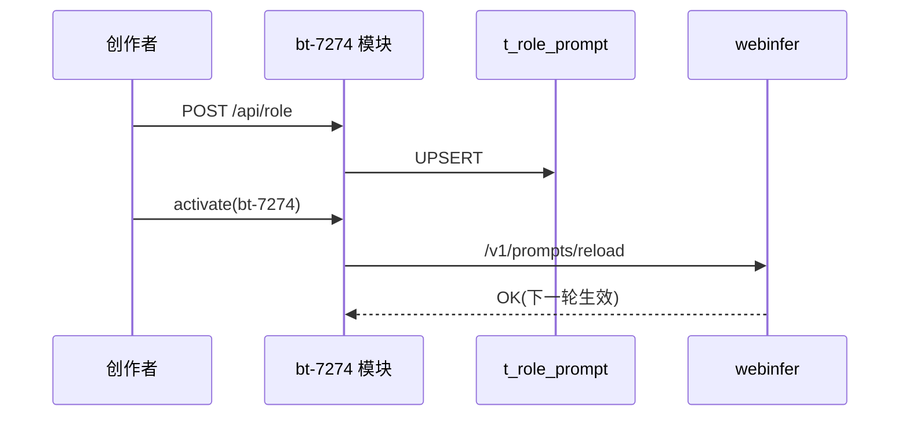

##### §3.2.M10.5 关键流程逻辑

无复杂状态机；角色 prompt 版本化（role_key + version 乐观锁），激活后下一轮对话生效。

#### 3.2.M11 进程编排与自愈

##### §3.2.M11.1 模块概述

覆盖「一键启停、进程健康监控、崩溃自动重启、VRAM 看护」业务流程（BC-OPS 通用域），业务逻辑在 11 进程、PowerShell 编排、t_process_health 之间流动。是对 V1（进程自愈 P99 ≤ 30s）的落地。

##### §3.2.M11.2 接口清单

| 子领域 | 方法 | 路径 | 用途（≤ 20 字） | 请求 DTO | 响应 VO | 幂等 |
| --- | --- | --- | --- | --- | --- | --- |
| 监控 | GET | `/api/supervisor/health` | 全进程健康 | — | `ProcessHealthListVO` | 天然 |
| 监控 | POST | `/api/supervisor/restart` | 强制重启某进程 | `RestartRequest` | `Result` | 是（biz_req_no） |
| 配置 | GET | `/api/supervisor/vram` | VRAM 水位 | — | `VramVO` | 天然 |

##### §3.2.M11.3 关键结构定义（DTO）

```json
{ "ProcessHealthListVO": { "items": [ { "process_key": "llama_main", "status": "RUNNING", "restart_count": 0, "vram_mb": 5800 } ] } }
```

##### §3.2.M11.4 模块逻辑时序图

| 编号 | 标题 | 场景类别 | 是否包含异常分支 |
| --- | --- | --- | --- |
| SQ-02 | 进程自愈 - 崩溃自动重启 | 崩溃探测/重启 | 是（重启失败升级告警） |

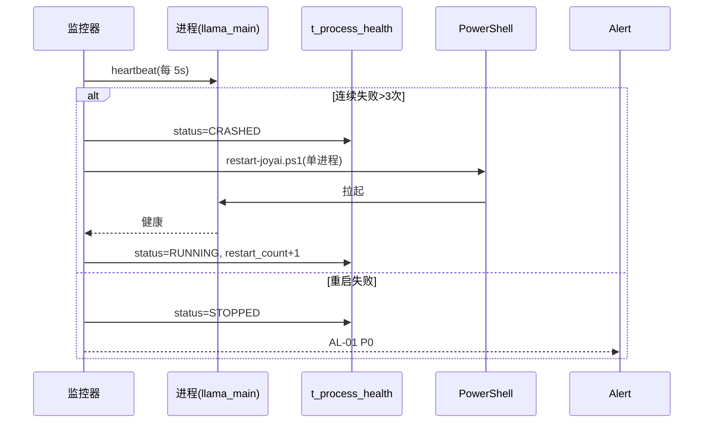

##### §3.2.M11.5 关键流程逻辑

```
触发：heartbeat 探测（5s 间隔）
Step 1: 健康检查
  ├── 校验：进程存活 + 端口可达 → 失败标记 CRASHED
  └── 状态变更：t_process_health.status
Step 2: 自动重启（restart:unless-stopped 模式）
  ├── [MOCK] 启动顺序依赖校验：voice_clone→tts→webinfer→hermes→webui（D40 §4）
  └── 状态变更：RESTARTING → RUNNING（restart_count+1）
Step 3: 升级
  └── 重启失败 → AL-01 P0（人工介入）
```

#### 3.2.M12 云端语音增强 MiniMax API（外部 E-01）

##### §3.2.M12.1 模块概述

MiniMax 云端为外部 SaaS（E-01），经 ACL adapter（M4）调用，提供 TTS/声音克隆/可选 ASR。业务逻辑在 TTS adapter、MiniMax 之间流动。本地优先主对话 VLM 永远本地（D42 §10），仅语音上云。

##### §3.2.M12.2 接口清单（经 ACL 调用，非直连）

| 子领域 | 方法 | 路径 | 用途（≤ 20 字） | 请求 DTO | 响应 VO | 幂等 |
| --- | --- | --- | --- | --- | --- | --- |
| TTS | POST | `/v1/t2a_v2` | 文本转语音 | `TtsRequest` | `AudioVO` | 否 |
| 克隆 | POST | `/v1/voice_clone` | Rapid Clone 注册 | `VoiceCloneRequest` | `VoiceCloneVO` | 是（X-Idempotency-Key） |

> 直连接口由 ACL adapter（M4）封装；Key 经隔离托管（C-05），不硬编码（V4/ADR0001）。

##### §3.2.M12.3 关键结构定义（DTO）

```json
{ "VoiceCloneVO": { "voice_id": "minimax_man_33333", "group_id": "<your_minimax_group_id>", "expire_at": "ISO8601" } }
```

##### §3.2.M12.4 模块逻辑时序图

见 §3.2.M4.4 SQ-04（TTS adapter → MiniMax ACL 调用）。

##### §3.2.M12.5 关键流程逻辑

无复杂状态机；外部依赖，失败由 M4 降级到本地 CozyVoice（BD-02）。

### 3.3 核心业务对象清单

#### 3.3.1 对象定义

| 编号 | 对象名（代码类名） | 对象类型 | 包路径 | 模块归属 | 被哪些模块复用 | 实例化策略 | 序列化约定 | 持久化策略 |
| --- | --- | --- | --- | --- | --- | --- | --- | --- |
| O-01 | `DecisionToken` | 值对象 | `common.dto` | common | M1/M3/M6 | new（不可变） | JSON | 不落表，瞬时 |
| O-02 | `RolePrompt` | 聚合根 | `bt_7274` | M10 | M3/M10 | Factory | JSON | 落表 → `t_role_prompt` |
| O-03 | `VoiceClone` | 聚合根 | `voice_clone_api` | M4 | M4 | Builder | JSON | 落表 → `t_voice_clone_registry` |
| O-04 | `ProcessHealth` | 实体 | `process_supervisor` | M11 | M11/M2 | new | JSON | 落表 → `t_process_health` |
| O-05 | `Session` | 聚合根 | `memory_store` | M9 | M3/M9 | Factory | JSON | 落表 → `t_session` |
| O-06 | `MemoryBlock` | 实体 | `memory_store` | M9 | M3/M9 | 由聚合根创建 | JSON | 落表 → `t_memory_block` |
| O-07 | `ConfigItem` | 实体 | `config_center` | M11 | M11/M2 | new | JSON | 落表 → `t_config_item` |

**对象类型说明**：聚合根/实体/值对象/共享 DTO/共享枚举/防腐层 ACL（见模板定义）。`VoiceClone` ACL 在 M4 封装 MiniMax 外部模型。

#### 3.3.2 命名漂移登记表

| 业务实体（§2） | 代码类名（§3.3.1） | 数据表名（§4.2） | 漂移原因 |
| --- | --- | --- | --- |
| 声音克隆 | `VoiceClone` | `t_voice_clone_registry` | 业务名「克隆」vs 表名强调注册元数据（含凭证句柄） |
| 进程 | `ProcessHealth` | `t_process_health` | 业务「进程」vs 表名强调健康/自愈状态 |

> 其余对象名/类名/表名一致，未登记。

### 3.4 跨模块公共能力

| 公共能力 | 简述 | 提供方（SDK / 切面 / Bean） | 被哪些模块复用 | 接入方式 |
| --- | --- | --- | --- | --- |
| 统一响应与错误码 | `Result(T)` + 6 位错误码 | `common.dto.Result` + `common.exceptions` | 全部业务模块 | 返回结构统一 |
| traceId 透传 | 请求链路追踪 | `common.middleware.TraceMiddleware` | M1/M3/M4/M5/M9 | HTTP Header `traceparent` 透传 |
| 密钥隔离托管 | MiniMax Key 不硬编码 | `common.secrets.IsolatedVault`（C-05） | M4/M12 | 环境变量/隔离目录读取 |
| 配置中心 | 开关/阈值/降级 | `config_center.ConfigService`（O-07） | M11/M2/M3 | Bean 注入 + 变更监听 |

### 3.5 接口契约

> 所有接口必须遵守本节约定的错误码、幂等、限流、超时基线。

#### 3.5.1 全局错误码体系

**错误码格式**：

| 项 | 取值 |
| --- | --- |
| 错误码格式 | 6 位：`1 位类别字母(A/B/C) + 2 位模块号 + 3 位错误序号`，例 `A030001` |
| 分段规则 | 类别(A 业务/B 系统/C 客户端) + 模块(01 WebUI/02 运维/03 webinfer/04 TTS/05 委派/06 面板/07 VLM/08 ASR/09 记忆/10 角色/11 运维进程/12 MiniMax) + 序号 |
| 类别取值 | A=业务错误（HTTP 200，业务语义失败）/ B=系统错误（HTTP 5xx）/ C=客户端错误（HTTP 4xx） |

**错误响应统一结构**：

```json
{
  "code": "A030001",
  "msg": "llama-server 不可达，决策失败",
  "msgI18n": { "zh-CN": "推理服务不可用", "en-US": "Inference unavailable" },
  "data": null,
  "traceId": "abc123",
  "timestamp": "2026-07-20T10:00:00.000Z"
}
```

**错误码注册表**：

| 错误码 | HTTP 状态 | 所属模块 | 含义 | 重试建议 | 用户文案 |
| --- | --- | --- | --- | --- | --- |
| A030001 | 200 | M3 webinfer | llama-server 不可达（ADR0006 显式失败） | 不重试 | 推理服务暂不可用，请稍后重试 |
| A030002 | 200 | M3 webinfer | 决策 token 解析失败 | 不重试 | 对话解析异常 |
| A040001 | 200 | M4 TTS | MiniMax 调用失败 | 可重试(切本地) | 语音合成失败，已切换本地 |
| A040002 | 200 | M4 TTS | 声音克隆注册失败 | 不重试 | 声音克隆注册失败 |
| A050001 | 200 | M5 委派 | Hermes 委派失败（主对话正常） | 不重试 | 智能委派暂不可用 |
| A090001 | 200 | M9 记忆 | 记忆持久化失败（主对话正常） | 不重试 | 记忆暂不可用 |
| A100001 | 200 | M10 角色 | 角色 prompt 校验失败 | 不重试 | 角色配置无效 |
| A110001 | 200 | M11 进程 | 进程重启失败（升级告警） | 不重试 | 服务自愈失败，需人工介入 |
| B999001 | 500 | 全局 | 系统内部错误 | 可重试 | 系统繁忙，请稍后再试 |
| C400001 | 400 | 全局 | 参数校验失败 | 不重试 | 参数错误 |
| C401001 | 401 | 全局 | 未登录/未授权 | 不重试 | 请先授权（本地单用户） |
| C403001 | 403 | 全局 | 无权限（暴露面越界） | 不重试 | 禁止访问（仅 localhost/内网） |
| C404001 | 404 | 全局 | 资源不存在 | 不重试 | 内容不存在 |
| C429001 | 429 | 全局 | 触发限流 | 退避后重试 | 操作太频繁，请稍后再试 |

#### 3.5.2 幂等性约定

| 接口类型 | 是否要求幂等 | 幂等键来源（建议） |
| --- | --- | --- |
| 写入类（POST 创建 / 克隆注册） | 必须幂等 | Header `X-Idempotency-Key`（UUID，调用方生成） |
| 更新类（PUT / PATCH，如角色 activate） | 必须幂等 | 资源 ID + 版本号（乐观锁） |
| 删除类（DELETE） | 天然幂等 | — |
| 查询类（GET） | 天然幂等 | — |
| 语音克隆 / 委派类 | **强制幂等** | 业务侧请求号（biz_req_no / X-Idempotency-Key） |

**幂等设计需考虑的问题**：

| 问题维度 | 设计要点 |
| --- | --- |
| 幂等键生命周期 | 进程内存 + sqlite 去重（短窗 24h 防抖，长窗对账） |
| 重复请求语义 | 相同键返回首次结果（克隆注册避免重复扣费） |
| 执行中态 | 首个未返回时，第二个返回「处理中」(C429 类语义) |
| 失败可重试 | 失败后允许同键重试（本地无计费，外部 MiniMax 需谨慎） |
| 存储兜底 | sqlite 唯一索引 `uk_(biz)` 作最终防线（§4.2 索引） |

#### 3.5.3 限流约定

| 维度 | 默认值 | 触发动作 | 调整方式 |
| --- | --- | --- | --- |
| 全局 QPS（本地） | 50 | 返回 C429001 | 配置中心（t_config_item） |
| 单进程 QPS | 20 | 返回 C429001 | 配置中心 |
| 单 IP QPS（localhost 内网） | 30 | 返回 C429001 | 配置中心 |
| 单用户 QPS（本地单用户） | 10 | 返回 C429001 | 配置中心 |
| 重保接口（克隆注册 / 委派） | 单用户 5 次/分钟 | 锁定 15 分钟 | 配置中心 |

**降级策略**：触发限流后前端按 `Retry-After` 退避；后端写入类接口记熔断队列；限流红线与 §5.5 / §8.4 一致。

#### 3.5.4 默认超时与重试基线

| 调用类型 | 默认超时 | 默认重试 | 重试条件 |
| --- | --- | --- | --- |
| 同步 API（内部，webinfer→memory-store） | 3s | 0 次 | — |
| 同步 API（VLM llama-server） | 15s | 1 次 | 仅网络错误 / 5xx |
| 同步 API（外部 E-01 MiniMax） | 10s | 2 次（指数退避 1s/2s） | 仅网络错误 / 5xx，失败切本地 |
| 同步 API（外部 E-02 Hermes） | 20s | 1 次 | 仅网络错误 / 5xx |
| 进程重启（M11） | 30s | 3 次 | 重启失败升级告警 |

**填写要求**：超时值禁止「无限」；所有重试必须有上限；重试配合幂等键（§3.5.2）。

#### 3.5.5 路由设计规范

**API 路由规范**：

| 维度 | 取值 |
| --- | --- |
| 风格 | RESTful（资源化 URL），与现有 OpenAI 兼容 HTTP 一致 |
| 版本控制 | 现有端点（`/v1/...`）沿用；新增管理端点 `/api/v1/...` |
| 命名 | 小写 + 中划线（kebab-case） |
| 资源命名 | 名词复数（`/api/role`、`/v1/blocks`） |
| 子资源 | `/api/role/{key}/activate` |
| 动作类接口 | `/api/voice/{id}`（DELETE） |

**前端页面路由清单**：

| 路径 | 页面 / 功能 | 入口角色（§2.3） | 鉴权要求 | 关联模块（§3.2.M{N}） |
| --- | --- | --- | --- | --- |
| `/` | 主对话界面 | 创作者 | 本地单用户 | M1/M3 |
| `/config/role` | 角色与声音配置 | 创作者 | 本地单用户 | M10/M4 |
| `/history` | 会话/记忆历史 | 创作者 | 本地单用户 | M9 |
| `/ops/processes` | 服务状态面板 | 运维 | 本地单用户 | M11/M2 |
| `/ops/security` | 安全配置 | 运维 | 本地单用户 | M2/M11 |

**前端路由约定**：History 模式；路由元信息 `meta.requireAuth = true`；本地单用户无 SSO（§7.2.1）。

---

## 4. 数据库设计

> **本章回答**：每个模块的状态用什么表存、表怎么建、数据怎么清理。数据库按业务域组织，与第 2/3 章一致。存储默认 SQLite（ADR0005，单机本地优先）。

### 4.1 全局数据约定

| 约定项 | 取值 | 说明 |
| --- | --- | --- |
| 命名规范（表名） | `t_(entity)` 业务主表 | 全项目统一前缀 `t_` |
| 命名规范（字段名） | 小写 + 下划线（snake_case） | 禁止驼峰 |
| 主键类型 | `INTEGER PRIMARY KEY AUTOINCREMENT`（SQLite） | 全项目统一 |
| 字符集 / 排序 | `utf8mb4`（SQLite 默认 UTF-8 全量） | 支持 emoji 与多语言 |
| 时间字段类型 | `DATETIME`（ISO8601 UTC 存储，毫秒精度） | 统一时区（UTC） |
| 软删除字段 | `deleted INTEGER DEFAULT 0` | 0 存在 / 1 已删除 |
| 审计字段 | `created_by / created_time / updated_by / updated_time` | 命名锁定 |
| 隔离字段（多租户） | `tenant_id INTEGER DEFAULT 1` | **单租户本地工具，不做租户隔离**；保留为可选项（默认 1），查询不强制带入（见 §0 裁剪） |
| 业务唯一标识 | `biz_id VARCHAR(100)` | 与外部系统对齐时使用 |
| 状态枚举 | `VARCHAR` 字符串 | DDL 注释列出全部取值 |
| 金额字段 | 无（本系统无金额） | — |
| 敏感字段 | `credential_handle`（凭证引用，不存明文） | MiniMax Key/音频明文不落库（V4/ADR0001） |

### 4.2 单表设计

#### 4.2.1 ~ 4.2.5 角色 Prompt 配置表

**§4.2.1 库表元信息**

| 字段 | 取值 |
| --- | --- |
| 数据库类型 | SQLite 3 |
| 库名 | `joyai.db` |
| 表名 | `t_role_prompt` |
| 业务含义（≤ 50 字） | bt-7274 角色 prompt 配置与激活状态 |
| 模块归属（§3.2） | M10 角色与提示注入 |
| 对应核心对象（§3.3） | O-02 `RolePrompt` |

**§4.2.2 库表结构定义**

| 列名 | 数据类型 | 可为空 | 约束 | 默认值 | 备注 |
| --- | --- | --- | --- | --- | --- |
| id | INTEGER | NOT NULL | PRIMARY KEY AUTOINCREMENT | — | 主键 ID |
| tenant_id | INTEGER | NOT NULL | — | 1 | 单租户预留（默认1，不强制） |
| role_key | VARCHAR(64) | NOT NULL | — | — | 角色键（bt-7274） |
| role_name | VARCHAR(128) | NOT NULL | — | — | 角色显示名 |
| prompt_text | TEXT | NOT NULL | — | — | 系统提示/人格注入文本 |
| decision_token_enabled | INTEGER | NOT NULL | — | 1 | 是否启用决策 token（0/1） |
| model_profile | VARCHAR(128) | NULL | — | NULL | 关联 llama-server 配置引用 |
| status | VARCHAR(30) | NOT NULL | — | 'DRAFT' | ACTIVE / DRAFT / ARCHIVED |
| version | INTEGER | NOT NULL | — | 1 | 乐观锁版本 |
| created_by | VARCHAR(64) | NULL | — | NULL | 创建人 |
| created_time | DATETIME | NULL | — | CURRENT_TIMESTAMP | 创建时间 |
| updated_by | VARCHAR(64) | NULL | — | NULL | 更新人 |
| updated_time | DATETIME | NULL | — | CURRENT_TIMESTAMP | 更新时间 |
| deleted | INTEGER | NOT NULL | — | 0 | 删除标志 |

**§4.2.3 索引设计**

| 索引名 | 索引类型 | 字段（含顺序） | 设计目的 | 关联查询场景 |
| --- | --- | --- | --- | --- |
| PRIMARY | 主键 | id | 唯一标识 | 按主键查询 |
| uk_tenant_role | 唯一索引 | tenant_id, role_key | 角色唯一性 | 激活/查角色 |
| idx_status | 普通索引 | status | 状态筛选 | 列出 ACTIVE 角色 |

**§4.2.4 DDL**

```sql
CREATE TABLE t_role_prompt (
  id INTEGER PRIMARY KEY AUTOINCREMENT,
  tenant_id INTEGER NOT NULL DEFAULT 1,
  role_key VARCHAR(64) NOT NULL,
  role_name VARCHAR(128) NOT NULL,
  prompt_text TEXT NOT NULL,
  decision_token_enabled INTEGER NOT NULL DEFAULT 1,
  model_profile VARCHAR(128),
  status VARCHAR(30) NOT NULL DEFAULT 'DRAFT',
  version INTEGER NOT NULL DEFAULT 1,
  created_by VARCHAR(64),
  created_time DATETIME DEFAULT CURRENT_TIMESTAMP,
  updated_by VARCHAR(64),
  updated_time DATETIME DEFAULT CURRENT_TIMESTAMP,
  deleted INTEGER NOT NULL DEFAULT 0,
  UNIQUE KEY uk_tenant_role (tenant_id, role_key)
);
CREATE INDEX idx_status ON t_role_prompt(status);
```

**§4.2.5 扩展逻辑（数据清理机制）**

| 清理机制 | 适用场景 | 配置 |
| --- | --- | --- |
| 软删 | 角色配置「删除」可恢复 | 置 deleted=1，定期物理清理 ARCHIVED |

#### 4.2.6 ~ 4.2.10 声音克隆注册元数据表

**§4.2.6 库表元信息**

| 字段 | 取值 |
| --- | --- |
| 数据库类型 | SQLite 3 |
| 库名 | `joyai.db` |
| 表名 | `t_voice_clone_registry` |
| 业务含义（≤ 50 字） | MiniMax Rapid Clone 注册元数据（仅存引用/凭证句柄，不存音频明文） |
| 模块归属（§3.2） | M4 语音播报与克隆 |
| 对应核心对象（§3.3） | O-03 `VoiceClone` |

**§4.2.7 库表结构定义**

| 列名 | 数据类型 | 可为空 | 约束 | 默认值 | 备注 |
| --- | --- | --- | --- | --- | --- |
| id | INTEGER | NOT NULL | PRIMARY KEY AUTOINCREMENT | — | 主键 ID |
| tenant_id | INTEGER | NOT NULL | — | 1 | 单租户预留 |
| voice_id | VARCHAR(128) | NOT NULL | — | — | MiniMax voice_id（如 minimax_man_33333） |
| voice_name | VARCHAR(128) | NOT NULL | — | — | 声音显示名 |
| group_id | VARCHAR(128) | NOT NULL | — | — | MiniMax GROUP_ID（D27） |
| clone_ref_handle | VARCHAR(256) | NOT NULL | — | — | 克隆引用句柄（非音频明文） |
| credential_handle | VARCHAR(256) | NOT NULL | — | — | 隔离托管的凭证引用（不存 Key 明文） |
| expire_at | DATETIME | NOT NULL | — | — | 7 天过期（MiniMax 策略） |
| status | VARCHAR(30) | NOT NULL | — | 'ACTIVE' | ACTIVE / EXPIRED / REVOKED |
| created_by | VARCHAR(64) | NULL | — | NULL | 创建人 |
| created_time | DATETIME | NULL | — | CURRENT_TIMESTAMP | 创建时间 |
| updated_by | VARCHAR(64) | NULL | — | NULL | 更新人 |
| updated_time | DATETIME | NULL | — | CURRENT_TIMESTAMP | 更新时间 |
| deleted | INTEGER | NOT NULL | — | 0 | 删除标志 |

**§4.2.8 索引设计**

| 索引名 | 索引类型 | 字段（含顺序） | 设计目的 | 关联查询场景 |
| --- | --- | --- | --- | --- |
| PRIMARY | 主键 | id | 唯一标识 | 按主键 |
| uk_tenant_voice | 唯一索引 | tenant_id, voice_id | 声音唯一性 | 查/撤克隆 |
| idx_expire | 普通索引 | expire_at | 过期扫描 | 定时清理 EXPIRED |

**§4.2.9 DDL**

```sql
CREATE TABLE t_voice_clone_registry (
  id INTEGER PRIMARY KEY AUTOINCREMENT,
  tenant_id INTEGER NOT NULL DEFAULT 1,
  voice_id VARCHAR(128) NOT NULL,
  voice_name VARCHAR(128) NOT NULL,
  group_id VARCHAR(128) NOT NULL,
  clone_ref_handle VARCHAR(256) NOT NULL,
  credential_handle VARCHAR(256) NOT NULL,
  expire_at DATETIME NOT NULL,
  status VARCHAR(30) NOT NULL DEFAULT 'ACTIVE',
  created_by VARCHAR(64),
  created_time DATETIME DEFAULT CURRENT_TIMESTAMP,
  updated_by VARCHAR(64),
  updated_time DATETIME DEFAULT CURRENT_TIMESTAMP,
  deleted INTEGER NOT NULL DEFAULT 0,
  UNIQUE KEY uk_tenant_voice (tenant_id, voice_id)
);
CREATE INDEX idx_expire ON t_voice_clone_registry(expire_at);
```

**§4.2.10 扩展逻辑（数据清理机制）**

| 清理机制 | 适用场景 | 配置 |
| --- | --- | --- |
| 物理删除 | EXPIRED/REVOKED 超过 7 天 | 定时任务扫描 expire_at |

#### 4.2.11 ~ 4.2.15 进程注册与自愈状态表

**§4.2.11 库表元信息**

| 字段 | 取值 |
| --- | --- |
| 数据库类型 | SQLite 3 |
| 库名 | `joyai.db` |
| 表名 | `t_process_health` |
| 业务含义（≤ 50 字） | 11 进程注册、健康、心跳与重启计数（进程自愈状态） |
| 模块归属（§3.2） | M11 进程编排与自愈 |
| 对应核心对象（§3.3） | O-04 `ProcessHealth` |

**§4.2.12 库表结构定义**

| 列名 | 数据类型 | 可为空 | 约束 | 默认值 | 备注 |
| --- | --- | --- | --- | --- | --- |
| id | INTEGER | NOT NULL | PRIMARY KEY AUTOINCREMENT | — | 主键 ID |
| tenant_id | INTEGER | NOT NULL | — | 1 | 单租户预留 |
| process_key | VARCHAR(64) | NOT NULL | — | — | 进程键（llama_main/webinfer/webui...） |
| process_name | VARCHAR(128) | NOT NULL | — | — | 进程显示名 |
| port | INTEGER | NULL | — | NULL | 监听端口 |
| expected_cmd | VARCHAR(512) | NULL | — | NULL | 期望启动命令 |
| status | VARCHAR(30) | NOT NULL | — | 'STOPPED' | RUNNING/STOPPED/CRASHED/RESTARTING |
| last_heartbeat | DATETIME | NULL | — | NULL | 最后心跳 |
| restart_count | INTEGER | NOT NULL | — | 0 | 重启次数 |
| last_restart_at | DATETIME | NULL | — | NULL | 最后重启时间 |
| vram_mb | INTEGER | NULL | — | NULL | 显存占用（MB） |
| pid | INTEGER | NULL | — | NULL | 进程 PID |
| created_by | VARCHAR(64) | NULL | — | NULL | 创建人 |
| created_time | DATETIME | NULL | — | CURRENT_TIMESTAMP | 创建时间 |
| updated_by | VARCHAR(64) | NULL | — | NULL | 更新人 |
| updated_time | DATETIME | NULL | — | CURRENT_TIMESTAMP | 更新时间 |
| deleted | INTEGER | NOT NULL | — | 0 | 删除标志 |

**§4.2.13 索引设计**

| 索引名 | 索引类型 | 字段（含顺序） | 设计目的 | 关联查询场景 |
| --- | --- | --- | --- | --- |
| PRIMARY | 主键 | id | 唯一标识 | 按主键 |
| uk_tenant_proc | 唯一索引 | tenant_id, process_key | 进程唯一注册 | 监控/重启查询 |
| idx_status | 普通索引 | status | 异常进程筛选 | 告警扫描 CRASHED |

**§4.2.14 DDL**

```sql
CREATE TABLE t_process_health (
  id INTEGER PRIMARY KEY AUTOINCREMENT,
  tenant_id INTEGER NOT NULL DEFAULT 1,
  process_key VARCHAR(64) NOT NULL,
  process_name VARCHAR(128) NOT NULL,
  port INTEGER,
  expected_cmd VARCHAR(512),
  status VARCHAR(30) NOT NULL DEFAULT 'STOPPED',
  last_heartbeat DATETIME,
  restart_count INTEGER NOT NULL DEFAULT 0,
  last_restart_at DATETIME,
  vram_mb INTEGER,
  pid INTEGER,
  created_by VARCHAR(64),
  created_time DATETIME DEFAULT CURRENT_TIMESTAMP,
  updated_by VARCHAR(64),
  updated_time DATETIME DEFAULT CURRENT_TIMESTAMP,
  deleted INTEGER NOT NULL DEFAULT 0,
  UNIQUE KEY uk_tenant_proc (tenant_id, process_key)
);
CREATE INDEX idx_status ON t_process_health(status);
```

**§4.2.15 扩展逻辑（数据清理机制）**

| 清理机制 | 适用场景 | 配置 |
| --- | --- | --- |
| 无（永久保留） | 进程注册为配置态 | restart_count 仅统计当期运行 |

#### 4.2.16 ~ 4.2.20 会话索引表（与 memory-store v0.1 对齐）

**§4.2.16 库表元信息**

| 字段 | 取值 |
| --- | --- |
| 数据库类型 | SQLite 3 |
| 库名 | `joyai.db` |
| 表名 | `t_session` |
| 业务含义（≤ 50 字） | 会话生命周期索引，与 memory-store v0.1 对齐，v0.2 留扩展 |
| 模块归属（§3.2） | M9 记忆管理 |
| 对应核心对象（§3.3） | O-05 `Session` |

**§4.2.17 库表结构定义**

| 列名 | 数据类型 | 可为空 | 约束 | 默认值 | 备注 |
| --- | --- | --- | --- | --- | --- |
| id | INTEGER | NOT NULL | PRIMARY KEY AUTOINCREMENT | — | 主键 ID |
| tenant_id | INTEGER | NOT NULL | — | 1 | 单租户预留 |
| session_id | VARCHAR(64) | NOT NULL | — | — | 会话 UUID |
| user_id | VARCHAR(64) | NOT NULL | — | 'local' | 单用户本地默认 local |
| role_key | VARCHAR(64) | NULL | — | NULL | 关联角色（FK t_role_prompt） |
| title | VARCHAR(256) | NULL | — | NULL | 会话标题 |
| start_time | DATETIME | NULL | — | CURRENT_TIMESTAMP | 开始时间 |
| end_time | DATETIME | NULL | — | NULL | 结束时间 |
| turn_count | INTEGER | NOT NULL | — | 0 | 对话轮次 |
| summary_status | VARCHAR(30) | NOT NULL | — | 'NONE' | NONE/GENERATING/DONE |
| created_by | VARCHAR(64) | NULL | — | NULL | 创建人 |
| created_time | DATETIME | NULL | — | CURRENT_TIMESTAMP | 创建时间 |
| updated_by | VARCHAR(64) | NULL | — | NULL | 更新人 |
| updated_time | DATETIME | NULL | — | CURRENT_TIMESTAMP | 更新时间 |
| deleted | INTEGER | NOT NULL | — | 0 | 删除标志 |

**§4.2.18 索引设计**

| 索引名 | 索引类型 | 字段（含顺序） | 设计目的 | 关联查询场景 |
| --- | --- | --- | --- | --- |
| PRIMARY | 主键 | id | 唯一标识 | 按主键 |
| uk_session | 唯一索引 | tenant_id, session_id | 会话唯一性 | 查会话 |
| idx_role | 普通索引 | role_key | 按角色查会话 | 角色维度列表 |

**§4.2.19 DDL**

```sql
CREATE TABLE t_session (
  id INTEGER PRIMARY KEY AUTOINCREMENT,
  tenant_id INTEGER NOT NULL DEFAULT 1,
  session_id VARCHAR(64) NOT NULL,
  user_id VARCHAR(64) NOT NULL DEFAULT 'local',
  role_key VARCHAR(64),
  title VARCHAR(256),
  start_time DATETIME DEFAULT CURRENT_TIMESTAMP,
  end_time DATETIME,
  turn_count INTEGER NOT NULL DEFAULT 0,
  summary_status VARCHAR(30) NOT NULL DEFAULT 'NONE',
  created_by VARCHAR(64),
  created_time DATETIME DEFAULT CURRENT_TIMESTAMP,
  updated_by VARCHAR(64),
  updated_time DATETIME DEFAULT CURRENT_TIMESTAMP,
  deleted INTEGER NOT NULL DEFAULT 0,
  UNIQUE KEY uk_session (tenant_id, session_id)
);
CREATE INDEX idx_role ON t_session(role_key);
```

**§4.2.20 扩展逻辑（数据清理机制）**

| 清理机制 | 适用场景 | 配置 |
| --- | --- | --- |
| 软删 + 归档 | 会话「删除」可恢复 | 置 deleted=1，长期归档至本地文件 |

#### 4.2.21 ~ 4.2.25 记忆块表（对齐 memory-store MemoryBlock，v0.2 扩展）

**§4.2.21 库表元信息**

| 字段 | 取值 |
| --- | --- |
| 数据库类型 | SQLite 3（FTS5 虚拟表另建） |
| 库名 | `joyai.db` |
| 表名 | `t_memory_block` |
| 业务含义（≤ 50 字） | 记忆块（短期/中期），对齐 memory-store MemoryBlock，v0.2 补 embedding |
| 模块归属（§3.2） | M9 记忆管理 |
| 对应核心对象（§3.3） | O-06 `MemoryBlock` |

**§4.2.22 库表结构定义**

| 列名 | 数据类型 | 可为空 | 约束 | 默认值 | 备注 |
| --- | --- | --- | --- | --- | --- |
| id | INTEGER | NOT NULL | PRIMARY KEY AUTOINCREMENT | — | 主键 ID |
| tenant_id | INTEGER | NOT NULL | — | 1 | 单租户预留 |
| block_id | VARCHAR(64) | NOT NULL | — | — | 记忆块 UUID |
| session_id | VARCHAR(64) | NOT NULL | — | — | 关联会话 |
| layer | VARCHAR(10) | NOT NULL | — | 'L0' | L0 短期 / L1 中期 / L2 长期(v0.2) |
| content | TEXT | NOT NULL | — | — | 记忆内容 |
| embedding_status | VARCHAR(20) | NOT NULL | — | 'NONE' | NONE/PENDING/DONE（v0.2） |
| score | REAL | NULL | — | NULL | 命中分（v0.1 不计算，ADR0005） |
| last_hit_at | DATETIME | NULL | — | NULL | 最后命中（v0.1 不计算） |
| hit_count | INTEGER | NULL | — | 0 | 命中次数（v0.1 不计算） |
| created_by | VARCHAR(64) | NULL | — | NULL | 创建人 |
| created_time | DATETIME | NULL | — | CURRENT_TIMESTAMP | 创建时间 |
| updated_by | VARCHAR(64) | NULL | — | NULL | 更新人 |
| updated_time | DATETIME | NULL | — | CURRENT_TIMESTAMP | 更新时间 |
| deleted | INTEGER | NOT NULL | — | 0 | 删除标志 |

**§4.2.23 索引设计**

| 索引名 | 索引类型 | 字段（含顺序） | 设计目的 | 关联查询场景 |
| --- | --- | --- | --- | --- |
| PRIMARY | 主键 | id | 唯一标识 | 按主键 |
| uk_block | 唯一索引 | tenant_id, block_id | 块唯一性 | push 幂等 |
| idx_session_layer | 普通索引 | session_id, layer | 按会话/层查记忆 | pull 短期/中期 |
| idx_embed | 普通索引 | embedding_status | v0.2 嵌入任务扫描 | 待嵌入筛选 |

**§4.2.24 DDL**

```sql
CREATE TABLE t_memory_block (
  id INTEGER PRIMARY KEY AUTOINCREMENT,
  tenant_id INTEGER NOT NULL DEFAULT 1,
  block_id VARCHAR(64) NOT NULL,
  session_id VARCHAR(64) NOT NULL,
  layer VARCHAR(10) NOT NULL DEFAULT 'L0',
  content TEXT NOT NULL,
  embedding_status VARCHAR(20) NOT NULL DEFAULT 'NONE',
  score REAL,
  last_hit_at DATETIME,
  hit_count INTEGER DEFAULT 0,
  created_by VARCHAR(64),
  created_time DATETIME DEFAULT CURRENT_TIMESTAMP,
  updated_by VARCHAR(64),
  updated_time DATETIME DEFAULT CURRENT_TIMESTAMP,
  deleted INTEGER NOT NULL DEFAULT 0,
  UNIQUE KEY uk_block (tenant_id, block_id)
);
CREATE INDEX idx_session_layer ON t_memory_block(session_id, layer);
CREATE INDEX idx_embed ON t_memory_block(embedding_status);
```

> 注：memory-store v0.1 另建 FTS5 虚拟表用于全文检索（D9/D19），与 `t_memory_block` 通过 block_id 关联；v0.2 补 embedding 列（O3）。

**§4.2.25 扩展逻辑（数据清理机制）**

| 清理机制 | 适用场景 | 配置 |
| --- | --- | --- |
| 软删 | 记忆「删除」可恢复 | 置 deleted=1；L2 长期记忆 v0.2 归档 |

#### 4.2.26 ~ 4.2.30 配置中心表（开关/阈值/降级）

**§4.2.26 库表元信息**

| 字段 | 取值 |
| --- | --- |
| 数据库类型 | SQLite 3 |
| 库名 | `joyai.db` |
| 表名 | `t_config_item` |
| 业务含义（≤ 50 字） | 开关/限流阈值/降级开关集中配置 |
| 模块归属（§3.2） | M11 配置中心 |
| 对应核心对象（§3.3） | O-07 `ConfigItem` |

**§4.2.27 库表结构定义**

| 列名 | 数据类型 | 可为空 | 约束 | 默认值 | 备注 |
| --- | --- | --- | --- | --- | --- |
| id | INTEGER | NOT NULL | PRIMARY KEY AUTOINCREMENT | — | 主键 ID |
| tenant_id | INTEGER | NOT NULL | — | 1 | 单租户预留 |
| config_key | VARCHAR(128) | NOT NULL | — | — | 配置键（如 rate_limit.global_qps） |
| config_value | TEXT | NOT NULL | — | — | 配置值 |
| config_type | VARCHAR(20) | NOT NULL | — | 'TEXT' | SWITCH/THRESHOLD/TEXT |
| description | VARCHAR(256) | NULL | — | NULL | 说明 |
| scope | VARCHAR(64) | NULL | — | NULL | 作用域（global/process:xxx） |
| status | VARCHAR(20) | NOT NULL | — | 'ENABLED' | ENABLED/DISABLED |
| created_by | VARCHAR(64) | NULL | — | NULL | 创建人 |
| created_time | DATETIME | NULL | — | CURRENT_TIMESTAMP | 创建时间 |
| updated_by | VARCHAR(64) | NULL | — | NULL | 更新人 |
| updated_time | DATETIME | NULL | — | CURRENT_TIMESTAMP | 更新时间 |
| deleted | INTEGER | NOT NULL | — | 0 | 删除标志 |

**§4.2.28 索引设计**

| 索引名 | 索引类型 | 字段（含顺序） | 设计目的 | 关联查询场景 |
| --- | --- | --- | --- | --- |
| PRIMARY | 主键 | id | 唯一标识 | 按主键 |
| uk_config | 唯一索引 | tenant_id, config_key | 配置唯一性 | 读配置 |

**§4.2.29 DDL**

```sql
CREATE TABLE t_config_item (
  id INTEGER PRIMARY KEY AUTOINCREMENT,
  tenant_id INTEGER NOT NULL DEFAULT 1,
  config_key VARCHAR(128) NOT NULL,
  config_value TEXT NOT NULL,
  config_type VARCHAR(20) NOT NULL DEFAULT 'TEXT',
  description VARCHAR(256),
  scope VARCHAR(64),
  status VARCHAR(20) NOT NULL DEFAULT 'ENABLED',
  created_by VARCHAR(64),
  created_time DATETIME DEFAULT CURRENT_TIMESTAMP,
  updated_by VARCHAR(64),
  updated_time DATETIME DEFAULT CURRENT_TIMESTAMP,
  deleted INTEGER NOT NULL DEFAULT 0,
  UNIQUE KEY uk_config (tenant_id, config_key)
);
```

**§4.2.30 扩展逻辑（数据清理机制）**

| 清理机制 | 适用场景 | 配置 |
| --- | --- | --- |
| 无（配置永久） | 配置态 | 变更记录 updated_time 审计 |

### 4.3 数据部署与备份

#### 4.3.1 存储清单

| 存储类型 | 用途 | 部署模式 | HA 方案 | 备份策略 | 日志 / 审计去向 |
| --- | --- | --- | --- | --- | --- |
| SQLite（joyai.db） | 角色/克隆/进程/会话/记忆/配置 | 本地单文件 | 无 HA（单机），进程自愈保护 | 本地文件复制（分钟级）+ 异地 U 盘可选 | 本地结构化日志 |
| SQLite FTS5（memory FTS） | 记忆全文检索 | 本地单文件 | 同主库 | 同主库 | 本地日志 |

#### 4.3.2 备份与恢复

| 维度 | 取值 |
| --- | --- |
| 备份方式 | 全量文件复制（`.db` + `-wal`）；冷备（进程停止时） |
| 备份位置 | 与生产同机不同目录（最佳努力）；重要配置可手动导出 |
| 保留策略 | 全量保留 7 天滚动；重要配置长期 |
| RPO（数据丢失容忍） | ≤ 5 分钟（按分钟级，本地文件复制频率） |
| RTO（恢复时间目标） | ≤ 10 分钟（停进程→替换 .db→重启） |
| 恢复演练 | 频率：完整版纳入（MVP 不强制）；负责人 `@运维` |

> 与 §5.3 SLA 自洽：进程重启 RTO ≤ 30s，数据恢复 RTO ≤ 10min，RPO ≤ 5min。

---

## 5. 部署架构

> **本章定位**：只承载对开发产生约束的部署结论。具体节点规格、CICD、回滚 SOP 见《系统部署文档》（platform-architect）。

### 5.1 环境与集群划分

| 环境名称 | 环境定位 | 集群隔离 | 集群规格 |
| --- | --- | --- | --- |
| dev | 开发自测 | 与 prod 同机不同目录 | 最小规格（共享单卡） |
| prod | 生产（本地常驻） | 与 dev 同机隔离目录 | 单卡 RTX 5060 Ti 16GB |

**填写要求**：本地单机，dev/prod 不物理分离（D5：私有化单机）；规格细节见部署文档。

**配置策略**：

| 配置层级 | 存放位置 | 适用内容 | 变更生效 | 对开发的约束 |
| --- | --- | --- | --- | --- |
| L1 代码内 | 代码仓库 | 默认值、枚举、决策 token 字面量 | 重新部署 | 禁止写入：环境差异、密码、地址 |
| L2 配置中心 | `t_config_item` | 业务开关、限流阈值、降级开关 | 热更新（监听+回调） | 必须实现变更回调；变更幂等 |
| L3 环境变量 / .env | 隔离托管文件（gitignored） | MiniMax Key、端口、模型路径 | 重启进程 | 启动失败 fail-fast，禁止跑默认值 |
| L4 Secret | 隔离密钥目录（C-05） | MiniMax Key 等 | 动态读取 | 禁止落日志、禁止入代码（V4） |

### 5.2 运行时高可用与弹性

#### 5.2.1 负载均衡

| 维度 | 取值 |
| --- | --- |
| 类型 | 无（单机 localhost 直连，无 LB） |
| 健康检查路径 | `/health`（各服务） |
| 健康检查频率 | 5s（M11 监控器） |
| 失败阈值 | 连续 3 次失败标记不健康 |
| 恢复阈值 | 连续 2 次成功标记健康 |
| 会话保持 | N/A（无 LB） |

#### 5.2.2 弹性伸缩

| 维度 | 取值 |
| --- | --- |
| 触发指标 | N/A（单机固定进程组，无副本伸缩） |
| 扩容阈值 | N/A |
| 缩容阈值 | N/A |
| 副本区间 | 单实例（min 1 / max 1） |
| 冷却时间 | N/A |

#### 5.2.3 容灾级别

| 维度 | 取值 |
| --- | --- |
| 容灾级别 | 单 AZ（单机本地） |
| 故障切换 RTO | 进程重启 RTO ≤ 30s（P99，对齐 V1）；数据恢复 RTO ≤ 10min（§4.3.2） |
| 跨 Region 数据同步策略 | N/A（无跨区） |

#### 5.2.4 可用性来源拆分

| 可用性来源 | 范围 | 责任方 |
| --- | --- | --- |
| 进程自愈（restart:unless-stopped 模式） | 11 进程崩溃自动重启 | 研发团队（M11） |
| 本系统自身保障 | 业务容错 / 降级（BD-01~BD-04） | 研发团队 |
| 强依赖外部（E-01/E-02）故障策略 | 熔断 / 降级 / 本地 fallback | 研发团队 |

**对开发的约束**：

| 契约项 | 本系统取值 | 开发实现要求 |
| --- | --- | --- |
| 无状态化 | webinfer 无本地会话态（会话态在 memory-store）；TTS/委派无本地状态 | 禁止进程内落对话状态 |
| 优雅停机 | SIGTERM → 停止接入 → 处理在飞请求 → 退出（≤ 30s） | 实现 shutdown hook |
| Liveness | `/health`，仅判进程存活 | 失败 → 重启（M11） |
| Readiness | 判依赖（llama-server/sqlite）就绪 | 失败 → 摘流不杀 |
| 幂等性范围 | 写入/克隆/委派必须幂等（§3.5.2） | 幂等键 + sqlite 唯一索引兜底 |
| 超时与重试基线 | 默认值见 §3.5.4 | 跨服务调用显式设超时；重试配合幂等键 |

### 5.3 服务级别（SLA）

| SLA 指标项 | 指标定义 | 目标值 | 度量方式 |
| --- | --- | --- | --- |
| 系统开放时间 | 对外提供服务时间窗口 | 7×24 本地常驻 | 进程存活统计 |
| 系统可用性 | 月度可用时长 / 月度总时长 | 最佳努力，**无对外 SLA 承诺**（D5） | 进程自愈成功率统计 |
| 单接口分位响应时延 | 端到端响应时间 | P95 ≤ 0.8s；P99 ≤ 1.2s（N1） | WebUI HUD 计时 / APM |
| 故障恢复目标（RTO、RPO） | 故障到恢复 / 数据丢失 | 进程 RTO ≤ 30s；数据 RPO ≤ 5min（§4.3.2） | 演练验证 |
| 计划内停机窗口 | 升级 / 维护 | 由 start/stop-joyai.ps1 控制 | 公告（本地） |
| 不可用界定 | 何为「不可用」 | webinfer/llama-server 健康连续失败 > 3 次 | 告警规则（§8.4） |

**判定合格**：可用性（最佳努力）/ RTO（≤ 30s）/ RPO（≤ 5min）/ P99（≤ 1.2s）均有数字，与 §4.3 备份恢复、§5.2 容灾级别自洽。

### 5.4 部署拓扑图

#### 5.4.1 物理拓扑图

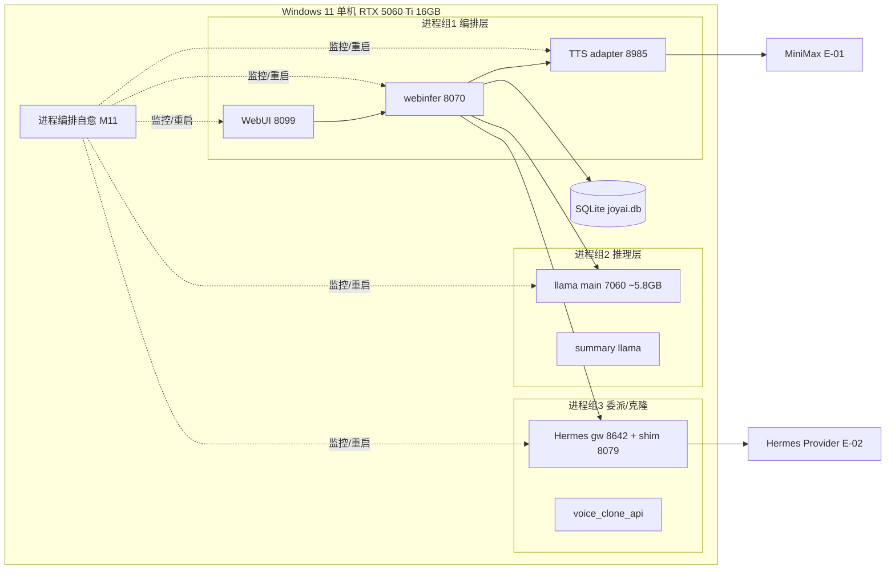

#### 5.4.2 拓扑要素清单

| 要素 | 取值 |
| --- | --- |
| 跨 Region 部署 | 否 |
| 跨 AZ 部署 | 否（单机） |
| 流量入口路径 | 浏览器 → localhost:8099（WebUI）→ 8070（webinfer） |
| 内部调用路径 | HTTP（OpenAI 兼容）+ 进程内（sherpa） |
| 数据库访问路径 | SQLite 本地文件连接 |

#### 5.4.3 故障域划分

| 故障域 | 影响范围 | 容错机制 | 预期 RTO |
| --- | --- | --- | --- |
| 单进程（llama_main/webui/...） | 单实例 | M11 自动重启 | ≤ 30s（P99） |
| 单卡 VRAM | 推理降级/OOM | 关非必要服务 + 降上下文（BD-03） | 秒级 |
| 整机 | 全部进程 | 手动重启 start-joyai.ps1 | ≤ 10min（数据 RTO） |

### 5.5 容量规划

#### 5.5.1 业务量预估

| 业务指标 | 当前值 | MVP 阶段值 | 生产阶段值 | 备注 |
| --- | --- | --- | --- | --- |
| 注册用户数 | 1（单用户本地） | 1 | 1（N2） | D5 单用户 |
| 并发对话 | 1 路 | 1 路 | 1~2 路 | 单卡限制 |
| 峰值 QPS（推理） | ~1 req/s | ~1 req/s | ~2 req/s | 每秒决策 |
| VRAM 峰值 | ~11.5GB | ≤ 11.5GB（V2） | ≤ 11.5GB | D40 §3 |
| 数据存量 | 会话级 | 本地 sqlite 数百 MB | 同左 | — |

#### 5.5.2 资源容量推算

| 资源 | 推算公式 | 当前配置 | 生产阶段配置 |
| --- | --- | --- | --- |
| VRAM | 进程组 VRAM 累加 | ~11.5GB / 16GB（留 4.5GB） | 同（不扩） |
| 内存 | 进程常驻 | ~4GB 系统内存 | 同 |
| SQLite | 会话/记忆条目 | 单库 ≤ 数百 MB | 同 |
| 磁盘 | 模型 + 日志 | GGUF ~数 GB + 日志 | 同 |

#### 5.5.3 扩容触发与路径

| 资源 | 扩容触发指标 | 扩容方式 | 扩容耗时 |
| --- | --- | --- | --- |
| VRAM | > 11.5GB | 关非必要服务 / 降上下文（BD-03） | 秒级 |
| 磁盘 | > 80% | 清理日志 / 归档会话 | 手动 |

> 多机扩容（K8s）为 O1，不在本期（完整版评估）。

#### 5.5.4 容量水位线

| 水位 | 阈值 | 动作 | 对开发的约束 |
| --- | --- | --- | --- |
| 健康水位 | VRAM ≤ 60% / 进程健康 | 无动作 | — |
| 预警水位 | VRAM 60-80% | 告警，评估关服务 | — |
| 危险水位 | VRAM > 80% | 自动降载（关非必要服务） | 限流联动 |
| 红线 | VRAM > 95% | 触发降级 / 强制重启非核心 | 与 §3.5.3 限流一致 |

**判定合格**：业务量预估含 MVP/生产；红线 → §3.5.3 限流 → §8.4 告警数值一致。

---

## 6. 网络架构

> **本章定位**：只承载对开发产生约束的网络结论。VPC/子网/CIDR 等运维细节见《系统部署文档》。

### 6.1 网络环境规划

| 网络环境 | 用途 | 说明 / 访问策略 |
| --- | --- | --- |
| 本地回路（localhost） | 主交互入口 | 浏览器 → 127.0.0.1:8099（WebUI），仅本机 |
| 内网（intranet） | 可选局域网访问 | 运维端可绑定内网 IP，需显式授权 |
| 公网（DMZ/WAN） | **N/A** | 禁止公网暴露（V4 基础 / R-04）；WebRTC/服务不绑 0.0.0.0 |

### 6.2 流量入口与南北向流量

#### 6.2.1 入口流量链路

| 组件 | 作用 | 部署位置 |
| --- | --- | --- |
| 浏览器（创作者） | 本地 WebUI 入口 | 本机 |
| WebUI 8099 | 前端 + 本地 HTTP 服务 | 本机 |
| webinfer 8070 | 单入口网关（ADR0006） | 本机 |

**入口决策（对开发的约束）**：

| 决策项 | 取值 | 对开发的约束 |
| --- | --- | --- |
| TLS 终结点 | 本地自签证书（D33），仅 localhost/内网 | 前端忽略 cert-error 或内网代理 TLS |
| 限流位置 | 业务自实现（§3.5.3 配置中心） | 对接 §3.5.3 限流红线 |
| 鉴权位置 | 本地单用户无 SSO（§7.2.1） | 仅暴露面绑定校验 |
| 真实客户端 IP | localhost（127.0.0.1） | 无需 X-Forwarded 处理 |

#### 6.2.2 出口流量

| 决策项 | 取值 | 对开发的约束 |
| --- | --- | --- |
| 出口方式 | 直连 MiniMax/Hermes HTTPS（E-01/E-02） | 仅语音上云，VL 推理不出本机（Q4） |
| 是否需要固定出口 IP | 否 | MiniMax/Hermes 按 Key 鉴权 |
| 出口白名单 | MiniMax API 域名 / Hermes 端点 | 新增外部依赖须登记 |
| 跨地域 / 跨云出口 | 公网 HTTPS（仅语音上云档） | 数据出境合规确认（U-03） |

### 6.3 内部互联（东西向流量）

| 决策项 | 取值 | 对开发的约束 |
| --- | --- | --- |
| 服务发现 | 固定 localhost:port（ADR0004 端口冻结） | 禁止硬编码 IP，用配置/环境变量 |
| 服务间通信协议 | HTTP（OpenAI 兼容）+ 进程内（sherpa） | 与 §3.5.4 超时重试基线对齐 |
| 内部 mTLS | 不启用（本机回路） | 暴露面收敛替代 |
| 跨服务调用幂等性 | 遵循 §3.5.2 幂等键传递 | Header 透传幂等键与 traceId（§8.3） |

**判定合格**：§6.1/§6.2/§6.3 决策项 100% 锁定；TLS 终结点/限流/鉴权与 §3.5/§7 一致；服务发现与通信协议锁定。

---

## 7. 安全设计

> **本章回答**：本系统在安全维度做了哪些机制选择、对应关键参数基线。完整 STRIDE 威胁建模归 G5（security-architect）。

### 7.1 架构安全全景

| 能力域 | 选用产品 / 机制 | 作用范围 | 是否启用 |
| --- | --- | --- | --- |
| 抗 DDoS | 不适用（本地无公网入口） | — | 不适用：无公网暴露（V4/R-04） |
| WAF | 不适用 | — | 不适用：无公网入口 |
| 防火墙 / 安全组 | Windows 防火墙（绑定 localhost/内网） | 主机 | 是（暴露面收敛） |
| 主机安全 | Windows Defender（既有） | 全部主机 | 是 |
| 容器安全 | 不适用 | — | 不适用：裸进程（Docker 留完整版 F14） |
| 数据安全审计 | 本地结构化日志（§8.2） | 关键操作 | 是（本地日志审计） |
| 密钥管理（KMS） | 隔离托管（.env gitignored / 隔离目录；Vault 完整版） | MiniMax Key | 是（MVP 基础）/ Vault 完整版 |
| 安全运营中心（SOC） | 不适用 | — | 不适用：本地单用户 |
| 堡垒机 | 不适用 | — | 不适用：本地单用户 |

### 7.2 业务安全架构

#### 7.2.1 用户认证

| 维度 | 取值 |
| --- | --- |
| 账号体系 | 本地单用户（无 SSO / IDP） |
| 登录方式 | 无登录态（本地单用户直接访问，暴露面绑定 localhost/内网） |
| 多因素认证（MFA） | 不启用（单用户本地） |
| 密码强度 | N/A（无账号体系） |
| 登录失败锁定 | N/A |
| Token 有效期 | N/A（无会话 Token） |
| 会话管理 | 无集中会话；对话态在 memory-store |

#### 7.2.2 数据安全

| 维度 | 取值 |
| --- | --- |
| 数据分级 | 本地单用户，不强制分级；音视频/对话为本地敏感数据 |
| 传输加密 | 本地回路 HTTP；自签证书（D33）仅 localhost/内网；外部 E-01/E-02 走 HTTPS |
| 存储加密 | SQLite 本地文件（磁盘加密可选，Windows BitLocker 建议） |
| 敏感字段清单 | MiniMax Key（凭证句柄隔离，不落库明文，V4/ADR0001）；音频参考不落库（仅引用） |
| 数据导出与共享 | 本地导出（可选）；不跨网络共享 |

**敏感字段处理策略表**：

| 字段 | 分级 | 存储策略 | 展示策略 | 导出策略 |
| --- | --- | --- | --- | --- |
| MiniMax Key | L3 | 隔离托管（C-05），不硬编码/不落库明文 | 掩码展示 | 禁止导出明文 |
| 参考音频 | L3 | 仅传引用句柄（clone_ref_handle），不存音频明文 | 不展示 | 禁止导出 |
| 对话/记忆 | L2 | SQLite 本地 | 本地展示 | 本地导出（可选） |

#### 7.2.3 密钥与凭证

| 维度 | 取值 |
| --- | --- |
| 存储方式 | 隔离托管：.env（gitignored）/ 隔离密钥目录（C-05）；Vault 留完整版 |
| 下发方式 | 进程启动读取环境变量；不内置常量 |
| 轮换策略 | MVP 手动轮换；完整版按 90 天基线（Vault 动态） |
| 红线 | 禁止入库 / 入代码 / 入配置文件明文；禁止跨环境共用密钥（V4） |

#### 7.2.4 审计日志

| 维度 | 取值 |
| --- | --- |
| 启用的日志类型 | 应用日志 / 接入日志 / 审计日志（本地） |
| 审计内容 | 谁（本地用户）、何时、对什么资源、做了什么、结果、来源 IP（localhost） |
| 不可篡改保障 | 本地文件 + 只读归档（最佳努力） |
| 保留期 | ≥ 1 年（合规建议，本地磁盘容量允许） |

#### 7.2.5 访问控制

| 维度 | 取值 |
| --- | --- |
| 权限模型 | 单用户本地工具，**不做 RBAC / 多租户隔离**（N2/D5）；暴露面绑定 localhost/内网作为唯一访问控制 |
| 多租户隔离 | **单租户本地工具，不做租户隔离**（§4.1 `tenant_id` 仅预留默认 1） |
| 越权防护 | 暴露面不绑 0.0.0.0；运维端仅 localhost/内网（C403001 越界拒绝） |
| 接口级权限 | 与 §3.5 调用契约对齐（本地单用户，无角色标签；仅暴露面校验） |

**判定合格**：§7.1 安全能力全景表无空白；§7.2 五项维度均给出本系统选择与关键基线，无「待定」。

---

## 8. 可观测设计

> **本章回答**：系统跑起来后如何知道它健康、出问题如何定位、用户体验是否达标。三大支柱：Metrics / Logs / Traces。

### 8.1 Metrics

#### 8.1.1 指标分层

| 指标层 | 示例 | 工具 |
| --- | --- | --- |
| 业务指标 | 对话轮次、决策分布（silence/response/delegate）、委派成功率、克隆注册数 | 进程级指标 + 结构化日志 |
| 应用指标 | RED：对话 Rate / Errors / Duration（P99） | 进程级埋点 |
| 中间件指标 | SQLite 写入 QPS / 慢查询、llama-server 推理时延 | 进程级埋点 |
| 资源指标 | USE：CPU / 内存 / **VRAM** / 磁盘 / 网络 | nvidia-smi + 系统指标 |

#### 8.1.2 关键指标 Dashboard 清单

| Dashboard 名 | 受众 | 核心指标 | 刷新频率 |
| --- | --- | --- | --- |
| 进程健康大盘 | 运维 / SRE | 11 进程状态 / 重启计数 / 心跳 | 5s |
| VRAM 水位大盘 | 运维 / SRE | 单卡 VRAM 占用 / 各进程 vram_mb / 水位线 | 5s |
| 交互延迟大盘 | 研发 / SRE | 端到端 P95/P99、KWS 唤醒延迟、TTS 合成时延 | 30s |
| 业务交互大盘 | 产品 / 业务 | 对话轮次、决策分布、委派成功率、记忆命中 | 1min |
| 容量与水位大盘 | SRE | VRAM/磁盘水位、限流触发次数 | 1min |
| 告警大盘 | On-call | 当前活跃告警（P0~P3） | 实时 |

> Dashboard ≥ 5 个（实际 6 个），满足硬指标。

### 8.2 Logs

#### 8.2.1 日志分级与去向

| 日志类型 | 级别 | 保存时间 | 日志去向 |
| --- | --- | --- | --- |
| 应用日志（业务） | INFO+ | 30 天热 + 本地归档 | 本地文件（结构化 JSON） |
| 应用日志（异常） | ERROR+ | 90 天热 + 本地归档 | 本地文件 + 实时告警 |
| 接入日志（WebUI/网关） | INFO+ | 30 天 | 本地文件 |
| 审计日志 | INFO+ | ≥ 1 年 | 本地只读归档 |
| 慢查询日志 | — | 30 天 | 本地文件 |

#### 8.2.2 结构化日志规范

```json
{
  "timestamp": "2026-07-20T10:00:00.000Z",
  "level": "INFO",
  "service": "webinfer",
  "instance": "webinfer-8070",
  "traceId": "W3C-TraceContext",
  "spanId": "abc",
  "userId": "local",
  "sessionId": "uuid",
  "module": "interaction-orchestrator",
  "event": "decision_routing",
  "msg": "response routed to TTS",
  "extra": { "decision_token": "response", "vram_mb": 5800 }
}
```

**硬性要求**：

| 要求项 | 内容 |
| --- | --- |
| 必含字段 | 所有日志必须含 `traceId` + `userId`（单租户无 tenantId，按裁剪指引改用 userId/sessionId） |
| 敏感字段 | 禁止打印 MiniMax Key / 音频明文（与 §7.2.2 联动） |
| ERROR 级别 | 必须含完整堆栈 + 业务上下文（session_id / process_key 等） |

### 8.3 Traces

| 项 | 取值 |
| --- | --- |
| 协议标准 | OpenTelemetry / W3C TraceContext（进程级，本地可降级为 traceId 透传） |
| 采样策略 | 默认 1% 采样；错误请求 100% 采样；慢请求（>1.2s）100% 采样 |
| 透传方式 | HTTP Header `traceparent` / `tracestate`；进程内透传 traceId |
| 关键 Span 命名 | `service.method` / `db.operation` / `ext.minimax_hermes.call` |
| 跨外部系统 | 调用 E-01/E-02 时透传 `traceId`（若支持），记录 `peer.service` |

**与时序图的关联**：§3.2 模块时序图要求标注 traceId 透传节点，本节是其落地规范。

### 8.4 告警体系

#### 8.4.1 告警分级

| 级别 | 适用场景 | 响应时间 | 通知方式 |
| --- | --- | --- | --- |
| P0 紧急 | 核心对话链路中断 / 关键进程自愈失败 | ≤ 5 min | 本地弹窗 + 日志 + IM（若配置） |
| P1 高 | 部分功能受影响（延迟劣化 / MiniMax 失效） | ≤ 15 min | 日志 + IM |
| P2 中 | 单点异常但有降级（委派失败 / 记忆失败） | ≤ 1 h | 本地日志 |
| P3 低 | 趋势性预警（重启次数超阈值 / VRAM 预警） | 工作时间 | 本地日志 |

#### 8.4.2 告警规则编排

| 编号 | 级别 | 触发条件 | 维度 | Owner | Runbook |
| --- | --- | --- | --- | --- | --- |
| AL-01 | P0 | 进程（llama_main/webinfer）崩溃且自动重启失败 | 进程健康 | `@运维/SRE` | 查日志→手动 `start-joyai.ps1`→查 VRAM/端口冲突 |
| AL-02 | P0 | VRAM > 11.5GB（OOM 风险） | 资源水位 | `@运维` | 关非必要服务（summary/voice_clone）→降上下文→BD-03 |
| AL-03 | P1 | 端到端 P99 > 1.2s 持续 5min | 接口延迟 | `@后端` | 查各段耗时（采集/推理/TTS）→定位瓶颈 |
| AL-04 | P1 | MiniMax API 调用失败 / Key 失效 | 外部依赖 | `@语音` | 查 Key 托管（C-05）→切本地 Cozy fallback（BD-02） |
| AL-05 | P2 | Hermes 委派失败 | 委派健康 | `@代理` | 主对话正常；查 gateway/shim 健康（BD-01） |
| AL-06 | P2 | memory-store 写入失败 | 记忆健康 | `@记忆` | 主对话正常；查 sqlite 完整性（BD-04） |
| AL-07 | P3 | 单进程重启次数 > 10/小时 | 进程稳定性 | `@运维` | 查崩溃根因（OOM/端口/依赖） |

**判定合格**：指标覆盖业务/应用/中间件/资源四层；告警映射到指标；P0/P1 有 Owner；Dashboard ≥ 5；日志含 traceId + userId；采样覆盖错误/慢请求；§5.3 SLA、§2.5.1 质量目标与告警阈值自洽。

---

## 附录：阶段内中间确认自检报告（协议 §2.4）

> 按 intermediate_confirmation 协议，在 §2/§3/§4/§5 完成后各做一次自检（§2.1 判定 + §2.3 反向验证 3 问）。本轮为「首轮全新产出」，上游已冻结边界（D4 + ADR0001~0007 + 高层 D1~D5 + MVP 范围），所有关键决策点均已被冻结文档明确选择，故四轮自检均判定「未命中触发标准」，未发起 `[中间确认]`。以下为各轮证据。

### 自检一（§2 业务架构完成后）

- **§2.1 方案分歧型判定**：未命中。① 业务域划分（7 域）与 DDD 映射模式（5 种）属应用架构内部设计，不影响下游 platform-architect（部署）/security-architect（安全）的产出边界；② 上游已冻结模块全景（高层 §6.2 共 12 模块）与业务域范围，不存在用户未冻结的竞争性方案需裁决。
- **§2.3 反向验证 3 问**：
  - Q1（返工成本）：若 3 月后推翻，返工范围 = 本文 §2.2 限界上下文表 + §3.2 模块映射（约 2 章），切换成本 ≈ 0.5 人周；因上游冻结边界未变，实际推翻概率低。**证据**：返工仅限业务架构描述层，模块清单继承高层 §6.2 不变。
  - Q2（可感知性）：用户/客户/监管**感知不到** DDD 映射这一内部设计；可感知的是功能（F1~F12）与延迟（N1），均已冻结。**证据**：映射不进入用户界面/合同/合规属性。
  - Q3（与原始诉求一致）：用户原始诉求（material_digest D1/D2）仅要求「模块可插拔 + 接口契约清晰 + 本地优先」，未指定 DDD 模式；本文 5 种模式仅为满足模板硬指标的内部实现选择，不改变产品形态。**证据**：引用 D1「外围 5 个可插拔服务」+ D41 松耦合。

### 自检二（§3 应用架构 / 模块 / 接口契约完成后）

- **§2.1 判定**：未命中。接口风格（RESTful/HTTP JSON）已被 ADR0006 + D4/D14 冻结（OpenAI 兼容 HTTP）；模块清单继承高层 §6.2；无竞争性未冻结方案。
- **§2.3 反向验证 3 问**：
  - Q1：返工范围 = §3.1~§3.5 接口契约与模块五段式（约 2 章），切换成本 ≈ 1 人周（主要影响 DTO/错误码表）。**证据**：接口路径风格锁定为 RESTful，与现有 webinfer 端点一致。
  - Q2：用户可感知「接口契约清晰、单服务可替换」（D41），本文仅细化不新增形态；无新功能/交互增减。**证据**：§3.5 错误码/幂等/限流均为开发约束，不改变用户操作。
  - Q3：原始诉求要求「接口契约边界定义」（高层 F12），本文细化之，未偏离。**证据**：高层 §6.1 F12 明确要求 system-architect 定义接口契约边界。

### 自检三（§4 数据库设计完成后）

- **§2.1 判定**：未命中。存储选型已冻结为 SQLite（ADR0005 v0.1 仅 sqlite）；表结构为新建轻量配置/状态表（角色/克隆/进程/会话/记忆/配置），不影响部署/安全下游产出边界。
- **§2.3 反向验证 3 问**：
  - Q1：返工范围 = §4.2 六张表 DDL（约 1 章），切换成本 ≈ 0.5 人周；且 v0.2 演进已预留（§4.2.21 注释）。**证据**：ADR0005 要求 sqlite 单一后端直至 v0.2 显式升级。
  - Q2：用户**感知不到**内部表结构；可感知的是「记忆可用/角色配置生效」（F6/F10），已冻结。**证据**：表结构不进入 UI/合同。
  - Q3：原始诉求未指定表结构（归 system-architect，高层 §4.2 边界）；本文新建表均为补齐 G3 缺口，未偏离。**证据**：material_digest G3「无会话/qa_history/用户配置等 DB schema 设计」→ 本文补齐。

### 自检四（§5 部署架构完成后）

- **§2.1 判定**：未命中。高可用模式（进程自愈 SPOF 防护，非 K8s 多副本）已被 D5（私有化单机、无对外 SLA）+ O1（K8s 留完整版）冻结；部署结论仅约束开发（容错/降级/限流），不重新裁决部署形态。
- **§2.3 反向验证 3 问**：
  - Q1：返工范围 = §5 部署约束结论（约 1 章），切换成本 ≈ 0.5 人周；物理拓扑/CI-CD 归 platform-architect，不受本文影响。**证据**：§5 仅给开发约束，节点规格归部署文档。
  - Q2：用户可感知「最佳努力可用性 + 进程自愈」（V1），已冻结；无新 SLA 承诺。**证据**：D5 明确「无对外 SLA（进程自愈最佳努力可用性）」。
  - Q3：原始诉求（D1「本地优先、数据不出本机」）与本文一致；单机进程自愈为既定方向。**证据**：D40 §8 故障域 + D5 部署形态。

**结论**：四轮自检均未命中协议 §2.1 / §2.2 任一触发标准，不发起 `[中间确认]`；所有关键决策点已被上游冻结文档覆盖，本文仅做下游细化设计。

---

## 附录：硬指标达标自检（G4 模板合规）

| 硬指标 | 达标 | 证据 |
| --- | --- | --- |
| 业务域 3~7 个 | ✅ | §2.1 共 7 个业务域 |
| DDD 上下文映射 5 种关系模式 | ✅ | §2.2.2 使用 Customer/Supplier + ACL + Shared Kernel + Conformist + Published Language |
| 模块设计五段式完整 | ✅ | §3.2 M1~M12 各含 .1~.5 五段 |
| 技术选型表每项版本号 + 选型理由 | ✅ | §3.1.5 含 llama.cpp GGUF IQ4_NL / sherpa-onnx v4 / MiniMax Speech 2.8 / Python 3.12 等 |
| 全局错误码 6 位格式 | ✅ | §3.5.1 格式 `A030001`（1 字母+5 数字） |
| 数据库表设计五段式完整 | ✅ | §4.2 六张表各含 元信息/结构/索引/DDL/清理 五段 |
| RPO/RTO 有具体数字 | ✅ | §4.3.2 / §5.3：RTO≤30s、RPO≤5min、数据 RTO≤10min |
| Dashboard ≥ 5 个 | ✅ | §8.1.2 共 6 个 Dashboard |
| Logs 必含 traceId（+tenantId 可换 userId/sessionId） | ✅ | §8.2.2 含 traceId + userId/sessionId |
| 告警 P0~P3 分级含 Owner + Runbook | ✅ | §8.4.2 AL-01~AL-07 均含 Owner + Runbook |
| 图示（系统上下文/模块图/主链路/自愈/委派时序） | ✅ | §3.1.1 / §3.1.2 / §3.2.M3.4 / M11.4 / M5.4 Mermaid |
| 裁剪章节注明（§4.4/§4.5/多租户/网络 N/A） | ✅ | §0 修订记录 + §4.1 + §6 |
