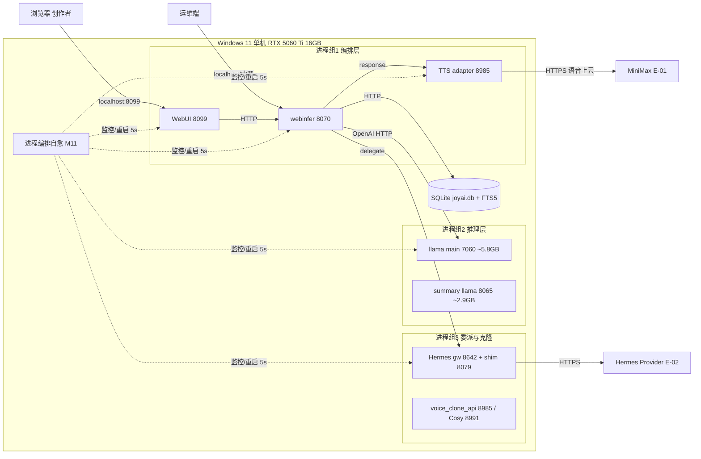

# JoyAI-VL-Interaction · 部署设计

> 本文档为《JoyAI-VL-Interaction 架构设计》核心产物之一，对应**部署设计**阶段（G5），与《安全设计》并行产出。
> 上游输入：《系统设计》（G4 已冻结，12 模块 / 6 张表 / RTO≤30s·RPO≤5min / 6 Dashboard / P0~P3 告警）、《高层架构设计》（G3 已冻结，D1~D5）、《资料摘要 material_digest.md》（G1 通过，D4 + ADR0001~0007）、《UserStory》（G4 通过）。
> 下游输出：本地单机可落地的环境与资源清单、部署拓扑、CI/CD、监控告警、应急回滚、安全合规基线、容量与成本方案。
> 设计立场：在已冻结架构（D4 + ADR0001~0007 + 高层 D1~D5 + 系统设计决策）基础上**冻结边界、补齐部署级设计**，不推倒重来；部署形态为**私有化本地 Windows 单机 + RTX 5060 Ti 16GB**，无 K8s / 多 AZ / 公网 VPC。

---

## 0. 元信息：修订记录

```yaml
标题: JoyAI-VL-Interaction - 部署设计 v0.2
版本: v0.2
状态: Reviewing   # Draft | Reviewing | Approved | Deprecated
创建日期: 2026-07-21
最后更新: 2026-07-21
作者: platform-architect (毕落地)
评审人:
  - team-lead (主理人)
  - 项目技术负责人
关联文档:
  上游输入:
    - 系统设计: 系统设计.md (G4 已冻结)
    - 高层架构设计: 高层架构设计.md (G3 已冻结)
    - 资料摘要: material_digest.md (G1 通过)
    - UserStory: UserStory.md (G4 通过)
  并行产出:
    - 安全设计: 待 security-architect 产出（威胁建模 / 权限策略）
```

| 版本 | 日期 | 作者 | 变更内容 | 评审状态 |
| --- | --- | --- | --- | --- |
| v0.1 | 2026-07-21 | platform-architect (毕落地) | 初稿：本地单机部署形态下的环境矩阵、六大资源清单、拓扑与高可用、CI/CD、监控告警、应急回滚、安全合规基线、容量与成本 | Draft |
| v0.2 | 2026-07-21 | platform-architect (毕落地) | 消费 security-architect G5 权威项 1~3：防火墙默认 deny + 端口绑定、5 类密钥分级 + NTFS ACL + 轮转 90/180 天、审计 floor ≥90 天 + 6 字段；附录 A 第 2/4/5/6 项置为已确认 | Reviewing |

> **裁剪说明（按模板「按需裁剪」规则 + 本地单机形态）**：
> - 公网 VPC / 子网 / CIDR / 跨 AZ / 跨 Region 灾备：标注 **N/A - 单机本地**，无公网入口（V4 基础 / R-04）。
> - 容器化 / K8s 编排：以 **PowerShell 编排（start/stop-joyai.ps1）** 替代，保留模板八章结构与 8 阶段流水线语义填真实值；Docker Compose 留完整版（F14）。
> - WAF / DDoS / 堡垒机 / SOC：标注 N/A（本地无公网暴露面，security-architect 在 G5 安全设计中确认）。
> - 云资源清单在本机语境下等价表述为「主机 / 进程 / 本地存储 / 本地网络资源」，六类资源（计算 / 存储 / 网络 / 中间件 / 安全 / 可观测）全部实填，无整表留空。
> - 章节序号连续（§1~§8）；不适用的子项已在对应表中标注 N/A，不删除顶层章节（硬指标覆盖需要）。

---

## 1. 引言

### 1.1 适用范围与部署形态

- **系统范围**：JoyAI-VL-Interaction 实时视觉-语言交互系统，核心模型 JoyAI-VL-8B 每秒自主决策 `silence` / `response` / `delegate`（`silence`=沉默、`response`=说话、`delegate`=委派），外围 5 个可插拔服务（推理 llama-server / WebUI / ASR / TTS / background-agent）。
- **部署形态**：**私有化本地**，目标硬件 **Windows 11 + 单卡 NVIDIA RTX 5060 Ti 16GB**（VRAM 预算 ~11.5GB，预留 4.5GB 给游戏）；**PowerShell 编排**（start-joyai.ps1 / stop-joyai.ps1），Python 3.12；无多租户（单用户本地，N2）；无对外 SLA（进程自愈最佳努力可用性，D5）。
- **不适用范围**：多节点 K8s 集群化 / 多机 HA（O1，完整版评估）、全云档 OpenAI Realtime 主路径（O2）、跨会话长期记忆 v0.2（O3）、完整 STRIDE 安全建模（O5，归 security-architect）。
- **本文档覆盖**：环境矩阵、六大资源清单、部署拓扑与高可用、CI/CD 与发布策略、监控告警、应急回滚、安全合规基线（密钥托管 / 暴露面收敛）、容量与成本。

### 1.2 名词与缩写

| 名词 | 英文 / 缩写 | 含义 |
| --- | --- | --- |
| 决策 token | decision token | 模型每秒输出的三类控制字面量：`silence` / `response` / `delegate`，由 webinfer 在送 TTS 前剥离 |
| VLM | Vision-Language Model | 视觉-语言模型，llama-server 7060 承载 JoyAI-VL-8B GGUF IQ4_NL |
| VRAM | Video RAM | 显存；单卡预算 ~11.5GB / 16GB（D40 §3） |
| webinfer | 实时交互编排服务 | 单入口网关 8070，OpenAI 兼容 HTTP，决策 token 编排 + 角色 prompt 注入（ADR0006） |
| llama-server | VLM 推理服务 | 7060，GGUF IQ4_NL，JoyAI-VL-8B 推理底座（D40 §6） |
| Hermes | 智能委派底座 | shim 8079 → gateway 8642，/v1/solve 协议转换（D24） |
| memory-store | 记忆管理服务 | 8996，sqlite FTS5 骨架 v0.1（ADR0005） |
| WebRTC | Web Real-Time Communication | 浏览器实时音视频，WebUI 8099 链路（D40 §0） |
| SPOF | Single Point of Failure | 单点故障；webinfer(8070) 与 llama-server main(7060) 为两层 SPOF（D10 / D40 §8） |
| 进程自愈 | process self-heal | 核心进程崩溃后自动重启，P99 ≤ 30s（V1） |
| GGUF IQ4_NL | — | llama.cpp imatrix 量化格式，单卡消费级 GPU 友好（D40 §6） |
| RTO / RPO | Recovery Time / Point Objective | 恢复时间目标 / 数据丢失容忍（进程 RTO≤30s，数据 RPO≤5min） |
| L1~L4 | 配置层级 | 代码内 / 配置中心 / 环境变量 / Secret（§4.4） |
| C-0x | 云组件 ID | 系统设计 §3.1.3 组件清单（C-01 SQLite … C-06 可观测） |

---

## 2. 环境与资源清单

### 2.1 环境矩阵

> 本地单机形态：dev / int / uat / prod **同机不同目录**隔离（无独立集群 / VPC）。prod 为常驻生产；其余为同机目录级隔离的开发 / 联调 / 验收实例。网络访问统一收敛到 localhost / 内网（禁止公网，R-04）。

| 环境 | 用途 | 集群隔离 | 数据 | 网络访问 |
| --- | --- | --- | --- | --- |
| dev | 开发自测（feature 分支） | N/A - 单机目录级隔离（独立 venv + 项目目录） | 模拟数据（本地 sqlite 临时库） | localhost |
| int | 联调（develop 分支） | N/A - 单机目录级隔离（独立目录） | 模拟数据 | localhost |
| uat | 预发 / 验收（release 候选） | N/A - 单机目录级隔离，仿生产配置 | 仿生产（本地 sqlite，可导入样例会话） | localhost + 内网（运维端，可选） |
| prod | 生产本地常驻（main 分支） | N/A - 单机独立目录，单卡 RTX 5060 Ti 16GB | 真实数据（本地 sqlite joyai.db） | localhost + 内网（运维端，可选） |

**环境策略补充**：

- 四环境共享同一台 Windows 主机与同一张 GPU；通过**目录 + Python venv + 端口偏移（可选）**实现隔离，避免相互抢占 VRAM。
- prod 默认启动计划仅 7060 / 8070 / 8099 / 8985（ADR0004）；全 11 进程计划为容量目标（VRAM ~11.5GB）。
- 数据不跨环境共享；prod 数据禁止回灌 dev / int（避免密钥 / 会话污染）。

### 2.2 云资源清单（本地单机资源清单）

> 本地单机语境下，「云资源」等价于「主机 / 进程 / 本地存储 / 本地网络」资源。六类（计算 / 存储 / 网络 / 中间件 / 安全 / 可观测）全部实填。

#### 2.2.1 计算资源

| 资源编号 | 类型 | 产品 | 资源 ID | 名称 | 规格 | 数量 | 环境 | 复用 / 新建 | HA 方案 | 用途 |
| --- | --- | --- | --- | --- | --- | --- | --- | --- | --- | --- |
| R-C-001 | 物理主机 | Windows 11 + CPU 8 核+ | host-win11 | Windows 11 单机 | 系统内存 ≥32GB（常驻 ~4~6GB）；CPU 8 核+ | 1 台 | 全环境 | 复用（现有） | 无（单机） | 全部进程宿主 |
| R-C-002 | GPU | NVIDIA RTX 5060 Ti 16GB | gpu-5060ti | 推理显卡 | 16GB VRAM（预算 11.5GB） | 1 张 | 全环境 | 复用（现有） | 无（单卡） | VLM 推理 + 语音编解码 |
| R-C-003 | 进程 | llama-server | proc-llama-main | VLM 主推理 | VRAM 5.8GB | 1 | prod | 复用（现有） | M11 自动重启 | 多模态决策推理（SPOF） |
| R-C-004 | 进程 | llama-server | proc-summary | 摘要推理 | VRAM 2.9GB | 1 | prod | 复用（现有） | M11 自动重启 | 每 100 帧中期摘要 |
| R-C-005 | 进程 | whisper.cpp | proc-whisper | 本地 ASR | VRAM 0.7GB | 1 | prod | 复用（现有） | M11 自动重启 | 语音识别（可选） |
| R-C-006 | 进程 | CozyVoice / voice_clone | proc-cosy | 本地 TTS fallback | VRAM 1.1GB | 1 | prod | 复用（现有） | M11 自动重启 | MiniMax 失败本地 fallback |
| R-C-007 | 进程 | voice_clone_api | proc-vc-api | 声音克隆服务 | VRAM 0.2GB | 1 | prod | 复用（现有） | M11 自动重启 | Rapid Clone 注册（8985） |
| R-C-008 | 进程 | Hermes gateway | proc-hermes-gw | 委派网关 | VRAM 0.2GB | 1 | prod | 复用（现有） | M11 自动重启 | 严格隔离委派（8642） |
| R-C-009 | 进程 | Hermes shim | proc-hermes-shim | 委派适配 | VRAM 0.15GB | 1 | prod | 复用（现有） | M11 自动重启 | /v1/solve 协议转换（8079） |
| R-C-010 | 进程 | webinfer | proc-webinfer | 实时交互编排 | RAM 0.1GB | 1 | 全环境 | 复用（现有） | M11 自动重启 | 单入口网关（8070，SPOF） |
| R-C-011 | 进程 | tts_adapter | proc-tts-adapter | TTS 适配 | RAM 0.08GB | 1 | prod | 复用（现有） | M11 自动重启 | MiniMax ACL（8992） |
| R-C-012 | 进程 | asr_adapter | proc-asr-adapter | ASR 适配 | RAM 0.08GB | 1 | prod | 复用（现有） | M11 自动重启 | 流式转写（8994） |
| R-C-013 | 进程 | WebUI | proc-webui | 创作者交互端 | RAM 0.15GB | 1 | 全环境 | 复用（现有） | M11 自动重启 | WebRTC 前端（8099） |

> **VRAM 预算核算**：R-C-003~R-C-009 显存占用合计 ≈ 5.8+2.9+0.7+1.1+0.2+0.2+0.15 = 11.05GB，加 R-C-010~R-C-013 系统内存 ~0.66GB，整体逼近 11.5GB 预算上限（D40 §3，V2）。预留 4.5GB 给游戏（D40 §3）。

#### 2.2.2 存储资源

| 资源编号 | 类型 | 产品 | 资源 ID | 名称 | 规格 | 容量 | 环境 | 复用 / 新建 | HA 方案 | 备份策略 |
| --- | --- | --- | --- | --- | --- | --- | --- | --- | --- | --- |
| R-S-001 | 本地数据库 | SQLite 3 | sqlite-joyai | 主库 joyai.db | 单文件 | ≤ 数百 MB | 全环境 | 复用（新建 6 表） | 无 HA（单机） | 本地文件复制 7 天滚动 + 冷备 |
| R-S-002 | 模型文件 | GGUF IQ4_NL | gguf-joyai-vl | JoyAI-VL-8B + mmproj | 单文件 | 预留 20GB（实占 ~5~6GB） | prod | 复用（现有） | 模型文件副本 | 手动备份模型目录 |
| R-S-003 | 日志目录 | 本地文件系统 | log-dir | 结构化日志 + 审计 | 目录 | 滚动（应用 30d / 审计 ≥1y） | 全环境 | 新建 | 本地冗余（可选 U 盘） | 只读归档（审计） |
| R-S-004 | 密钥目录 | 隔离目录（C-05） | secret-dir | MiniMax Key 隔离托管 | 目录 | KB 级 | prod | 新建（MVP） | 文件权限 + gitignore | 不备份明文（仅重建） |

#### 2.2.3 网络资源

| 资源编号 | 类型 | 产品 | 资源 ID | 名称 | 规格 | 环境 | 复用 / 新建 | 用途 |
| --- | --- | --- | --- | --- | --- | --- | --- | --- |
| R-N-001 | 回环网络 | localhost 127.0.0.1 | loopback | 主交互回路 | 127.0.0.1 | 全环境 | 复用（OS） | 浏览器 → WebUI 8099 → webinfer 8070 |
| R-N-002 | 内网 NIC | 以太网 / Wi-Fi 网卡 | intranet-nic | 可选运维访问 | 内网 IP（如 192.168.x.x） | prod / uat | 复用（OS） | 运维端内网可达（需显式授权） |
| R-N-003 | 主机防火墙 | Windows Defender 防火墙 | win-fw | 暴露面收敛 | 默认 deny inbound（权威项 1） | 全环境 | 复用（OS） | 仅放行 8099(localhost)/8070(localhost·内网)；内部端口 7060/8985/8079/8642/8996 仅绑 127.0.0.1；出站默认 deny 仅放行 E-01/E-02:443 |

> **无公网资源**：本机不分配公网 IP、不绑定 0.0.0.0、不建 VPC / 子网 / CIDR（V4 基础 / R-04）。唯一跨网络流量为出向访问 MiniMax / Hermes（HTTPS，仅语音上云）。

#### 2.2.4 中间件与平台服务

| 资源编号 | 类型 | 产品 | 资源 ID | 名称 | 规格 | 环境 | 复用 / 新建 | HA 方案 | 用途 |
| --- | --- | --- | --- | --- | --- | --- | --- | --- | --- |
| R-M-001 | VLM 推理引擎 | llama.cpp / llama-server（GGUF IQ4_NL） | llama-server | VLM 推理底座 | 单卡 ~5.8GB VRAM | prod | 复用（现有） | M11 自动重启 | 多模态决策推理 |
| R-M-002 | 嵌入式存储 | SQLite 3（FTS5） | sqlite-engine | memory-store 后端 + 主库 | 单文件 | 全环境 | 复用（新建） | 无 HA | 记忆 / 会话 / 配置 |
| R-M-003 | 健康存储 | SQLite（t_process_health） | proc-health-store | 进程自愈状态 | 11 进程行 | 全环境 | 新建 | 无 HA | 心跳 / 重启计数 |
| R-M-004 | 流式 / ASR | WebRTC + 进程内 sherpa-onnx v4 | webrtc-sherpa | 采集 / KWS / ASR | 1fps 视频 + 音频 | 全环境 | 复用（现有） | 进程内 | 采集与唤醒 |

#### 2.2.5 可观测资源

| 资源编号 | 类型 | 产品 | 资源 ID | 名称 | 规格 | 环境 | 复用 / 新建 | 承载可观测维度 |
| --- | --- | --- | --- | --- | --- | --- | --- | --- |
| R-O-001 | 指标采集 | nvidia-smi + psutil + 自埋点 | metrics-agent | 进程级指标 | 11 进程指标 + VRAM | 全环境 | 新建（MVP 轻量） | 资源 USE / 应用 RED / 业务指标 |
| R-O-002 | 日志 | 结构化 JSON 文件 | log-agent | 结构化日志 | 按级别分级 | 全环境 | 新建 | 应用 / 接入 / 审计日志（traceId + userId） |
| R-O-003 | 大盘 | 本地静态页 / 轻量 server（Grafana 完整版） | dashboard | 6 个 Dashboard | 5s~1min 刷新 | prod | 新建 | 进程健康 / VRAM / 延迟 / 业务 / 容量 / 告警 |
| R-O-004 | 告警引擎 | 本地规则 + 弹窗 / IM | alert-engine | 告警与通道 | P0~P3 | prod | 新建 | 活跃告警路由 + 升级 |

> **日志保留期（草案，待 security-architect G5 确认）**：应用 INFO 30 天热 + 归档；应用 ERROR 90 天热 + 归档；接入日志 30 天；审计日志 ≥ 1 年（本地只读归档）。详见 §7.3 与附录 A 第 5 项。

#### 2.2.6 安全资源

| 资源编号 | 类型 | 产品 | 资源 ID | 名称 | 规格 | 环境 | 复用 / 新建 | HA 方案 | 用途 |
| --- | --- | --- | --- | --- | --- | --- | --- | --- | --- |
| R-Sec-001 | 主机防火墙 | Windows Defender 防火墙 | win-fw-sec | 暴露面收敛 | 默认 deny inbound（权威项 1） | 全环境 | 复用（OS） | 主机级 | 默认 deny；入站仅 8099/8070，内部端口绑 127.0.0.1，出站默认 deny 仅 E-01/E-02:443（R-04） |
| R-Sec-002 | 密钥托管 | 隔离 .env / 隔离密钥目录（C-05，NTFS ACL 仅当前用户+SYSTEM）；Vault 完整版 | isolated-vault | 5 类密钥隔离托管（权威项 2） | 5 类 | prod | 新建（MVP） | 文件权限 + NTFS ACL | 不硬编码 / 不落库明文（V4 / ADR0001）；5 类分级 + 轮转 90/180 天 |
| R-Sec-003 | 审计日志 | 本地只读归档 | audit-log | 操作审计 | ≥ 1 年 | prod | 新建 | 本地 | 谁 / 何时 / 资源 / 动作 / 结果 |
| R-Sec-004 | TLS 证书 | 自签证书 | self-signed-crt | WebUI localhost/内网 TLS | 本地 CA | 全环境 | 新建 | 主机级 | WebRTC / HTTPS 本地加密 |
| R-Sec-005 | WAF / DDoS | N/A | N/a | 无公网入口 | — | — | N/A | N/A | 本地无公网暴露面，WAF 不适用（待 security-architect G5 确认） |

> **安全资源说明**：KMS / Vault 选型由 platform-architect 确认（隔离 .env / 密钥目录，Vault 留完整版）；**密钥分级、轮转周期、WAF / 安全组规则已按 security-architect G5 安全设计权威项确认**（重叠区权威方分配表）。本表已消费安全侧权威项 1~3，6 项 G5 对齐点见附录 A（第 2/4/5/6 项已确认）。

### 2.3 复用资源清单

| 复用资源 ID | 原业务方 | 余量评估 | 隔离方式 |
| --- | --- | --- | --- |
| R-C-001 / R-C-002（主机 + GPU） | 现有架构（D40 §0） | VRAM 余量 4.5GB（游戏预留）；系统内存余量 ≥26GB | 进程级隔离（同机目录） |
| R-M-001（llama-server 7060） | 现有推理服务（D4 §拓扑） | VRAM 5.8GB 已占，余量紧张 | 单进程 SPOF，M11 监控重启 |
| R-M-002（SQLite / memory-store 8996） | 现有记忆服务（D9 / D19） | 单库 ≤ 数百 MB，余量充足 | 单文件，v0.1 仅 sqlite |
| R-C-010（webinfer 8070） | 现有 webinfer（D10 / D14） | RAM 0.1GB，余量充足 | 单进程 SPOF，M11 监控重启 |
| R-N-001（localhost） | 操作系统 | 充足 | 回环隔离，无外暴露 |
| R-Sec-001（Windows 防火墙） | 操作系统 | 充足 | 主机级策略 |

> **字段说明**：
> - **复用资源 ID**：引用 §2.2 各资源编号。
> - **原业务方**：原 Owner（现有架构 / 操作系统）。
> - **余量评估**：基于 D40 §3 进程组 VRAM 拆分与系统设计 §5.5 容量推算。
> - **隔离方式**：本地单机以进程 / 目录级隔离替代云上的命名空间 / VPC / 账号隔离。

---

## 3. 部署拓扑与高可用设计

### 3.1 物理拓扑

#### 3.1.1 物理拓扑图



#### 3.1.2 拓扑要素清单

- 跨 Region 部署：否（单机本地）。
- 跨 AZ 部署：否（单卡单机，无多 AZ）。
- 流量入口路径：浏览器 → localhost:8099（WebUI）→ 8070（webinfer，ADR0006 单入口）。
- 内部调用路径：HTTP（OpenAI 兼容）+ 进程内（sherpa KWS/ASR）。
- 数据库访问路径：SQLite 本地文件连接（joyai.db）。
- 出口路径：仅 MiniMax / Hermes HTTPS（语音上云，VL 推理不出本机，Q4）。

### 3.2 流量与网络链路（连通视图）

#### 3.2.1 流量入口链路

| 组件 (R-xx) | 协议 - 端口 | TLS 终结 | 作用 |
| --- | --- | --- | --- |
| 浏览器 → WebUI（R-C-013 / R-N-001） | HTTP / WebRTC - 8099 | 自签证书（localhost/内网，R-Sec-004） | 创作者实时交互入口 |
| 运维端 → webinfer（R-C-010） | HTTP - 8070（/api/ops/*） | 否（内网回路） | 启停 / 监控 / 安全配置 |
| webinfer 8070（R-C-010） | HTTP - 8070 | 否 | 单入口网关（ADR0006），对外唯一 LLM 入口 |

> **入站默认 deny（权威项 1）**：入口仅绑定 127.0.0.1 / 内网；不绑定 0.0.0.0（R-04 / C403001 越界拒绝）。仅上表 8099(localhost) / 8070(localhost·内网) 入站放行；内部端口 7060 / 8985 / 8079 / 8642 / 8996 仅绑 127.0.0.1 禁止入站。公网入口：**N/A**。

#### 3.2.2 内部互联链路

| 项 | 说明 |
| --- | --- |
| 服务发现 | 固定 localhost:port（ADR0004 端口冻结），环境变量 / 配置注入；禁止硬编码 IP |
| 服务间协议 | HTTP（OpenAI 兼容）+ 进程内（sherpa KWS/ASR） |
| mTLS | 不启用（本机回路，以暴露面收敛替代；完整版可选） |
| 数据库连接 | 应用 → SQLite 本地文件（joyai.db）直连，无 ProxySQL |
| 缓存连接 | N/A（无 Redis，进程内字典满足限流 / 幂等计数，ADR0005） |
| MQ 连接 | N/A（无消息队列，进程内事件 / 发布语言） |
| 幂等 / 链路追踪 | Header 透传 `X-Idempotency-Key` 与 `traceparent`（§8.3） |
> **端口绑定（权威项 1）**：全部内部 / 适配服务（含 7060 / 8065 / 8985 / 8992 / 8994 / 8079 / 8642 / 8996）固定绑 127.0.0.1 仅本机进程间，禁止入站（默认 deny inbound）。 |

#### 3.2.3 跨网络互联

| 互联类型 | 通道 | 带宽 | 加密 | 用途 |
| --- | --- | --- | --- | --- |
| 跨主机 / 跨 Region（灾备） | N/A | N/A | N/A | 单机本地，无跨网络灾备（O1 完整版评估） |
| 出向 - MiniMax（E-01） | 公网 HTTPS（REST） | 按宽带上行 | TLS + Key 鉴权 | 仅 TTS / 克隆 / 可选 ASR（数据出境合规 U-03） |
| 出向 - Hermes（E-02） | 公网 HTTPS（REST） | 按宽带上行 | TLS + Key 鉴权 | 严格隔离委派 /v1/solve |

> **流量管控（已按安全侧权威项 1 确认）**：默认 deny inbound + outbound。入站仅放行 8099(localhost) / 8070(localhost·内网)；内部端口仅绑 127.0.0.1。出站默认 deny，仅放行 MiniMax `E-01` 与 Hermes `E-02` 的 HTTPS 443（防数据外泄与 C2 回连）。WAF 不适用（无公网，R-Sec-005）。详见附录 A 第 2 / 6 项。

### 3.3 高可用与故障容错

#### 3.3.1 故障域划分

| 故障域 | 影响范围 | 容错机制 | 预期 RTO |
| --- | --- | --- | --- |
| 单进程（llama_main / webinfer / WebUI …） | 单实例 | M11 自动重启（restart:unless-stopped） | ≤ 30s（P99，对齐 V1） |
| 单卡 VRAM | 推理降级 / OOM 风险 | 关非必要服务 + 降上下文（BD-03） | 秒级 |
| 单主机（整机） | 全部 11 进程 | 手动 start-joyai.ps1 全量拉起 | ≤ 10min（数据 RTO，§4.3.2） |
| 跨主机 / 跨 Region | 全部（无此能力） | N/A - 单机无此层级 | N/A（O1 完整版评估） |

> **可用性来源拆分**：
> - **进程自愈（restart:unless-stopped）**：11 进程崩溃自动重启，责任方研发团队（M11）。
> - **本系统自身保障**：业务容错 / 降级（BD-01~BD-04），责任方研发团队。
> - **外部依赖（E-01 / E-02）故障**：熔断 / 降级 / 本地 fallback（CozyVoice），责任方研发团队。
> - 无云厂商 SLA 兜底（本地单机，最佳努力可用性，D5）。

#### 3.3.2 负载均衡

- 类型：无（单机 localhost 直连，无 LB / 无多副本）。
- 健康检查路径：`/health`（各服务）。
- 健康检查频率：5s（M11 监控器）。
- 失败阈值：连续 3 次失败标记不健康。
- 恢复阈值：连续 2 次成功标记健康。
- 会话保持：N/A（无 LB）。

#### 3.3.3 健康检查配置

| 服务 | 健康检查路径 | 频率 | 失败阈值 | 连续成功阈值 | 说明 |
| --- | --- | --- | --- | --- | --- |
| webinfer 8070 | `/health` | 5s | 3 | 2 | 单入口网关（SPOF） |
| llama-server 7060 | `/health` | 5s | 3 | 2 | 唯一 SPOF，崩溃即全瘫（D40 §8） |
| WebUI 8099 | `/health` 或进程存活 | 5s | 3 | 2 | 前端 |
| memory-store 8996 | `/health` | 5s | 3 | 2 | sqlite 后端 |
| Hermes shim 8079 / gw 8642 | `/health` | 5s | 3 | 2 | 委派失败主对话正常 |
| TTS / voice_clone 8985 | `/health` | 5s | 3 | 2 | 失败切本地 Cozy |

#### 3.3.4 弹性伸缩配置

- 触发指标：N/A（单机固定进程组，无副本伸缩）。
- 扩容阈值：N/A（VRAM 已满预算，扩容方向为关非必要服务 / 降上下文，见 §8.1.3）。
- 缩容阈值：N/A。
- 副本区间：单实例（min 1 / max 1）。
- 冷却时间：N/A。

#### 3.3.5 容灾切换配置

- 容灾级别：单 AZ（单机本地）。
- 故障切换 RTO：进程重启 RTO ≤ 30s（P99，对齐 V1）；数据恢复 RTO ≤ 10min（§4.3.2）。
- 跨 Region 数据同步策略：N/A（无跨区）。
- 整机恢复：stop-joyai.ps1 优雅退出 → 替换 joyai.db（如有损）→ start-joyai.ps1 全量拉起（依赖顺序：voice_clone → tts → webinfer → hermes → webui，D40 §4）。

---

## 4. 部署流程

### 4.1 代码仓库与分支

| 项 | 规范 / 值 | 说明 |
| --- | --- | --- |
| 代码仓库地址 | 本地 Git 仓库（JoyAI-VL-Interaction，开源 Apache 2.0） | 单机开发，亦可推送到私有 / 公共远程 |
| 分支管理 | main（生产）/ release（验收）/ develop（联调）/ feature/*（开发） | 四环境对应分支（§2.1） |
| 合并规范 | feature → develop（PR + 173 测试全绿）；develop → release（验收）；release → main（人工审批） | 修复 D12 🔴 pyproject 打包缺陷后生效 |
| 标签规范 | 语义化版本 `vX.Y.Z`（如 v3.38）；Git Tag 作为回滚锚点 | 每次发布打 Tag，对应制品目录 |

### 4.2 流水线（CI / CD）

> 本地单机以 PowerShell + 本地 Git + pytest 实现 8 阶段流水线语义；无容器注册表，制品为本地发布包（zip / whl）+ 模型清单。

| 阶段 | 触发条件 | 关键动作 | 失败处理 |
| --- | --- | --- | --- |
| 1 构建 | 自动（push / PR） | git pull → 创建 venv → pip install -r requirements → pytest 单元测试（webui 107 + webinfer 66 = 173 测试） | 阻断后续阶段 |
| 2 代码扫描 | 构建后 | flake8 / pylint 规范 + **硬编码密钥扫描**（secretlint / grep，阻断 MiniMax Key 明文） | 不达标阻断 |
| 3 安全扫描 | 构建后 | pip-audit（SCA 依赖漏洞）+ bandit（SAST） | 高危阻断 |
| 4 集成测试 | 合并到 develop | 接口契约测试（OpenAI 兼容端点 mock llama-server）+ 173 测试全绿 | 阻断后续阶段 |
| 5 制品打包 | 构建 / 测试通过 | 构建发布包（zip / whl）+ 模型清单 + start/stop-joyai.ps1 打包；修复 D12 🔴（补齐 13 模块 py-modules）；打 Git Tag | 失败重试 |
| 6 部署集成环境 | Package 完成 | 自动解包到 dev / int 目录 → install-windows.ps1 → 启动依赖 → 冒烟（/health 全绿） | 失败回滚到上一版本目录 |
| 7 部署测试环境 | 手动触发 | 部署到 uat 目录 → 冒烟 + 手动验收（11 进程健康 + 主链路走通） | 失败回滚到上一版本 |
| 8 部署生产环境 | 人工审批（Owner 1 人） | 按发布策略就地滚动重启（先停旧进程组，再起新，单用户无多副本）→ 灰度校验 /health | 按回滚 SOP 实施回滚（§6.1） |

### 4.3 构建产物与制品管理

| 配置项 | 配置值 / 规则 | 说明 |
| --- | --- | --- |
| 产物类型 | Python wheel / 源码发布包（zip）+ PowerShell 编排脚本 | 非容器镜像（单机本地） |
| 制品仓库 | 本地制品目录（如 `D:\AI\workspace\releases\vX.Y.Z`）；可选内网共享 | 替代云镜像仓库 |
| 制品命名 | `joyai-vl-${git_tag}-${commit_sha_short}.zip` | 对应 §4.1 标签规范 |
| 制品保留期 | 最近 10 个版本（滚动）；重要版本长期 | 回滚锚点 |
| 制品溯源 | 包内 `MANIFEST.json` 含 git-commit / build-time / pipeline-id | 便于反查源码 |
| 签名与校验 | 发布包 SHA256 校验和（PowerShell `Get-FileHash`）；Vault / cosign 留完整版 | MVP 用哈希校验防篡改 |

### 4.4 配置管理

> 配置中心选型：进程内 + 本地 SQLite（t_config_item）+ 隔离 .env / 密钥目录。分四级，与系统设计 §5.1 一致。

| 层级 | 存放位置 | 适用内容 | 变更生效 | 对部署的约束 |
| --- | --- | --- | --- | --- |
| L1 代码内 | 代码仓库 | 默认值、枚举、决策 token 字面量（`silence` / `response` / `delegate`） | 重新部署 | 禁止写入：环境差异、密码、地址 |
| L2 配置中心 | `t_config_item`（SQLite） | 业务开关、限流阈值、降级开关 | 热更新（监听 + 回调） | 必须实现变更回调；变更幂等 |
| L3 环境变量 / .env | 隔离托管文件（gitignored） | MiniMax Key、端口、模型路径 | 重启进程 | 启动失败 fail-fast，禁止跑默认值 |
| L4 Secret | 隔离密钥目录（C-05） | MiniMax Key 等敏感凭证 | 动态读取 | 禁止落日志、禁止入代码（V4 / ADR0001） |

### 4.5 发布策略

#### 4.5.1 发布方式

> 全系统采用 **就地滚动重启（in-place rolling restart）**：单用户单机、无多副本，故不采用蓝绿 / 金丝雀多副本；完整版可选 Docker Compose 健康重启（F14）。单用户无需多批次灰度，发布窗口内「先停旧进程组 → 再起新 → 校验 /health 全绿」即完成。

| 模块 | 发布方式 | 说明 |
| --- | --- | --- |
| 全部模块（M1~M12） | 就地滚动重启 | 单用户本地，停旧起新；依赖顺序见 D40 §4 |
| 模型（GGUF） | 停机替换 | 换模型需停 llama-server，属计划内窗口 |

#### 4.5.2 发布标准流程

- **首次发布标准流程（资源初始化）**：install-windows.ps1 → 下载 GGUF 模型 → setup-*.ps1 → 填 .env（Key）→ 填角色 prompt → start-joyai.ps1 -Mode default → 浏览器 8099 验收。
- **常规迭代发布流程**：CI 打 Tag → 部署到 uat 验收 → 人工审批 → 停旧进程组 → 解包新版本 → 起新进程组 → /health 全绿 → 主链路冒烟。
- **资源变更流程**：VRAM / 端口变更走配置中心（L2/L3）；DDL 变更走 sqlite 迁移脚本（可回滚优先，见 §6.1.3）。

#### 4.5.3 灰度路径与观测窗口

- 灰度批次：单用户本地无多批次；发布后观测窗口 **≥ 10 分钟**，确认 11 进程 /health 全绿、端到端 P99 ≤ 1.2s、VRAM ≤ 11.5GB。
- 放量条件：观测窗口内无 P0 / P1 告警、无 OOM、主链路走通。

#### 4.5.4 发布门禁

| 门禁项 | 拦截条件 | 检查时机 |
| --- | --- | --- |
| 单元测试通过率 | 100%（173 测试全绿） | 阶段 1 |
| 单元测试覆盖率（增量） | ≥ 70% | 阶段 2 |
| 集成测试通过率 | 100% | 阶段 4 |
| 静态扫描严重问题数 | 0（高危）；中危需评审 | 阶段 2 |
| 安全扫描高危漏洞 | 0（pip-audit / bandit） | 阶段 3 |
| 密钥硬编码扫描 | 0（MiniMax Key 明文） | 阶段 2 |
| 接口契约校验 | 兼容（不破坏 webinfer / llama-server 在网调用方） | 阶段 4 |
| 性能基线 | P99 不退化（端到端 ≤ 1.2s） | 阶段 7 冒烟 |
| 人工审批 | 至少 1 名 Owner | 阶段 8 生产发布前 |

---

## 5. 监控告警接入

### 5.1 监控架构与数据流

```text
进程 / 中间件 ──┬─► Metrics (R-O-001) ──► 本地指标存储 ──► Dashboard (R-O-003)
               ├─► Logs    (R-O-002) ──► 结构化日志文件 / 审计只读归档 (R-Sec-003)
               └─► Traces  (traceparent) ──► 本地 traceId 透传
                                          ▼
                                  告警引擎 (R-O-004)
                                          ▼
                            本地弹窗 / 日志 / IM（§5.4）
```

> 注：本机 MVP 轻量可观测（R-O-001~R-O-004），Prometheus + Grafana 为完整版演进（C-06）。

### 5.2 关键 Dashboard 清单

| 大盘 | 用户 | 指标 |
| --- | --- | --- |
| 进程健康大盘 | 运维 / SRE | 11 进程状态 / 重启计数 / 心跳 |
| VRAM 水位大盘 | 运维 / SRE | 单卡 VRAM 占用 / 各进程 vram_mb / 水位线 |
| 交互延迟大盘 | 研发 / SRE | 端到端 P95 / P99、KWS 唤醒延迟、TTS 合成时延 |
| 业务交互大盘 | 产品 / 业务 | 对话轮次、决策分布（silence/response/delegate）、委派成功率、记忆命中 |
| 容量与水位大盘 | SRE | VRAM / 磁盘水位、限流触发次数 |
| 告警大盘 | On-call | 当前活跃告警（P0~P3） |

### 5.3 告警规则清单

| 编号 | 级别 | 触发条件 | 关联资源 (R-xx) | Owner | Runbook |
| --- | --- | --- | --- | --- | --- |
| AL-01 | P0 | 进程（llama_main / webinfer）崩溃且自动重启失败 | R-C-003 / R-C-010 | 运维 / SRE | RB-01 |
| AL-02 | P0 | VRAM 超过 11.5GB（OOM 风险） | R-C-002 | 运维 | RB-02 |
| AL-03 | P1 | 端到端 P99 超过 1.2s 持续 5min | R-C-010 / R-C-003 | 后端 | RB-03 |
| AL-04 | P1 | MiniMax API 调用失败 / Key 失效 | R-Sec-002 / E-01 | 语音 | RB-04 |
| AL-05 | P2 | Hermes 委派失败 | R-C-008 / R-C-009 | 代理 | RB-05 |
| AL-06 | P2 | memory-store 写入失败 | R-M-002 / R-S-001 | 记忆 | RB-06 |
| AL-07 | P3 | 单进程重启次数超过 10 / 小时 | R-O-001 / R-M-003 | 运维 | RB-07 |

### 5.4 告警通道

| 级别 | 响应时间 | 通知方式 | 上升机制 |
| --- | --- | --- | --- |
| P0 | ≤ 5 min | 本地弹窗 + 日志 + IM（若配置） | 15min 未响应升级至 Owner / 主理人 |
| P1 | ≤ 15 min | 日志 + IM | 30min 未响应升级 |
| P2 | ≤ 1 h | 本地日志 | 工作时间跟进 |
| P3 | 工作时间 | 本地日志 | 周期性复盘 |

---

## 6. 应急与回滚

### 6.1 回滚机制

#### 6.1.1 回滚触发条件

- 生产错误率：llama_main / webinfer 连续崩溃且重启失败（AL-01）；5xx / 显式失败率超阈值。
- P90 / P99 耗时：端到端 P99 超过 1.2s 持续 5min（AL-03）。
- 关键告警触发：AL-01 / AL-02（VRAM 超预算 OOM 风险）。
- 资源水位：VRAM 红线（超过 95% 预算）且降载无效。

#### 6.1.2 回滚决策人

- On-call 主值班可独立决定 P0 回滚（单用户本地，回滚 = 回退到上一 Git Tag / 进程目录）。
- 其他级别由 Owner 决定。
- 数据型变更（DDL）回滚由后端 / 运维共同确认（§6.1.3）。

#### 6.1.3 回滚执行 SOP

| 对象 | 回滚方式 | 预计耗时 | 有损风险 / 数据丢失 |
| --- | --- | --- | --- |
| 应用版本 | 流水线「一键回滚」→ 切换至上一个 Git Tag / 发布目录 → 就地重启进程组 | ≤ 5 min | 无（进程无状态，会话态在 memory-store） |
| 配置 | t_config_item 保留 N 个历史版本（L2），回退到上一版本 | ≤ 1 min | 无 |
| 模型（GGUF） | 停 llama-server → 还原上一模型文件 → 重启 | ≤ 5 min | 无 |
| 数据库资源（DDL） | **加列 / 加索引可逆，直接回退**；删列 / 删表 / 改类型不可逆，须前置变更并在发布前备份 joyai.db | ≤ 30 min | 可逆变更无；不可逆变更须先冷备（RPO ≤ 5min） |

> **不可逆 DDL 约束**：删除列 / 删除表 / 修改主键类型等不可回滚变更，禁止与代码同发布，须提前冷备 joyai.db 并单独评审（system-architect 在系统设计 §4.2 已限定为轻量加列为主）。

### 6.2 故障应急 Runbook

#### 6.2.1 Runbook 索引

| Runbook 编号 | 关联告警 | 故障场景 | Owner |
| --- | --- | --- | --- |
| RB-01 | AL-01 | 核心进程（llama_main / webinfer）崩溃且重启失败 | 运维 / SRE |
| RB-02 | AL-02 | VRAM 超过 11.5GB（OOM 风险） | 运维 |
| RB-03 | AL-03 | 端到端 P99 超过 1.2s | 后端 |
| RB-04 | AL-04 | MiniMax API 失败 / Key 失效 | 语音 |
| RB-05 | AL-05 | Hermes 委派失败 | 代理 |
| RB-06 | AL-06 | memory-store 写入失败 | 记忆 |
| RB-07 | AL-07 | 单进程重启次数超阈值 | 运维 |

#### 6.2.2 Runbook 编写规范

每条 Runbook 按以下结构编写：

- **症状**：触发该 Runbook 的可观测特征（大盘指标 / 告警内容 / 用户反馈）。
- **诊断（按顺序执行）**：定位根因的诊断步骤，明确使用的可观测工具与查询路径。
- **缓解**：分场景的处置动作（与回滚 §6.1、降级 BD-01~BD-04、限流联动）。
- **升级**：缓解未生效的升级条件、升级路径与对外通告机制。

#### 6.2.3 RB-01：核心进程崩溃且重启失败

- **症状**：AL-01 触发；llama_main / webinfer 连续崩溃，M11 重启 ≥ 3 次仍失败；UI 显示 llmBadge 异常，主对话中断。
- **诊断（按顺序执行）**：
  1. 查 `t_process_health`（R-M-003）status=STOPPED / CRASHED，确认 restart_count。
  2. 查应用 ERROR 日志（R-O-002）堆栈，定位根因（OOM / 端口占用 / 模型文件损坏 / 依赖缺失）。
  3. `nvidia-smi` 查 VRAM 是否超限（关联 RB-02）。
- **缓解**：
  - 场景 A（端口占用）→ stop-joyai.ps1 释放，重启。
  - 场景 B（OOM）→ 关非必要服务（summary / voice_clone）→ 降上下文（BD-03）。
  - 场景 C（模型损坏）→ 还原上一 GGUF（§6.1.3 模型回滚）。
  - 场景 D（依赖缺失）→ 回退上一发布目录（≤ 5min，无数据损）。
- **升级**：重启失败超阈值 → 人工介入，主理人知悉；其余进程不全瘫（Hermes 挂仅委派失败）。

#### 6.2.4 RB-02：VRAM 超过 11.5GB

- **症状**：AL-02 触发；VRAM 水位大盘红线（超过 95% 预算 ≈ 10.9GB）；OOM 风险。
- **诊断（按顺序执行）**：
  1. `nvidia-smi` 查各进程 vram_mb（R-C-003~R-C-009）。
  2. 确认是否新增服务 / 上下文膨胀。
- **缓解**：
  - 自动降载（BD-03）：关非必要服务（summary 2.9GB / voice_clone 0.2GB / Cosy 1.1GB）→ 降上下文长度。
  - 仍超限 → 提示用户手动关停可选服务，避免 OOM（目标 OOM 率 = 0）。
- **升级**：降载无效且持续高危 → 记录高危事件，主理人复盘容量规划。

#### 6.2.5 RB-03：端到端 P99 超过 1.2s

- **症状**：AL-03 触发；交互延迟大盘 P99 超过 1.2s 持续 5min。
- **诊断（按顺序执行）**：
  1. 拆段计时：采集（1fps）→ webinfer → llama-server → TTS。
  2. 查 llama-server 推理时延（R-O-001 中间件指标）与 VRAM 水位（关联 RB-02）。
- **缓解**：定位瓶颈段优化；若 VRAM 紧张先降载；非核心功能降级（BD-01~BD-04）。
- **升级**：持续劣化 → 后端 Owner 介入，评估模型 / 上下文参数。

#### 6.2.6 RB-04：MiniMax API 失败 / Key 失效

- **症状**：AL-04 触发；TTS 调用失败 / 401。
- **诊断（按顺序执行）**：
  1. 查 R-Sec-002 密钥托管状态（Key 是否加载 / 过期）。
  2. 查 MiniMax 返回码（401=Key 失效，5xx=服务端）。
- **缓解**：切本地 CozyVoice fallback（BD-02）；若 Key 失效 → 重新注入 .env / 密钥目录（L3/L4），重启 TTS 进程。
- **升级**：Key 泄露风险 → 安全 / 合规介入（关联 R-Sec-002 轮换）。

#### 6.2.7 RB-05：Hermes 委派失败

- **症状**：AL-05 触发；delegate 路由失败。
- **诊断（按顺序执行）**：查 Hermes shim 8079 / gateway 8642 /health（R-C-008 / R-C-009）。
- **缓解**：委派失败主对话正常（BD-01）；重启 Hermes 进程；不影响主链路。
- **升级**：持续失败 → 代理 Owner 介入，主对话不受影响。

#### 6.2.8 RB-06：memory-store 写入失败

- **症状**：AL-06 触发；push 记忆失败。
- **诊断（按顺序执行）**：查 SQLite 完整性（R-S-001），disk 是否满。
- **缓解**：记忆失败主对话正常（BD-04）；跳过记忆持久化；修复 sqlite 或释放磁盘。
- **升级**：sqlite 损坏 → 从冷备恢复（RPO ≤ 5min）。

#### 6.2.9 RB-07：单进程重启次数超阈值

- **症状**：AL-07 触发；单进程重启超过 10 / 小时。
- **诊断（按顺序执行）**：查崩溃根因（OOM / 端口 / 依赖），关联 RB-01 / RB-02。
- **缓解**：按根因处置；若为稳定性隐患，排期修复。
- **升级**：高频崩溃 → 运维 Owner 复盘，必要时回退版本。

---

## 7. 安全合规

### 7.1 上线前安全自检

| 编号 | 检查项 | 检查内容 / 标准 | 责任人 | 检查时机 | 是否通过 |
| --- | --- | --- | --- | --- | --- |
| 7.1.1 | 《安全架构设计》清单自检 | 对照 security-architect G5 输出（已对齐权威项 1~3） | 安全 / 部署 | 上线前 | 已对齐 |
| 7.1.2 | 合规评审 | 数据出境（MiniMax 语音上云）合规确认（U-03） | 安全 / 合规 | 上线前 | 待确认 |
| 7.1.3 | 公网暴露面评估 | 不绑 0.0.0.0，仅 localhost / 内网（R-04） | 部署 | 启动校验 | 基线通过 |
| 7.1.4 | 安全组 / 防火墙开放性 | Windows 防火墙默认 deny，仅 8099/8070 入站，内部端口绑 127.0.0.1（R-Sec-001） | 部署 / 安全 | 启动校验 | 基线通过（已按权威项 1 确认） |
| 7.1.5 | 安全组件接入（WAF / 主机安全） | WAF N/A（无公网）；Windows Defender 启用 | 部署 / 安全 | 上线前 | 基线通过 |
| 7.1.6 | KMS / 凭证管理 | 5 类密钥隔离托管（C-05 + NTFS ACL），不硬编码（V4 / ADR0001） | 部署 / 安全 | 启动加载 | 基线通过（分级已按权威项 2 确认） |
| 7.1.7 | 代码漏洞扫描 | bandit / pylint 0 高危（阶段 3） | CI | 发布前 | 门禁阻断 |
| 7.1.8 | 镜像漏洞扫描 | N/A（非容器，本地二进制哈希校验） | CI | 发布前 | 不适用 |
| 7.1.9 | 系统上线前扫描 | 密钥硬编码扫描 0 命中（阶段 2） | CI | 发布前 | 门禁阻断 |

### 7.2 凭证与密钥清单

| 凭证编号 | 安全分级（权威项 2） | 类型 / 内容 | 存储方式（C-05 + NTFS ACL） | 所有人 | 轮换周期 | 用途 |
| --- | --- | --- | --- | --- | --- | --- |
| CRED-001 | ① 云 AKSK | MiniMax / Hermes API Key | 隔离密钥目录（C-05，L4）；NTFS ACL 仅当前用户 + SYSTEM | 语音 / 代理团队 | 90 天 / 泄露即换 | TTS / 克隆 / ASR（E-01）· 严格隔离委派（E-02） |
| CRED-002 | ① 云 AKSK | MiniMax GROUP_ID | 隔离密钥目录（C-05，L3） | 语音团队 | 90 天 / 泄露即换 | 克隆注册归属（ADR0001 / D27） |
| CRED-003 | ④ 对外 API Key | = ① 云 AKSK（对外暴露的第三方调用 Key） | 同 CRED-001 | 语音团队 | 90 天 | 第三方调用鉴权 |
| CRED-004 | ② 服务间密钥 | N/A（本机回路未启用 mTLS / 服务间密钥，以暴露面收敛替代，§3.2.2；保留分级位） | — | — | 180 天（启用时） | 服务间鉴权（完整版） |
| CRED-005 | ③ 用户密码 | WebUI 管理密码（单用户本地） | 隔离密钥目录（C-05，L4）；NTFS ACL | 创作者 | 按需改 / 泄露即换 | WebUI 8099 管理访问 |
| CRED-006 | ⑤ 数据库密码 | sqlite 无口令（N/A，保留分级位） | — | — | N/A | joyai.db 访问 |

> **密钥红线（已按安全侧权威项 2 确认）**：严禁硬编码（CI 上线前密钥扫描，grep 规则见安全设计 §6.4）；严禁多业务共用同一 Key；跨环境禁止共用密钥（V4）。存储统一落 C-05 隔离目录，NTFS ACL 仅授予当前用户 + SYSTEM，拒绝 Users / Everyone / 其他账户。轮换：外部 AKSK 90 天或泄露即换；服务间密钥 180 天；WebUI 管理密码按需改 + 泄露即换（安全设计 §6.3）。
> 注：参考音频引用仅存 `clone_ref_handle`（不存音频明文，ADR0001）；运维暴露面绑定策略（localhost / intranet）归本地配置，非密钥类。

### 7.3 访问审计接入

| 审计源 | 去向 | 保留期 | 是否启用 |
| --- | --- | --- | --- |
| 应用日志（业务 / 异常） | 本地结构化日志文件（R-O-002） | INFO 30 天 / ERROR 90 天 | 是 |
| 接入日志（WebUI / 网关） | 本地文件 | 30 天 | 是 |
| 审计日志（谁 / 何时 / 资源 / 动作 / 结果） | 本地只读归档（R-Sec-003） | ≥ 90 天（安全侧 floor）；当前 ≥ 1 年（系统设计 §7.2.4，更严）；最终天数待 team-lead G5 确认 | 是 |
| 慢查询日志 | 本地文件 | 30 天 | 是 |

> **审计维度映射（权威项 3，本地形态重述）**：云资源→本地进程健康 t_process_health；业务操作→用户/编排动作；数据库→sqlite 读写；堡垒机→运维/配置端操作；WAF→Windows Firewall 日志。审计字段至少含：时间、主体、来源 IP、操作对象、结果、风险等级。保留期 floor ≥ 90 天（安全侧权威），当前取 ≥ 1 年（更严），**最终天数待 team-lead 在 G5 人工审核确认（90 或更长，见安全设计附录 C）**。本地结构化落盘 + 只读归档（不可篡改）。

---

## 8. 容量与成本

### 8.1 容量规划

#### 8.1.1 业务量预估

| 业务指标 | 当前值 | MVP 阶段值 | 生产阶段值 | 备注 |
| --- | --- | --- | --- | --- |
| 注册用户数 | 1（单用户本地） | 1 | 1（N2） | D5 单用户 |
| 并发对话 | 1 路 | 1 路 | 1~2 路 | 单卡限制 |
| 峰值 QPS（推理） | ~1 req/s | ~1 req/s | ~2 req/s | 每秒决策 |
| VRAM 峰值 | ~11.5GB | ≤ 11.5GB（V2） | ≤ 11.5GB | D40 §3 |
| 数据存量 | 会话级 | 本地 sqlite 数百 MB | 同左 | — |

#### 8.1.2 资源容量推算

> 根据系统实际涉及的资源类型逐项填写，每项给出推算公式与当前 / 目标阶段配置。

| 资源 | 推算公式 | 当前配置 | 生产阶段配置 |
| --- | --- | --- | --- |
| VRAM | 进程组 VRAM 累加（5.8+2.9+0.7+1.1+0.2+0.2+0.15） | ~11.05GB / 16GB（留 4.5GB） | 同（不扩，满预算） |
| 系统内存 | 进程常驻（0.66GB）+ OS / 浏览器 | ~4~6GB / ≥32GB | 同 |
| SQLite | 会话 / 记忆条目级 | 单库 ≤ 数百 MB | 同 |
| 磁盘 | 模型（~5~6GB）+ 日志（滚动） | 预留 20GB 模型 + 日志 | 同 |
| 带宽（入向） | 视频 1fps ~200KB/s + 音频 | ~200KB/s | 同（本地回环） |
| 带宽（出向） | 仅 TTS / 克隆上云 | 按语音时长（MB 级 / 次） | 同（可选） |

#### 8.1.3 扩容触发与路径

| 资源 | 扩容触发指标 | 扩容方式 | 扩容耗时 |
| --- | --- | --- | --- |
| VRAM | 超过 11.5GB | 关非必要服务（summary / voice_clone / Cosy）+ 降上下文（BD-03） | 秒级 |
| 磁盘 | 超过 80% | 清理日志 / 归档会话 | 手动（分钟级） |
| 并发 | 超过 2 路 | N/A（单卡上限）；多机扩容为 O1 完整版（K8s） | N/A |
| 响应时延 | P99 超过 1.2s | 定位瓶颈 / 降载 / 模型参数调整 | 分钟级 |

#### 8.1.4 容量水位线

**水位分层定义（标准）**

| 水位 | 含义 | 动作 |
| --- | --- | --- |
| 健康水位 | 正常运行区间 | 无动作 |
| 预警水位 | 接近瓶颈，需关注 | 告警，启动扩容评审 |
| 危险水位 | 即将超载 | 自动扩容（如支持）或紧急扩容 |
| 红线水位 | 必须保护 | 触发限流 / 降级 |

**各资源水位阈值（按系统资源填写，预算基准 = VRAM 11.5GB / 系统内存 32GB / 磁盘 100%）**

| 资源 | 监控指标 | 健康（≤60%） | 预警（≤80%） | 危险（≤95%） | 红线（>95%） |
| --- | --- | --- | --- | --- | --- |
| VRAM（预算 11.5GB） | 单卡 VRAM 占用 | ≤ 6.9GB | ≤ 9.2GB | ≤ 10.9GB | 超过 10.9GB → BD-03 降载 / 重启非核心 |
| 系统内存（32GB） | 常驻内存 | ≤ 19.2GB | ≤ 25.6GB | ≤ 30.4GB | 超过 30.4GB → 查泄漏 |
| 磁盘 | 模型 + 日志目录 | ≤ 60% | ≤ 80% | ≤ 95% | 超过 95% → 清理归档 |
| 进程健康 | 崩溃 / 重启率 | 0 崩溃 | 重启少于 5 / 时 | 重启 5~10 / 时 | 超过 10 / 时 → AL-07 |

### 8.2 成本计算

> 基于资源清单推算月度 / 年度成本，含计算 / 存储 / 网络 / 安全 / 可观测各分项。本地单机算力为自有硬件，运营成本为 0；云端仅可选语音增强。

| 成本分项 | 月度成本（¥） | 年度成本（¥） | 说明 |
| --- | --- | --- | --- |
| 计算（本地 GPU / CPU） | 0 | 0 | 自有硬件，折旧不计入运营 |
| 存储（本地磁盘 / sqlite） | 0 | 0 | 本地文件，无云存储费 |
| 网络（本地回环） | 0 | 0 | 无出向带宽费（仅语音上云计入云端） |
| 安全（Windows 防火墙 / 自签 / 密钥目录） | 0 | 0 | 操作系统内置能力 |
| 可观测（本地进程指标 / 日志） | 0 | 0 | 本地轻量，无 SaaS 费 |
| 云端语音增强（MiniMax Max + 阿里云 ASR，档2） | 149 | 1788 | MiniMax ¥119 + 阿里云 ASR ¥30（D31 / D42 §12） |
| 本地电费（整机常驻，可选估算） | 150 | 1800 | RTX 5060 Ti 整机 ~0.3~0.5 kWh × 24h × ¥0.6/kWh 估算 |
| **月度 / 年度合计（不含电费）** | **149** | **1788** | 云端可选上限 ≤ ¥149/月（高层 §1.3 价值主张） |
| **月度 / 年度合计（含电费估算）** | **299** | **3588** | 含本地电费可选估算 |

> **成本结论**：核心 VL 推理 100% 本地免费；云端仅作可选语音增强，月度上限 ≤ ¥149（不含电费），年度 ≤ ¥1788，满足高层 §1.3「月度云端成本上限 ≤ ¥149/月」硬指标。如完全本地（sherpa + 本地 CozyVoice，档2→全本地），月度成本为 0。

---

## 附录 A：重叠区权威方分配与 G5 安全对齐 6 项

> 依据 dispatch「重叠区权威方分配表」与 Step S 交接机制，部署侧（platform-architect）产出拓扑骨架与安全资源草案，security-architect 在 G5 安全设计中定义规则细节。以下 6 项为待安全侧确认的对账点（部署侧来源）。

| 序号 | G5 对账项（部署侧来源） | 部署侧草案（已落 §2 / §3） | 权威方（决策） | 待安全侧确认内容 |
| --- | --- | --- | --- | --- |
| 1 | VPC / 子网 / CIDR | N/A - 单机 localhost / 内网，无 VPC（§2.2.3 / §3.2.3） | platform-architect（拓扑骨架） | 确认无 VPC 适用，无需子网规划 |
| 2 | 安全组 / Windows 防火墙规则 | 默认 deny inbound；入站仅 8099(localhost)/8070(localhost·内网)，内部端口 7060/8985/8079/8642/8996 绑 127.0.0.1；出站默认 deny 仅 E-01/E-02:443（R-Sec-001 / R-N-003） | security-architect（规则，已确认） | 已确认（权威项 1） |
| 3 | KMS / Vault 选型 | 隔离 .env / 密钥目录（C-05），Vault 留完整版（R-Sec-002 / §2.2.6） | platform-architect（选型） | 确认 Vault 引入时机与接口 |
| 4 | 密钥分级 / 轮转 | 5 类密钥分级（云AKSK / 服务间 / 用户密码 / 对外API Key / DB口令N/A）；NTFS ACL；轮转 90/180 天（§7.2） | security-architect（分级 / 轮转，已确认） | 已确认（权威项 2） |
| 5 | 日志保留期 / 审计字段 | 应用 30d / 错误 90d / 审计 floor ≥ 90d（当前 ≥1 年）；6 审计字段（R-O-002 / R-Sec-003 / §7.3） | security-architect（保留期 / 不可篡改，已确认） | 已确认 floor ≥ 90 天 + 字段；最终天数待 team-lead G5 |
| 6 | WAF / DDoS | N/A - 本地无公网入口（R-Sec-005 / §7.1.5） | security-architect（确认，已确认） | 已确认：WAF N/A（无公网） |

---

## 附录 B：阶段内中间确认自检报告（协议 §2.4）

> 按 intermediate_confirmation 协议，在 §2 / §3 / §4 / §6 / §8 完成后各做一次自检（§2.1 判定 + §2.3 反向验证 3 问）。上游已冻结边界（D4 + ADR0001~0007 + 高层 D1~D5 + 系统设计决策 + 部署形态 D5），所有关键决策点均已被冻结文档明确选择，故五轮自检均判定「未命中触发标准」，未发起 `[中间确认]`。

### B.1 §2 环境与资源清单完成后自检

- **§2.1 方案分歧型判定**：未命中。① 环境矩阵（4 环境同机目录隔离）与六类资源清单均继承自已冻结部署形态（D5 私有化单机 + 系统设计 §5.1）；② 无 ≥2 种竞争方案需裁决；用户原始诉求 / 上游已冻结文档已对部署形态做出明确选择。
- **§2.3 反向验证 3 问**：
  - Q1（返工成本）：若 3 月后推翻，返工范围 = 本文 §2 资源表（约 1 章），切换成本 ≈ 0.5 人日；因部署形态冻结未变，实际推翻概率低。证据：资源清单继承系统设计 §3.1.3 云组件清单（C-01~C-06）与 D40 §3 进程组。
  - Q2（可感知性）：用户**不可感知**内部资源编号；可感知的是「能跑通 / 成本 ≤¥149/月」，均已冻结。证据：资源表不进入 UI / 合同。
  - Q3（一致）：一致。证据：直接引用 D5（私有化单机）、D40 §3（11 进程 VRAM）、系统设计 §5.1（环境矩阵）。

### B.2 §3 部署拓扑与高可用完成后自检

- **§2.1 方案分歧型判定**：未命中。拓扑（单机三进程组）、故障域 4 层、容灾级别（单 AZ）均继承自 D5 / O1 / D40 §8，无竞争方案。
- **§2.3 反向验证 3 问**：
  - Q1：返工范围 = 本文 §3（约 1 章），切换成本 ≈ 0.5 人日。证据：物理拓扑继承系统设计 §5.4，单机形态冻结。
  - Q2：用户可感知「进程自愈 / 最佳努力可用性」（V1），已冻结；无新 SLA 承诺。证据：D5「无对外 SLA（进程自愈最佳努力可用性）」。
  - Q3：一致。证据：D40 §8 故障域（llama main 挂=全瘫，hermes 挂=委派失败主对话正常）+ D5 部署形态。

### B.3 §4 部署流程（CI/CD / 配置 / 发布）完成后自检

- **§2.1 方案分歧型判定**：未命中。CI/CD 8 阶段、配置 L1~L4、发布策略（就地滚动重启）均继承自已冻结工程结构（PowerShell 编排，D40 / ADR0004）与系统设计 §5.1（L1~L4）；单用户单机形态决定无需蓝绿 / 金丝雀多副本，无竞争方案。
- **§2.3 反向验证 3 问**：
  - Q1：返工范围 = 本文 §4（约 1 章），切换成本 ≈ 0.5~1 人日（主要影响流水线脚本）。证据：编排脚本继承 start/stop-joyai.ps1（ADR0004）。
  - Q2：用户可感知「一键启停 / 崩溃恢复」（F8 / F12），已冻结；无新交互形态。证据：高层 §6.1 F8 / F12。
  - Q3：一致。证据：ADR0004 服务生命周期 + D40 §0 唯一启动入口。

### B.4 §6 应急与回滚完成后自检

- **§2.1 方案分歧型判定**：未命中。回滚触发 / 决策人 / SOP 继承自 RTO≤30s、数据 RPO≤5min（系统设计 §4.3.2 / §5.3）与降级清单 BD-01~BD-04；不可逆 DDL 约束继承系统设计 §4.2（轻量加列为主）。无竞争方案。
- **§2.3 反向验证 3 问**：
  - Q1：返工范围 = 本文 §6（约 1 章），切换成本 ≈ 0.5 人日。证据：Runbook 对齐 AL-01~AL-07（系统设计 §8.4.2）。
  - Q2：用户可感知「崩溃可恢复 / 不全瘫」（V1），已冻结。证据：V1 P99 ≤ 30s。
  - Q3：一致。证据：系统设计 §5.3 SLA（RTO≤30s / RPO≤5min）。

### B.5 §8 容量与成本完成后自检

- **§2.1 方案分歧型判定**：未命中。容量水位线（60/80/95%）、成本（本地 0 + 云端 ≤¥149/月）继承自系统设计 §5.5（水位线 / 业务量）与高层 §1.3（成本硬指标）；单卡预算 11.5GB 冻结（V2）。无竞争方案，无超预算降配决策（成本已远低于阈值）。
- **§2.3 反向验证 3 问**：
  - Q1：返工范围 = 本文 §8（约 1 章），切换成本 ≈ 0.5 人日。证据：容量推算继承 D40 §3 / 系统设计 §5.5。
  - Q2：用户可感知「月度成本 ≤¥149/月 / VRAM ≤11.5GB」，已冻结（高层 §1.3）。证据：价值主张量化目标。
  - Q3：一致。证据：高层 §1.3「月度云端成本上限 ≤ ¥149/月」+ V2「VRAM ≤ 11.5GB」。

> **自检总判定**：§2 / §3 / §4 / §6 / §8 五轮自检均未命中协议 §2.1 与 §2.2 任一触发标准，全程**未发起** `[中间确认]`。所有决策点均为对冻结部署形态（D5 / ADR0004 / D40 §3 / §8）与系统设计结论的忠实细化，无新增方案分歧、无不可逆 / 跨界感知型新承诺。

---

## 附录 C：待确认项（需主理人 / 安全侧 / 下游确认）

| 编号 | 待确认项 | 归属 | 说明 / 影响 |
| --- | --- | --- | --- |
| G5-SEC | 完整 STRIDE 威胁建模 / 权限策略 / WAF 规则 | security-architect | 安全侧已确认权威项 1~3（防火墙 / 密钥 / 审计）；WAF N/A；剩余：审计保留期最终天数待 team-lead G5 确认 |
| G5-RET | 日志保留期与审计字段最终值 | team-lead（G5 人工审核） | 安全侧 floor ≥ 90 天已确认；最终天数（90 或更长）待主理人 G5 确认 |
| G5-KEY | 密钥分级清单与轮转周期 | security-architect | 附录 A 第 4 项，当前草案 L3 Key / 90 天基线 |
| U-03 | MiniMax 中国区数据出境合规（语音 / 克隆上云） | 安全 / 合规 | 仅 ASR/TTS/克隆上云涉及音频出境；不可行则全本地 |
| F14 | Docker Compose 可选编排 | 完整版 | 当前 PowerShell 编排，Compose 留完整版 |
| O1 | 多节点 K8s 集群化 | 完整版 | 当前单机，集群化需求与时机未定 |

> **人工审核待确认点（G5 产物审核）**：请主理人通过 AskUserQuestion 确认本部署设计是否「审核通过」；重点核对：① §2 环境矩阵与六类资源清单完整性；② §3 拓扑与故障域 4 层；③ §4 CI/CD 8 阶段与配置 L1~L4；④ §5 告警 P0~P3 + Owner + Runbook；⑤ §8 容量水位线与成本月度/年度；⑥ 附录 A 6 项安全对齐点是否需 security-architect G5 回填。未通过人工审核前，不得进入最终交付（G6）。
