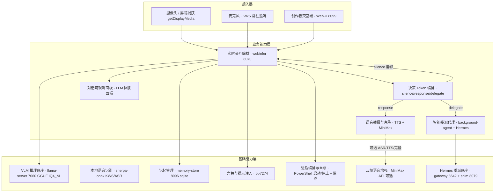
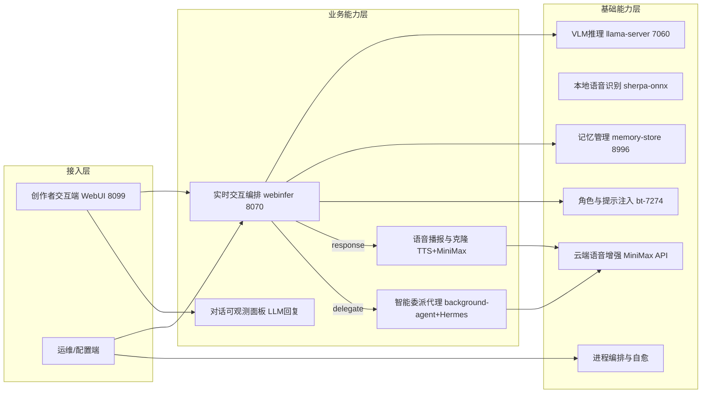

# JoyAI-VL-Interaction · 高层架构设计

> 本文档为《JoyAI-VL-Interaction 架构设计》核心产物之一，对应**高层架构设计**阶段（G3）。
> 上游输入：业务原始诉求 + 行业调研结论（G2 通过）+ 现有架构知识库（material_digest.md G1 通过，含冻结边界 D4 + ADR0001~0007）；
> 下游输出：驱动《系统设计》《部署设计》《安全设计》《UserStory》四份文档的撰写。
> 设计立场：在现有已冻结架构（D4 + ADR0001~0007）基础上**冻结边界、补齐下游缺失部分**，不推倒重来。

---

## 0. 元信息：修订记录

```yaml
标题: JoyAI-VL-Interaction - 高层架构设计 v0.1
版本: v0.1
状态: Draft   # Draft | Reviewing | Approved | Deprecated
创建日期: 2026-07-20
最后更新: 2026-07-20
作者: business-architect (许边界)
评审人:
  - team-lead (主理人)
  - 项目技术负责人

关联文档:
  上游输入:
    - 业务原始诉求 / PRD: material_digest.md (G1 通过，43 份资料归一化)
    - 行业调研报告: research_report.md (G2 通过，4 家标杆 + 5 维度加权矩阵)
    - 现有架构知识库: doc/local/architecture-current.md (D4, HEAD=021f429) + ADR0001~0007
  下游产出:
    - 系统设计: 待 system-architect 产出（接口契约 / 关键表结构）
    - 部署设计: 待 platform-architect 产出（部署拓扑 / CI-CD / 容量成本）
    - 安全设计: 待 security-architect 产出（威胁建模 / 权限策略）
    - UserStory: 待 product-story-designer 产出
```

| 版本 | 日期 | 作者 | 变更内容 | 评审状态 |
| --- | --- | --- | --- | --- |
| v0.1 | 2026-07-20 | business-architect (许边界) | 初稿：在冻结架构（D4 + ADR0001~0007）基础上补齐下游高层设计（模块全景 / 接口边界 / 进程自愈 / 安全基础 / MVP 决策） | Draft |

> **版本管理纪律**：破坏性变更（章节结构调整 / 关键决策反转）升 MAJOR；新增章节、扩充内容升 MINOR。

---

## 1. 需求概要

### 1.1 需求概要说明

JoyAI-VL-Interaction 是一个 8B 规模、完全开源（Apache 2.0）的实时视觉-语言交互系统，核心模型 JoyAI-VL-8B 每秒自主决策「说话 / 沉默 / 委派」（silence / response / delegate），外围由 5 个可插拔服务（推理 / WebUI / ASR / TTS / background-agent）组成，自带 400 万时间对齐交互训练数据。本期由「项目已有架构但后续架构未写完」触发，需求是**在现有已冻结架构之上冻结边界、补齐下游高层设计**（模块拆分 / 接口边界 / 部署形态 / 安全需求边界），服务于创作者、看护者、玩家、主播等终端用户与二次开发者，覆盖实时看护提醒、游戏实时解说、菜谱步骤引导、直播弹幕评论四类场景。

### 1.2 关键决策摘要

| 编号 | 决策类别 | 决策内容 | 关联章节 |
| --- | --- | --- | --- |
| D1 | 范围决策 | 本期仅补齐下游高层设计（模块全景 / 接口契约边界 / 进程自愈 / 安全基础），不推翻现有冻结架构（D4 + ADR0001~0007） | §6.1 需求边界 |
| D2 | 技术选型决策 | VLM 推理复用 llama-server GGUF IQ4_NL（B3，评分 4.80）；流式复用 WebRTC + 进程内 sherpa；语音复用 MiniMax Rapid Clone（ADR0001 冻结）；不引入 OpenAI Realtime 作为主路径（与「完全开源 + 本地优先」诉求冲突） | §3.2 / §4 |
| D3 | MVP / 完整版边界 | MVP = 单机 PowerShell 编排 + 进程自愈 + 安全基础（密钥托管 + 暴露面收敛）；完整版 = + Docker Compose 可选 + memory-store v0.2 + 完整 STRIDE 安全 + CI 门禁 | §4.3 |
| D4 | 复用 vs 新建 | 推理 / 网关 / 语音 / 记忆 / 委派底座全部复用现有（ADR 冻结）；仅新建轻量的「进程编排与自愈」与「安全基础收敛」两层 | §5.2 系统依赖架构 |
| D5 | 部署形态 | 私有化（本地 Windows 单机 + RTX 5060 Ti 16GB），多租户否，无对外 SLA（进程自愈最佳努力可用性） | §4.2 / §5.2 |

**硬指标**：≥ 3 条，≤ 5 条；每条决策必须能映射到正文具体章节。✅（5 条，均映射）

### 1.3 价值主张

| 价值维度 | 量化目标 | 度量指标 | 当前值 | 目标值 | 截止时间 |
| --- | --- | --- | --- | --- | --- |
| 效率 | 实时视觉-语言交互端到端延迟可控，不卡顿不掉线 | 端到端交互时延 P99 | 0.8–1.5s（D22 性能表） | ≤ 1.2s | MVP 上线 |
| 合规 | 核心视觉-语言推理 100% 本地化，数据不出本机 | VL 推理本地化率 | 主对话 VLM 本地（D40 §6 不变性） | 100% | MVP 上线 |
| 成本 | 消费级单卡自有算力，云端仅作可选语音增强，月成本可控 | 月度云端成本上限 | 本地推理免费 + 可选云 | ≤ ¥149/月（档2：MiniMax Max ¥119 + 阿里云 ASR ¥30，D31/D42 §12） | MVP 上线 |

**硬指标**：业务价值 ≥ 2 条 + 技术/成本价值 ≥ 1 条；每条必须可量化，禁止出现"提升 / 优化 / 加强 / 更好"等模糊词。✅（效率、合规为业务价值；成本为技术/成本价值；均量化）

---

## 2. 需求分析 & 痛点解构

### 2.1 核心角色关注点

> 本节按「甲方决策者 / 最终用户 / 受影响方」三大维度盘点角色诉求：甲方决策者关注完全开源与本地优先的可持续性；最终用户（创作者 / 二次开发者）关注实时交互与模块可插拔性；受影响方（安全 / 运维）关注数据本地化与进程自愈。各角色 Top1 关心点如下表。

| 角色 | 业务身份 | 主要操作 | Top1 关心点 | 来源 |
| --- | --- | --- | --- | --- |
| 甲方决策者（项目技术负责人 / PM） | 开源项目维护者 / 技术负责人 | 架构演进决策、社区采用评估、冻结边界守护 | 完全开源 + 本地优先的可持续性与社区可复现性（能否在消费级单卡跑通 8B VLM 实时交互） | README D1/D2；D40 §6 |
| 最终用户 A（终端创作者：看护者 / 玩家 / 厨师 / 主播） | 一线使用者 | 实时对话、看护提醒、游戏解说、菜谱引导、弹幕评论 | 实时交互延迟 ≤ 1.2s 且不卡顿、不掉线（断流即失去使用价值） | D1 场景；D22 e2e 0.8–1.5s |
| 最终用户 B（二次开发者 / 集成者） | 调用 5 个可插拔服务的开发者 | 模块替换、接口对接、二次开发 | 模块可插拔替换 + 接口契约清晰，单服务替换成本可控 | D41 五服务可插拔；D15 松耦合 |
| 受影响方：安全 / 合规 | 合规 / 安全责任人 | 密钥审计、数据驻留核查 | 数据不出本机（本地优先）、MiniMax API Key 不硬编码不泄露 | D8/D33；G5 安全缺口 |
| 受影响方：运维 / SRE | 本地部署运维 | 启停编排、故障恢复、资源看护 | 单点进程可监控、崩溃可自动恢复（不全瘫） | D40 §8；ADR0006 SPOF |

**硬指标**：≥ 3 类（甲方决策者 / 最终用户 / 受影响方各至少一行）；每行必须有"Top1 关心点"，禁止笼统写"使用方便"。✅（5 行，覆盖三大维度，均无"使用方便"）

### 2.2 核心痛点

| 编号 | 痛点描述 | 现象 / 数据 | 影响角色 | 影响程度 | 优先级 |
| --- | --- | --- | --- | --- | --- |
| P1 | 实时对话链路存在单点故障，任一核心进程崩溃即全瘫 | webinfer(8070) 为 ADR0006 冻结的「显式失败、不回退 7060」新 SPOF；llama-server main(7060) 为唯一 SPOF（D40 §8：main 挂=全瘫）；两处均无自动恢复 | 最终用户 A / 运维 | 高（核心可用性底线） | P1 |
| P1 | 单卡 VRAM 预算紧张，新增服务或上下文膨胀即 OOM | 预算 ~11.5GB / 16GB（D40 §3），峰值已逼近上限，仅留 4.5GB 余量 | 最终用户 A / 运维 | 高（推理降级或崩溃） | P1 |
| P2 | 记忆无跨会话持久化，长对话上下文丢失 | memory-store v0.1 仅 sqlite 骨架，score/last_hit_at/hit_count 不计算，无长期记忆（D9/D25）；进程内三层记忆无持久化 | 最终用户 A | 中 | P2 |
| P2 | 安全威胁建模缺失，密钥与暴露面无防护基线 | MiniMax API Key 处理无 Vault（D8/D42）、WebUI 自签证书（D33）、WebRTC 暴露面无收敛；G5 全资料无威胁建模 | 安全 / 合规 | 中（财务 + 数据出境风险） | P2 |
| P3 | 多进程无 CI 门禁，存在打包阻断缺陷 | pyproject.toml 仅列 13 模块中 3 个（D12 🔴 阻断）；无 CI 流水线（G6） | 运维 / 开发者 | 中（发布破坏、回归漏检） | P3 |

**优先级标准**：
- **P1**：直接影响业务核心流程或合规底线，不解决无法上线。
- **P2**：影响用户体验或运营效率，可在 MVP 后迭代。
- **P3**：体验型 / 长尾问题，列入完整版或后续版本。

**硬指标**：每条痛点必须有"现象 / 数据"佐证；P1 ≥ 1 条且必须在 §2.3 有对应目标。✅（2 条 P1 均有数据佐证，且 §2.3 中 V1 对齐 SPOF、V2 对齐 VRAM）

### 2.3 期待目标

| 编号 | 目标描述 | 对齐痛点 | 度量指标 | 当前值 | 目标值 | 截止时间 |
| --- | --- | --- | --- | --- | --- | --- |
| V1 | 核心对话链路进程级自愈，崩溃到恢复可观测 | P1（SPOF） | 进程崩溃 → 自动重启恢复 P99 | 无自愈（D40 §8 仅重启建议） | P99 ≤ 30s | MVP 上线 |
| V2 | 单卡 VRAM 峰值受控，不超预算 | P1（VRAM） | VRAM 峰值占用 | ~11.5GB（D40 §3） | ≤ 11.5GB，OOM 率 = 0 | 完整版上线 |
| V3 | 跨会话长期记忆可用，上下文不丢失 | P2（记忆） | 跨会话记忆召回可用 | 无持久化（D9/D25） | memory-store v0.2 可用 | 完整版上线 |
| V4 | API Key 100% 经隔离托管，无硬编码 | P2（安全） | Key 硬编码 / 日志泄露次数 | 环境变量（D8，开发态） | 0 次，全部 Vault/隔离托管 | 完整版上线（MVP 先做基础收敛） |
| V5 | CI 门禁覆盖发布，打包缺陷清零 | P3（CI） | 发布破坏率 / 打包缺陷数 | D12 🔴 1 项阻断 | 0 项，pytest + 打包校验 100% 门禁 | 完整版上线 |

**硬指标**：每条目标必须**有数字 + 对齐至少 1 条痛点**；P1 痛点必须有对应 V 级目标。✅（V1 对齐 P1 SPOF，V2 对齐 P1 VRAM；所有目标含数字）

### 2.4 基线复用

| 复用类别 | 现有能力 | 复用方式 | 来源系统 | 备注 |
| --- | --- | --- | --- | --- |
| 推理底座 | JoyAI-VL-8B（GGUF IQ4_NL）via llama-server 7060 | 直接调用 OpenAI 兼容 HTTP | 现有推理服务（D40 §6；D4 §拓扑） | 单卡 ~5.8GB（D40 §3）；VRAM 预算内 |
| 编排网关 | webinfer 8070 单入口网关 | 直接调用（ADR0006 冻结） | 现有 webinfer（D10/D14） | 显式失败不回退 7060；需补 SPOF 自愈 |
| 流式传输 | WebUI(8099) WebRTC + 进程内 sherpa-onnx KWS/ASR | 直接复用 | 现有 WebUI + 本地 ASR（D22/D40） | KWS v4 recall 49.06%（D18） |
| 语音播报 | MiniMax Speech 2.8 / Rapid Clone（同步路径） | 直接调用（ADR0001 冻结） | 现有 TTS + voice-clone（D5/D27） | 本地 CozyVoice 作 fallback（D42 §5） |
| 智能委派 | Hermes 严格隔离 + shim(8079)/gateway(8642) | 直接调用 /v1/solve | 现有 background-agent（D24/D42 §16） | 人格/记忆/Skills/Provider 独立 |
| 记忆 | memory-store v0.1 sqlite 骨架（端口 8996） | 直接调用 push/pull | 现有记忆服务（D9/D19） | 仅 v0.1，embedding/psql 留 v0.2 |
| 角色提示 | bt-7274 角色 prompt 注入 | 直接调用 | 现有 webinfer（D40 §6；D42 §1） | 决策 token 由 webinfer 剥离（D4） |
| 屏幕捕获 | getDisplayMedia（window，1fps） | 直接复用 | 现有 WebUI（D26/D42 §16） | 0 后端改动 |
| 编排脚本 | start-joyai.ps1 / stop-joyai.ps1 | 直接复用 | 现有 PowerShell 编排（D8/D42） | 默认启动 7060/8070/8099/8985 |
| 测试资产 | webui 107 + webinfer 66 = 173 测试全绿 | 直接复用为回归基线 | 现有测试（D4 §测试） | CI 门禁基础（D-06 缺口） |

**硬指标**：必须先盘点再决定新建；凡列入"功能缺口"的能力，必须先在本节确认基线无法覆盖。✅（逐项盘点，新建仅限「进程编排自愈」「安全基础收敛」两层，基线已覆盖其余）

### 2.5 功能缺口

| 阶段 | 功能缺口 | 必要性 | 优先级 | 对齐目标 |
| --- | --- | --- | --- | --- |
| 交互前（启动 / 配置） | 一键启停编排 + 角色 prompt 配置 + 声音克隆注册 | 必须 | MVP | V1（依赖编排稳定） |
| 交互中（实时交互） | 决策 token 编排（silence/response/delegate）端到端闭环 | 必须 | MVP | V1 / 效率 |
| 交互中 | 实时 VL 推理（图像 + 文本 → 决策） | 必须 | MVP | 效率 / V2 |
| 交互中 | 流式 ASR / KWS 唤醒与打断（进程内 sherpa） | 必须 | MVP | 效率 |
| 交互中 | TTS 语音播报 + MiniMax 声音克隆（同步路径） | 必须 | MVP | — |
| 交互中 | 屏幕捕获 + Hermes 智能委派 | 必须 | MVP | — |
| 交互中 | 进程级监控与自愈（崩溃自动重启） | 必须 | MVP | V1 |
| 交互中 | 单卡 VRAM 监控与预算保护 | 重要 | MVP | V2 |
| 交互后（会话后） | 跨会话长期记忆持久化（memory-store v0.2） | 重要 | 完整版 | V3 |
| 运营 | 安全基础：API Key 隔离托管 + WebRTC 暴露面收敛 | 重要 | MVP 部分 / 完整版 | V4 |
| 运营 | 部署拓扑演进（Docker Compose 可选） | 重要 | 完整版 | — |
| 运营 | CI 门禁（pytest + 打包校验） | 重要 | 完整版 | V5 |

**硬指标**：每条缺口必须对齐 §2.3 至少一条目标；MVP 缺口必须在 §6.3 功能清单中对应有 MVP 范围标记。✅（全部对齐目标；MVP 缺口在 §6.3 标 ✅）

---

## 3. 行业调研

### 3.1 行业标杆系统分析

| 标杆系统 | 厂商 / 来源 | 场景覆盖 | 技术亮点 | 商业模式 | 适用度 |
| --- | --- | --- | --- | --- | --- |
| OpenAI Realtime API（gpt-realtime / GPT-4o） | OpenAI（头部 SaaS） | 低延迟语音到语音 + 图像输入的多模态实时对话 | 单一模型语音到语音、自动 VAD/打断、function calling、图像输入 | 云端 SaaS（按 token $32/64 每 1M 音频） | 低（与本地优先/全开源冲突，仅作全云档参照） |
| vLLM | vLLM 社区（开源，Apache 2.0） | 高吞吐 LLM/VLM 推理服务，OpenAI 兼容 API | PagedAttention、连续批处理、GGUF/INT4/FP8 量化、多 LoRA、多模态 | 开源免费，自有算力 | 中（部分借鉴：容器化/健康检查模式） |
| llama.cpp / llama-server（GGUF IQ4_NL） | ggml-org（开源，MIT） | 消费级硬件本地 LLM/VLM 推理，OpenAI 兼容 server | GGUF 单文件、IQ4_NL imatrix 量化、-ngl GPU 卸载、极低依赖 | 开源免费（MIT），自有算力 | 高（优先借鉴：推理主路径基线） |
| Pipecat（Daily 开源编排框架） | Daily.co（开源，GitHub 社区） | 实时语音/多模态 Agent 编排：可插拔 STT/LLM/TTS + WebRTC | Pipeline/Frame 架构、VAD/智能打断、供应商中立、60+ 集成、SmallWebRTC 自托管 | 框架开源免费；下游服务按所选商计费 | 中（部分借鉴：WebRTC/VAD/Frame 模式） |

**硬指标**：≥ 3 家；至少包含 1 家头部 SaaS + 1 家开源/自研代表。✅（4 家；B1 OpenAI 为头部 SaaS；B2 vLLM / B3 llama.cpp / B4 Pipecat 均为开源代表）

### 3.2 方案对标及优先级打分

**对比矩阵**（每行权重之和 = 1）：

| 评估维度 | 权重 | B1 OpenAI Realtime | B2 vLLM | B3 llama.cpp | B4 Pipecat |
| --- | --- | --- | --- | --- | --- |
| 场景契合度 | 0.30 | 2 | 4 | 5 | 4 |
| 技术成熟度 | 0.20 | 5 | 5 | 4 | 4 |
| 集成难度（反向）| 0.15 | 3 | 3 | 5 | 3 |
| 成本（反向） | 0.15 | 2 | 4 | 5 | 4 |
| 合规可控性 | 0.20 | 1 | 5 | 5 | 4 |
| **加权总分** | **1.00** | **2.55** | **4.25** | **4.80** | **3.85** |

> 评分标尺：1~5 分，1 = 严重不符合，3 = 基本满足但存在明显局限，5 = 完美契合。权重与打分来自 research_report.md §3.1（G2 已通过），直接引用。

**结论摘要**：
- **优先借鉴**：**B3 llama.cpp / llama-server（GGUF IQ4_NL）** —— 理由：场景契合度 5/5（与单卡 RTX 5060 Ti 16GB、本地优先主路径完全一致，D40 §6）、集成难度 5/5（单二进制低依赖）、成本 5/5（MIT 免费）、合规可控性 5/5（彻底私有化）；作为推理主路径优先借鉴基线。
- **部分借鉴**：**B2 vLLM（4.25）与 B4 Pipecat（3.85）** —— B2 借鉴容器化部署与健康检查模式（支撑 G4）；B4 借鉴 Pipeline/Frame + VAD/智能打断 + SmallWebRTC 自托管设计模式映射到既有 WebUI(WebRTC)+webinfer 编排层。两者均**不整体替换**已冻结的 webinfer 单入口网关（ADR0006）。
- **不借鉴（否决）**：**B1 OpenAI Realtime API（2.55）作为主路径** —— 否决理由：合规可控性 1/5（数据必须出公网）、成本 2/5（持续语音按 token 计费）、场景契合度 2/5（与本地优先、Apache 2.0 全开源、单卡消费级 GPU 冻结底线冲突）。B1 仅作为「全云档（档3）」能力参照，本架构将其置于 Out-of-Scope（见 §6.1 O2）。

### 3.3 完整报告参考

- 完整报告链接：`D:\AI\workspace\JoyAI-VL-Interaction-main\.workbuddy\output\research_report.md`
- 调研工具：`tech-research-advisor`
- 调研日期：2026-07-20
- 调研归档：`material_digest.md`（G1 通过，含 D4/D22/D27/D31/D40/D42 等冻结边界与缺口 G1~G7）

---

## 4. 方案决策

### 4.1 价值定位澄清

```
对外价值（客户侧）: 为看护 / 游戏 / 菜谱 / 直播等场景的创作者提供完全本地、隐私不出本机的实时视觉-语言交互能力，端到端延迟 P99 ≤ 1.2s，数据零出境。
对内价值（运营侧）: 开源社区可插拔架构（5 服务独立替换）；运维侧进程级自愈降低运维负担；合规侧核心 VL 推理 100% 本地化、留痕可审计。
差异化价值        : 每秒自主决策 silence/response/delegate 的「会说话的 AI」（非被动问答）；单张消费级 GPU（≤11.5GB VRAM）跑通 8B VLM 实时交互；Apache 2.0 全开源 vs 闭源云 API。
```

**与产品矩阵的关系**：本系统在「本地优先实时 VL 交互」价值主线中承担**核心交互引擎**职责，与上游摄像头/屏幕/麦克风采集、可选 MiniMax 云端语音增强、可选 Hermes 委派 Provider 形成完整业务闭环（见 §5.2、§5.3）。

### 4.2 系统定位澄清

| 维度 | 内容 |
| --- | --- |
| 系统名称 | JoyAI-VL-Interaction（实时视觉-语言交互系统） |
| 系统类型 | 已有系统扩展（在现有架构上冻结边界 + 补齐下游高层设计，不推倒重来） |
| 部署形态 | 私有化（本地 Windows 单机 + RTX 5060 Ti 16GB；依据 ADR0004 服务生命周期 + D40 §0 唯一启动入口 start-joyai.ps1） |
| 多租户 | 否（单用户本地工具，无租户隔离需求） |
| 服务对象 | 终端创作者（看护者/玩家/厨师/主播）、二次开发者（最终用户 B）、项目技术负责人（甲方决策者）、运维/安全（受影响方）—— 对齐 §2.1 |
| 上游依赖 | 摄像头/屏幕捕获（getDisplayMedia）、麦克风（含 KWS 唤醒）、MiniMax 云端（可选 ASR/TTS/克隆）、Hermes Provider（可选委派） |
| 下游消费者 | 无外部下游（本地闭环）；可选本地会话/记忆导出 |
| 边界（不做） | 不做多租户云端 SaaS；不做闭源云 API（OpenAI Realtime）主路径；不做 K8s 多节点集群（MVP）；不做跨会话长期记忆 v0.2（MVP）；不决定数据库表结构（归 system-architect）；不规定资源规格/运行时拓扑（归 platform-architect）；不编写部署/安全最终方案（归 platform-architect / security-architect） |

### 4.3 MVP 与完整版决策

| 阶段 | 时间窗 | 范围（功能编号） | 架构差异点 | 退出标准 | 不做（延后） |
| --- | --- | --- | --- | --- | --- |
| MVP | W1 ~ W4（下游细化设计周期） | F1~F12, N1, N2（见 §6.1 / §6.3） | 单机 PowerShell 编排、单租户、进程自愈脚本、安全基础（Key 隔离 + 暴露面收敛） | 主链路（WebUI→webinfer→llama-server）端到端跑通 + 5 服务可独立启停 + 进程崩溃自愈 P99 ≤ 30s + 173 测试全绿 | F13~F17（memory v0.2 / Docker Compose / 完整 STRIDE / CI / 容量模型） |
| 完整版 | W5 ~ W12 | + F13 ~ F17 | 可选 Docker Compose 编排、memory-store v0.2（embedding/psql）、完整 STRIDE 威胁建模、CI 门禁、容量与成本模型 | D-01 迁移验证通过 + 安全威胁模型评审通过 + CI 100% 覆盖发布 + VRAM OOM 率 = 0 | — |

**演进纪律**（重要）：
- ✅ MVP 的架构骨架必须是完整版的**子集**，不允许 MVP 上线后推倒重来（webinfer 单入口网关 ADR0006 在 MVP 与完整版均保持冻结）。
- ✅ MVP 中可 Mock/可选的能力（云端 ASR/TTS 增强、Hermes 委派）在完整版保持同一接口契约，仅替换底层 Provider，无需大改。
- ❌ 禁止：MVP 为赶工引入「完整版无法继承」的临时架构（如临时单库→完整版分库分表）；memory-store 保持 sqlite 单一后端直至 v0.2 显式升级（ADR0005 边界）。

---

## 5. 业务架构设计

### 5.1 业务架构图

> 三层结构：**接入层（用户/触点）→ 业务能力层（核心模块）→ 基础能力层（底座/数据）**。实线 = 同步调用，虚线 = 异步/可选外部，粗线 = 主链路。



### 5.2 系统依赖架构

| 依赖类型 | 系统 / 模块 | 提供方 | 依赖能力 | 接入方式 | 同步/异步 | 关键约束 |
| --- | --- | --- | --- | --- | --- | --- |
| 上游 | 摄像头 / 屏幕捕获（getDisplayMedia） | 浏览器 / 操作系统 | 视频帧（1fps，无音频） | WebRTC / HTTPS | 同步（帧推送） | 仅选窗口、强制 1fps（D26）；0 后端改动 |
| 上游 | 麦克风 + KWS 常驻监听 | 浏览器 / WebUI 进程内 | 音频流 + 唤醒词检测 | 进程内（无网络） | 同步 | sherpa-onnx v4，FAR 2% / recall 49%（D22） |
| 上游 | MiniMax 云端（ASR/TTS/克隆） | MiniMax（外部 SaaS） | 语音合成 / 克隆 / 可选 ASR | HTTPS REST | 异步（同步路径 /v1/voice_clone，ADR0001） | API Key 隔离托管 + 按量限额（R-03）；数据出境合规确认（U-03） |
| 复用底座 | VLM 推理（llama-server 7060） | 推理服务 | 多模态推理 /v1/chat/completions | OpenAI 兼容 HTTP | 同步 | SPOF 监控 + 自动重启（R-02）；VRAM ≤ 11.5GB（D40 §3） |
| 复用底座 | webinfer 8070 单入口网关 | 现有 webinfer | 决策 token 编排 / 角色 prompt 注入 | OpenAI 兼容 HTTP | 同步 | ADR0006 显式失败不回退 7060；需补 SPOF 自愈（R-01） |
| 复用底座 | sherpa-onnx KWS/ASR | WebUI 进程内 | 流式识别 / 唤醒 | 进程内 | 同步 | 默认本地，上云档仅增强（D42 §10） |
| 复用底座 | Hermes gateway 8642 + shim 8079 | background-agent | 严格隔离委派 /v1/solve | HTTP | 同步 | 人格/记忆/Skills/Provider 独立（D24）；委派失败主对话正常 |
| 复用底座 | memory-store 8996 | 记忆服务 | 短期/中期记忆 push/pull | HTTP（FTS5 sqlite） | 同步 | v0.1 仅 sqlite（ADR0005）；跨会话持久化留 v0.2（D-03） |
| 下游 | 本地会话 / 记忆导出 | 本地文件系统 | 导出（可选） | 文件写 | 异步 | 非核心闭环，可选能力 |

**硬指标**：
- 每条依赖必须明确"接入方式 + 同步/异步 + 关键约束"，禁止只写"调用 API"。✅（逐条明确）
- 所有 P1 痛点对应的核心能力，必须能在本表中找到依赖来源（自建/复用/采购）。✅（P1-SPOF → B5 进程自愈 + webinfer/llama-server 监控约束；P1-VRAM → B1 VLM 推理 VRAM 约束）

### 5.3 业务闭环

**业务主链路**（端到端）：

```
视频/音频采集（U2/U3） → VLM 推理 + 决策 token（M1/M2 → B1） → 
  [response] 语音播报（M3） / [silence] 静默等待 / [delegate] Hermes 委派（M4 → B7）
→ 用户感知（字幕 / HUD / 语音，U1） → 会话沉淀（记忆 B3 + 每 100 帧中期摘要）
```

**关键反馈回路**：

| 回路 | 触发点 | 反馈对象 | 反馈机制 | 价值 |
| --- | --- | --- | --- | --- |
| 业务效果回路 | 每 100 帧中期摘要 + 会话结束 | memory-store（B3） | 短期→中期→长期上下文累积（v0.1 仅短期/中期；v0.2 补长期） | 优化后续交互上下文连贯性 |
| 运营监控回路 | 进程健康 / VRAM / 延迟指标异常 | 运维 / SRE（B5） | 实时告警 + 进程自动重启（P99 ≤ 30s） | 快速恢复，避免全瘫（R-01/R-02） |
| 模型迭代回路 | 用户标注 / 角色 prompt / 配置调整 | 训练管线（4M 训练数据） | 周度/版本级微调与 prompt 迭代 | 提升交互质量与场景适配 |

**运营主线**：每日（进程健康巡检 + VRAM 水位看护）、每周（会话质量 / 延迟 P99 复盘）、每月（安全审计 + 云端成本盘点，对齐 V4/V5）。

---

## 6. 产品需求及原型

### 6.1 需求边界

**In-Scope**（本期必做）：

```
F1. 实时 VL 推理主链路（WebUI→webinfer→llama-server）端到端闭环
F2. 决策 token 编排（silence/response/delegate）
F3. 流式 ASR / KWS 唤醒与打断（进程内 sherpa-onnx）
F4. TTS 语音播报 + MiniMax 声音克隆（同步路径，ADR0001）
F5. 屏幕捕获 + Hermes 智能委派
F6. memory-store v0.1 短期/中期记忆（sqlite，ADR0005）
F7. 对话可观测面板（LLM 回复面板，ADR0003）
F8. 进程级监控与自愈（崩溃自动重启，P99 ≤ 30s，对齐 V1）
F9. 单卡 VRAM 监控与预算保护（≤ 11.5GB，对齐 V2）
F10. 安全基础：API Key 隔离托管 + WebRTC 暴露面收敛（localhost/内网，对齐 V4 基础）
F11. 5 服务产品模块全景与接口契约边界定义
F12. 一键启动/停止编排（start/stop-joyai.ps1）
N1. 非功能：端到端交互延迟 P99 ≤ 1.2s
N2. 非功能：单用户本地，无多租户
```

**Out-of-Scope**（本期不做，必须列原因）：
| 编号 | 不做的事 | 原因 | 后续计划 |
| --- | --- | --- | --- |
| Out-of-Scope O1 | 多节点 K8s 集群化 / 多机 HA | 当前单机 Windows 目标，集群化需求与时机未定（U-04）；迁移成本需评估（D-01） | 完整版评估 Docker Compose → K8s |
| Out-of-Scope O2 | 全云档（OpenAI Realtime 主路径） | 与「完全开源 + 本地优先」诉求冲突，数据出境且持续计费（B1 评分 2.55，合规可控性 1/5） | 不做（维持本地优先；仅作能力参照） |
| Out-of-Scope O3 | 跨会话长期记忆持久化 v0.2（embedding/psql/obsidian） | ADR0005 v0.1 仅 sqlite，范围外能力推迟（D9/D19） | 完整版（D-03） |
| Out-of-Scope O4 | 多租户 / SaaS 化 | 单用户本地工具定位，无租户隔离需求 | 不做 |
| Out-of-Scope O5 | 完整 STRIDE 威胁建模与合规认证 | G5 安全缺口当前完全缺失，MVP 仅做密钥托管 + 暴露面收敛基础 | 安全设计专项（G5） |

**硬指标**：In-Scope ≤ 15 条；Out-of-Scope ≥ 3 条。✅（In-Scope 12 条功能 + 2 条非功能 = 14 ≤ 15；Out-of-Scope 5 条 ≥ 3）

### 6.2 产品模块全景图

**模块卡片**（每个模块必填字段）：

| 模块名称 | 一级归属 | 责任团队 | 上游 | 下游 | MVP 是否包含 |
| --- | --- | --- | --- | --- | --- |
| 创作者交互端（WebUI 8099） | 接入层 | 前端团队 | 用户 / 摄像头 / 麦克风 | webinfer | 是 |
| 运维 / 配置端 | 接入层 | 运维团队 | 各服务状态 | webinfer / 进程编排 | 是 |
| 实时交互编排服务（webinfer 8070） | 业务能力层 | 后端团队 | WebUI | llama-server / memory-store / Hermes / TTS | 是 |
| 语音播报与克隆（TTS + MiniMax） | 业务能力层 | 语音团队 | webinfer | MiniMax 云端（可选） | 是 |
| 智能委派代理（background-agent + Hermes） | 业务能力层 | 代理团队 | webinfer | Hermes gateway 8642 | 是 |
| 对话可观测面板（LLM 回复面板） | 业务能力层 | 前端团队 | webinfer | — | 是 |
| VLM 推理服务（llama-server 7060） | 基础能力层 | 推理团队 | webinfer | — | 是 |
| 本地语音识别（sherpa-onnx KWS/ASR） | 基础能力层 | 语音团队 | 麦克风 | WebUI（进程内） | 是 |
| 记忆管理服务（memory-store 8996） | 基础能力层 | 记忆团队 | webinfer | sqlite | 是（v0.1） |
| 角色与提示注入（bt-7274） | 基础能力层 | 后端团队 | webinfer | — | 是 |
| 进程编排与自愈（PowerShell + 监控） | 基础能力层 | 运维团队 | 各服务 | — | 是 |
| 云端语音增强（MiniMax API） | 基础能力层（外部） | 外部供应商 | TTS / ASR | — | 否（可选增强） |



### 6.3 功能清单

| 编号 | 一级模块 | 二级功能 | 功能描述 | 优先级 | MVP 范围 | 完整版范围 | 对齐目标 |
| --- | --- | --- | --- | --- | --- | --- | --- |
| F1 | 实时交互编排 | 决策 token 编排 | 每秒 silence/response/delegate 路由，送 TTS 前剥离 token | P0 | ✅ | ✅ | V1 |
| F2 | VLM 推理 | 多模态推理 | 图像 + 文本 → 决策输出 | P0 | ✅ | ✅ | 效率 / V2 |
| F3 | 本地语音识别 | KWS 唤醒 + ASR 流式 | 进程内 sherpa-onnx，唤醒词 + 打断 | P0 | ✅ | ✅ | 效率 |
| F4 | 语音播报与克隆 | TTS + Rapid Clone | MiniMax 同步路径（ADR0001） | P0 | ✅ | ✅ | — |
| F5 | 智能委派代理 | Hermes 严格隔离委派 | shim/gateway /v1/solve 协议转换 | P0 | ✅ | ✅ | — |
| F6 | 记忆管理 | 短期/中期记忆（sqlite） | memory-store v0.1 push/pull | P0 | ✅ | ✅ | V3（部分） |
| F7 | 对话可观测 | LLM 回复面板 | ADR0003 可见性（display:block / /api/llm/status） | P1 | ✅ | ✅ | — |
| F8 | 进程编排与自愈 | 崩溃自动重启 | 进程 health check + 自动重启，P99 ≤ 30s | P0 | ✅ | ✅ | V1 |
| F9 | 进程编排与自愈 | VRAM 监控与预算保护 | 单卡 ≤ 11.5GB，超限告警降载 | P1 | ✅ | ✅ | V2 |
| F10 | 安全基础 | Key 隔离 + 暴露面收敛 | 环境变量/隔离托管 + WebRTC localhost/内网 | P1 | ✅ | ✅ | V4 |
| F11 | 屏幕捕获 | getDisplayMedia | 窗口 1fps 捕获，0 后端改动 | P0 | ✅ | ✅ | — |
| F12 | 模块全景 | 接口契约边界定义 | 5 服务模块边界与契约边界（归 system-architect 细化） | P1 | ✅ | ✅ | — |
| F13 | 记忆管理 | 跨会话长期记忆 v0.2 | embedding/psql/obsidian（D-03） | P2 | ❌ | ✅ | V3 |
| F14 | 部署拓扑 | Docker Compose 可选 | 健康检查 + restart（D-01） | P2 | ❌ | ✅ | — |
| F15 | 安全设计 | 完整 STRIDE 威胁建模 | 威胁模型 + 权限策略（G5） | P2 | ❌ | ✅ | V4 |
| F16 | CI/CD | 门禁流水线 | pytest + 打包校验（修复 D12 🔴） | P2 | ❌ | ✅ | V5 |
| F17 | 容量与成本 | 容量与成本模型 | 扩缩容 / 成本监控（G7） | P3 | ❌ | ✅ | — |

**硬指标**：
- 每个 P0 功能必须在 MVP 范围内为 ✅。✅（F1/F2/F3/F4/F5/F6/F8/F11 共 8 个 P0 全 ✅）
- 每个功能必须能反向映射到 §2.5 功能缺口 + §2.3 期待目标。✅（逐条对齐）

### 6.4 产品原型 - 创作者交互端（WebUI 8099）

**核心页面清单**：

| 页面 | 用途 | 关键交互 | MVP |
| --- | --- | --- | --- |
| 主对话界面 | 视频流 + 字幕 + HUD 徽章（jarvisStatus/llmBadge/ttsBadge/kwsBadge） | 实时字幕呈现、KWS_LISTENING/WAKE_DETECTED/DIALOG_ACTIVE 状态可视 | ✅ |
| 语音监听控制 | BT 监听按钮 + KWS 常驻链路 | audio-only WebRTC /offer，唤醒即进入对话 | ✅ |
| 角色与声音配置 | 角色 prompt 注入 + 声音克隆注册 | 填写 bt-7274 prompt、上传 10s 参考音频触发 Rapid Clone | ✅ |
| 对话历史与记忆 | vlm-history 查看 | 会话回放、短期/中期记忆浏览 | ✅ |

**关键交互约束**：
- 字幕/语音响应：触发到呈现 P99 ≤ 1.2s（对齐 效率 / N1）。
- KWS 唤醒延迟：≤ 1.5s（对齐 D22 e2e 0.8–1.5s）。
- 核心路径：采集 → 推理 → 播报，步骤 ≤ 3 步（用户无额外操作）。

**原型链接**：本地工具，无独立 Figma；交互规范见 doc/subsystems/voice-ui.md（D28）、doc/specs/webui-kws-listening-chain.md（D21）。

### 6.5 产品原型 - 运维 / 配置端

**核心页面清单**：

| 页面 | 用途 | 关键交互 | MVP |
| --- | --- | --- | --- |
| 服务状态面板 | 11 进程健康 + VRAM 水位 | 实时刷新、异常高亮 | ✅ |
| 启动 / 停止编排 | start/stop-joyai.ps1 可视化 | 一键启停、依赖顺序校验 | ✅ |
| 安全配置 | Key 托管 / 暴露面策略 | 配置隔离托管、绑定 localhost/内网 | ✅ |
| 会话 / 记忆导出 | 本地导出（可选） | 筛选 / 导出 | ❌（完整版） |

**关键交互约束**：
- 进程崩溃 → 自愈恢复 P99 ≤ 30s（对齐 V1）。
- VRAM 超限 → 实时告警并触发降载（对齐 V2）。
- 默认仅 localhost/内网访问，禁止公网暴露（对齐 V4 基础 / R-04）。

**原型链接**：本地工具，配置规范见 doc/local/architecture-local.md（D40）、ADR0004（D8）。

---

## 附录 A：生成流程方法论

> 本附录为高层架构设计的**生成方法论**，描述每一步的目标、工具与产物形态，作为正文章节的产出依据。

### A.0 生成流程总览

| 步骤 | 名称 | 核心产出 | 落入正文章节 |
| --- | --- | --- | --- |
| Step0 | 业务基础知识库构建 | 关联文档结构化知识库 | （为全文提供输入） |
| Step1 | 行业调研分析 | 行业标杆 / 方案对比 / MVP 决策 | §3 行业调研 |
| Step2 | 需求分析 / 痛点解构 | 需求画像卡 | §2 需求分析 & 痛点解构 |
| Step3 | 能力盘点，系统定位 | 价值定位 + 系统定位 | §4 方案决策 / §5.2 系统依赖架构 |
| Step4 | 生成系统高层架构设计 | 本文档主文档 | §1 ~ §5 |
| Step5 | 产品需求及原型 | 需求边界 + 全景图 + 原型 | §6 产品需求及原型 |


### A.1 Step0：业务基础知识库构建

#### A.1.1 目标

构建业务系统关联信息知识库，为后续步骤提供「现有架构、外部依赖文档」等业务背景。

#### A.1.2 工具（Skill）

- `docx`：解析 Word 类业务/产品文档
- `pdf`：解析 PDF 类规范、API 手册等
- `pptx`：解析方案 / 汇报型 PPT
- `xlsx`：解析数据表、清单类文件

#### A.1.3 能力效果展示

> 本项目由 `knowledge-ingest-engineer` 完成 43 份资料归一化（material_digest.md，G1 通过），沉淀冻结边界（D4 + ADR0001~0007）、后续架构缺口（G1~G7）与架构完成度盘点，作为本 Step0 知识库输入。

### A.2 Step1：行业调研分析

#### A.2.1 目标

基于当前需求，调研行业标杆系统及对应解决方案，对标行业标杆的优秀方案，结合当前系统背景及基础组件能力，综合打分决策 MVP 功能和落地路径。

#### A.2.2 工具（Skill）

- `tech-research-advisor`

#### A.2.3 完整报告参考

- 完整报告链接：`D:\AI\workspace\JoyAI-VL-Interaction-main\.workbuddy\output\research_report.md`

#### A.2.4 能力效果展示

##### A.2.4.1 用户输入问题

> 围绕 G1~G7 缺口收拢 5 个调研问题（Q1~Q5）：推理部署形态、流式链路、能力分层成本、部署 HA、威胁建模。

##### A.2.4.2 行业标杆

> B1 OpenAI Realtime（头部 SaaS）/ B2 vLLM / B3 llama.cpp / B4 Pipecat（开源）。

##### A.2.4.3 行业优秀方案及对比

> 5 维度加权矩阵：B3 4.80（优先）/ B2 4.25（部分）/ B4 3.85（部分）/ B1 2.55（不借鉴主路径）。

##### A.2.4.4 方案打分及 MVP 功能评估

> 见 §3.2 与 research_report.md §3。

##### A.2.4.5 能力清单 & 方案总结

> 见 research_report.md §4（自研/采购/复用边界建议）。

### A.3 Step2：需求分析 / 痛点解构

#### A.3.1 目标

构建**需求画像卡**，深入解构需求要点及目标。

#### A.3.2 能力效果展示

> 按"核心角色关注点 / 核心痛点 / 期待目标 / 基线复用 / 功能缺口"五段式产出需求画像卡（结构对应正文 §2）。

### A.4 Step3：能力盘点，系统定位

#### A.4.1 目标

- 从能力知识库中召回现有系统架构，与当前问题相关的已有能力，并完成**分层与去重**
- **系统价值及能力嵌入**：明确需求 / 系统在当前架构中的价值定位
- **系统架构定位、上下游推导**：让目标系统在图中"被看见"，并自动生成上下游关系说明

#### A.4.2 产物形态

- 价值定位澄清（对应正文 §4.1）
- 系统定位澄清（对应正文 §4.2）
- 系统依赖架构图（对应正文 §5.2）

### A.5 Step4：生成系统高层架构设计

#### A.5.1 目标

整合行业分析、需求结构、现有项目背景知识库，输出**系统高层设计**（即本文档正文 §1 ~ §5）。

#### A.5.2 产物形态

- 需求概要（§1）
- 需求分析 & 痛点解构（§2）
- 行业调研（§3）
- 方案决策（§4）
- 业务架构设计（§5）

### A.6 Step5：产品需求及原型

#### A.6.1 目标

在系统高层设计的基础上，输出可被产品/研发直接消费的需求边界、功能清单与产品原型（即本文档正文 §6）。

#### A.6.2 产物形态

- 需求边界（§6.1）
- 产品模块全景图（§6.2）
- 功能清单（§6.3）
- 产品原型 - 创作者交互端（§6.4）
- 产品原型 - 运维/配置端（§6.5）

---

## 附录 B：配套工具清单

### B.1 知识库 Skill

> 用途：解析存量知识库内容。

- `docx`
- `pdf`
- `pptx`
- `xlsx`

### B.2 行业调研

> 用途：基于核心痛点与客户诉求，调研行业标杆项目及解决方案。

- `tech-research-advisor`
