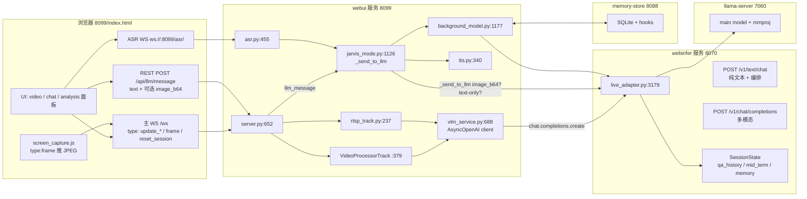
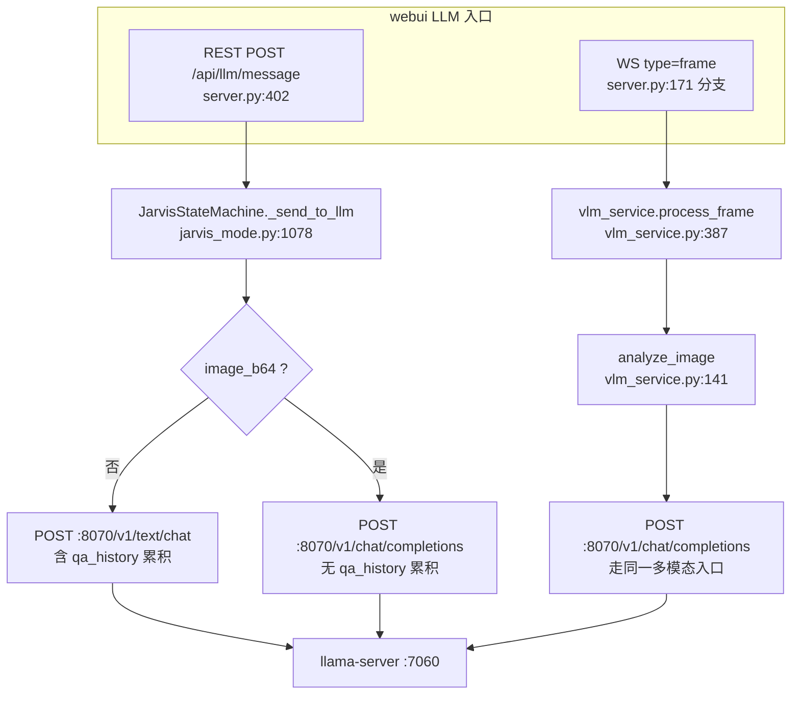
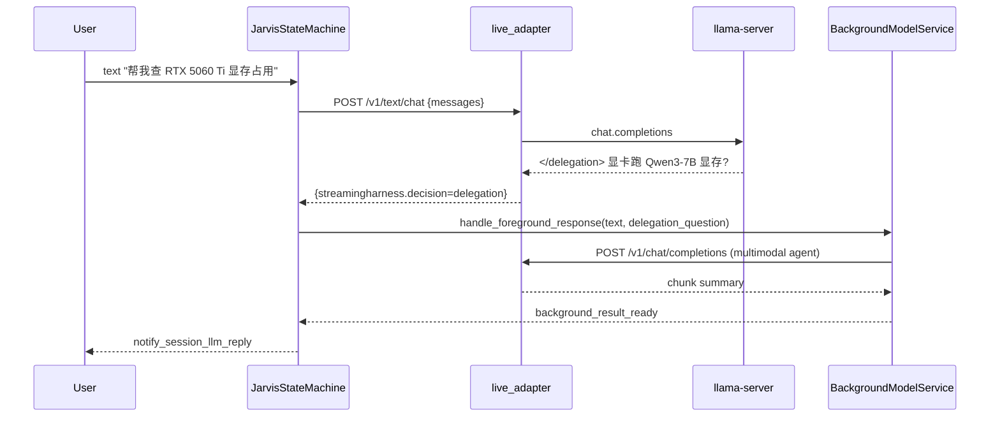

# 项目现状架构图（2026-07-14 代码事实层）

> 🚫 **已归档：本文不是现行拓扑。** 现行运行拓扑请看 **[`../runtime-topology.md`](../runtime-topology.md)**。
>
> ⚠️ **历史快照（2026-07-14）**：本文基线 commit `021f429` 经 2026-09-14 核查**已不在本仓库对象库中**（filter-repo 改写前的历史），无法 `git show` 复核。
> 另知本文 §5 的模块行数表已**整表失效**（如 `live_adapter.py` 记 3179 行，实际 73 行纯门面），且含全仓唯一的幽灵端口 `8088`（真值 8997）。
>
> 本文基于 HEAD = `021f429`（v3.37 + Phase 2A/B/C）逐文件核对，
> 不引用 `specs/*.md`。所有图均为可执行的 mermaid。
>
> **Phase 2A/B/C 新增**：4-API services config + 单 webinfer 主路 + 3 独立 capture 模块 + summarizer hot-swap。
> 详细审查见 [`../specs/2026-07-14-project-audit.md`](../specs/2026-07-14-project-audit.md)。

---

## 1. 整体数据流（一张图）



---

## 2. 三条 LLM 入口的真实路径（用户的疑问解答）



**事实层面**（不看 spec）：

| 路径 | 触发 | 端点 | 决策 token | qa_history |
| --- | --- | --- | --- | --- |
| 文本对话 | `/api/llm/message` (text-only) | `/v1/text/chat` | 解析 `</silence/response/delegation>` | 累积 |
| 文本+图 (paper-plane) | `/api/llm/message` (image_b64) | `/v1/chat/completions` | 解析 | 不累积 |
| 视频帧 (webcam/RTSP/screen) | WS `type:frame` | `/v1/chat/completions` | 不解析 | 不累积 |

**结论**：用户疑问成立 —— **视频帧路径没有经过 paper-plane 文字-图混合路径**。
两条路径都汇聚到 llama-server :7060（中间都过 webinfer :8070 网关），
但路径 1（jarvis）走 webinfer 的 text path，路径 2（vlm_service）走 webinfer 的 chat-completions path。
这是 v3.37 单入口设计的有意切分：text 才累积对话历史，video 是"观察"语义。

---

## 3. 视频输入三路子流

```mermaid
flowchart LR
    USER[用户点击 bigStartBtn] --> START[start() index.html:9412]
    START --> ACTIVE_TAB{active tab}
    ACTIVE_TAB -- data-source=webcam --> WEBCAM[startWebcam :9491<br/>WebRTC offer → /offer]
    ACTIVE_TAB -- data-source=rtsp --> RTSP[startRTSP :9573<br/>/api/rtsp/start]
    ACTIVE_TAB -- data-source=screen --> SCREEN[startScreenCapture :9467<br/>screen_capture.js]

    WEBCAM --> PC[PeerConnection<br/>视频轨道]
    RTSP --> RTSPTRK[rtsp_track.py VideoProcessorTrack]
    SCREEN --> WS_FRAME[WS type=frame JPEG]

    PC --> VPT[VideoProcessorTrack.recv<br/>video_processor.py]
    RTSPTRK --> VPT
    WS_FRAME -.服务端.-> SVR[server.py:171 frame 分支]
    SVR --> VLM[vlm_service.process_frame]
    VPT --> VLM
    VLM --> LA[/v1/chat/completions/]
```

`VideoProcessorTrack` 接收所有三路视频帧，统一进 `vlm_service.process_frame` →
`analyze_image` → `self.client.chat.completions.create(...)` → webinfer。

---

## 4. 决策 / 委派链路



---

## 5. 模块行数清单（代码层）

| 模块 | 行数 | 角色 |
| --- | --- | --- |
| `live_adapter.py` | 3179 | webinfer 网关 + 编排 |
| `jarvis_mode.py` | 1126 | BT-7274 状态机 |
| `background_model.py` | 1177 | 后台 agent |
| `server.py` | 652 | webui HTTP/WS 入口 |
| `vlm_service.py` | 688 | 视频帧 → LLM 客户端封装 |
| `asr.py` | 455 | 语音识别 |
| `video_processor.py` | 379 | WebRTC/RTSP 视频轨道 |
| `tts.py` | 340 | 语音合成 |
| `jarvis_session.py` | 242 | 会话管理 |
| `rtsp_track.py` | 237 | RTSP → VLM |
| `audio_processor.py` | 180 | 音频处理 |
| `local_file_server.py` | 56 | 静态图片 |

合计 ~24.9k 行 Python + ~9k 行 JS（index.html）。

---

## 6. 与用户预期相比的风险点

| 风险 | 严重度 | 现状 |
| --- | --- | --- |
| 视频帧路径未接 paper-plane 文本合并 | 低（设计有意） | spec §2.2 明确 `/v1/chat/completions` 接受 image，文本+图走 `/api/llm/message` |
| vlm_service 默认 api_base=:8000 与实际 :8070 不一致 | 低 | server.py:446 覆盖 |
| 红色 Start 按钮 = 设计色 `--joy-red` | 无 | CSS 1082-1166 设计意图 |
| `bigStartBtn` 重复实现 | 无 | 仅 9412 一处定义；7594/9434 是 reset / animating 切换 |
| doc/specs 偏多（21 个 .md） | 中 | 7 specs + 6 adr + 3 main + 2 local + 5 deprecated + 2 research |

---

## 7. 当前 HEAD 与 Phase 2 变更

**HEAD = `021f429`**（v3.37 + Phase 2A/B/C，4 个新 commit）：

```
021f429 test(webui): delete dead Phase 1 contract tests; add capture modules contract
1e28f47 feat(webui+webinfer): hot-swap summarizer routing via /v1/summarizer/route
e4a0666 fix(webui): services status handler must not block event loop
fb279e9 feat(webui): 4-API services config + 3 independent capture modules
c6a1486 fix(webinfer): handle None archived_in_chunk in qa_history filter (regression: 502)
0c37c3b fix(webui): delete duplicate screen capture impl on screenStart/screenStop
7c2ba1c docs(architecture): v3.37+eventloop fix 代码事实层现状图 (本文上一版)
616b6eb fix(webui): unblock event loop on sync _probe_tts/_probe_kws
ff79b3b feat(llm-gateway): v3.37 single-entry point (Option B)
```

**Phase 2A (`fb279e9`)** — 删红 Start 按钮 + Video/VLM Settings 面板；3 capture 模块独立（`screen_capture.js` / `capture_webcam.js` / `capture_rtsp.js`）；4-API config storage（`_services_config` + `GET/PUT /api/services/config` + `GET /api/services/status`）。

**Phase 2B (`e4a0666` + `1e28f47`)** — `services_status_handler` 不阻塞 event loop（4 probe 用 `run_in_executor` + `gather`）；summarizer routing 通过 `/v1/summarizer/route` 热切 webinfer 自己的 `SummarizerModel._client`，webui 只 fire-and-forget POST。

**Phase 2C (`021f429`)** — 删 Phase 1 死的 contract test，加 capture modules contract test。

测试统计：webui **107 passed** + webinfer **66 passed** = 173 green。工作树 clean（除 `services/.pids/` untracked），4 ahead of origin/main。