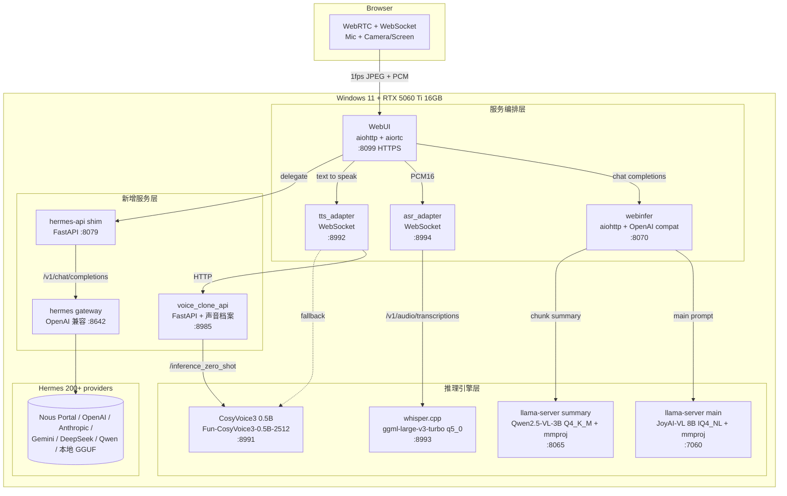
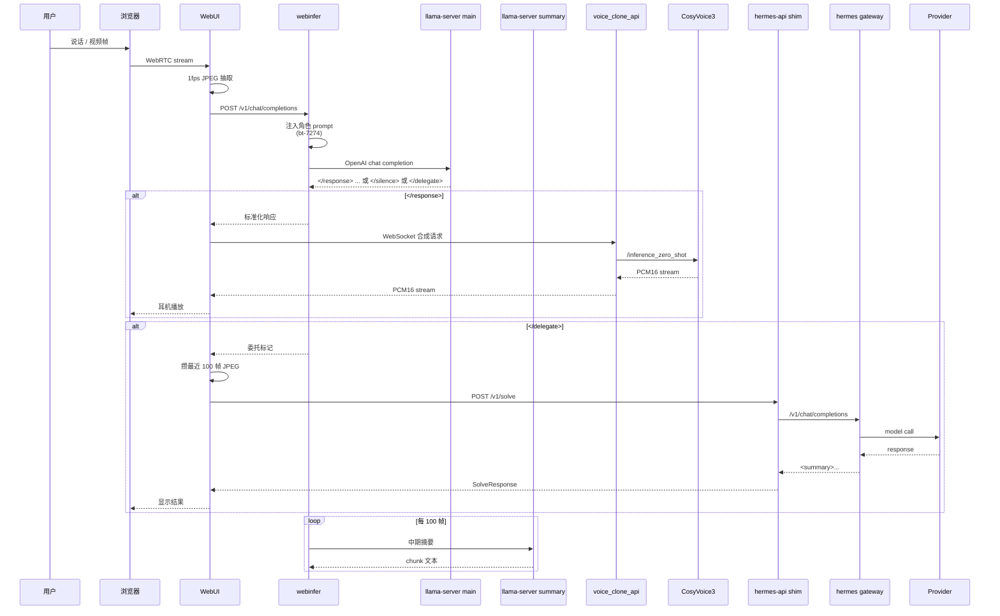

> 🚫 **已过时：本文不是现行拓扑。** 现行运行拓扑请看 **[`../runtime-topology.md`](../runtime-topology.md)**。
>
> ~~**现行运行拓扑（2026-07-12）**~~（**该自称已作废**）：`7060` 社区量化 JoyAI llama-server + `8070` webinfer + `8099` WebUI + `8985` MiniMax voice-clone/TTS。
> ~~Jarvis 文本/语音对话为降低延迟直接调用同一个 7060~~（**已被 ADR-0006 取代**：所有 LLM 调用必须经 webinfer :8070）。
> 下文 11 进程、CosyVoice `8991`、TTS adapter `8992`、whisper `8993`、ASR adapter `8994` 是早期本地化方案的历史设计，不是当前启动计划。
> 当前唯一启动入口：`start-joyai.ps1 -Mode default`；停止：`stop-joyai.ps1`。
>
> ⚠️ 2026-09-14 核查：本文 §1 拓扑图与 §3 进程表**仍原样保留 11 进程 + 8991/8992**，与第 3 行的免责声明自相矛盾。阅读时请只采信本警示块，正文一律视为历史设计。
# 本地化架构（Windows + RTX 5060 Ti 16GB）

> 配套：`doc/local/tech-local.md`（细节）、`doc/local/pm-local.md`（产品）、`doc/research/lightweight-replacement.md`（选型证据）

---

## 1. 系统拓扑



## 2. 数据流（一帧视频的完整路径）



## 3. 进程组（按启动顺序）

| # | 进程 | 端口 | 启动 | 显存 | 备注 |
| - | - | - | - | -: | - |
| 1 | llama-server main | 7060 | 后台 | 5.8 GB | sm_120 build + IQ4_NL + Q8 KV |
| 2 | llama-server summary | 8065 | 后台 | 2.9 GB | Q4_K_M + Q8 KV |
| 3 | whisper.cpp | 8993 | 后台 | 0.7 GB | cublas 12.4 prebuilt |
| 4 | CosyVoice3 | 8991 | 后台 | 1.1 GB | conda env + FP16 |
| 5 | voice_clone_api | 8985 | 后台 | 0.2 GB | FastAPI + 0 个 Python 模型 |
| 6 | hermes gateway | 8642 | 后台 | 0.2 GB | Nous Research Node + Python |
| 7 | hermes-api shim | 8079 | 后台 | 0.15 GB | 我们的 shim |
| 8 | webinfer 适配器 | 8070 | 后台 | 0.1 GB | aiohttp |
| 9 | tts_adapter | 8992 | 后台 | 0.08 GB | WebSocket 客户端 |
| 10 | asr_adapter | 8994 | 后台 | 0.08 GB | WebSocket 客户端 |
| 11 | WebUI | 8099 | **前台** | 0.15 GB | aiohttp + aiortc |
| | **合计** | | | **~11.5 GB** | 留 4.5 GB 给游戏 |

## 4. 启动顺序与依赖

```
hermes gateway ──(无需)──┐
llama-server main ───┐   │
llama-server summary ┤   │
whisper.cpp ──────────┤   │
CosyVoice3 ───────────┤   │
voice_clone_api ───┐  │   │
hermes-api shim ───┼──┤   │
webinfer ──────────┼──┤   │
tts_adapter ────────┼──┤   │
asr_adapter ────────┼──┤   │
WebUI ──────────────┴──┴───┘
                    (前台, Ctrl+C 停全部)
```

依赖链：

- voice_clone_api → CosyVoice3
- tts_adapter → voice_clone_api 或 CosyVoice3
- webinfer → llama-server main + summary
- hermes-api shim → hermes gateway
- WebUI → webinfer + tts_adapter + asr_adapter + hermes-api shim

## 5. 文件分布

```
D:\AI\
├── workspace\
│   └── JoyAI-VL-Interaction-main\   # 项目代码
│       ├── prompts\                  # 角色 prompt
│       ├── services\                 # 5 + 1 个服务
│       │   ├── webinfer\
│       │   ├── webui\
│       │   ├── asr\
│       │   ├── tts\
│       │   ├── background-agent\
│       │   │   ├── codex_api\        # 旧（保留）
│       │   │   └── hermes_api\       # 新
│       │   └── voice-clone\          # 新
│       ├── install\                  # PowerShell 安装器
│       ├── services\scripts\         # PowerShell 编排
│       ├── doc\                      # 本地化文档
│       └── docs\                     # 调研报告
├── models\                           # 所有模型权重
│   ├── main\                         # 主对话 GGUF
│   ├── summary\                      # 摘要 GGUF
│   ├── asr\                          # whisper 模型
│   └── tts\                          # CosyVoice 模型
├── bin\                              # 原生可执行
│   ├── llama.cpp\
│   └── whisper.cpp\
└── tools\                            # 源码（Conda env 用）
    └── CosyVoice\
```

## 6. 与原架构的差异

| 维度 | 原 | 本地 | 原因 |
| - | - | - | - |
| 主对话后端 | vLLM | llama-server | Win 友好，GGUF 量化 |
| 摘要后端 | vLLM | llama-server | 同上 |
| ASR 后端 | vLLM | whisper.cpp | Win 友好，Q5_0 量化 |
| TTS 后端 | vLLM-Omni | CosyVoice3 | Win 友好，零样本克隆 |
| Agent 后端 | Codex CLI | Hermes HTTP API | 用户自选，零 OpenAI 锁定 |
| 角色化 | 无 | `prompts/*.txt` 注入 | bt-7274 等可热重载 |
| 声音 | 固定 | 零样本克隆 | 用户私有音色 |
| 总进程数 | 8 | 11 | 多 1 个 voice_clone |
| GPU | 3 张 | 1 张 | 5060Ti 单卡 |
| 显存峰值 | ~70GB | ~11.5GB | GGUF 量化 + KV 压缩 |

## 7. 接口契约不变性

- **webui 端零修改**：调 `POST http://127.0.0.1:8070/v1/chat/completions`、调 `POST http://127.0.0.1:8992/`、调 `POST http://127.0.0.1:8994/`、调 `POST http://127.0.0.1:8079/v1/solve`
- **OpenAI 兼容**：所有推理后端都暴露 OpenAI 协议，webui / webinfer 不感知
- **Pydantic 字段一致**：`SolveRequest` / `SolveResponse` / `FrameInput` 字段名/顺序/类型与原 codex 100% 相同

## 8. 故障域

| 故障 | 影响 | 隔离 |
| - | - | - |
| hermes 挂 | 委派失败，主对话正常 | `/v1/solve` 返回 `status: failed`，不影响其他 |
| CosyVoice 挂 | TTS 失败，主对话可显示文字 | tts_adapter 走 fallback 路径 |
| whisper 挂 | 不能语音输入，可文字输入 | webui 切到纯文字模式 |
| llama-server summary 挂 | 没有长期记忆，主对话正常 | webinfer 跳过摘要 |
| llama-server main 挂 | **全瘫** | 唯一 SPOF；监控 + 自动重启 |
| webui 挂 | 用户看不到 | 重启 |
