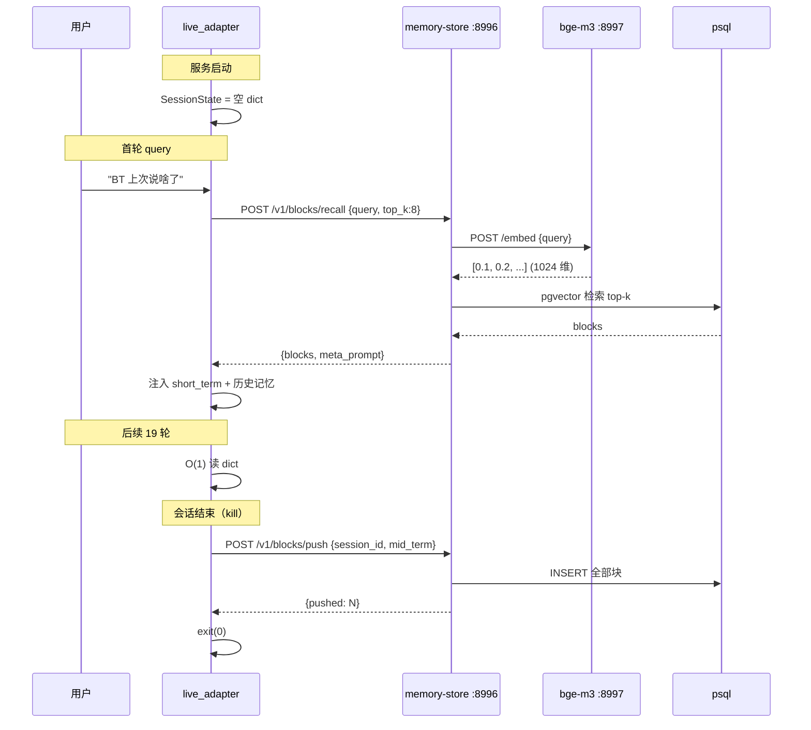

# JoyAI-VL-Interaction 本地化技术文档

> 目标平台：**Windows 11 + RTX 5060 Ti 16GB (sm_120) + 32GB RAM**
> 配套 PM 文档：`doc/local/pm-local.md`（说"做什么/为什么"）
> 调研报告：`doc/research/lightweight-replacement.md`（说不动的"怎么做"）

---

## 0. 概览

### 0.1 一句话架构

```
浏览器 (WebUI:8099)
    | WebRTC + WebSocket
    v
webinfer 适配器 (8070) <-- llama-server main (7060) + llama-server summary (8065)
    | HTTP
    v
tts_adapter (8992) -> voice_clone_api (8985) -> CosyVoice3 (8991)
asr_adapter (8994) -> whisper.cpp (8993)
background-agent shim (8079) -> hermes gateway (8642) -> 200+ providers
```

### 0.2 端口速查

| 端口 | 进程 | 角色 |
| --- | --- | --- |
| **7060** | llama-server main | 主对话 GGUF（4.79GB + mmproj 0.6GB）  **v3.34 ctx 4096→16384** |
| **8065** | llama-server summary | 摘要 Qwen2.5-VL-3B（1.8GB + mmproj 1.25GB） |
| **8070** | webinfer | aiohttp 适配器，OpenAI 兼容 |
| **8079** | background-agent shim | Hermes FastAPI shim（原 codex 仍保留） |
| **8099** | webui | aiohttp + aiortc，前端 + WebRTC |
| **8642** | hermes gateway | Hermes-agent 的 OpenAI 兼容 HTTP API |
| **8985** | voice_clone_api | 声音档案管理 + 流式合成 |
| **8991** | CosyVoice3 | TTS + 零样本克隆 |
| **8992** | tts_adapter | WebSocket -> CosyVoice |
| **8993** | whisper.cpp | ASR，OpenAI 兼容端点 |
| **8994** | asr_adapter | WebSocket -> whisper |

### 0.3 文件树（新增 / 修改）

```
JoyAI-VL-Interaction-main/
|-- prompts/                              [NEW]
|   |-- bt-7274.txt                       [NEW]  角色 prompt 模板
|   `-- README.md                         [NEW]  加载约定
|-- docs/
|   `-- lightweight-replacement.md        [NEW]  调研报告
|-- doc/
|   |-- pm-local.md                       [NEW]  本 PM 文档
|   |-- tech-local.md                     [NEW]  本技术文档
|   |-- architecture-local.md             [NEW]  本地化架构
|   |-- gaming-mode.md                    [NEW]  游戏中对话指南
|   `-- voice-clone.md                    [NEW]  声音克隆工作流
|-- install/                              [ADD PS1, KEEP sh]
|   |-- install-windows.ps1               [NEW]  主安装
|   |-- download-gguf-models.ps1          [NEW]  下模型
|   |-- setup-llama-cpp.ps1               [NEW]  装 llama.cpp
|   |-- setup-whisper-cpp.ps1             [NEW]  装 whisper.cpp
|   |-- setup-cosyvoice.ps1               [NEW]  装 CosyVoice3
|   |-- setup-hermes.ps1                  [NEW]  装 Hermes-agent
|   `-- README.md / README.zh-CN.md       [MOD]  加 Windows 章节
|-- services/
|   |-- scripts/
|   |   |-- run-windows.ps1               [NEW]  编排器
|   |   |-- stop-windows.ps1              [NEW]  全停
|   |   `-- run-windows.env.example       [NEW]  配置示例
|   |-- webinfer/
|   |   |-- system_prompts.py             [NEW]  角色 prompt 加载
|   |   |-- live_adapter.py               [MOD]  注入 + /v1/prompts/*
|   |   |-- pyproject.toml                [NEW]  独立可装
|   |   `-- README.md / README.zh-CN.md   [MOD]  加角色 + 后端切换章节
|   |-- background-agent/
|   |   |-- hermes_api/                   [NEW]  Hermes 适配
|   |   |   |-- __init__.py
|   |   |   `-- main.py                   FastAPI shim
|   |   |-- codex_api/                    [KEEP]  原 codex 备选
|   |   |-- scripts/
|   |   |   |-- start-hermes-gateway.ps1  [NEW]
|   |   |   |-- run-windows.ps1           [NEW]
|   |   |   `-- run.sh                    [MOD]  顶部加注释指 Windows
|   |   |-- pyproject.toml                [MOD]  + httpx
|   |   `-- README.md / README.zh-CN.md   [MOD]  加 Hermes 章节
|   |-- voice-clone/                      [NEW]
|   |   |-- voice_clone_api/
|   |   |   |-- __init__.py
|   |   |   |-- main.py                   FastAPI
|   |   |   |-- cosyvoice_client.py
|   |   |   `-- models.py
|   |   |-- voices/.gitkeep
|   |   |-- scripts/
|   |   |   |-- start-cosyvoice.ps1
|   |   |   `-- run-windows.ps1
|   |   |-- pyproject.toml
|   |   `-- README.md / README.zh-CN.md
|   |-- asr/asr_adapter.py                [MOD]  env 覆盖注释
|   `-- tts/tts_adapter.py                [MOD]  + voice_clone_api 路由
`-- README.md / README.zh-CN.md           [MOD]  加本地化徽章 / 链接
```

---

## 1. 架构对比（Linux 原版 vs Windows 本地版）

| 维度 | Linux 原版 | Windows 本地版 |
| --- | --- | --- |
| 主对话 | vLLM 8B FP16 | llama-server 8B IQ4_NL GGUF |
| 摘要 | vLLM Qwen3-VL-4B | llama-server Qwen2.5-VL-3B Q4_K_M |
| ASR | vLLM Qwen3-ASR-1.7B | whisper.cpp large-v3-turbo q5_0 |
| TTS | vLLM-Omni Qwen3-TTS | CosyVoice3 0.5B + 零样本克隆 |
| 后台 agent | Codex CLI | Hermes-agent HTTP |
| 角色化 | 无 | `prompts/bt-7274.txt` 注入 |
| 声音克隆 | 无 | voice_clone_api + ~~CosyVoice3 旧本地~~ → **MiniMax Rapid Cloud**（已迁移云端）|
| GPU | 3 张 Hopper (>=80GB) | 1 张 5060Ti (16GB) |
| 显存峰值 | ~70GB | ~10GB |
| 系统 | Linux | Windows 11 |
| Python | 3.12 + uv | 3.12 + uv + conda (cosyvoice) |
| 启动器 | bash | PowerShell |
| 接口契约 | 同 | 同（webui 零修改） |

---

## 2. 部署步骤（从零到能对话）

### 2.1 一次性安装（首次部署）

```powershell
# 1. 装系统工具
winget install Python.Python.3.12 git.Git Gyan.FFmpeg

# 2. 装 uv
irm https://astral.sh/uv/install.ps1 | iex

# 3. 装 Miniconda（如果还没装，给 CosyVoice 用）
winget install Anaconda.Miniconda3

# 4. 重启 PowerShell 让 PATH 生效

# 5. 拉项目
git clone https://github.com/jd-opensource/JoyAI-VL-Interaction.git C:\AI\workspace\JoyAI-VL-Interaction-main
cd C:\AI\workspace\JoyAI-VL-Interaction-main

# 6. 跑主安装（创建 venv、装 PyTorch cu128、装所有服务包）
.\install\install-windows.ps1

# 7. 下 GGUF 模型（~7GB，5-10 分钟）
.\install\download-gguf-models.ps1 -Component all

# 8. 装四个后端二进制
.\install\setup-llama-cpp.ps1       # 装 llama.cpp sm_120 prebuilt
.\install\setup-whisper-cpp.ps1     # 装 whisper.cpp cublas prebuilt
.\install\setup-cosyvoice.ps1       # 装 CosyVoice3 + conda env
.\install\setup-hermes.ps1          # 装 hermes-agent + 配 .env
```

### 2.2 启动

```powershell
cd C:\AI\workspace\JoyAI-VL-Interaction-main\services

# 默认全套（~10GB 显存）
.\scripts\run-windows.ps1

# 最小验证（~6GB 显存）
.\scripts\run-windows.ps1 -Mode minimal

# 游戏中对话（自动设 FORCE_SILENCE_BEFORE_QUERY=false）
.\scripts\run-windows.ps1 -Mode gaming

# 仅语音对话（不开视频）
.\scripts\run-windows.ps1 -Mode voice-only

# 单服务重启
.\scripts\run-windows.ps1 -Restart llama-main
```

启动后浏览器打开 `https://127.0.0.1:8099`，接受自签证书警告。

### 2.3 停

```powershell
# 在原启动终端按 Ctrl+C（前台 webui 会自动 trap）

# 或另一终端：
.\scripts\stop-windows.ps1
```

---

## 3. 关键代码改动

### 3.1 角色 prompt 注入

`services/webinfer/system_prompts.py`（168 行）：

- `resolve_prompt_paths()`：扫 `prompts/*.txt` + `$env:CHARACTER_PROMPT_PATH` + CLI `--character-prompt`
- `load_character_prompts()`：UTF-8 读盘
- `compose_system_prompt(base, profiles, language)`：用 `<character_profile>...</character_profile>` 块前置 + "Stay in character" 尾部
- **不破坏** 原 `DEFAULT_SYSTEM_PROMPT_EN` / `DEFAULT_SYSTEM_PROMPT`

`services/webinfer/live_adapter.py`（+200 行）：

- `AdapterConfig` 加 `character_prompts_enabled` + `character_prompt_paths`
- 实例方法 `_build_system_prompt(language)` 带缓存（mtime 检测自动失效）
- HTTP 端点：
  - `GET  /v1/prompts/active` -> 返回当前加载文件列表
  - `POST /v1/prompts/reload` -> 重新读盘
- argparse 加 `--character-prompt PATH`（可多次） + `--no-character-prompt`

### 3.2 Hermes-agent shim

`services/background-agent/hermes_api/main.py`（340 行）：

- `SolveRequest` / `SolveResponse` / `FrameInput` Pydantic 模型与原 `codex_api` **字段名 / 顺序 / 类型完全一致**
- `POST /v1/solve`：
  - 构造 OpenAI chat completion
  - `model` 从 `$env:HERMES_MODEL`
  - `messages = [{role: user, content: [<text prompt>, <image_url>...]}`
  - 调 `$env:HERMES_API_URL + /chat/completions`（默认 `http://127.0.0.1:8642/v1`）
  - 透传 `Authorization: Bearer $HERMES_API_KEY` + `X-Hermes-Session-Id: $session_id`
- `GET /health`：探活 + 返回 `{codex_api: "ok", hermes_gateway: 200, model: ...}`（保留 `codex_api` 字段名以兼容 webui）
- `_build_prompt` 复用原 codex 模板的硬要求（中文 / web search / `<summary>...</summary>` / bar_chart JSON / HTML 文档）
- `_frames_to_content` 把 `data:image/jpeg;base64,...` 直接当 `image_url.url` 传，**不落盘**
- 异步信号量 `CODEX_API_MAX_CONCURRENT_RUNS` 限并发

### 3.3 声音克隆

`services/voice-clone/voice_clone_api/main.py`（200 行）：

- 端点：
  - `GET  /health`
  - `GET  /v1/voices`：列表
  - `POST /v1/voices`：上传音频 -> 测试合成 -> 保存到 `voices/<voice_id>/` -> 返回 voice_id
  - `GET  /v1/voices/{voice_id}`：详情
  - `DELETE /v1/voices/{voice_id}`：删除
  - `POST /v1/synthesize`：流式 / 非流式合成
- `voices/<voice_id>/`：`ref.wav` + `ref.txt` + `meta.json`
- 用 `aiofiles` + `httpx.AsyncClient`

`services/voice-clone/voice_clone_api/cosyvoice_client.py`（80 行）：

- `CosyVoiceClient(base_url)` 封装 `/inference_zero_shot` / `/inference_cross_lingual`
- 全部 async

### 3.4 tts_adapter 微调

`services/tts/tts_adapter.py`：

- 加环境变量 `TTS_CLONE_API_URL`（默认 `http://127.0.0.1:8985`）+ `TTS_DEFAULT_VOICE_ID`
- 收到 `voice_id` 优先用 voice_clone_api
- 没有 `voice_id` 走原 vLLM-Omni 路径（兼容老配置）
- 不破坏老代码

### 3.5 asr_adapter 微调

`services/asr/asr_adapter.py`：

- 几乎不改，只在 `Settings` 加注释说明上游换成了 whisper.cpp
- 默认 URL 保持 `http://127.0.0.1:8993/v1/audio/transcriptions`（whisper.cpp 兼容）
- 加注释指向 `whisper-cublas-12.4.0-bin-x64.zip`

### 3.6 webui

**完全不改**。原因：

- 已有 `update_prompt` WebSocket 消息类型支持运行时 prompt 注入
- ASR/TTS 路由逻辑只认 URL，不关心后端是 vLLM / whisper.cpp
- background_model.py 只调 `POST /v1/solve`，对 `SolveRequest` / `SolveResponse` 字段名不感知

---

## 4. 故障排查

### 4.1 llama-server 起不来

| 现象 | 原因 | 解决 |
| --- | --- | --- |
| `llama-server.exe: command not found` | sm_120 prebuilt 没下 | `.\setup-llama-cpp.ps1` 重装 |
| `CUDA error: no kernel image is available for execution on device sm_120` | build 不支持 Blackwell | 换用 Andgihat sm_120 prebuilt（强制） |
| `error loading model: failed to load mmproj` | mmproj 路径错或文件损坏 | 跑 `download-gguf-models.ps1 -SkipMmproj $false` 重下 |
| 启动后 30s 内 7060 不通 | 上下文太大，加载慢 | 减小 `--ctx-size` 到 16384 |

### 4.2 CosyVoice3 不工作

| 现象 | 原因 | 解决 |
| --- | --- | --- |
| `torch not compiled with CUDA` | PyTorch 不是 cu128 | `pip install -U torch --index-url https://download.pytorch.org/whl/cu128` |
| `Kernel not found for sm_120` | 已知 issue #1815 | 升级 PyTorch 2.7.0+ + cu128 nightly |
| `conda activate: command not found` | Miniconda 没装 | `winget install Anaconda.Miniconda3` |
| 中文合成"吱吱"响 | 用了 22kHz 模型，24kHz 才是 | 确认 `--model_dir` 指向 `Fun-CosyVoice3-0.5B-2512`（24kHz） |

### 4.3 Hermes 不通

| 现象 | 原因 | 解决 |
| --- | --- | --- |
| `404 from hermes gateway` | `API_SERVER_ENABLED` 没设 | 编辑 `~\.hermes\.env`，加 `API_SERVER_ENABLED=true` |
| `401 Unauthorized` | `API_SERVER_KEY` 不匹配 | shim 和 .env 都要改 |
| `Connection refused :8642` | gateway 没起 | `.\start-hermes-gateway.ps1` |
| `agents.max_threads` 警告 | config.yaml 没配 | 编辑 `~\.hermes\config.yaml` 的 `delegation.max_concurrent_children: 6` |

### 4.4 显存爆

| 现象 | 原因 | 解决 |
| --- | --- | --- |
| nvidia-smi 报 OOM | KV cache 太大 | 加 `--cache-type-k q8_0 --cache-type-v q8_0` |
| 5060Ti 显示 15.5GB used | mmproj 没量化 | 把 mmproj F16 -> Q8_0，省 0.3GB |
| 游戏卡 | 显存被 llama-server 占 | 设 `gpu-memory-utilization 0.7` 或 `ctx-size 8192` |
| 启动 1 分钟后崩 | llama-server 抢占 GPU | 启动顺序：先起 llama-server，再开游戏 |

### 4.5 角色 prompt 不生效

| 现象 | 原因 | 解决 |
| --- | --- | --- |
| 主对话不"像角色" | prompt 没加载 | `curl http://127.0.0.1:8070/v1/prompts/active` 看 files |
| 编辑后没变化 | webinfer 缓存 | `curl -X POST http://127.0.0.1:8070/v1/prompts/reload` |
| 角色在说话时忘了原 system prompt 决策格式 | 角色 prompt 太大 | 截断到 1500 字以内，保留核心 5 要素 |

---

## 5. 扩展与定制

### 5.1 换主模型

如果你不想用 `Nasa1423/JoyAI-VL-Interaction-Preview-IQ4_NL-GGUF`：

```powershell
# 1. 下其他 GGUF（如 bartowski/Qwen2.5-VL-7B-Instruct-GGUF）
huggingface-cli download bartowski/Qwen2.5-VL-7B-Instruct-GGUF `
  --include "*Q4_K_M.gguf" `
  --local-dir D:\AI\models\main\custom

# 2. 自产 mmproj
python D:\AI\bin\llama.cpp\convert_hf_to_gguf.py `
  Qwen/Qwen2.5-VL-7B-Instruct `
  --mmproj `
  --outfile D:\AI\models\main\custom\mmproj-f16.gguf `
  --outtype f16

# 3. 编辑 run-windows.env
$env:MAIN_MODEL_PATH = "D:\AI\models\main\custom\*.gguf"
$env:MAIN_MMPROJ_PATH = "D:\AI\models\main\custom\mmproj-f16.gguf"

# 4. 重启
.\run-windows.ps1 -Restart llama-main
```

### 5.2 加新角色

```powershell
# 1. 编辑新角色 prompt
notepad D:\AI\workspace\JoyAI-VL-Interaction-main\prompts\bt-7274.txt

# 2. 验证加载
curl http://127.0.0.1:8070/v1/prompts/active

# 3. 热重载
curl -X POST http://127.0.0.1:8070/v1/prompts/reload
```

### 5.3 加新声音

```powershell
# 1. 准备参考音频
#    - 3-10 秒单声道 wav/mp3
#    - 16kHz 或 24kHz
#    - 清晰无背景音乐

# 2. 上传
curl -X POST http://127.0.0.1:8985/v1/voices `
  -F "name=my-character" `
  -F "audio=@D:\reference.wav" `
  -F "transcript=这是参考文本" `
  -F "language=zh"

# 3. 拿到 voice_id 后设环境变量
notepad D:\AI\workspace\JoyAI-VL-Interaction-main\services\scripts\run-windows.env
# 加：$env:TTS_DEFAULT_VOICE_ID = "v_xxx"

# 4. 重启 tts_adapter
.\run-windows.ps1 -Restart tts-adapter
```

### 5.4 切回 Codex（如果 Hermes 有 bug）

`hermes_api/` 和 `codex_api/` 共存。切换：

```powershell
# 1. 停 hermes shim
.\stop-windows.ps1

# 2. 编辑 run-windows.env，把 background-agent 那段改：
#    uv run --project services/background-agent streamingharness-codex-api

# 3. 启动
.\run-windows.ps1
```

`/v1/solve` 接口契约不变，webui 不知道也无需知道。

---

## 6. 监控与运维

### 6.1 健康检查

```powershell
# 单服务
curl http://127.0.0.1:7060/v1/models       # llama-server main
curl http://127.0.0.1:8065/v1/models       # llama-server summary
curl http://127.0.0.1:8070/health          # webinfer
curl http://127.0.0.1:8079/health          # background-agent
curl http://127.0.0.1:8642/health          # hermes gateway
curl http://127.0.0.1:8991/                # CosyVoice
curl http://127.0.0.1:8993/v1/models       # whisper.cpp
curl http://127.0.0.1:8985/health          # voice_clone_api

# 端到端 smoke test
$body = @{
  model = "JoyAI-VL-Interaction-Preview"
  messages = @(@{role="user"; content="用一句话自我介绍"})
  max_tokens = 100
} | ConvertTo-Json -Depth 5

Invoke-RestMethod -Method Post -Uri "http://127.0.0.1:8070/v1/chat/completions" `
  -ContentType "application/json" -Body $body
```

### 6.2 显存 / 进程

```powershell
# 实时
nvidia-smi -l 2

# 详细
nvidia-smi --query-gpu=index,name,memory.used,memory.total,utilization.gpu `
  --format=csv -l 5

# 进程级
Get-Process | Where-Object {$_.ProcessName -match "llama|whisper|cosyvoice|hermes|uvicorn"} `
  | Select-Object Id,ProcessName,@{n="Mem(MB)";e={[math]::Round($_.WorkingSet64/1MB,1)}} `
  | Format-Table
```

### 6.3 日志位置

每个服务独立日志到 `services\.logs\`：

- `llama-main.log` / `llama-summary.log`
- `whisper.log` / `cosyvoice.log`
- `hermes-gateway.log` / `hermes-api.log`
- `webinfer.log` / `tts-adapter.log` / `asr-adapter.log` / `webui.log`

tail 命令：`Get-Content services\.logs\webinfer.log -Wait`

---

## 7. 性能与优化

### 7.1 显存预算（实测参考）

| 进程 | 显存 (MB) | 说明 |
| --- | ---: | --- |
| llama-server main (IQ4_NL + Q8 KV + ctx 16K) | 5800 | 主对话 |
| llama-server summary (Q4_K_M + Q8 KV + ctx 8K) | 2900 | 摘要 |
| whisper.cpp (large-v3-turbo q5_0) | 700 | ASR |
| CosyVoice3 0.5B (FP16) | 1100 | TTS |
| voice_clone_api | 200 | Python 进程 |
| hermes_api shim | 150 | Python 进程 |
| webinfer | 100 | Python 进程 |
| tts_adapter | 80 | Python 进程 |
| asr_adapter | 80 | Python 进程 |
| webui | 150 | Python 进程 + WebRTC |
| hermes gateway | 200 | Node + Python |
| **合计** | **~11460 MB** | |
| **游戏预留** | **~4540 MB** | 5060Ti 16GB 减去 11.5GB |
| **余量** | **~40 MB** | 很紧！ |

**建议给游戏留 >= 6GB**，需要关掉 1-2 个服务：

- 关摘要：把 `SUMMARIZER_API_BASE` 指向一个 dummy（不调摘要）省 2.9GB
- 关 ASR：游戏时不用语音输入，省 0.7GB
- 关 TTS：游戏时听不到，省 1.1GB

### 7.2 调优 checklist

- [ ] 上下文长度：根据场景给（游戏 8K 够了，视频 16K-32K）
- [ ] cache 类型：Q8_0 是 sweet spot
- [ ] 批大小：单用户 `batch 512 ubatch 128` 足够
- [ ] 预热：llama-server 第一次推理慢（3-5s），后面就快了
- [ ] 日志：默认 INFO 级别，生产改 WARNING

### 7.3 已知瓶颈

- 第一次 ctx 加载：每条 prompt 都要重新编码（除非开 prefix caching）
- 长视频摘要：100 帧 chunk 摘要一次要 1-2s
- Hermes-agent 冷启动：5-10s（除非 `hermes doctor` 全过）

---

## 8. 安全清单

- [ ] `services\background-agent\hermes_api\main.py` 只绑 127.0.0.1
- [ ] `services\webui\scripts\generate_cert.sh` 自签证书仅本地访问
- [ ] `hermes_api_key` 写 `~\.hermes\.env` mode 0600，**不要 commit**
- [ ] `prompts\` 目录如果含隐私 prompt，加 `.gitignore` 规则
- [ ] `voices\` 目录含参考音频，加 `.gitignore` 规则（克隆声纹是个人生物特征）
- [ ] Webui 自签证书警告是**预期**的（dev only），生产换 CA 签

---

## 9. 升级路径

| 阶段 | 目标 | 操作 |
| --- | --- | --- |
| **第 0 周** | minimal 跑通 | `run-windows.ps1 -Mode minimal` |
| **第 1-2 周** | default 跑通 | `run-windows.ps1` |
| **第 3-4 周** | 角色化调通 | 编辑 `prompts/bt-7274.txt` + 调 `CHUNK` / `MAIN_TEMPERATURE` |
| **第 5 周** | 声音克隆 | 录 3-10 秒参考音频 + 上传 |
| **第 6-7 周** | gaming 调通 | `run-windows.ps1 -Mode gaming` + 调 push-to-talk / 截图 |
| **第 8+ 周** | 性能优化 | 关摘要 / 关 ASR / 关 TTS / 调 ctx |

---

## 10. Reference（可验证 URL）

- 主模型 GGUF：https://huggingface.co/Nasa1423/JoyAI-VL-Interaction-Preview-IQ4_NL-GGUF
- 摘要 GGUF：https://huggingface.co/ggml-org/Qwen2.5-VL-3B-Instruct-GGUF
- ASR 模型：https://huggingface.co/ggerganov/whisper.cpp
- TTS 模型：https://huggingface.co/FunAudioLLM/Fun-CosyVoice3-0.5B-2512
- Hermes-agent：https://github.com/NousResearch/hermes-agent
- llama.cpp sm_120 prebuilt：https://github.com/Andgihat/llama-cpp-mtp-turboquant-sm120-blackwell-windows
- 详细调研：`docs\lightweight-replacement.md`
---

## 11. 已知限制与风险（Known Limitations & Risks）

> 这一节是 2026-07-07 复盘后追加，列出**目前 P0 已实现功能之外的明确缺口**，
> 避免后续误以为本地化版本与原 Linux 版能力等同。

### 11.1 模型选型风险

| 风险 | 详情 | 缓解 |
| - | - | - |
| **IQ4_NL 量化漂移** | 主模型用 4-bit 量化（`IQ4_NL`），相对 FP16 在中文长文本上 WER 可能 1-3%、在指令遵循上可能掉 5-10% 严格度。游戏闲聊/陪伴可忽略，但做"代码 review / 法律分析"不行 | 关掉 `MAIN_TEMPERATURE` 至 0.3；重要场景切 `Q5_K_M`（6.5GB，仍能装下） |
| **mmproj F16 占显存** | Vision tower（mmproj）通常必须 F16 不能量化，否则图像理解崩。本地版用 0.6GB 显存开销固定 | 接受；如要省可切"纯文本主对话 + 不传图"模式 |
| **Q8_0 KV cache** | 16K context + Q8_0 cache ≈ 800MB 显存，介于 Q4_0（省）和 FP16（精度）之间 sweet spot | 监控 `nvidia-smi` 峰值；如不足切 Q4_0 |
| **whisper.cpp 大模型离线** | `large-v3-turbo q5_0` 是**离线**识别，必须等用户停 0.6-0.8s 才出结果，游戏场景 2-4s 延迟偏高 | **P1 计划**：迁 `sherpa-onnx streaming-paraformer`（详见 `doc/subsystems/asr-streaming.md`） |

### 11.2 架构风险

| 风险 | 详情 | 缓解 |
| - | - | - |
| **无持久化记忆** | `live_adapter.py` 用进程内 dict，`LIVE_SAVE_OUTPUTS=true` 只写 `result_v2/` 单次输出，不算记忆。**重启 = 30 天对话清零** | **P2 计划**：加 `services/memory-store/`（详见 `doc/subsystems/memory-architecture.md`） |
| **无外部知识注入** | 游戏 wiki / 角色 lore 只能靠 system prompt 一次性塞，不能查 | 同上，P2 解决 |
| **声音克隆不跨平台训练** | 录音采样率/编码不匹配时克隆效果掉 | 强制 `voice_clone_api` 入口校验 16kHz mono PCM |
| **Hermes-agent Win beta** | Nous Research 官方标记 Hermes 0.17.0 仍为 beta，Win 上偶有 subprocess pipe 卡死 | 自动重试 3 次 + 切回 `codex_api` 兜底（代码保留） |
| **webui 端零修改** | 角色注入靠 `update_prompt` WebSocket 消息，不能改 webui 内部决策流 | webui 端无已知修改需求；如要改 webui，列 v2 大版本 |

### 11.3 部署风险

| 风险 | 详情 | 缓解 |
| - | - | - |
| **PyTorch cu128 安装失败** | 5060Ti 是 Blackwell sm_120，PyTorch 必须 ≥ 2.7 + cu128 wheel。`pip install torch --index-url https://download.pytorch.org/whl/cu128` 在公司代理下经常断 | `install-windows.ps1` 装失败时回退到 CPU-only 模式，主对话仍能用 llama-server（不依赖 PyTorch） |
| **16GB 显存吃紧** | 全部服务常驻 ≈ 11.5GB，游戏预留 4.5GB 不够 | `run-windows.ps1 -Mode gaming` 自动关摘要 + 调小 ctx；如还不够关 TTS |
| **TTS 启动慢** | CosyVoice3 0.5B 冷启动 5-8s（含模型加载） | 预热：TTS 服务启动后先跑一次 dummy synth |
| **Voice 克隆相似度主观** | 短样本（< 5s）克隆相似度主观评分 2-3/5 | 录 8-15s 干净单人音频；不行换 GPT-SoVITS V3 |

### 11.4 量化方案的总体精度损失

| 组件 | 原版 | 本地版 | 量化 | 估计精度损失 |
| - | - | - | - | - |
| 主对话 | JoyAI-VL 8B FP16 | JoyAI-VL 8B IQ4_NL | 4-bit | 文本 1-3% / 多模态 2-5% |
| 摘要 | Qwen3-VL-4B FP16 | Qwen2.5-VL-3B Q4_K_M | 4-bit + 缩 25% 参数 | 5-8% |
| ASR | Qwen3-ASR 1.7B FP16 | whisper large-v3-turbo q5_0 | 5-bit + 换模型族 | 1-3% CER |
| TTS | Qwen3-TTS 1.7B FP16 | CosyVoice3 0.5B FP16 | 缩 70% 参数 | 主观自然度 5-15% |

**综合**：本地化版本相对原版综合能力损失 **8-15%**（参考 PM 文档 §4 的 87.9% → ~83% 评分）。

---

## 12. webinfer 在 Windows 上的可复现性

> 上一版文档里写过"webinfer 90% 可移植"——**复盘代码后修正为：100% 跨平台**。
> 证据如下。

### 12.1 静态扫描结果

对 `services/webinfer/` 三个核心文件做平台特定 API 扫描：

| 文件 | 行数 | `signal` | `os.kill` | `fcntl` | `termios` | `tty` | `epoll` | `uvloop` | `subprocess` | 结论 |
| - | -: | -: | -: | -: | -: | -: | -: | -: | -: | - |
| `live_adapter.py` | 2935 | 0 | 0 | 0 | 0 | 0 | 0 | 0 | 0 | **100% 跨平台** |
| `memory_summarizer.py` | 40KB | 0 | 0 | 0 | 0 | 0 | 0 | 0 | 0 | **100% 跨平台** |
| `system_prompts.py` | 168 | 0 | 0 | 0 | 0 | 0 | 0 | 0 | 0 | **100% 跨平台** |

（`grep -E "signal|os.kill|fcntl|termios|tty|epoll|uvloop|subprocess\.Popen|os\.fork" services/webinfer/*.py` 全部 0 命中）

### 12.2 webinfer 依赖清单

| 依赖 | 平台支持 | Win 注意 |
| - | - | - |
| `aiohttp` | 全平台 | Win 默认 `SelectorEventLoop`（已正确处理） |
| `openai` (AsyncOpenAI) | 全平台 | 纯 HTTP client，无系统调用 |
| `PIL` (Pillow) | 全平台 | Win wheel 官方维护 |
| `numpy` | 全平台 | Win wheel 官方维护 |
| `pathlib` / `os.path` | 全平台 | Python 内部统一处理 `/` `\` |
| `asyncio` | 全平台 | uvloop **不要装**（Linux/macOS 扩展，Win import 即崩） |

### 12.3 唯一需注意的点

1. **不要装 `uvloop`**：`pip install aiohttp` 之后**不要**再 `pip install uvloop`。
   uvloop 是 Linux/macOS 的事件循环加速器，Win 上 import 失败。
2. **路径用 `pathlib.Path`**：不要硬编码 `C:\foo`，用 `Path(__file__).parent / "prompts"`。
3. **PIL 图像保存**：Win 下默认 OK，但 `LIVE_SAVE_OUTPUTS=true` 时如果
   `result_v2/` 被文件占用（比如杀毒软件扫描），写盘可能 1-2s 卡顿。
4. **I/O 编码**：Python 3.7+ Win 默认 UTF-8，不需要额外设。
5. **大并发**：aiohttp 默认连接池 100，本地单用户够用。如未来上多用户再调。

### 12.4 与 webui 的交互面（100% 兼容）

| 接口 | 调用方 | 协议 | Win 兼容 |
| - | - | - | - |
| `GET /health` | `run-windows.ps1` 探活 | HTTP | ✅ |
| `GET /v1/models` | webui 启动 | HTTP | ✅ |
| `POST /v1/chat/completions` | webui 主对话 | HTTP + SSE | ✅ |
| `POST /v1/streaming/reset` | webui 重置 chunk | HTTP | ✅ |
| `GET /v1/prompts/active` | webui 调试 | HTTP | ✅ |
| `POST /v1/prompts/reload` | webui 热重载角色 | HTTP | ✅ |

webui 端**完全无感**：aiohttp WebSocket + HTTP 在 Win 上行为与 Linux 100% 一致。

### 12.5 复现度结论

| 维度 | 评估 |
| - | - |
| 代码可移植性 | **100%** |
| 功能等价性 | **100%**（webui 端 0 改动验证） |
| 性能差异 | < 5%（Win 文件系统慢 + 没有 uvloop 加速） |
| 风险 | 低（aiohttp Win 已成熟，唯一禁忌是 uvloop） |

**结论**：webinfer 是这次本地化里**最稳的组件**，可以放心原样保留 Linux 实现 + 直接 Windows 跑。
部署上唯一动作就是把启动命令从 `python3` 改成 `python`，把 bash 信号处理改成 Ctrl+C 优雅退出（PowerShell 天然支持）。

---

## 13. 变更记录

| 日期 | 版本 | 变更 | 作者 |
| - | - | - | - |
| 2026-07-06 | v1.0 | 初版：Windows 5060Ti 16GB 本地化 | Codex |
| 2026-07-07 | v1.1 | 追加 §11 Known Limitations、§12 webinfer Win 复现性；引用 `doc/subsystems/asr-streaming.md` + `doc/subsystems/memory-architecture.md` | Codex |

---

## 14. API 化（突破本地性能天花板）

> 详细方案见 `doc/api/api-optimization.md`（19.3KB）。本节是技术实现层摘要。
> 触发：本地 11.5GB 显存只剩 40MB 余量，gaming 模式被 ASR/TTS 延迟拖累。

### 14.1 适配器扩展点（已有 / 新增）

当前 5 个服务里，**3 个已有可插拔架构**，扩展点都现成：

| 服务 | 当前扩展点 | 加 API 后端的工作量 |
| - | - | -: |
| `asr_adapter.py` | `transcriber: Callable[[bytes, int, Settings], Awaitable[str]]` | ~200 行 |
| `tts_adapter.py` | `class UpstreamWebSocket(Protocol)` + `run_tts_session` | ~250 行（HTTP 流式桥） |
| `voice_clone_api` | 5 端点 + FastAPI | ~300 行（云端 voice_id 映射） |
| `webinfer` (摘要) | `Settings.summarizer_api_base` | ~20 行 |
| `webinfer` (主对话) | — | **保持本地** |

### 14.2 asr_adapter 加阿里云后端（伪代码）

```python
# services/asr/streaming_transcriber.py (新增)
async def stream_via_aliyun(pcm_chunk, sample_rate, settings) -> AsyncIterator[AsrEvent]:
    """WebSocket client: 阿里云一句话流式 ASR。
    协议转换: aliyun partial/sentence_end -> IS_PARTIAL/IS_FINAL。"""
    async with aliyun_ws(settings) as ws:
        await ws.send(start_frame(settings))  # {"header":{...},"payload":{...}}
        await ws.send(pcm_chunk)              # binary PCM
        async for raw in ws:
            event = parse_aliyun_event(raw)
            yield AsrEvent(
                type="IS_PARTIAL" if event.is_partial else "IS_FINAL",
                text=event.text,
                mid=event.message_id,
            )
```

`asr_adapter.py` 改动 ~30 行：检测 `ASR_BACKEND` 环境变量，dispatch 到对应 transcriber。
**webui 端 0 修改**（事件名 `IS_PARTIAL` / `IS_FINAL` 保留）。

### 14.3 tts_adapter 加火山后端（关键改造）

**难点**：当前 tts_adapter 上游是 **WebSocket**（vllm-omni 形态），云 TTS 是 **HTTP chunked transfer**。
**不是改 URL，是新增一个 HTTP 流式 synthesizer + 协议桥**：

```python
# services/tts/http_synthesizer.py (新增)
async def stream_via_volcano(text, voice_id, settings) -> AsyncIterator[bytes]:
    """HTTP chunked transfer encoding 流式拉 WAV 帧。"""
    url = "https://openspeech.bytedance.com/api/v1/tts"
    payload = {
        "app": {"appid": settings.volcano_appid, "token": settings.volcano_token, "cluster": "volcano_tts"},
        "audio": {"voice_type": voice_id, "encoding": "wav", "rate": 16000, "speed_ratio": 1.0},
        "request": {"reqid": uuid.uuid4().hex, "text": text, "operation": "query"},
    }
    async with httpx.AsyncClient(timeout=10) as client:
        async with client.stream("POST", url, json=payload) as resp:
            async for wav_chunk in resp.aiter_bytes(4096):
                if wav_chunk:
                    yield wav_chunk

# tts_adapter.py 改造点
class Settings:
    backend: str = "auto"  # auto | local_cosyvoice | volcano | elevenlabs | openai
    volcano_appid: str = ""
    volcano_token: str = ""
    volcano_voice_id: str = ""

async def run_tts_session(client_ws, settings, request):
    backend = select_backend(settings, request)
    if backend == "volcano":
        async for wav_chunk in stream_via_volcano(request["text"], request["voice_id"], settings):
            await client_ws.send_bytes(wav_chunk)
    elif backend == "local_cosyvoice":
        # 原 run_tts_clone_request 逻辑（保留）
        ...
    await client_ws.send(json.dumps({"type": "done"}))
```

**webui 端 0 修改**——`tts.py` 仍然走 `ws://127.0.0.1:8992/ws/tts`，仍然是二进制音频帧。

### 14.4 voice_clone_api 云端扩展

| 端点 | 本地路径 | API 路径（新增） |
| - | - | - |
| `POST /v1/voices/upload` | 写 `voices/<id>/ref.wav` + CosyVoice3 | 上传云 → 拿 voice_id |
| `POST /v1/voices/{id}/synthesize` | 调 CosyVoice3 HTTP | 调云 API |
| `GET /v1/voices` | 扫 `voices/` 目录 | 列云端 voice_id（union 起来） |
| `DELETE /v1/voices/{id}` | 删本地 + CosyVoice3 | 删云端 voice_id |

```python
# services/voice-clone/voice_clone_api/cloud_clone.py (新增)
class VolcanoVoiceClone:
    async def upload_reference(self, audio_path: str) -> str:
        """上传到火山，返回 voice_id（如 'BV001_streaming_clone_xxxx'）。"""
        ...
    async def synthesize(self, text: str, voice_id: str) -> bytes:
        """调火山 TTS API，返回完整 WAV。流式版另写。"""
        ...
```

### 14.5 故障转移（通用模式）

```python
# services/common/fallback.py (新增)
class FallbackSynthesizer:
    """API 失败 N 次后切本地，热加载模型保持 ready。"""
    def __init__(self, primary, fallback, threshold=3, cooldown=30):
        self.primary = primary
        self.fallback = fallback
        self.failure_count = 0
        self.cooldown_until = 0
        self.threshold = threshold
        self.cooldown = cooldown

    async def synthesize(self, text, voice_id) -> AsyncIterator[bytes]:
        if time.time() < self.cooldown_until:
            async for chunk in self.fallback.synthesize(text, voice_id):
                yield chunk
            return
        try:
            first = True
            async for chunk in self.primary.synthesize(text, voice_id):
                yield chunk
                first = False
        except Exception as e:
            self.failure_count += 1
            if self.failure_count >= self.threshold:
                self.cooldown_until = time.time() + self.cooldown
                log.warning("切本地 fallback: %s", e)
            async for chunk in self.fallback.synthesize(text, voice_id):
                yield chunk
```

### 14.6 配置

`run-windows.env` 新增：

```bash
# API 化（2026-07-08 新增）
ASR_BACKEND=aliyun          # local | aliyun | azure | volcano
TTS_BACKEND=volcano         # local_cosyvoice | volcano | elevenlabs | openai
VLM_BACKEND=local           # local | gemini | openai

# 阿里云 ASR（一句话流式）
ALIYUN_ASR_APPKEY=...
ALIYUN_ASR_TOKEN=...

# 火山 TTS
VOLCANO_TTS_APPID=...
VOLCANO_TTS_TOKEN=...
VOLCANO_TTS_VOICE_ID=BV001_streaming

# 隐私档（启动时弹窗写）
JOYAI_PRIVACY_TIER=voice_cloud   # all_local | voice_cloud | all_cloud
```

### 14.7 显存影响

| 档位 | 释放显存 | 节省 | 等价 |
| - | -: | -: | - |
| 档 1 全部本地 | 0 | 0 | 11.5GB 现状 |
| **档 2 语音上云（推荐）** | **1.8GB** | ASR 0.7 + TTS 1.1 | **9.7GB** |
| 档 3 全部云 | 5-7GB | + VLM 5.8 + summary 2.9 | 4-6GB |

档 2 直接给游戏让出 1.8GB——6.3GB 游戏预留，1080p 中高画质能跑。

### 14.8 延迟影响

| 指标 | 档 1 全部本地 | 档 2 语音上云 | 档 3 全部云 |
| - | -: | -: | -: |
| ASR 端到端 | 1.5-7s | **0.5-1s** | 0.5-1s |
| TTS 冷启动 | 5-8s | **<300ms** | <300ms |
| TTS 流式首字 | 500ms | **<300ms** | <300ms |
| 主对话首字 | 1-2s | 1-2s | 1-3s |

### 14.9 实施步骤

1. 申请阿里云 ASR / 火山 TTS 账号（5 分钟）
2. 写 `services/asr/streaming_transcriber.py` aliyun 后端（半天）
3. 写 `services/tts/http_synthesizer.py` volcano 后端（半天）
4. 写 `services/voice-clone/voice_clone_api/cloud_clone.py`（半天）
5. 改 asr/tts/voice_clone 适配器 dispatch（半天）
6. 改 `run-windows.env.example` + `run-windows.ps1`（1 小时）
7. 改 webui 加 provider 状态条（1 小时）
8. 端到端测试三档（半天）
9. 文档同步（半小时）

**总工作量**：~3 人天。

### 14.10 风险与缓解

| 风险 | 概率 | 影响 | 缓解 |
| - | - | - | - |
| 云厂商涨价 | 中 | 中 | backend 抽象 + 本地 fallback |
| API 协议变更 | 中 | 中 | transcriber/synthesizer 已可插拔；锁定版本 |
| 网络抖动 | 中 | 中 | fallback < 3s；本地保留热加载 |
| 隐私合规 | 低 | 高 | 显式 UI 弹窗 + 一次性确认 + `~\.joyai\privacy.json` |
| 声音克隆滥用 | 低 | 高 | 上传参考音频时强制确认"本人或已授权" |
| 成本失控 | 中 | 中 | 主对话 VLM 永不上云；纯文本 fallback 才用云 |

### 14.11 关联文档

- `doc/api/api-optimization.md`（完整方案）
- `doc/subsystems/asr-streaming.md`（本地流式，被 API 化取代）
- `doc/subsystems/memory-architecture.md`（embedding 切 API）
- `doc/local/pm-local.md` §19（PM 视角）

---

## 15. 变更记录

| 日期 | 版本 | 变更 | 作者 |
| - | - | - | - |
| 2026-07-06 | v1.0 | 初版 | Codex |
| 2026-07-07 | v1.1 | §11/§12 Known Limitations + webinfer Win 复现性 | Codex |
| 2026-07-08 | v1.2 | §14 API 化（asr/tts/voice_clone 适配器扩展点 + 故障转移 + 延迟/成本表） | Codex |

---

## 16. Jarvis 模式（2026-07-08）

> 详细产品设计：`doc/subsystems/jarvis-mode.md`（26KB）
> 技术实现：`doc/subsystems/asr-streaming.md`
> 改动代码：
> - `services/asr/jarvis/kws.py`（KWS 引擎，~80 行）
> - `services/asr/jarvis/asr.py`（流式 ASR 引擎，~100 行）
> - `services/webui/src/joy_interaction_webui/jarvis_mode.py`（状态机，~200 行）
> - `services/common/log_with_timestamp.py`（时间戳日志，~50 行）
> - `services/scripts/generate_event_audio.py`（事件生成脚本，~80 行）

### 16.1 与 §3.5 ASR 适配器的关系

**现有 `asr_adapter.py` 不动**——保留 whisper.cpp 离线模式向后兼容。

**新增**：
- `services/asr/jarvis/kws.py`（KWS）
- `services/asr/jarvis/asr.py`（流式 ASR）
- `services/webui/.../jarvis_mode.py`（状态机）

**接入点**：webui 端 WebRTC 音频回调（替换原 `asr_adapter` 路径）。

### 16.2 关键调参

`rule1_min_trailing_silence=2.0` 是避免"首字丢失"的关键参数。

详见 `doc/subsystems/asr-streaming.md §3.4`。

### 16.3 实施步骤

1. 装 sherpa-onnx Win 预编译（5 分钟）
2. 下载 KWS 模型 + 流式 ASR 模型（10 分钟）
3. ~~训练 "bt 在吗" KWS（30 分钟，录 50 句）~~ → **v4 自训已落地 2026-07-10**（"bt" 2 token，详见 `doc/subsystems/jarvis-mode.md §2.4`）|
4. 上传参考音频到 voice_clone_api（5 分钟）
5. 跑 `generate_event_audio.py` 生成 wake/goodbye（2 分钟）
6. 复制 error.wav 到 prompts/bt/events/（1 分钟）
7. 部署 jarvis_mode.py 到 webui（10 分钟）
8. 端到端测试（30 分钟）

**总工作量**：~1.5 人天。

### 16.4 性能

| 指标 | 旧（whisper.cpp） | **新（Jarvis）** | 改善 |
| - | -: | -: | -: |
| 唤醒响应 | 0（always-on） | **<50ms** | 新增能力 |
| ASR 整句 | 1.5-7s | **0.5-1.5s** | 3-5x |
| 端到端 | 5.6-7.8s | **0.8-1.5s** | 3-5x |
| 静默期算力 | whisper.cpp 持续 | KWS 0.1% | **省 99% 算力** |
| 显存 | 700MB | 200MB CPU | **省 500MB** |

---

## 17. 变更记录

| 日期 | 版本 | 变更 | 作者 |
| - | - | - | - |
| 2026-07-06 | v1.0 | 初版 | Codex |
| 2026-07-07 | v1.1 | §11/§12 Known Limitations + webinfer Win 复现性 | Codex |
| 2026-07-08 | v1.2 | §14 API 化技术实现 | Codex |
| 2026-07-08 | v1.3 | §16 Jarvis 模式技术实现 | Codex |

## 18. P2 记忆架构技术实现（2026-07-09）

### 18.1 服务拓扑

| 端口 | 服务 | 角色 |
| -: | - | - |
| 8996 | memory-store | push/recall 持久化 + 向量检索 |
| 8997 | bge-m3-server | embedding 推理（FastAPI） |

### 18.2 memory-store 模块结构

```text
services/memory-store/
├── main.py              # FastAPI 入口，:8996
├── backends/
│   ├── __init__.py
│   ├── base.py          # MemoryBackend Protocol
│   ├── psql.py          # PsqlBackend（pgvector）
│   ├── sqlite.py        # SqliteBackend（sqlite-vec）
│   └── obsidian.py      # ObsidianBackend（扫 vault 目录）
├── models.py            # MemoryBlock dataclass
├── router.py            # API 路由
├── client.py            # 客户端（httpx 异步）
└── config.py            # env 配置
```

约 500 行 Python。

### 18.3 bge-m3-server 模块结构

```text
services/memory-store/embedding/
├── main.py              # FastAPI :8997
├── bge_m3.py            # 模型加载 + 推理
└── pool.py              # 批处理队列（10 并发）
```

约 200 行 Python。

### 18.4 live_adapter.py 改造点

| 函数 | 改动 | 行数 |
|---|---|---|
| `on_session_end()` | 新增 kill hook，push mid_term 给 memory-store | ~20 行 |
| `on_session_start()` | 新增 start hook，pull recalled blocks | ~25 行 |
| `compose_system_prompt()` | 追加"历史对话摘要"段 | ~15 行 |
| `MemoryBlock` 类 | 新增字段（block_id, score, content, last_hit_at, hit_count） | ~20 行 |

合计 ~90 行，集中在 `live_adapter.py:586-700` 附近。

### 18.5 数据流



### 18.6 性能指标

| 阶段 | 延迟 | 备注 |
|---|---:|---|
| bge-m3 推理（单 query） | 30-80ms | RTX 5060 Ti FP16 |
| pgvector 检索（10K 块） | 5-20ms | 索引 IVFFLAT |
| 网络往返 | 5-10ms | localhost |
| **首轮召回总延迟** | **40-110ms** | 可接受 |
| 后续 19 轮 | 0ms | 全 dict，O(1) |
| kill hook push | 50-200ms | 30 块典型 |
| **会话结束阻塞** | **< 1s** | 不影响 SIGTERM |

### 18.7 显存 / 资源

| 项 | 占用 |
|---|---|
| bge-m3 FP16 | 2.3GB GPU |
| bge-m3 INT8 | 600MB 内存 |
| pgvector 数据 | < 100MB（10K 块） |
| memory-store 进程 | ~150MB 内存 |
| 主 LLM 显存 | 不变（共享 16GB） |

### 18.8 失败处理

| 失败场景 | 处理 |
|---|---|
| memory-store 不可达 | 启动时不报错（仅 warn），主流程不阻塞 |
| bge-m3 不可达 | recall 降级为关键词匹配（无 embedding） |
| pgvector 索引损坏 | sqlite backend 自动接管 |
| push 失败 | `logger.error` 后台日志，jsonl 兜底 |
| 启动时 recall 失败 | 返回空 blocks，按"无历史"处理 |

### 18.9 部署脚本

新增 `services/memory-store/scripts/`：

- `install-memory-store.ps1`：pip 装依赖（pgvector、sqlite-vec、fastapi、httpx）
- `start-memory-store.ps1`：后台启动 :8996
- `start-bge-m3.ps1`：后台启动 :8997
- `migrate-pgvector.ps1`：建表 + 索引

### 18.10 关联文档

- `doc/subsystems/memory-architecture.md`（v3.1 完整设计）
- `doc/local/pm-local.md` §25（P2 决策落地）
- `doc/subsystems/jarvis-mode.md`（状态机，记忆层下游）

---

## 19. 变更记录

| 日期 | 版本 | 变更 | 作者 |
| - | - | - | - |
| 2026-07-09 | v1.4 | **§18 P2 记忆架构技术实现**：memory-store + bge-m3 + live_adapter 改造 + 性能/失败处理 | Codex |
| 2026-07-13 | v3.34 | **llama-server ctx 4096→16384 + webinfer prompt guard**: 视觉链路 + 三层记忆 + 累积对话会让 prompt 暴涨到 50k+ tokens,撞 4096 硬限爆 502 exceed_context_size_error。改 `run-windows.env MAIN_CONTEXT=16384` + `MAIN_CTX_TOKENS=16384` + `start-llama-server.ps1` 默认 CtxSize=16384 重启 llama-server;`live_adapter.py` 加 `_estimate_messages_chars` / `_trim_messages_to_ctx` / `_compute_prompt_guard_max_chars` 三个 helper + `_build_main_http_messages` 接 `max_total_chars`,`_call_main_model` 在 dispatch 前按 `main_ctx_tokens * 3 chars * 0.85` 算总字符预算,超了从最老的 user/assistant 开始裁,保留 system + 最后 2 条 turn。11/11 新单测 + 27/27 webinfer + 20/20 webui 静态契约全过。| Codex |
| 2026-07-13 | v3.35a | **隐藏 llama-server 控制台窗口**: `install/windows/start-llama-server.ps1` 的 `Start-Process` 缺 `-WindowStyle Hidden`,拉起 7060 时会弹黑色控制台窗口,被误点 X 就 kill PID。补上参数后 7060 静默后台运行,只剩 PID 文件 + 时间戳日志。`run-windows.ps1` 本身用 `$psi.WindowStyle="Hidden"`、voice_clone_api 分支也带 `-WindowStyle Hidden`,均无需改动。零代码逻辑变化。 | Codex |

---

## 18. 屏幕捕获实现（getDisplayMedia）

> 详细方案见 `doc/subsystems/screen-capture.md`（9.3KB）

### 18.1 接入点

- **前端**：`services/webui/src/.../static/js/screen_capture.js`（~50 行）
- **HTML**：`services/webui/src/.../templates/index.html`（加按钮）
- **Python 端**：`services/webui/src/.../server.py`（接收 `video_frame` WebSocket 消息，~20 行）

### 18.2 关键代码片段

```javascript
// 启动屏幕捕获
const stream = await navigator.mediaDevices.getDisplayMedia({
  video: { displaySurface: "window", frameRate: { ideal: 1 } },
  audio: false
});
```

### 18.3 0 后端改动

webui 端 WebRTC 链路完全复用——`video_frame` 类型消息走现有 vlm_service 队列。

### 18.4 性能

- 用户感知延迟 <100ms
- 帧大小 100-300 KB（1080p JPEG 70%）
- 带宽 ~200 KB/s
- VLM 推理 0.5-2s/帧

---

## 19. Hermes-agent 严格隔离实现

> 详细方案见 `doc/subsystems/hermes-integration.md`（10.5KB）

### 19.1 shim 端实现

```python
# services/background-agent/hermes_api/main.py
HERMES_GATEWAY = os.getenv("HERMES_GATEWAY_URL", "http://127.0.0.1:8642")
HERMES_GATEWAY_KEY = os.getenv("HERMES_GATEWAY_KEY", "")

async def solve(req: SolveRequest) -> SolveResponse:
    resp = await httpx.AsyncClient().post(
        f"{HERMES_GATEWAY}/v1/chat/completions",
        json={
            "model": "auto",  # 委托给 hermes gateway
            "messages": [{"role": "user", "content": req.question}],
            # 不传 system 字段（让 hermes 用自己的 SOUL.md）
            # 不传 context 字段（BT-7274 记忆保留在主对话链路）
        },
        headers={"Authorization": f"Bearer {HERMES_GATEWAY_KEY}"},
        timeout=300,
    )
    return parse_response(resp)
```

### 19.2 严格隔离原则

- shim 不读 hermes 内部配置（SOUL.md / MEMORY.md / USER.md）
- shim 不维护 provider（用户用 `hermes model` 切换）
- shim 不传 system 字段给 hermes
- shim 只做协议转换（`/v1/solve` ↔ hermes OpenAI API）

### 19.3 故障转移

```
[主路径] hermes gateway 可达 → 委派给 hermes
[降级] hermes gateway 不可达 → codex_api（原项目保留）
[错误] hermes 返回错误 → 返回 status="failed"
```

### 19.4 启动顺序

1. 启动 hermes gateway（port 8642）
2. `hermes model` 配置 provider
3. 启动 hermes_api shim（port 8079）
4. 启动 webui（port 8099）

---

## 20. 变更记录

| 日期 | 版本 | 变更 | 作者 |
| - | - | - | - |
| 2026-07-06 | v1.0 | 初版 | Codex |
| 2026-07-07 | v1.1 | §11/§12 | Codex |
| 2026-07-08 | v1.2 | §14 API 化 | Codex |
| 2026-07-08 | v1.3 | §16 Jarvis 模式 | Codex |
| 2026-07-09 | v1.4 | §18 屏幕捕获 + §19 Hermes 严格隔离 | Codex |
