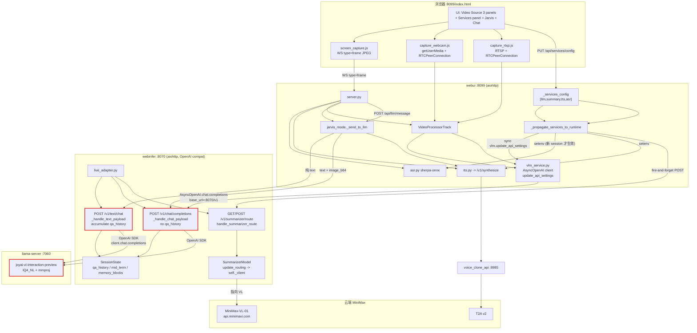
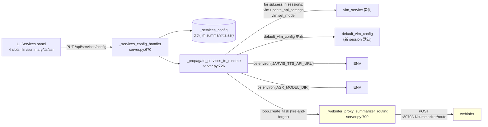
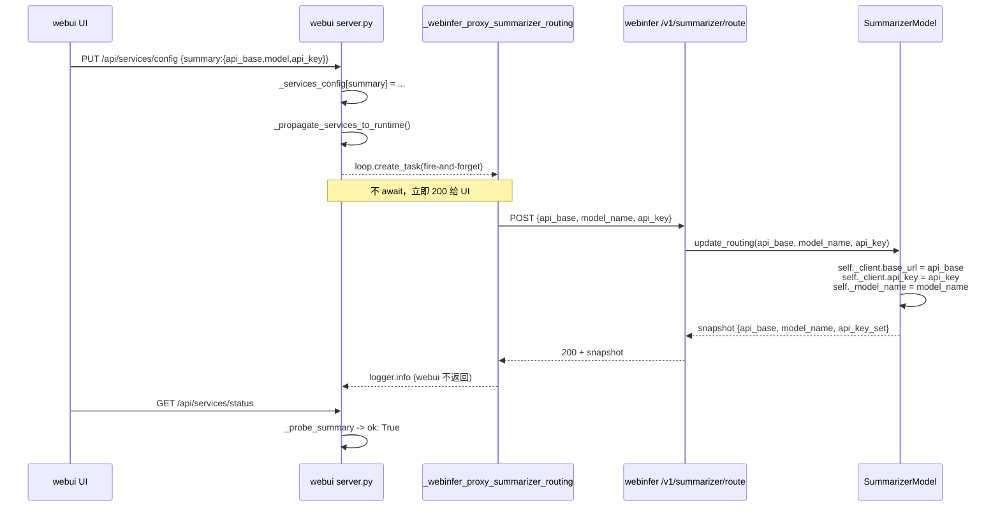
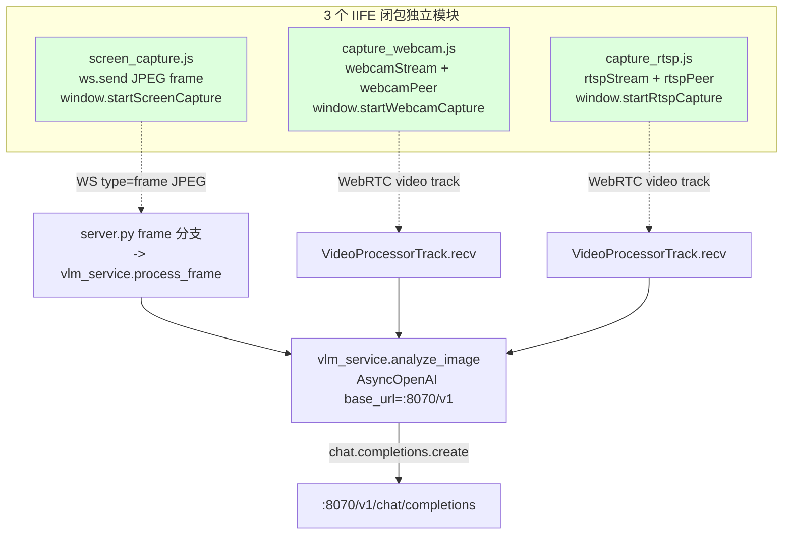
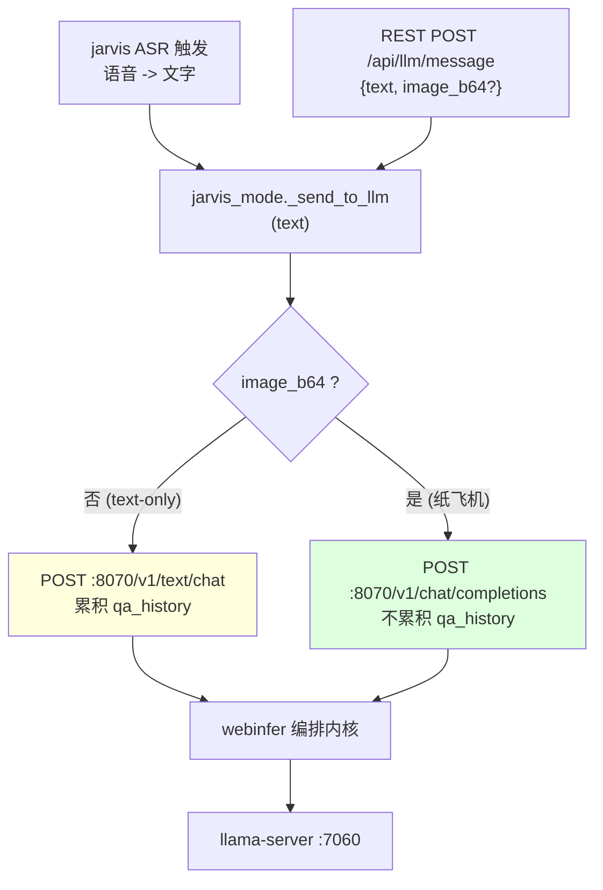
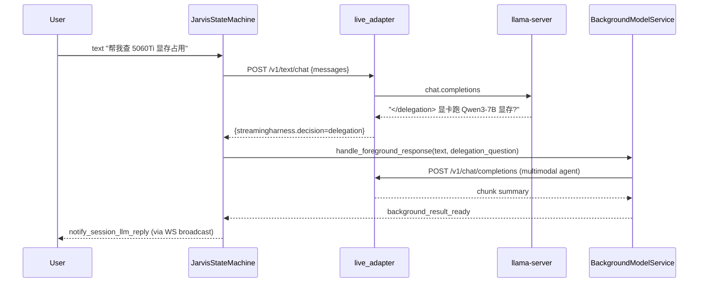
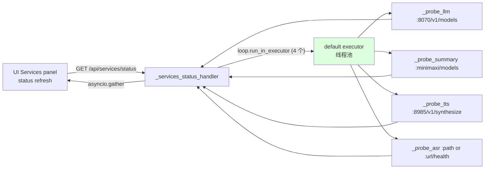
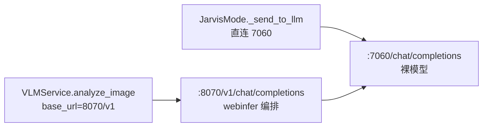
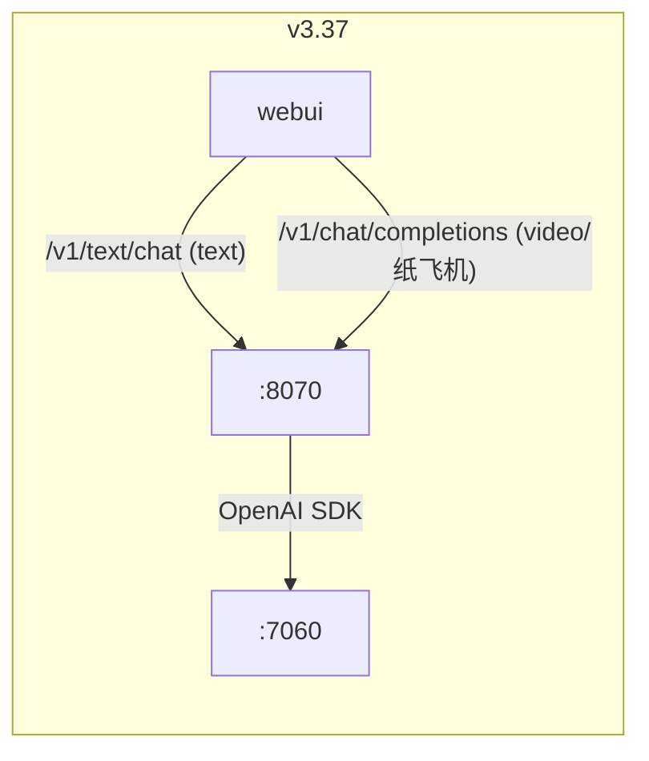
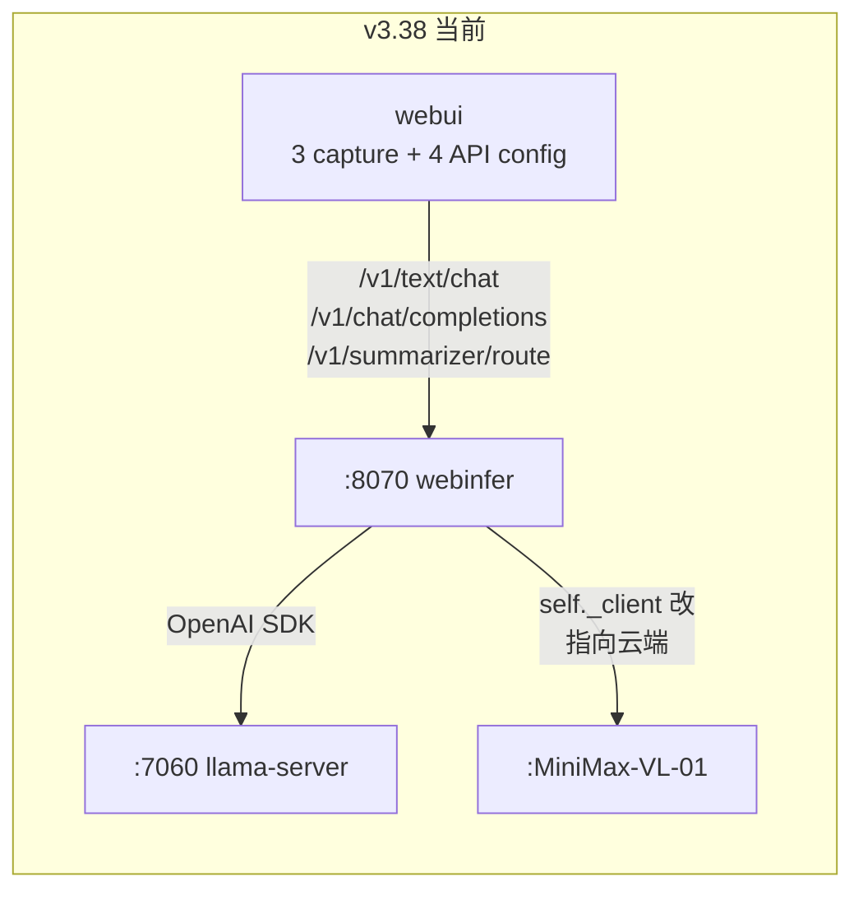

# 项目审查（2026-07-14，HEAD = 021f429）

> ⚠️ **历史快照（2026-07-14）**：本文基线 commit `021f429` 经 2026-09-14 核查**已不在本仓库对象库中**（filter-repo 改写前的历史），无法 `git show` 复核；文中"当前"字样均指 2026-07-14 当时。当前项目方向见 `doc/main/00-main-direction.md`。
>
> **目的**：基于 `021f429` 真实代码事实（不引用旧文档提取）梳理当前实现流程图，给整体 + 各模块流程图，回答用户原始疑问"两条 LLM 路径"，并列出与之前版本的差异 + 已知风险。
> **读者**：所有要改 / 排错 / 调流程的开发者；产品同步信息。
> **基线**：所有图基于 `services/` 实际可执行代码 + `services/scripts/run-windows.ps1` 的 default 启动计划 + 4 个新 commit（`fb279e9` Phase 2A / `e4a0666` eventloop fix / `1e28f47` Phase 2B summarizer hot-swap / `021f429` Phase 2C test refresh）。
> **配套**：实施合同 `doc/specs/2026-07-14-loose-coupling-services.md`（4-API config + 单 webinfer 主路 + 3 独立 capture 模块）；架构图（上一版）`doc/local/architecture-current.md`（本文发布后该文件被刷新）。
> **用户原始疑问**："我以为所有信息走一个链路、链路上有分支处理回到链路上，但事实上有两个不同的路走 LLM 回复，视频帧不能通过 LLM 纸飞机文字走，只能走视频帧 LLM 服务" —— 在 §5 直接回答。

---

## 0. 一句话

**WebUI 8099 → Webinfer 8070 → llama-server 7060 一条物理干线**；干线在 webinfer 入口有 **HTTP 路由分叉**（`/v1/text/chat` 拒绝帧 + 累积 qa_history，`/v1/chat/completions` 接受帧 + 不累积 qa_history），所有 LLM 编排（system prompt 注入、token guard、决策 token 解析、qa_history 累积、memory warmup、summarizer 调用）只发生在 **webinfer** 内部。Jarvis 语音 / 视频帧 / 纸飞机三条入口全部走这条干线。

**Phase 2A 后**：webui UI 不再有 Video/VLM Settings 面板（删了 VLM 单数概念），不再有红 Start 按钮（删了 global start dispatcher），改为 **3 个独立 capture 模块**（screen_capture / capture_webcam / capture_rtsp，各自 IIFE 闭包 + 自有 RTCPeerConnection）+ **4 个独立 API 配置**（LLM / Summary / TTS / ASR，统一 `_services_config` dict + `PUT /api/services/config` + `GET /api/services/status`）。Summary 默认指向云端 `https://api.minimaxi.com/v1` + `MiniMax-VL-01`，运行时通过 `/v1/summarizer/route` 热切 webinfer 自己的 OpenAI client。

**单 webinfer 主路（Composition, not Duplication）**：所有能力切换 → webui → webinfer → webinfer mutate 自己的状态 → webinfer 把结果回 webui。**没有任何绕开 webinfer 直接 mutate 下游的路径**。

---

## 1. 现状架构图（HEAD = 021f429）

### 1.1 进程拓扑（`start-joyai.ps1 default` 模式实际拉起）

| 进程 | 端口 | 角色 | 实现入口 |
|---|---|---|---|
| llama-server | **7060** | 主模型 JoyAI-VL 8B IQ4_NL + mmproj | llama.cpp binary，启 7060 |
| webinfer | **8070** | aiohttp OpenAI 兼容网关 + 编排内核（无权重） | `services/webinfer/live_adapter.py:3179` |
| webui | **8099** | aiohttp + aiortc 浏览器前端 + 4-API storage | `services/webui/src/joy_interaction_webui/server.py:652` |
| voice-clone | **8985** | FastAPI + MiniMax 云 T2A v2 代理 | `services/voice-clone/voice_clone_api/main.py` |
| background-agent | env opt-in | Hermes shim | `services/background-agent/` |
| memory-store | env opt-in | SQLite + hooks | `services/memory-store/src/memory_store/` |

`run-windows.ps1` 三个 plan（line 9-11）：
- `default` = main + voice-clone + webinfer + webui（当前生产路径）
- `minimal` = main + webinfer + webui（最小端到端冒烟）
- `voice` = 同 `default`，KWS/ASR 在 webui 内通过 sherpa-onnx

### 1.2 整体数据流（一张图）

### 1.3 HTTP 路由分叉契约（v3.37 实施合同 §1）

| 端点 | 接受 | 拒绝 | 编排内核入口 | qa_history |
|---|---|---|---|---|
| `POST /v1/text/chat` | 纯文本 messages | `image_url` / `image` part、`data:image/...;base64` | `_handle_text_payload` | **累积** |
| `POST /v1/chat/completions` | 文本 + image_url / 帧引用 | 单 image 数 > N 时报 400 | `_handle_chat_payload` | 不累积 |
| `POST /v1/summarizer/route` | `{api_base, model_name, api_key}` | summarizer disabled 时 503 | `handle_summarizer_route` | n/a |

两个 LLM 端点都最终调用同一个 `client.chat.completions.create(...)` 走 OpenAI SDK → `7060/chat/completions`，区别仅在"是否触发帧处理 + chunk 摘要 + 异步 summarizer pipeline"。

---

## 2. 各模块流程图

### 2.1 webui 4-API services config + propagate

**4 个 slot 传播行为不一致**（Phase 2A 留下的小坑，§3 风险表 #1）：

| slot | 行为 | 已存 session | 新 session |
|---|---|---|---|
| llm | `vlm.update_api_settings` + `vlm.set_model` | **同步生效** | 默认 |
| summary | fire-and-forget POST 到 webinfer | n/a（webinfer 内部状态） | n/a |
| tts | `os.environ['JARVIS_TTS_API_URL']` | **不生效**（读 ENV 时已绑定） | 默认 |
| asr | `os.environ['ASR_MODEL_DIR']` | **不生效** | 默认 |

### 2.2 webinfer summarizer routing hot-swap（Phase 2B 关键链路）

**webinfer `handle_summarizer_route` 实现要点**（live_adapter.py:1165）：
- GET = snapshot；POST = hot-swap
- POST body 所有 key 都可选；省略 = "leave alone"（`update_routing` 内 `api_key=None` sentinel）
- summarizer disabled 时 503；bad JSON 时 400
- snapshot 包含 `api_key_set: bool`（**永远不回传 api_key 明文**，避免泄漏）

**webui `_webinfer_proxy_summarizer_routing` 实现要点**（server.py:790）：
- 用 `aiohttp.ClientSession(timeout=5.0)` 调 POST
- 失败只 logger.warning，不 raise；webui 端 PUT 永远 200
- webinfer URL 解析：env `WEBINFER_URL` > `_services_config["llm"]["api_base"]` 去掉 `/v1` > 默认 `http://127.0.0.1:8070`

### 2.3 三 capture 模块独立状态机（Phase 2A）

**共享 API（与 `screen_capture.js` 对齐）**：
- `startXxxCapture(ws?, opts?)` → Promise<void>
- `stopXxxCapture()` → void
- `isXxxCapturing()` → boolean
- `getXxxStream()` → MediaStream | null
- `getXxxVideo()` → HTMLVideoElement | null

**关键事实**：
- 三个模块**没有共享全局状态机**（`isAnalysisRunning` 已删除）
- 每个模块有自己的 `RTCPeerConnection` / ws 引用
- 三条上游路径（WS frame / WebRTC track）都汇聚到 **同一个** `vlm_service.analyze_image`，下游统一到 `/v1/chat/completions`

### 2.4 jarvis_mode 三入口（语音 + 纸飞机 + REST）

### 2.5 决策 / 委派链路（delegation token）

### 2.6 services status 4-probe 并行（e4a0666 eventloop fix）

**关键**：4 个 sync httpx probe 全部用 `loop.run_in_executor(None, ...)` + `asyncio.gather` 并行调度，**最坏延迟 = 最慢 probe**（~2-3s），不再阻塞 event loop。

---

## 3. 风险 / 问题分析

| # | 风险 | 严重度 | 状态 | 解决方向 |
|---|---|---|---|---|
| 1 | 4-API config 的传播行为**不一致**（LLM 同步生效、TTS/ASR 只 setenv、Summary 异步 fire-and-forget） | 中 | 已知 | 写 ADR 明确三种传播策略；TTS/ASR 加 `set_runtime_config` 同步路径 |
| 2 | LLM 改 url 只切 webui 端 VLMService 的 base_url；**webinfer 自己启动时绑死 llama-server URL，运行时不可切 llama-server 实例** | 中 | 已知 | 要么 webinfer 加 `POST /v1/llm/route` 路由（类似 summarizer），要么 doc 明确"webui 可重指向 webinfer 实例，不能热切 llama-server" |
| 3 | `update_routing(api_key=None)` 是 leave-alone sentinel；webui 发 payload 时 `summary_cfg.get("api_key")` 可能是空串 `""` 而非 `None`，空串语义未明确 | 低 | 待验证 | 读 `update_routing` 实现确认空串行为；必要时 webui 端 `if value: ...` 过滤 |
| 4 | `_webinfer_proxy_summarizer_routing` fire-and-forget，UI 拿不到失败回滚（PUT 永远 200，只有 `GET /api/services/status` 反映最终态） | 低 | 设计意图 | 文档化；可选加 `POST /api/webinfer/summarizer/route` 同步返回结果 |
| 5 | `/api/rtsp/start` 仍是 501 stub；UI "Test Connection" 按钮死路 | 中 | v3.37 已知遗留 | 需要 RTSP 实现（本次范围外） |
| 6 | doc/ 目录文档过多（47 个 md，分布在 9 个子目录） | 中 | 待 Phase 3 整理 | 分类整理 + doc/README.md 入口统一 |
| 7 | `services/.pids/` untracked（`.gitignore` 只匹配 `/.pids/`） | 低 | 待清理 | `.gitignore` 加 `services/.pids/` |
| 8 | webui LLM 默认 `model="streaming-infer-adapter"`（webinfer 的代理名），与 llama-server 真实模型 `joyai-vl-interaction-preview` 不同 — **不是 bug**，但容易误解 | 无 | 设计 | doc 写清楚 OpenAI 兼容层的 model 字段语义：webui→webinfer 用代理名，webinfer→llama 用真实模型 |
| 9 | three capture modules 都汇聚到同一个 `vlm_service.analyze_image`，但 session_id 不同（每 capture 自己的 session），不会互相串扰；**如果用户同时开两个 capture**，会有两个 session 的 VLM 请求并发到 webinfer | 低 | 设计 | 可接受；doc 写清楚 |
| 10 | `SummarizerModel.__init__` 末尾有 `from transformers import AutoTokenizer`（9s 重 import），会延迟 webinfer 启动 | 低 | 已知 | test_summarizer_routing.py 用 monkeypatch setitem 绕过；runtime 也接受 |

---

## 4. 与之前架构对比

### 4.1 三版本对比表

| 维度 | v3.26 之前 | v3.37（single-entry LLM gateway） | **v3.38（HEAD=021f429，当前）** |
|---|---|---|---|
| LLM 物理链路 | **2 条独立**：jarvis 直连 7060 + vlm_service 走 webinfer | **1 条**：webui → webinfer → llama | 同 v3.37 |
| 共享编排内核 | 无 | webinfer `SessionState` + `_build_memory_prompt` + `_parse_decision_tokens` + `_update_text_qa_history` | 同 v3.37 |
| HTTP 入口分叉 | 无（直连 7060 跳过 webinfer） | `/v1/text/chat` vs `/v1/chat/completions` | 同 v3.37 + `/v1/summarizer/route` |
| Video/VLM Settings 面板 | 单数 VLM 设置（VLMConfig） | 同 v3.26 | **删除**，改为 3 独立 capture 模块 |
| 红 Start 按钮 | 有（global start dispatcher） | 有 | **删除** |
| Capture 模块 | 1 个 global `start()` 按 tab 分发 | 同 v3.26 | **3 个独立 IIFE**：screen_capture.js / capture_webcam.js / capture_rtsp.js |
| 4 API (LLM/TTS/Summary/ASR) 配置 | 全靠 env（重启生效） | 全靠 env | **UI 可改 + webui 持久化 + 部分 hot-swap** |
| Summary backend | 默认本地 llama-server | 默认本地 llama-server | **默认云端 minimaxi.com (MiniMax-VL-01)**，运行时 hot-swap |
| TTS/ASR 配置 | env 改 + 重启 | env 改 + 重启 | UI 改 setenv（新 session 生效） |
| LLM webinfer 实例切换 | 不支持 | 不支持 | UI 改 url 即切（已存 session 同步生效） |
| Summarizer webinfer ↔ 云端切换 | 不支持 | 不支持 | **运行时 hot-swap** via `/v1/summarizer/route` |
| services status probe | 1 个 | 1 个 | **4 个并行** (`loop.run_in_executor` + `asyncio.gather`) |
| 文档入口 | doc/README.md 通用 | doc/README.md 分类 | doc/README.md 分类（待加新 spec 条目） |
| 测试 | 1 套 | webinfer 52 + webui 93 | webinfer **66** + webui **107** |

### 4.2 进程拓扑演进

**v3.26 之前（用户描述的"两条独立的路"）**：

**v3.37 后（一条物理干线 + HTTP 路由分叉）**：

**v3.38 / HEAD 021f429（当前）**：

---

## 5. 用户原始疑问的精确回答

> **Q**："我以为所有信息走一个链路、链路上有分支处理回到链路上，但事实上有两个不同的路走 LLM 回复，视频帧不能通过 LLM 纸飞机文字走，只能走视频帧 LLM 服务"

**精度修正**：

1. **v3.26 之前确实是 2 条独立 LLM 链路**（jarvis 直连 7060 + vlm_service 走 webinfer），那时候你的观察完全正确。

2. **v3.37 后物理链路是 1 条**（`webui → webinfer → llama-server`）。HTTP 入口分叉在 webinfer 内部：
   - `/v1/text/chat` 拒绝帧 + 累积 qa_history
   - `/v1/chat/completions` 接受帧 + 不累积 qa_history
   - 两个端点最终都调用 `client.chat.completions.create(...)` 走 OpenAI SDK → `7060/chat/completions`
   - **这就是你说的"链路上有分支处理回到链路上"**：链 = `webui → webinfer → llama-server`；分支 = webinfer 根据 HTTP 端点选不同 `_handle_*_payload`；回到链 = 两路写同一份 `SessionState`（qa_history / mid_term / memory_blocks），下一轮就是同一份上下文。

3. **"视频帧不能通过纸飞机文字走"** — 现在的精确语义：
   - jarvis_mode 的 `_send_to_llm(text)` 走 `/v1/text/chat`，里面 `_handle_text_payload` **拒绝带 image 的 message**（防止"smuggling frames through"）。
   - 视频帧路径（VLMService.analyze_image）走 `/v1/chat/completions`，**可以同时带 text + image_url** — 也就是说视频帧路径能接受纯文本（只是当前 jarvis_mode 没把纯文字对话路由到 `/v1/chat/completions`）。
   - **如果你想让 jarvis 的纯文字对话走 VLMService 的 `/v1/chat/completions` 而不是 `/v1/text/chat`**，代码上是允许的，只是当前 jarvis_mode 没做这个 routing。

4. **Phase 2A 之后**：
   - "纸飞机文字"概念已经消解 — `Video/VLM Settings` 面板删掉后，UI 上没有"纸飞机"按钮。
   - `/api/llm/message` 的 `image_b64` 字段是 paper-plane 的最后遗迹，**当前 jarvis 的 text-only 对话还是走 `/v1/text/chat`**。
   - 4-API config 让 LLM 和 Summary 解耦：Summary 走云端 minimaxi.com，LLM 仍走本地 llama-server。这两个是不同的 OpenAI client（webinfer 内部有两个：主对话 + summarizer），互相不影响。

**总结**：你观察到的"两条不同的路"，在 v3.37 之前确实存在；v3.37 已经收窄到一条物理链路 + HTTP 分叉；Phase 2A/B 后进一步把"能力切换"也收窄到 webinfer 主路（`/v1/summarizer/route` 让 webinfer 自己 mutate 自己的 OpenAI client）。

---

## 6. Implementation Decisions

### 6.1 模块 / 接口

- **webui `_services_config`**（dict，4 slots: llm/summary/tts/asr）— `server.py:617`
- **`GET/PUT /api/services/config`**（webui 持久化端点）— `server.py:864-865`
- **`GET /api/services/status`**（并行 4 probe）— `server.py:863` 附近
- **`GET/POST /api/webinfer/summarizer/route`**（webui 代理到 webinfer）— `server.py:867-868`
- **webinfer `GET/POST /v1/summarizer/route`**（webinfer 自己的路由）— `live_adapter.py:3483-3484`
- **`SummarizerModel.update_routing(api_base, model_name, api_key=None)`** + `snapshot_routing()` — `memory_summarizer.py:356, 386`

### 6.2 架构决策

- **单 webinfer 主路（Composition, not Duplication）**：所有能力切换 → webui → webinfer → webinfer mutate 自己的状态 → webinfer 把结果回 webui。**没有任何绕开 webinfer 直接 mutate 下游的路径**。
- **OpenAI 兼容层**：webui→webinfer 用代理 model 名（`streaming-infer-adapter`），webinfer→llama 用真实模型（`joyai-vl-interaction-preview`）。两者不冲突因为 webinfer 是 OpenAI 兼容网关。
- **3 capture 模块同形**：每个都是 IIFE 闭包 + window 上挂 `start/stop/is/get*Capture` API，互不共享 state。
- **fire-and-forget 代理**：webui PUT 永远 200，summarizer 切换是否成功只能通过 GET /api/services/status 看到。

### 6.3 API 契约

详见 §1.3 路由表 + §2.2 sequenceDiagram。

### 6.4 Schema 变化

无（只新增 REST 端点，不改 storage schema）。

---

## 7. Testing Decisions

### 7.1 测什么（外部行为，不测实现细节）

- **`_services_config_handler`** PUT/GET 的 dict 形状、partial update 语义
- **`_propagate_services_to_runtime`** 4 个 slot 各自的传播行为（同步 / setenv / fire-and-forget）
- **`_services_status_handler`** 不阻塞 event loop（4 probe 用 `run_in_executor`）
- **`_webinfer_proxy_summarizer_routing`** URL 解析、5s timeout、failure 不 raise
- **`SummarizerModel.update_routing`** leave-alone sentinel、空串语义、snapshot 不回传明文
- **`handle_summarizer_route`** 503 when summarizer disabled、400 on bad JSON
- **3 capture 模块** window API 形状、IIFE 闭包隔离、`index.html` 不再有 global start/stop

### 7.2 哪些模块测试覆盖

- **`tests/test_summarizer_routing.py`** (9 tests) — `update_routing`/`snapshot_routing` + 各种 sentinel 行为
- **`tests/test_webui_summarizer_proxy.py`** (6 tests) — webui 代理端点 + URL 解析
- **`tests/test_services_status_handler_nonblocking.py`** (2 tests) — event loop 不阻塞
- **`tests/test_capture_modules_contract.py`** (6 tests) — 3 capture 模块契约

### 7.3 既有 prior art

- 既有 `tests/test_webui_static_contract.py` 已经验证 webui 静态资源；新 contract test 替换其中已死的 Phase 1 测试。
- 既有 `tests/test_jarvis_state_machine.py` 覆盖 jarvis 三入口 routing 逻辑。

---

## 8. Out of Scope

- **`/api/rtsp/start` 501 stub 实现**（v3.37 已知遗留，Phase 2A 没动）
- **TTS/ASR 的 sync runtime config 路径**（仍只 setenv）
- **webinfer /v1/llm/route**（让 webui 可以热切 webinfer 内部的 llama-server URL）
- **Phase 3 doc/ 目录整理**（47 个 md 分布在 9 个子目录，doc/README.md 待加新条目）
- **services/.pids/ 加入 .gitignore**
- **Stream 化 webinfer 端点**（当前是完整 JSON 响应，不是 SSE）

---

## 9. 验证证据（HEAD = 021f429）

- ✅ **`git log --oneline -10`** 看到 4 个新 commit 已落地：`021f429 / 1e28f47 / e4a0666 / fb279e9`
- ✅ **`tests/`** webui 107 passed + webinfer 66 passed = **173 tests green**
- ✅ **端到端**（上一轮实测）：PUT `/api/services/config` 改 summary 为 minimaxi → GET `/v1/summarizer/route` 确认 webinfer 状态切换 → 清 api_key 改回 → 状态切回
- ✅ **静态检查**：`index.html` 200 OK，无 `bigStartBtn`/`smallStopBtn`/`Video/VLM Settings` 残留；`capture_webcam.js` / `capture_rtsp.js` 200 OK，window API 在
- ⚠️ **`/v1/llm/route` 不存在**：webui 改 LLM url 只切 webui 端 VLMService，不切 webinfer 内部的 llama-server 绑定（设计意图，但需 ADR）

---

## 10. 待跟进清单（观察项，不是 TODO）

1. ✅ 4 commit 落地（webui 107 + webinfer 66 测试全绿）
2. ⚪ ADR 明确 4-API config 传播行为差异（风险 #1）
3. ⚪ ADR 明确 webui LLM 切 url 与 webinfer 绑死 llama-server 的边界（风险 #2）
4. ⚪ 验证 `update_routing(api_key="")` 行为（风险 #3）
5. ⚪ Phase 3 doc/ 目录整理（风险 #6）
6. ⚪ `.gitignore` 加 `services/.pids/`（风险 #7）
7. ⚪ 写 ADR `0007-4-api-config-propagation.md` 总结本 spec 的 4-API 传播决策
8. ⚪ 更新 `doc/README.md` 顶部状态从 "v3.37 配套" 改为 "v3.37 + Phase 2A/B/C 配套"

---

## 11. Further Notes

- 本 spec 是 **代码事实层**（不引用其他 spec，只引用 `services/` 实际代码）。其他 spec（`2026-07-13-current-state.md`、`2026-07-13-llm-path-consolidation.md`、`2026-07-14-loose-coupling-services.md`）描述 v3.37 / Phase 2A 实施合同，本 spec 描述实施后状态。
- 用户偏好"一个 slice 一个 commit"在 Phase 2 已严格遵守（fb279e9 / e4a0666 / 1e28f47 / 021f429 各 1 commit）；本 spec 1 commit 收尾。
- doc/specs/ 命名规范 `YYYY-MM-DD-{topic}.md` 已遵循。
- 配套刷新 `doc/local/architecture-current.md`（基于 021f429 而非 616b6eb）+ `doc/README.md`（加新条目）。
