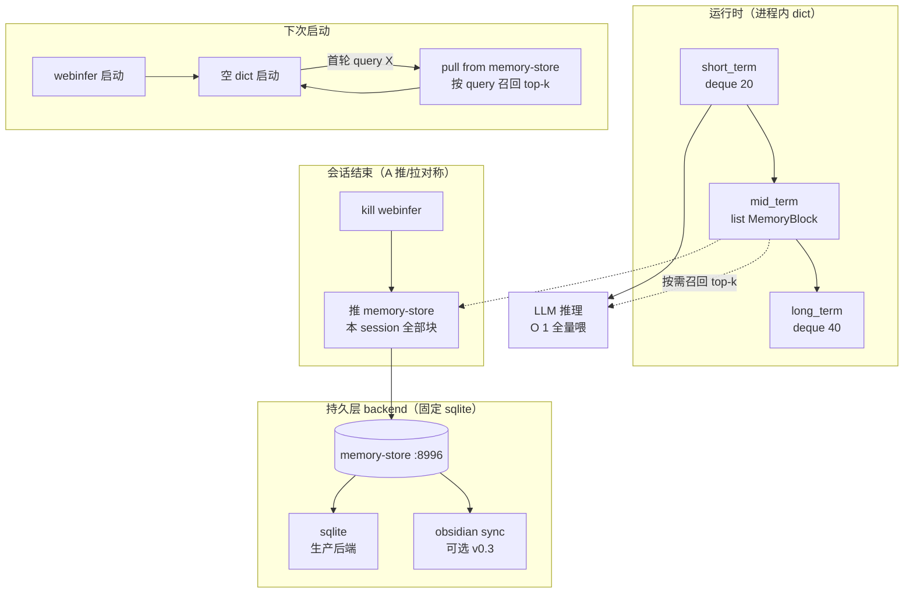

# 记忆架构设计（持久化 + 可插拔外部库）

> 状态：**v3.2 落地（v0.2 hooks 2026-07-13 完成；[Local Wiki] 委派召回 2026-07-23 落地进 hermes_api shim；obsidian/bge-m3 待排期）**。配套 `doc/subsystems/asr-streaming.md`（Jarvis 模式）。
> v0.1 skeleton（v3.25）：services/memory-store/ SqliteBackend + FTS5；v0.2 hooks（v3.26）：live_adapter.py push/pull/recall + webinfer [历史记忆] 注入；[Local Wiki]（2026-07-23）：hermes_api shim 委派前 recall memory-store。
> 触发：原项目有 3 层进程内记忆，但**无持久化、无外部接口、无 RAG**——重启即丢。
> 修订：
> - v3.1：去掉 namespace 字段（YAGNI）、storage 优先 psql（复用 hermes）。
> - v3.0：用户确认推/拉对称协作（A 方案）、embedding 本地 bge-m3。
> - **2026-07-23 ADR-001**：**取消 psql 复用 hermes 路线**，记忆持久层固定为 `sqlite`（避免污染 hermes 原本的记忆/状态库）。见 §10。

---

## 1. 问题陈述

### 1.1 原项目记忆现状（已修正）

原项目**不是 0 记忆**，而是**有 3 层进程内记忆 + 无持久化**。

| 层 | 字段 | 容量 | 作用 | 持久化 |
| - | - | - | - | - |
| L0 短期 | `short_term: deque[20]` | 20 轮 | 最近对话，O(1) 召回，全量喂 LLM | ❌ 进程内 |
| L1 中期 | `mid_term: list[SummaryBlock]` | 200 块 | 5 轮压缩 1 次（`compress_every_n=5`），保留骨架 | ❌ 进程内 |
| L2 长期 | `long_term: deque[40]` | 40 块 | 最新 40 个 mid_term 块，跨压缩窗口 | ❌ 进程内 |
|  |  |  |  |  |

**关键事实**：
- 全部在 `SessionState`（`live_adapter.py:586-616`）
- 0 命中 RAG / vector / embedding
- 唯一的"持久化"是 `LIVE_SAVE_OUTPUTS=true` → `logs/sessions/<sid>.jsonl`（**是响应日志，不是记忆**）
- 服务一停，mid_term / long_term **全部丢失**

### 1.2 用户的洞察

> 预置 wiki / lore 比实时联网搜索快。

**完全正确**：

| 维度 | 预置 RAG | 实时 web search |
| - | - | - |
| 延迟 | 50-300ms | 2-10s |
| 确定性 | 100% | 漂移 |
| 成本 | 0 | $0.01-0.1/次 |
| 隐私 | 全本地 | 第三方 |
| 适合 | 角色 / 机制 / 势力 | 时事 / 价格 / 最新攻略 |

### 1.3 P2 要解决的问题

1. **重启不丢记忆**：会话结束 → 持久化 mid_term 摘要
2. **外部知识库**：obsidian wiki / 游戏攻略 / 角色 lore 可注入 prompt
3. **可插拔后端**：**sqlite 固定为唯一生产后端**（不复用 hermes-agent 的 pg，避免污染 hermes 原记忆）；obsidian 同步可选（v0.3）
4. **不破坏现有速度**：进程内 dict 仍为 L0 缓存，按需召回才走 memory-store

## 2. 架构

### 2.1 新增服务

`services/memory-store/`（与 webinfer / background-agent 平行，端口 **8996**）。



### 2.2 数据块结构（单一类型）

mid_term 摘要推送 memory-store 时**不分类型**，统一为 `MemoryBlock`：

```python
@dataclass
class MemoryBlock:
    block_id: str
    session_id: str
    content: str           # 摘要文本
    score: float           # 重要度 0-1（压缩时由 LLM 评估）
    created_at: datetime
    last_hit_at: datetime  # 召回时更新
    hit_count: int
```

**角色偏好 整体不持久化**——这类稳定属性写进 `prompts/bt-7274.txt` system prompt 即可，单用户本地场景无"跨用户共享"需求。

### 2.3 与三层 dict 的关系

| 层 | 角色 | 是否走 memory-store |
| - | - | - |
| L0 short_term | 运行时快取，O(1) | ❌ 不持久化 |
| L1 mid_term | 会话结束**整批 push** | ✅ |
| L2 long_term | mid_term 的滑动窗口视图 | ❌（由 mid_term 派生） |
|  |                         |                       |

## 3. API 契约（memory-store :8996）

### 3.1 推（会话结束）

```http
POST /v1/blocks/push
Content-Type: application/json

Request:
{
  "session_id": "uuid",
  "blocks": [
    {
      "block_id": "uuid",
      "content": "前 5 轮对话摘要：用户问了 BT 的服役经历，BT 答了三次",
      "score": 0.5,
      "created_at": "2026-07-09T10:30:00Z"
    }
  ]
}

Response:
{"pushed": 1, "session_id": "uuid"}
```

### 3.2 拉（启动首轮 / 长对话定期）

```http
POST /v1/blocks/recall
Content-Type: application/json

Request:
{
  "query": "BT 上次说的那段话",
  "top_k": 8,
  "min_score": 0.3,
  "filter": {
    "created_after": "2026-01-01"
  }
}

Response:
{
  "blocks": [
    {
      "block_id": "uuid",
      "content": "前 5 轮对话摘要：用户问了 BT 的服役经历，BT 答了三次，最后一次提到隶属铁御",
      "score": 0.78,
      "hit_count": 3,
      "last_hit_at": "2026-07-09T10:00:00Z"
    }
  ]
}
```

> **实现状态（2026-07-23 对齐审计）**：`RecallResponse` 实际**只有 `blocks` 一个字段**（`models.py:43-44`），`recall_blocks` 仅返回 `RecallResponse(blocks=blocks)`。旧文档示例中的 `meta_prompt` / `took_ms` 当前**未返回**（属规划中/未实现字段），请勿在对接代码中依赖。

### 3.3 其他端点

> **实现状态（2026-07-23 对齐审计）**：memory-store 当前**仅实现** `POST /v1/blocks/push`、`POST /v1/blocks/recall`、`GET /health` 三个端点。下表中的 `GET /v1/blocks/{id}`、`DELETE /v1/sessions/{sid}`、`POST /v1/external/sync` 三项**尚未实现（规划中，v0.3+）**，仅作为路线图保留，下游**切勿**假定其已可用。注意健康检查路由为 `/health`（非 `/v1/health`）。

| Method | Path | 用途 | 状态 |
| - | - | - | - |
| `GET` | `/v1/blocks/{id}` | 单块查询（调试 / UI） | ⚠️ 未实现（规划中，v0.3+） |
| `DELETE` | `/v1/sessions/{sid}` | 会话清理（用户手动） | ⚠️ 未实现（规划中，v0.3+） |
| `POST` | `/v1/external/sync` | 外部库（obsidian）全量重建索引 | ⚠️ 未实现（规划中，v0.3+） |
| `GET` | `/health` | 健康检查（启动时） | ✅ 已实现（路由为 `/health`，非 `/v1/health`） |


## 4. 集成点

### 4.1 webinfer 改造（live_adapter.py）

#### 4.1.1 会话结束（kill hook）

```python
# live_adapter.py:on_session_end()
async def on_session_end(session_id: str, mid_term: list[MemoryBlock]):
    """服务关闭 / 会话超时触发"""
    try:
        async with httpx.AsyncClient(timeout=10) as client:
            await client.post(
                "http://localhost:8996/v1/blocks/push",
                json={"session_id": session_id, "blocks": mid_term},
            )
    except Exception as e:
        logger.error(f"memory-store push failed: {e}")  # 只后台日志，不读出
```

#### 4.1.2 启动首轮（pull hook）

```python
# live_adapter.py:on_session_start()
async def on_session_start(query: str | None) -> list[MemoryBlock]:
    """首轮 query 时召回；query 为 None 则不召回"""
    if not query:
        return []
    try:
        async with httpx.AsyncClient(timeout=5) as client:
            r = await client.post(
                "http://localhost:8996/v1/blocks/recall",
                json={"query": query, "top_k": 8, "min_score": 0.3},
            )
            return r.json()["blocks"]
    except Exception as e:
        logger.error(f"memory-store recall failed: {e}")
        return []  # 失败不阻塞主流程
```

#### 4.1.3 prompt 注入

```python
# 在 compose_system_prompt 里追加历史记忆段
if recalled_blocks:
    meta = format_blocks_as_prompt(recalled_blocks)
    sections.append(f"[历史记忆]\n{meta}")
```

### 4.2 hermes-api shim 改造（✅ 2026-07-23 已落地）

`/v1/solve` 处理 `</delegate>` 时**先查 memory-store 再走 web search**（实际实现见 `services/background-agent/hermes_api/main.py` 的 `async _enrich_with_memory()`，`solve()` 中 `await` 后注入 `_build_prompt(local_wiki=...)`）：

```python
# hermes_api/main.py 的 _build_prompt 里
async def _enrich_with_memory(question: str) -> str:
    try:
        async with httpx.AsyncClient(timeout=5) as client:
            r = await client.post(
                "http://localhost:8996/v1/blocks/recall",
                json={"query": question, "top_k": 5, "min_score": 0.4},
            )
            blocks = r.json()["blocks"]
            if not blocks:
                return ""
            return "\n".join(f"- {b['content']}" for b in blocks)  # v3.1 已移除 type 字段，只用 content
    except Exception:
        return ""  # 失败不阻塞，让 LLM 走 web search

# 在 _build_prompt 输出末尾追加：
context = await _enrich_with_memory(req.question)
if context:
    prompt += f"\n[Local Wiki]\n{context}\n(优先用本地资料，无关时才用 web search)\n"
```

### 4.3 webui 端最小改动

不动 webui 业务逻辑；只需加一个"知识库"页面：

- 列出已有 type 分布
- 上传 `.md` / `.txt` 文件到 `wiki/` 目录
- 触发 `POST /v1/external/sync`

预计改动：~30 行 Python + 1 个新静态页面。

## 5. 存储后端选型

### 5.1 生产后端：sqlite（固定，**不复用 hermes-agent**）

> **ADR-001（2026-07-23）**：原计划（v3.1）把记忆持久层架到 hermes-agent 的 Postgres 实例（psql 优先）。用户明确否决：复用 hermes 的 pg 会污染 hermes 原本的记忆/状态库。故 `MEMORY_BACKEND` 固定为 `sqlite`，`psql_backend.py` 保留为显式 `NotImplementedError` 桩（标注"已从路线图移除"），防止后续 agent 误启用。

| 维度 | 值 |
| - | - |
| 大小 | 0 外部依赖（pip 装 `sqlite` + `sqlite-vec`/FTS5） |
| 部署 | 单文件 `data/memory.sqlite`（memory-store 服务内） |
| 性能 | < 1ms / 检索（FTS5 bm25，10K chunks） |
| 容量 | 十万级 chunks（当前规模足够） |
| 优势 | 与 hermes **零耦合**，绝不触碰 hermes 原记忆/状态库 |
| 取舍 | 失去 pgvector 百万级向量共享（当前不需要，YAGNI） |

### 5.2 后端实现：sqlite + FTS5（当前生产）

| 维度 | 值 |
| - | - |
| 大小 | 0 依赖（pip 装） |
| 部署 | 单文件 `data/memory.sqlite` |
| 性能 | < 1ms / 检索（10K chunks） |
| 容量 | 上百万 chunks |
| 用途 | 固定生产后端（不与 hermes 共享） |

### 5.3 可选：obsidian 同步

| 维度 | 值 |
| - | - |
| 大小 | 0 依赖 |
| 部署 | 扫 `obsidian_vault/` 目录 |
| 同步 | 启动时全量 rebuild |
| 用途 | 把游戏 wiki / 角色 lore 作为 `type=fact` 块预置 |

### 5.4 embedding 模型

**`BAAI/bge-m3`**（v3.1 从 bge-small-zh-v1.5 升级）：

- ~2.3GB FP16 / ~600MB INT8
- 多语种（中英日韩，**代码也支持**）
- 1024 维
- 8192 token 上下文
- 本地 GPU 推理 ~30-80ms/query（RTX 5060 Ti 16GB）
- 中文检索质量与 text-embedding-3-large **基本打平**（MTEB zh ±2%）

**为什么不用 bge-small-zh**：
- bge-m3 多语种兜底（你游戏里可能有英文专有名词）
- bge-m3 长文本支持（8192 vs 512）
- 显存你 16GB 富余

### 5.5 backend 可插拔

```python
# memory-store/backends/__init__.py
class MemoryBackend(Protocol):
    async def push(self, blocks: list[MemoryBlock]) -> int: ...
    async def recall(self, query: str, top_k: int, ...) -> list[MemoryBlock]: ...
    async def sync_external(self, path: str) -> int: ...

# 实现：SqliteBackend（生产） / ObsidianBackend（可选 v0.3）
#       PsqlBackend 为显式 NotImplementedError 桩（已从路线图移除，勿启用）
# 通过 env MEMORY_BACKEND=sqlite 固定（默认即 sqlite）
```

## 6. 落地步骤

```text
1. P2-1 memory-store 骨架 + psql backend（~2-3 天）
2. P2-1.1 live_adapter on_session_end push 钩子（0.5 天） **— v3.26 完成**（`_session_cleanup_loop` + `handle_reset`）
3. P2-1.2 live_adapter on_session_start pull 钩子（0.5 天） **— v3.26 完成**（`get_session` fire-and-forget warmup + `_build_memory_prompt` 注入）
4. P2-3 bge-m3 本地服务 FastAPI :8997（1 天）
5. P2-2 向量检索集成 + obsidian 同步（2-3 天）
6. 验收：重启 webinfer 后能召回上轮对话 + obsidian wiki
7. 验收：重启 webinfer 后能召回上轮对话 + obsidian wiki
```

总工作量：**~10 天**，分两周迭代。

预估代码量：~800 行 Python（memory-store 500 + bge-m3 server 200 + live_adapter 改造 100）。

## 7. 显存 / 性能影响

| 项 | 占用 |
| - | - |
| bge-m3 模型 | 2.3GB GPU（FP16）/ 600MB 内存（INT8） |
| psql 数据 | < 100MB（10K 块） |
| 检索延迟 | 30-300ms（embedding 80ms + 搜索 5-50ms + 网络 10ms） |
| 召回 token 数 | top-8 ≈ 2000 token（注入到 context） |
| 主对话显存 | 不变（bge-m3 与 LLM 共享 16GB 显存） |

**主对话延迟**：每轮多 30-300ms（首轮召回 + 后续 0 命中本地 dict）。

## 8. 风险

| 风险 | 缓解 |
| - | - |
| bge-m3 下载失败 | 备选 `BAAI/bge-large-zh-v1.5`（单语种但 600MB 更小） |
| 检索不准 | 调 `min_score` 阈值；人工加 few-shot 例子 |
| 注入太多稀释决策 | 限制 `top_k=8`、总 token 上限 2000 |
| 隐私 | 全本地，psql 不出网（hermes 部署在内网） |
| psql 复用已取消（ADR-001） | 不再依赖 hermes pg；sqlite 为固定后端，无降级路径 |
| obsidian 路径写错 | 启动时校验路径存在性，失败仅 warn 不阻塞 |
| 异常崩溃丢本轮 push | 接受（你之前经验：响应日志有 jsonl 兜底） |

## 9. 关联文档

- `doc/local/tech-local.md` §16（Jarvis 模式）+ §P2 章节（待补）
- `doc/local/pm-local.md` §23 + §P2 章节（待补）
- `doc/subsystems/gaming-mode.md` §8（让 Hermes 委派查攻略的升级版）
- `doc/subsystems/jarvis-mode.md`（唤醒 + EXIT_WORDS 状态机，记忆层是其下游）
- `doc/research/lightweight-replacement.md` §2（bge-m3 与 whisper.cpp 同源）
- `services/background-agent/hermes_api/main.py`（[Local Wiki] 委派前 recall memory-store）

---

## 10. 决策记录（ADR）

### ADR-001：记忆持久层固定为 sqlite，取消 psql 复用 hermes

- **状态**：Accepted（2026-07-23）
- **上下文**：原计划（v3.1）把记忆持久层架到 hermes-agent 的 Postgres 实例（`backends/psql_backend.py`，psql 优先），目标是跨服务共享与 pgvector 向量检索。但用户明确担心：复用 hermes 的 pg 会**污染 hermes 原本的记忆/状态库**（`D:\Workspace\hermes-data\state.db` 等）。
- **决策**：取消 psql 复用路线。`MEMORY_BACKEND` 固定为 `sqlite`，作为 memory-store 唯一生产后端。`psql_backend.py` 保留为显式 `NotImplementedError` 桩，标注"已从路线图移除"，防止后续 agent 误启用。
- **后果（trade-off）**：
  - ✅ 与 hermes **零耦合**：memory-store 完全独立，绝不触碰 hermes 原记忆/状态库。
  - ✅ 部署简单：单文件 `data/memory.sqlite`，无外部依赖。
  - ➖ 失去 pgvector 跨服务共享与百万级向量检索能力（当前规模不需要，YAGNI）。
  - ➖ 若未来需要大规模 RAG，应评估**独立的**向量库（非 hermes 的 pg）。
